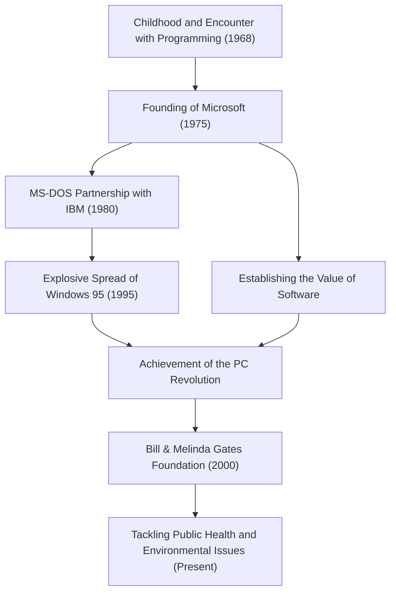

Today, computers exist on our desks and in our pockets as a matter of course. Bill Gates (William Henry Gates III) is the greatest contributor who popularized this concept of the "personal computer (PC)" around the world and created the huge industry of software. More than just a technologist, he was an outstanding businessman who later transformed into the world's largest philanthropist. His life story can be said to be the very history of the development of modern society.

### Awakening to the Value of Software

Born in Seattle, Washington in 1955, Gates showed extraordinary intelligence from an early age. He was captivated by the charm of programming at the age of 13. Through a teletype terminal introduced at the Lakeside School he attended, he immersed himself in the world of computers. Together with Paul Allen (later co-founder of Microsoft), they would find system bugs to earn computer time, and eventually grew to take on the payroll system of a local company.

Although he entered Harvard University in 1973, his passion was not in academia. In 1975, when the world's first commercial personal computer "Altair 8800" was released, Gates and Allen developed a BASIC interpreter for it. With the grand vision of "a computer on every desk and in every home," they dropped out of college and founded "Micro-Soft" (later Microsoft). At a time when "software" was merely an add-on to hardware, Gates' greatest foresight was recognizing its value as a copyright and placing it at the core of their business.

### Building an Empire and the Victory of "Windows"

Microsoft's leap forward became decisive with a contract with IBM in 1980. Approached to provide an OS (Operating System) for IBM's new PC, Gates bought an OS from another company and signed a contract to license it as "MS-DOS". Importantly, he did not give IBM exclusive rights, but reserved the right to license it to other computer manufacturers. This made MS-DOS the de facto standard for PCs.

Later, having recognized the importance of the Graphical User Interface (GUI) early on, he announced "Windows" in 1985. After several version upgrades, "Windows 95", released in 1995, became a global social phenomenon, throwing the door wide open to the Internet age.

### From a Ruthless Executive to a Philanthropist Saving the World

As an executive, Gates was incredibly ruthless toward competition and thoroughly pursued winning. The fierce browser war with Netscape and the antitrust trial with the Department of Justice are events that symbolize his aggressive business methods. On the other hand, he had a habit called "Think Week", where he would seclude himself in a cottage a few times a year, reading massive amounts of papers and books, continuously predicting the trends of future technology. His success was supported by both this time for deep thinking and his execution ability to tie it to business.

However, after establishing the "Bill & Melinda Gates Foundation" in 2000, the phase of his life changed significantly. After stepping down from the front lines of Microsoft's management in 2008, he began pouring his immense wealth into solving global challenges. His activities are diverse, including the eradication of infectious diseases (polio and malaria) in developing countries, the development of revolutionary next-generation toilets, and in recent years, climate change countermeasures (investing in clean energy).

The man who pursued "profit" in the business world is now seeking the maximum return of "the survival and welfare of humanity," trying to optimize the world with the power of science and technology.

### The Future and Legacy Guided by Technology

Bill Gates' life perfectly embodies how technology fundamentally reshapes society. Upon the foundation of the software industry he built, there exists the development of current smartphones, the cloud, and AI.

The greatest lesson he left behind might be that "technology itself is neither good nor bad; what matters is how it is used and implemented in society." The young man who wrote code and delivered an OS to PCs around the world is now at the forefront of a massive project to fix global bugs. His journey will continue to be an eternal role model for future entrepreneurs, showing what "true social contribution" looks like beyond business success.
