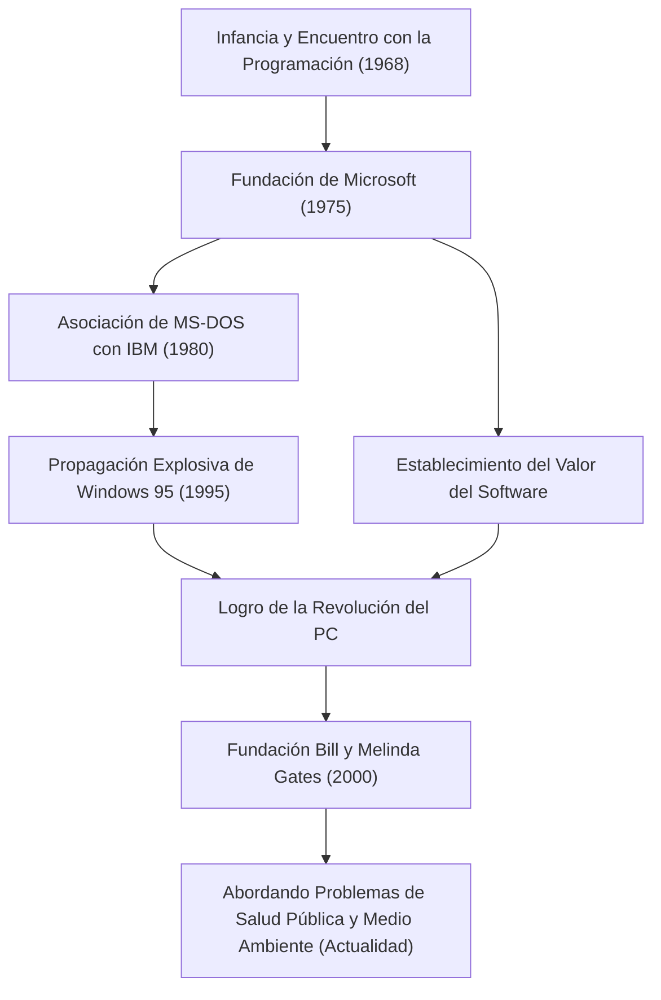

Hoy en día, las computadoras existen en nuestros escritorios y en nuestros bolsillos como algo natural. Bill Gates (William Henry Gates III) es el mayor contribuyente que popularizó este concepto de la "computadora personal (PC)" en todo el mundo y creó la enorme industria del software. Más que un simple tecnólogo, fue un hombre de negocios excepcional que luego se transformó en el mayor filántropo del mundo. Se puede decir que la historia de su vida es la historia misma del desarrollo de la sociedad moderna.

### Despertar al Valor del Software

Nacido en Seattle, Washington en 1955, Gates demostró una inteligencia extraordinaria desde una edad temprana. Quedó cautivado por el encanto de la programación a los 13 años. A través de un terminal de teletipo introducido en la escuela Lakeside a la que asistía, se sumergió en el mundo de las computadoras. Junto con Paul Allen (más tarde cofundador de Microsoft), encontraban errores en el sistema para ganar tiempo de computadora, y finalmente crecieron para hacerse cargo del sistema de nómina de una empresa local.

Aunque ingresó a la Universidad de Harvard en 1973, su pasión no estaba en el mundo académico. En 1975, cuando se lanzó la primera computadora personal comercial del mundo "Altair 8800", Gates y Allen desarrollaron un intérprete BASIC para ella. Con la gran visión de "una computadora en cada escritorio y en cada hogar", abandonaron la universidad y fundaron "Micro-Soft" (más tarde Microsoft). En una época en que el "software" era simplemente un complemento del hardware, la mayor previsión de Gates fue reconocer su valor como derechos de autor y colocarlo en el centro de su negocio.

### Construyendo un Imperio y la Victoria de "Windows"

El gran salto de Microsoft se volvió decisivo con un contrato con IBM en 1980. Contactado para proporcionar un SO (Sistema Operativo) para la nueva PC de IBM, Gates compró un SO de otra empresa y firmó un contrato para otorgar licencias del mismo como "MS-DOS". Es importante destacar que no le dio a IBM derechos exclusivos, sino que se reservó el derecho de otorgar licencias a otros fabricantes de computadoras. Esto convirtió a MS-DOS en el estándar de facto para las PC.

Más tarde, habiendo reconocido desde el principio la importancia de la Interfaz Gráfica de Usuario (GUI), anunció "Windows" en 1985. Después de varias actualizaciones de versión, "Windows 95", lanzado en 1995, se convirtió en un fenómeno social mundial, abriendo de par en par la puerta a la era de Internet.

### De Ejecutivo Despiadado a Filántropo que Salva el Mundo

Como ejecutivo, Gates fue increíblemente despiadado con la competencia y buscó implacablemente ganar. La feroz guerra de navegadores con Netscape y el juicio antimonopolio con el Departamento de Justicia son eventos que simbolizan sus métodos comerciales agresivos. Por otro lado, tenía un hábito llamado "Think Week" (Semana de Pensamiento), en la que se aislaba en una cabaña varias veces al año, leyendo enormes cantidades de artículos y libros, prediciendo continuamente las tendencias de la tecnología futura. Su éxito estuvo respaldado tanto por este tiempo para el pensamiento profundo como por su capacidad de ejecución para vincularlo a los negocios.

Sin embargo, después de establecer la "Fundación Bill y Melinda Gates" en 2000, la fase de su vida cambió significativamente. Después de dejar la primera línea de gestión de Microsoft en 2008, comenzó a verter su inmensa riqueza en la resolución de desafíos globales. Sus actividades son diversas, incluyendo la erradicación de enfermedades infecciosas (polio y malaria) en países en desarrollo, el desarrollo de inodoros revolucionarios de próxima generación, y en los últimos años, contramedidas contra el cambio climático (inversión en energía limpia).

El hombre que perseguía el "beneficio" en el mundo empresarial busca ahora el máximo rendimiento de "la supervivencia y el bienestar de la humanidad", intentando optimizar el mundo con el poder de la ciencia y la tecnología.

### El Futuro y el Legado Guiados por la Tecnología

La vida de Bill Gates encarna perfectamente cómo la tecnología remodela fundamentalmente la sociedad. Sobre la base de la industria del software que él construyó, existe el desarrollo de los teléfonos inteligentes actuales, la nube y la IA.

La mayor lección que dejó puede ser que "la tecnología en sí misma no es buena ni mala; lo que importa es cómo se usa y se implementa en la sociedad". El joven que escribía código y entregaba un sistema operativo a las PC de todo el mundo está ahora a la vanguardia de un proyecto masivo para solucionar los errores globales. Su viaje seguirá siendo un modelo a seguir eterno para los futuros emprendedores, mostrando cómo se ve la "verdadera contribución social" más allá del éxito empresarial.
