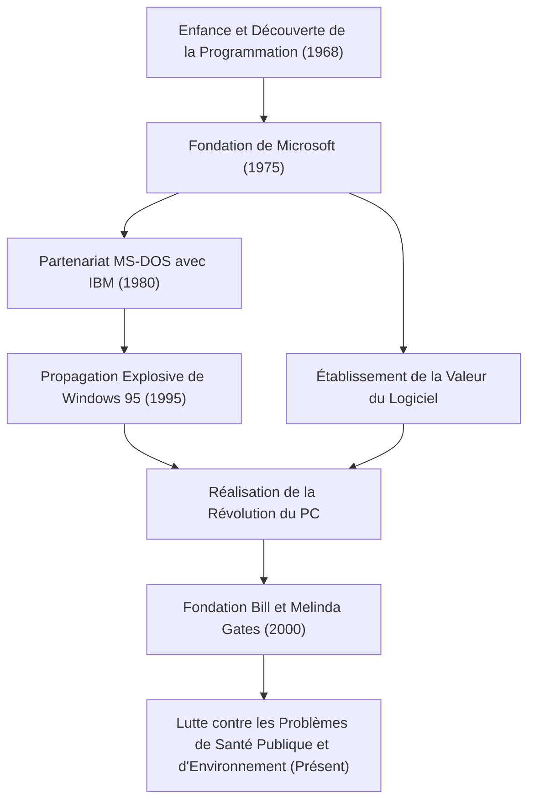

Aujourd'hui, les ordinateurs sont présents sur nos bureaux et dans nos poches comme une évidence. Bill Gates (William Henry Gates III) est le plus grand contributeur qui a popularisé ce concept de "l'ordinateur personnel (PC)" dans le monde entier et a créé l'immense industrie des logiciels. Plus qu'un simple technologue, il était un homme d'affaires exceptionnel qui s'est ensuite transformé en le plus grand philanthrope du monde. On peut dire que l'histoire de sa vie est l'histoire même du développement de la société moderne.

### L'Éveil à la Valeur des Logiciels

Né à Seattle, Washington en 1955, Gates a montré une intelligence extraordinaire dès son plus jeune âge. Il a été captivé par le charme de la programmation à l'âge de 13 ans. Grâce à un terminal télétype introduit à la Lakeside School qu'il fréquentait, il s'est immergé dans le monde de l'informatique. Avec Paul Allen (plus tard co-fondateur de Microsoft), ils trouvaient des bugs dans les systèmes pour gagner du temps d'ordinateur, et ont fini par prendre en charge le système de paie d'une entreprise locale.

Bien qu'il soit entré à l'Université de Harvard en 1973, sa passion n'était pas dans le monde académique. En 1975, lorsque le premier ordinateur personnel commercial au monde, l'"Altair 8800", a été lancé, Gates et Allen ont développé un interpréteur BASIC pour celui-ci. Avec la grande vision d'"un ordinateur sur chaque bureau et dans chaque maison", ils ont abandonné l'université et fondé "Micro-Soft" (plus tard Microsoft). À une époque où les "logiciels" n'étaient qu'un complément du matériel, la plus grande clairvoyance de Gates a été de reconnaître leur valeur en tant que droit d'auteur et de les placer au cœur de leur activité.

### La Construction d'un Empire et la Victoire de "Windows"

Le grand bond en avant de Microsoft est devenu décisif avec un contrat avec IBM en 1980. Approché pour fournir un système d'exploitation (OS) pour le nouveau PC d'IBM, Gates a acheté un OS à une autre entreprise et a signé un contrat pour le concéder sous licence sous le nom de "MS-DOS". Fait important, il n'a pas donné à IBM de droits exclusifs, mais a réservé le droit de le concéder sous licence à d'autres fabricants d'ordinateurs. Cela a fait de MS-DOS la norme de facto pour les PC.

Plus tard, ayant reconnu très tôt l'importance de l'Interface Utilisateur Graphique (GUI), il a annoncé "Windows" en 1985. Après plusieurs mises à jour de version, "Windows 95", sorti en 1995, est devenu un phénomène social mondial, ouvrant grand la porte à l'ère d'Internet.

### D'un Dirigeant Impitoyable à un Philanthrope qui Sauve le Monde

En tant que dirigeant, Gates était incroyablement impitoyable envers la concurrence et cherchait à tout prix à gagner. La féroce guerre des navigateurs contre Netscape et le procès antitrust avec le ministère de la Justice sont des événements qui symbolisent ses méthodes commerciales agressives. D'un autre côté, il avait une habitude appelée la "Think Week" (Semaine de Réflexion), au cours de laquelle il s'isolait dans un chalet quelques fois par an, lisant d'énormes quantités de documents et de livres, prédisant continuellement les tendances de la technologie future. Son succès a été soutenu à la fois par ce temps de réflexion profonde et par sa capacité d'exécution à le lier aux affaires.

Cependant, après avoir créé la "Fondation Bill et Melinda Gates" en 2000, la phase de sa vie a considérablement changé. Après s'être retiré de la première ligne de la direction de Microsoft en 2008, il a commencé à investir son immense richesse dans la résolution des défis mondiaux. Ses activités sont diverses, y compris l'éradication des maladies infectieuses (polio et paludisme) dans les pays en développement, le développement de toilettes révolutionnaires de nouvelle génération, et ces dernières années, des mesures de lutte contre le changement climatique (investissement dans les énergies propres).

L'homme qui recherchait le "profit" dans le monde des affaires cherche désormais le rendement maximal de "la survie et du bien-être de l'humanité", en essayant d'optimiser le monde grâce à la puissance de la science et de la technologie.

### L'Avenir et l'Héritage Guidés par la Technologie

La vie de Bill Gates incarne parfaitement comment la technologie remodèle fondamentalement la société. Sur les fondations de l'industrie du logiciel qu'il a bâtie, il y a le développement des smartphones actuels, du cloud et de l'IA.

La plus grande leçon qu'il a laissée derrière lui pourrait être que "la technologie en elle-même n'est ni bonne ni mauvaise ; ce qui compte, c'est la façon dont elle est utilisée et mise en œuvre dans la société." Le jeune homme qui écrivait du code et fournissait un système d'exploitation aux PC du monde entier est maintenant à l'avant-garde d'un projet massif pour corriger les bugs mondiaux. Son parcours continuera d'être un modèle éternel pour les futurs entrepreneurs, montrant à quoi ressemble une "véritable contribution sociale" au-delà du succès commercial.
