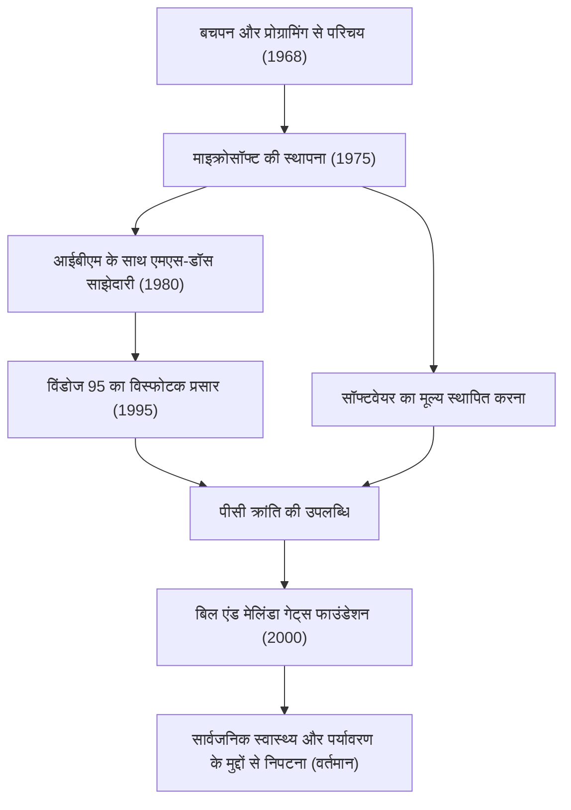

आज, कंप्यूटर हमारे डेस्क पर और हमारी जेब में सामान्य रूप से मौजूद हैं। बिल गेट्स (विलियम हेनरी गेट्स III) वह सबसे महान योगदानकर्ता हैं जिन्होंने दुनिया भर में "पर्सनल कंप्यूटर (पीसी)" की इस अवधारणा को लोकप्रिय बनाया और सॉफ्टवेयर का विशाल उद्योग बनाया। सिर्फ एक प्रौद्योगिकीविद् से अधिक, वह एक उत्कृष्ट व्यवसायी थे जो बाद में दुनिया के सबसे बड़े परोपकारी व्यक्ति में बदल गए। उनकी जीवन कहानी को आधुनिक समाज के विकास का इतिहास ही कहा जा सकता है।

### सॉफ्टवेयर के मूल्य के प्रति जागृति

1955 में वाशिंगटन के सिएटल में जन्मे गेट्स ने कम उम्र से ही असाधारण बुद्धिमत्ता दिखाई। 13 साल की उम्र में वे प्रोग्रामिंग के आकर्षण से मंत्रमुग्ध हो गए थे। लेकसाइड स्कूल में पेश किए गए एक टेलीटाइप टर्मिनल के माध्यम से, वे कंप्यूटर की दुनिया में डूब गए। पॉल एलन (बाद में माइक्रोसॉफ्ट के सह-संस्थापक) के साथ, वे कंप्यूटर का समय कमाने के लिए सिस्टम बग ढूंढते थे, और अंततः एक स्थानीय कंपनी की पेरोल प्रणाली का जिम्मा लेने के लिए विकसित हुए।

यद्यपि उन्होंने 1973 में हार्वर्ड विश्वविद्यालय में प्रवेश लिया, लेकिन उनका जुनून शिक्षा में नहीं था। 1975 में, जब दुनिया का पहला वाणिज्यिक व्यक्तिगत कंप्यूटर "Altair 8800" जारी किया गया, तो गेट्स और एलन ने इसके लिए एक BASIC दुभाषिया विकसित किया। "हर डेस्क पर और हर घर में एक कंप्यूटर" की भव्य दृष्टि के साथ, उन्होंने कॉलेज छोड़ दिया और "माइक्रो-सॉफ्ट" (बाद में माइक्रोसॉफ्ट) की स्थापना की। ऐसे समय में जब "सॉफ्टवेयर" केवल हार्डवेयर का एक जोड़ था, गेट्स की सबसे बड़ी दूरदर्शिता इसके मूल्य को कॉपीराइट के रूप में पहचानना और इसे अपने व्यवसाय के मूल में रखना था।

### एक साम्राज्य का निर्माण और "विंडोज" की जीत

1980 में आईबीएम के साथ एक अनुबंध के साथ माइक्रोसॉफ्ट की छलांग निर्णायक बन गई। आईबीएम के नए पीसी के लिए एक ओएस (ऑपरेटिंग सिस्टम) प्रदान करने के लिए संपर्क किए जाने पर, गेट्स ने एक अन्य कंपनी से एक ओएस खरीदा और इसे "एमएस-डॉस" के रूप में लाइसेंस देने के लिए एक अनुबंध पर हस्ताक्षर किए। महत्वपूर्ण बात यह है कि उन्होंने आईबीएम को विशेष अधिकार नहीं दिए, बल्कि अन्य कंप्यूटर निर्माताओं को लाइसेंस देने का अधिकार सुरक्षित रखा। इसने एमएस-डॉस को पीसी के लिए वास्तविक मानक बना दिया।

बाद में, ग्राफिकल यूजर इंटरफेस (जीयूआई) के महत्व को जल्दी पहचानने के बाद, उन्होंने 1985 में "विंडोज" की घोषणा की। कई संस्करण अपग्रेड के बाद, 1995 में जारी किया गया "विंडोज 95", एक वैश्विक सामाजिक घटना बन गया, जिसने इंटरनेट युग के लिए दरवाजे चौड़े कर दिए।

### एक क्रूर कार्यकारी से दुनिया को बचाने वाले परोपकारी व्यक्ति तक

एक कार्यकारी के रूप में, गेट्स प्रतिस्पर्धा के प्रति अविश्वसनीय रूप से क्रूर थे और उन्होंने पूरी तरह से जीत हासिल करने का प्रयास किया। नेटस्केप के साथ भयंकर ब्राउज़र युद्ध और न्याय विभाग के साथ एंटीट्रस्ट परीक्षण ऐसी घटनाएँ हैं जो उनके आक्रामक व्यावसायिक तरीकों का प्रतीक हैं। दूसरी ओर, उनकी "थिंक वीक" नामक एक आदत थी, जहाँ वे साल में कुछ बार एक कुटीर में एकांतवास करते थे, भारी मात्रा में कागजात और किताबें पढ़ते थे, और भविष्य की तकनीक के रुझानों की भविष्यवाणी करते थे। उनकी सफलता को गहरी सोच के लिए इस समय और इसे व्यवसाय से जोड़ने की उनकी निष्पादन क्षमता दोनों का समर्थन प्राप्त था।

हालाँकि, 2000 में "बिल एंड मेलिंडा गेट्स फाउंडेशन" की स्थापना के बाद, उनके जीवन का चरण काफी बदल गया। 2008 में माइक्रोसॉफ्ट के प्रबंधन की अग्रिम पंक्तियों से हटने के बाद, उन्होंने वैश्विक चुनौतियों को हल करने में अपनी अपार संपत्ति डालना शुरू कर दिया। उनकी गतिविधियाँ विविध हैं, जिनमें विकासशील देशों में संक्रामक रोगों (पोलियो और मलेरिया) का उन्मूलन, क्रांतिकारी अगली पीढ़ी के शौचालयों का विकास, और हाल के वर्षों में, जलवायु परिवर्तन के उपाय (स्वच्छ ऊर्जा में निवेश) शामिल हैं।

व्यापार की दुनिया में "लाभ" का पीछा करने वाला व्यक्ति अब "मानवता के अस्तित्व और कल्याण" की अधिकतम वापसी की मांग कर रहा है, जो विज्ञान और प्रौद्योगिकी की शक्ति के साथ दुनिया को अनुकूलित करने की कोशिश कर रहा है।

### प्रौद्योगिकी द्वारा निर्देशित भविष्य और विरासत

बिल गेट्स का जीवन पूरी तरह से यह दर्शाता है कि प्रौद्योगिकी समाज को मौलिक रूप से कैसे नया आकार देती है। उनके द्वारा बनाए गए सॉफ्टवेयर उद्योग की नींव पर, वर्तमान स्मार्टफोन, क्लाउड और एआई का विकास मौजूद है।

उन्होंने जो सबसे बड़ा सबक पीछे छोड़ा है, वह यह हो सकता है कि "प्रौद्योगिकी अपने आप में न तो अच्छी है और न ही बुरी; महत्वपूर्ण यह है कि इसका उपयोग कैसे किया जाता है और समाज में इसे कैसे लागू किया जाता है।" जो युवक कोड लिखता था और दुनिया भर के पीसी को ओएस देता था, वह अब वैश्विक बग को ठीक करने के लिए एक विशाल परियोजना में सबसे आगे है। उनकी यात्रा भविष्य के उद्यमियों के लिए एक शाश्वत रोल मॉडल बनी रहेगी, जो यह दर्शाती है कि व्यावसायिक सफलता से परे "सच्चा सामाजिक योगदान" कैसा दिखता है।
