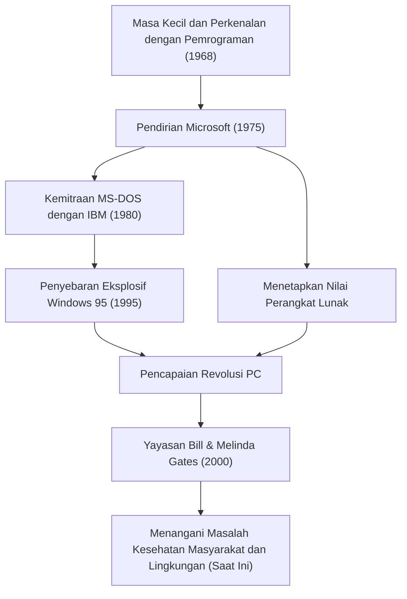

Saat ini, komputer ada di meja kita dan di saku kita sebagai hal yang biasa. Bill Gates (William Henry Gates III) adalah kontributor terbesar yang mempopulerkan konsep "komputer pribadi (PC)" ini ke seluruh dunia dan menciptakan industri perangkat lunak yang sangat besar. Lebih dari sekadar ahli teknologi, ia adalah pengusaha luar biasa yang kemudian bertransformasi menjadi dermawan terbesar di dunia. Kisah hidupnya dapat dikatakan sebagai sejarah perkembangan masyarakat modern itu sendiri.

### Kebangkitan terhadap Nilai Perangkat Lunak

Lahir di Seattle, Washington pada tahun 1955, Gates menunjukkan kecerdasan luar biasa sejak usia dini. Ia terpikat oleh daya tarik pemrograman pada usia 13 tahun. Melalui terminal teletype yang diperkenalkan di Lakeside School tempatnya bersekolah, ia membenamkan dirinya dalam dunia komputer. Bersama dengan Paul Allen (kemudian menjadi salah satu pendiri Microsoft), mereka akan menemukan bug sistem untuk mendapatkan waktu komputer, dan akhirnya berkembang untuk menangani sistem penggajian perusahaan lokal.

Meskipun ia masuk Universitas Harvard pada tahun 1973, minat utamanya bukan pada akademisi. Pada tahun 1975, ketika komputer pribadi komersial pertama di dunia "Altair 8800" dirilis, Gates dan Allen mengembangkan juru bahasa BASIC untuknya. Dengan visi besar "sebuah komputer di setiap meja dan di setiap rumah," mereka putus kuliah dan mendirikan "Micro-Soft" (kemudian Microsoft). Pada saat "perangkat lunak" hanya sekadar tambahan pada perangkat keras, pandangan ke depan terbesar Gates adalah menyadari nilainya sebagai hak cipta dan menempatkannya sebagai inti bisnis mereka.

### Membangun Kerajaan dan Kemenangan "Windows"

Lompatan maju Microsoft menjadi menentukan dengan kontrak dengan IBM pada tahun 1980. Didekati untuk menyediakan OS (Sistem Operasi) untuk PC baru IBM, Gates membeli OS dari perusahaan lain dan menandatangani kontrak untuk melisensikannya sebagai "MS-DOS". Yang penting, dia tidak memberi IBM hak eksklusif, tetapi mempertahankan hak untuk melisensikannya ke produsen komputer lain. Hal ini menjadikan MS-DOS sebagai standar de facto untuk PC.

Kemudian, setelah menyadari pentingnya Antarmuka Pengguna Grafis (GUI) sejak dini, ia mengumumkan "Windows" pada tahun 1985. Setelah beberapa peningkatan versi, "Windows 95", yang dirilis pada tahun 1995, menjadi fenomena sosial global, membuka pintu lebar-lebar ke era Internet.

### Dari Eksekutif yang Kejam menjadi Dermawan yang Menyelamatkan Dunia

Sebagai seorang eksekutif, Gates sangat kejam terhadap persaingan dan benar-benar mengejar kemenangan. Perang peramban yang sengit dengan Netscape dan persidangan antimonopoli dengan Departemen Kehakiman adalah peristiwa yang melambangkan metode bisnisnya yang agresif. Di sisi lain, ia memiliki kebiasaan yang disebut "Think Week", di mana ia akan mengurung diri di sebuah pondok beberapa kali dalam setahun, membaca sejumlah besar makalah dan buku, terus memprediksi tren teknologi masa depan. Kesuksesannya didukung oleh waktu yang digunakan untuk berpikir mendalam ini dan kemampuannya mengeksekusi untuk mengaitkannya dengan bisnis.

Namun, setelah mendirikan "Bill & Melinda Gates Foundation" pada tahun 2000, fase kehidupannya berubah secara signifikan. Setelah mundur dari garis depan manajemen Microsoft pada tahun 2008, ia mulai menggelontorkan kekayaannya yang sangat besar untuk memecahkan tantangan global. Kegiatannya beragam, termasuk pemberantasan penyakit menular (polio dan malaria) di negara-negara berkembang, pengembangan toilet generasi berikutnya yang revolusioner, dan dalam beberapa tahun terakhir, penanggulangan perubahan iklim (berinvestasi dalam energi bersih).

Pria yang mengejar "keuntungan" di dunia bisnis sekarang mencari keuntungan maksimal dari "kelangsungan hidup dan kesejahteraan umat manusia," mencoba mengoptimalkan dunia dengan kekuatan ilmu pengetahuan dan teknologi.

### Masa Depan dan Warisan yang Dipandu oleh Teknologi

Kehidupan Bill Gates mewujudkan dengan sempurna bagaimana teknologi secara mendasar membentuk kembali masyarakat. Di atas fondasi industri perangkat lunak yang dibangunnya, terdapat pengembangan telepon pintar saat ini, komputasi awan, dan AI.

Pelajaran terbesar yang ia tinggalkan mungkin adalah bahwa "teknologi itu sendiri tidak baik atau buruk; yang penting adalah bagaimana ia digunakan dan diimplementasikan dalam masyarakat." Pemuda yang menulis kode dan memberikan OS ke PC di seluruh dunia kini berada di garis depan proyek besar-besaran untuk memperbaiki bug global. Perjalanannya akan terus menjadi panutan abadi bagi wirausahawan masa depan, menunjukkan seperti apa "kontribusi sosial sejati" di luar kesuksesan bisnis.
