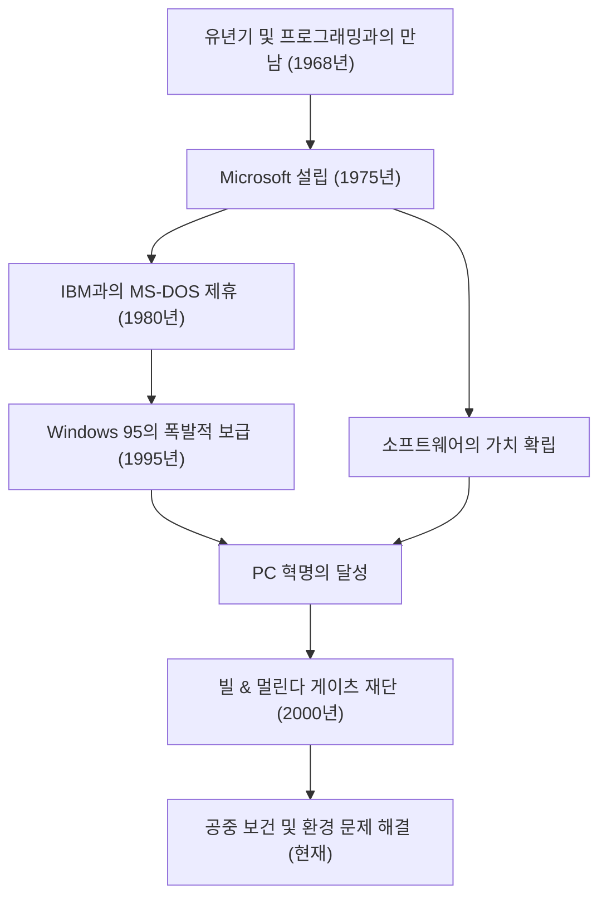

오늘날 우리의 책상 위와 주머니 속에는 당연하다는 듯이 컴퓨터가 존재합니다. 이 '개인용 컴퓨터(PC)'라는 개념을 전 세계에 보급하고, 소프트웨어라는 거대한 산업을 창출한 최대의 공로자가 바로 빌 게이츠(윌리엄 헨리 게이츠 3세)입니다. 단순한 기술자를 넘어 탁월한 비즈니스맨이었으며, 훗날 세계 최대의 자선사업가로 변모한 그의 생애는 현대 사회 발전의 역사 그 자체라고 할 수 있습니다.

### 소프트웨어의 가치에 눈뜨다

1955년 워싱턴주 시애틀에서 태어난 게이츠는 일찍부터 비범한 지능을 보였습니다. 그가 프로그래밍의 매력에 푹 빠진 것은 13살 때였습니다. 다니던 레이크사이드 학교에 도입된 텔레타이프 단말기를 통해 그는 컴퓨터의 세계에 몰두합니다. 폴 앨런(훗날 마이크로소프트 공동 창업자)과 함께 그들은 시스템의 버그를 찾아내어 컴퓨터 사용 시간을 벌었고, 이윽고 지역 기업의 급여 계산 시스템을 도급받을 정도로 성장했습니다.

1973년 하버드 대학교에 진학했지만, 그의 열정은 학계에 있지 않았습니다. 1975년 세계 최초의 상업용 개인용 컴퓨터 'Altair 8800'이 출시되자, 게이츠와 앨런은 이를 위한 BASIC 인터프리터를 개발했습니다. '모든 책상 위에, 모든 가정에 컴퓨터를'이라는 원대한 비전을 내걸고 대학을 중퇴하여 'Micro-Soft(훗날 Microsoft)'를 설립했습니다. 당시 하드웨어의 덤에 불과했던 '소프트웨어'에서 저작권이라는 가치를 발견하고, 이를 비즈니스의 핵심으로 삼은 것이야말로 게이츠의 가장 큰 혜안이었습니다.

### 제국의 구축과 'Windows'의 승리

마이크로소프트의 도약은 1980년 IBM과의 계약으로 결정적인 것이 됩니다. IBM의 신형 PC용 OS(운영체제) 제공을 타진받은 게이츠는 타사로부터 OS를 사들여 'MS-DOS'로 라이선스 공급하는 계약을 맺었습니다. 중요한 것은 IBM에 독점권을 주지 않고, 다른 컴퓨터 제조업체에도 라이선스를 줄 수 있는 권리를 유보했다는 점입니다. 이로써 MS-DOS는 PC의 사실상 표준(디팩토 스탠다드)이 되었습니다.

이후 그래픽 사용자 인터페이스(GUI)의 중요성을 일찍이 간파했던 그는 1985년 'Windows'를 발표합니다. 몇 차례의 버전업을 거쳐 1995년에 출시된 'Windows 95'는 세계적인 사회 현상이 되었고, 인터넷 시대로 가는 문을 활짝 열어젖혔습니다.

### 냉철한 경영자에서 세상을 구하는 자선가로

경영자로서의 게이츠는 경쟁에 대해 매우 냉철했으며 철저하게 이기는 것을 추구했습니다. 넷스케이프와의 치열한 브라우저 전쟁이나 독점금지법 위반을 둘러싼 법무부와의 재판은 그의 강압적인 비즈니스 방식을 상징하는 사건입니다. 한편, 그는 '생각 주간(Think Week)'이라는 습관을 가지고 있어 1년에 몇 번 오두막에 틀어박혀 대량의 논문과 책을 읽으며 미래 기술의 동향을 끊임없이 예측했습니다. 그의 성공은 이 깊이 생각하는 시간과 그것을 비즈니스로 연결하는 실행력이라는 양 수레바퀴에 의해 지탱되었습니다.

그러나 2000년에 '빌 & 멀린다 게이츠 재단'을 설립한 이후 그의 인생 단계는 크게 변화합니다. 2008년 마이크로소프트 경영 일선에서 물러난 후, 자신의 막대한 부를 지구적 과제 해결에 쏟아붓기 시작했습니다. 개발도상국의 감염병(소아마비와 말라리아) 근절, 획기적인 차세대 화장실 개발, 그리고 최근에는 기후 변화 대책(청정에너지 투자) 등 그 활동은 다방면에 걸쳐 있습니다.

비즈니스 세계에서 '이익'을 추구했던 남자는 이제 '인류의 존속과 복지'라는 최대의 수익을 구하며, 과학과 기술의 힘으로 세상을 최적화하려 하고 있습니다.

### 기술이 이끄는 미래와 유산

빌 게이츠의 인생은 기술이 어떻게 사회를 근본부터 다시 만들어내는지를 훌륭하게 구현하고 있습니다. 그가 구축한 소프트웨어 산업이라는 토대 위에 현재의 스마트폰이나 클라우드, 그리고 AI의 발전이 존재하고 있습니다.

그가 남긴 가장 큰 교훈은 "기술 그 자체에는 선악이 없으며, 그것을 어떻게 사용하고 사회에 구현할 것인가가 중요하다"는 것일지도 모릅니다. 코드를 작성하고 전 세계 PC에 OS를 전달했던 청년은 지금 지구 규모의 버그를 수정하기 위한 거대한 프로젝트의 선두에 서 있습니다. 그의 행보는 후세의 기업가들에게 비즈니스 성공 그 너머에 있는 '진정한 사회 공헌'의 모습을 보여주는 영원한 롤모델로 남을 것입니다.
