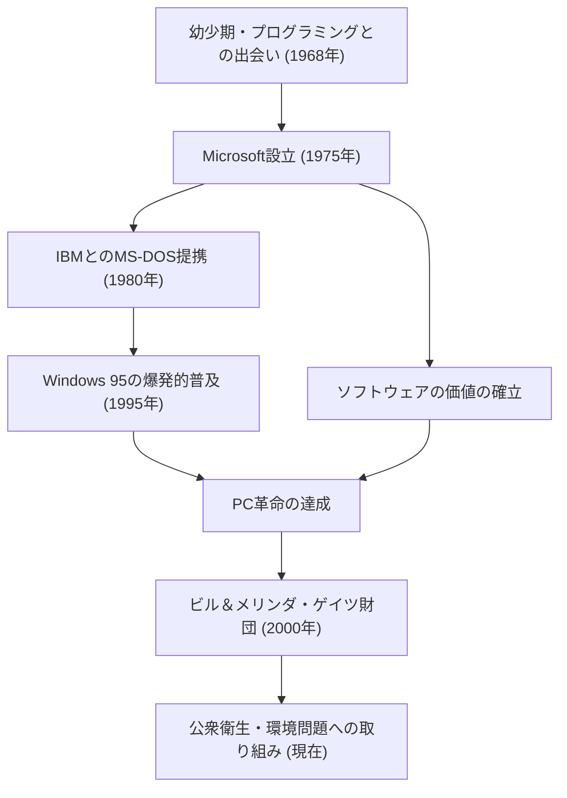

私たちの机の上に、そしてポケットの中に、当たり前のようにコンピューターが存在する現代。この「パーソナルコンピューター（PC）」という概念を世界中に普及させ、ソフトウェアという巨大産業を創出した最大の功労者が、ビル・ゲイツ（ウィリアム・ヘンリー・ゲイツ3世）です。単なる技術者にとどまらず、卓越したビジネスマンであり、後に世界最大の慈善事業家へと変貌を遂げた彼の生涯は、現代社会の発展の歴史そのものと言えます。

### ソフトウェアの価値への目覚め

1955年、ワシントン州シアトルで生まれたゲイツは、早くから並外れた知性を示していました。彼がプログラミングの魅力に取り憑かれたのは、13歳の時。通っていたレイクサイド校に導入されたテレタイプ端末を通じて、コンピューターの世界に没頭します。ポール・アレン（後のマイクロソフト共同創業者）とともに、彼らはシステムのバグを見つけてはコンピューター時間を稼ぎ、やがては地元企業の給与計算システムを請け負うまでに成長しました。

1973年にハーバード大学に進学したものの、彼の情熱はアカデミアにはありませんでした。1975年、世界初の商用パーソナルコンピューター「Altair 8800」が発売されると、ゲイツとアレンはそのためのBASICインタプリタを開発。「すべての机の上に、すべての家庭に、コンピューターを」という壮大なビジョンを掲げ、大学を中退して「Micro-Soft（後にMicrosoft）」を設立しました。当時、ハードウェアのおまけでしかなかった「ソフトウェア」に著作権という価値を見出し、それをビジネスの核に据えたことこそ、ゲイツの最大の慧眼でした。

### 帝国の構築と「Windows」の勝利

マイクロソフトの飛躍は、1980年のIBMとの契約によって決定的なものとなります。IBMの新型PC向けのOS（オペレーティングシステム）の提供を打診されたゲイツは、他社からOSを買い取り、「MS-DOS」としてライセンス供給する契約を結びました。重要なのは、IBMに独占権を与えず、他のコンピューターメーカーにもライセンスできる権利を留保したことです。これにより、MS-DOSはPCの事実上の標準（デファクトスタンダード）となりました。

その後、グラフィカル・ユーザー・インターフェース（GUI）の重要性をいち早く見抜いていた彼は、1985年に「Windows」を発表します。幾度かのバージョンアップを経て、1995年にリリースされた「Windows 95」は世界的な社会現象となり、インターネット時代への扉を大きく開きました。

### 冷徹な経営者から、世界を救う慈善家へ

経営者としてのゲイツは、競争に対して非常に冷徹であり、徹底的に勝つことを追求しました。ブラウザ戦争におけるネットスケープとの熾烈な争いや、独占禁止法違反を巡る司法省との裁判は、彼の強引なビジネス手法を象徴する出来事です。一方で、彼は「シンクウィーク（考える週）」と呼ばれる習慣を持ち、年に数回、コテージに籠もって大量の論文や書籍を読み込み、未来のテクノロジーの動向を予測し続けました。彼の成功は、この深く考える時間と、それをビジネスに結びつける実行力の両輪によって支えられていました。

しかし、2000年に「ビル＆メリンダ・ゲイツ財団」を設立して以降、彼の人生のフェーズは大きく変化します。2008年にマイクロソフトの経営の第一線から退くと、自身の莫大な富を、地球規模の課題解決に注ぎ込むようになりました。途上国での感染症（ポリオやマラリア）の根絶、画期的な次世代トイレの開発、そして近年では気候変動対策（クリーンエネルギーへの投資）など、その活動は多岐にわたります。

ビジネスの世界で「利益」を追求した男は、今や「人類の存続と福祉」という最大のリターンを求めて、科学とテクノロジーの力で世界を最適化しようとしています。

### テクノロジーが導く未来と遺産

ビル・ゲイツの人生は、テクノロジーがいかにして社会を根底から作り変えるかを見事に体現しています。彼が築き上げたソフトウェア産業という土台の上に、現在のスマートフォンやクラウド、そしてAIの発展が存在しています。

彼の残した最大の教訓は、「テクノロジーそのものには善悪はなく、それをどう使い、どう社会に実装するかが重要である」ということかもしれません。コードを書き、世界中のPCにOSを届けた青年は、今、地球規模のバグを修正するための巨大なプロジェクトの先頭に立っています。彼の歩みは、後世の起業家たちにとって、ビジネスの成功の先にある「真の社会貢献」のあり方を示す永遠のロールモデルであり続けるでしょう。
