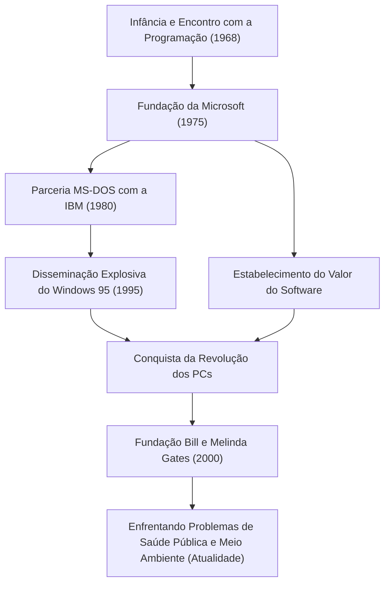

Hoje, computadores existem em nossas mesas e em nossos bolsos como algo natural. Bill Gates (William Henry Gates III) é o maior contribuidor que popularizou este conceito de "computador pessoal (PC)" em todo o mundo e criou a enorme indústria de software. Mais do que apenas um tecnólogo, ele foi um empresário notável que mais tarde se transformou no maior filantropo do mundo. A história de sua vida pode ser considerada a própria história do desenvolvimento da sociedade moderna.

### Despertando para o Valor do Software

Nascido em Seattle, Washington, em 1955, Gates demonstrou inteligência extraordinária desde cedo. Ele foi cativado pelo charme da programação aos 13 anos. Através de um terminal de teletipo introduzido na Lakeside School que ele frequentava, ele mergulhou no mundo dos computadores. Junto com Paul Allen (mais tarde cofundador da Microsoft), eles encontravam bugs de sistema para ganhar tempo de computador e, eventualmente, cresceram para assumir o sistema de folha de pagamento de uma empresa local.

Embora tenha ingressado na Universidade de Harvard em 1973, sua paixão não estava na vida acadêmica. Em 1975, quando o primeiro computador pessoal comercial do mundo "Altair 8800" foi lançado, Gates e Allen desenvolveram um interpretador BASIC para ele. Com a grande visão de "um computador em cada mesa e em cada casa", eles abandonaram a faculdade e fundaram a "Micro-Soft" (mais tarde Microsoft). Em uma época em que o "software" era apenas um complemento do hardware, a maior visão de Gates foi reconhecer seu valor como direitos autorais e colocá-lo no centro de seus negócios.

### Construindo um Império e a Vitória do "Windows"

O salto da Microsoft tornou-se decisivo com um contrato com a IBM em 1980. Abordado para fornecer um SO (Sistema Operacional) para o novo PC da IBM, Gates comprou um SO de outra empresa e assinou um contrato para licenciá-lo como "MS-DOS". O mais importante é que ele não deu direitos exclusivos à IBM, mas reservou-se o direito de licenciá-lo a outros fabricantes de computadores. Isso tornou o MS-DOS o padrão de fato para PCs.

Mais tarde, tendo reconhecido a importância da Interface Gráfica do Usuário (GUI) desde cedo, ele anunciou o "Windows" em 1985. Após várias atualizações de versão, o "Windows 95", lançado em 1995, tornou-se um fenômeno social global, escancarando a porta para a era da Internet.

### De Executivo Implacável a Filantropo Salvando o Mundo

Como executivo, Gates era incrivelmente implacável com a concorrência e buscou exaustivamente a vitória. A feroz guerra dos navegadores com a Netscape e o julgamento antitruste com o Departamento de Justiça são eventos que simbolizam seus métodos de negócios agressivos. Por outro lado, ele tinha um hábito chamado "Think Week", onde ele se isolava em uma casa de campo algumas vezes por ano, lendo enormes quantidades de artigos e livros, prevendo continuamente as tendências da tecnologia futura. Seu sucesso foi sustentado tanto por esse tempo de pensamento profundo quanto por sua capacidade de execução de vinculá-lo aos negócios.

No entanto, após estabelecer a "Fundação Bill e Melinda Gates" em 2000, a fase de sua vida mudou significativamente. Depois de deixar a linha de frente da gestão da Microsoft em 2008, ele começou a investir sua imensa riqueza na solução de desafios globais. Suas atividades são diversas, incluindo a erradicação de doenças infecciosas (poliomielite e malária) em países em desenvolvimento, o desenvolvimento de banheiros revolucionários de próxima geração e, nos últimos anos, contramedidas para as mudanças climáticas (investimento em energia limpa).

O homem que buscou "lucro" no mundo dos negócios agora busca o retorno máximo da "sobrevivência e bem-estar da humanidade", tentando otimizar o mundo com o poder da ciência e da tecnologia.

### O Futuro e o Legado Guiados pela Tecnologia

A vida de Bill Gates incorpora perfeitamente como a tecnologia remodela fundamentalmente a sociedade. Sobre a fundação da indústria de software que ele construiu, existe o desenvolvimento dos atuais smartphones, da nuvem e da IA.

A maior lição que ele deixou pode ser que "a tecnologia em si não é boa nem má; o que importa é como ela é usada e implementada na sociedade". O jovem que escrevia código e entregava um sistema operacional para PCs em todo o mundo está agora na vanguarda de um projeto massivo para consertar os bugs globais. Sua jornada continuará a ser um modelo eterno para futuros empreendedores, mostrando como é a "verdadeira contribuição social" além do sucesso nos negócios.
