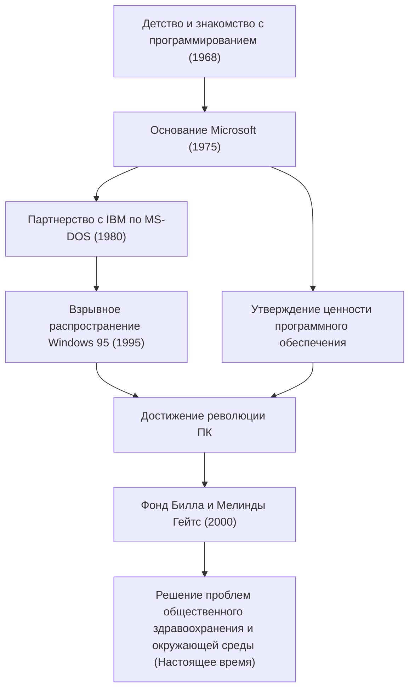

Сегодня компьютеры присутствуют на наших столах и в наших карманах как нечто само собой разумеющееся. Билл Гейтс (Уильям Генри Гейтс III) — величайший деятель, который популяризировал концепцию «персонального компьютера (ПК)» во всем мире и создал огромную индустрию программного обеспечения. Больше, чем просто технолог, он был выдающимся бизнесменом, который позже превратился в крупнейшего филантропа в мире. Можно сказать, что история его жизни — это сама история развития современного общества.

### Пробуждение к ценности программного обеспечения

Родившийся в Сиэтле, штат Вашингтон, в 1955 году, Гейтс с раннего возраста проявлял незаурядный интеллект. Он был очарован программированием в возрасте 13 лет. Через телетайпный терминал, установленный в школе Лейксайд, которую он посещал, он погрузился в мир компьютеров. Вместе с Полом Алленом (впоследствии соучредителем Microsoft) они находили ошибки в системах, чтобы заработать компьютерное время, и в итоге доросли до того, что взяли на себя систему расчета заработной платы местной компании.

Хотя он поступил в Гарвардский университет в 1973 году, его страсть не была связана с академической средой. В 1975 году, когда был выпущен первый в мире коммерческий персональный компьютер Altair 8800, Гейтс и Аллен разработали для него интерпретатор BASIC. С грандиозным видением «компьютер на каждом столе и в каждом доме» они бросили колледж и основали Micro-Soft (позже Microsoft). В то время, когда «программное обеспечение» было просто дополнением к аппаратному обеспечению, величайшим предвидением Гейтса было признание его ценности как авторского права и помещение его в основу своего бизнеса.

### Создание империи и победа «Windows»

Скачок Microsoft стал решающим благодаря контракту с IBM в 1980 году. Когда к нему обратились с предложением предоставить ОС (операционную систему) для нового ПК IBM, Гейтс купил ОС у другой компании и подписал контракт на ее лицензирование как «MS-DOS». Важно отметить, что он не предоставил IBM эксклюзивных прав, а оставил за собой право лицензировать ее другим производителям компьютеров. Это сделало MS-DOS фактическим стандартом для ПК.

Позже, рано осознав важность графического пользовательского интерфейса (GUI), он анонсировал «Windows» в 1985 году. После нескольких обновлений версий «Windows 95», выпущенная в 1995 году, стала глобальным социальным явлением, широко распахнув двери в эпоху Интернета.

### От безжалостного руководителя к филантропу, спасающему мир

Как руководитель, Гейтс был невероятно безжалостен к конкуренции и упорно стремился к победе. Жестокая война браузеров с Netscape и антимонопольный судебный процесс с Министерством юстиции — это события, символизирующие его агрессивные методы ведения бизнеса. С другой стороны, у него была привычка под названием «Неделя размышлений» (Think Week), когда он уединялся в коттедже несколько раз в год, читая огромное количество статей и книг, непрерывно предсказывая тенденции будущих технологий. Его успех поддерживался как этим временем для глубоких размышлений, так и его способностью к реализации, связывающей это с бизнесом.

Однако после создания «Фонда Билла и Мелинды Гейтс» в 2000 году этап его жизни существенно изменился. Уйдя с передовой линии управления Microsoft в 2008 году, он начал вкладывать свое огромное богатство в решение глобальных проблем. Его деятельность разнообразна, включая искоренение инфекционных заболеваний (полиомиелит и малярия) в развивающихся странах, разработку революционных туалетов нового поколения, а в последние годы — меры по борьбе с изменением климата (инвестиции в экологически чистую энергию).

Человек, стремившийся к «прибыли» в деловом мире, теперь ищет максимальную отдачу от «выживания и благополучия человечества», пытаясь оптимизировать мир с помощью науки и технологий.

### Будущее и наследие, направляемые технологиями

Жизнь Билла Гейтса прекрасно воплощает то, как технологии фундаментально меняют общество. На фундаменте индустрии программного обеспечения, которую он построил, существует развитие современных смартфонов, облачных вычислений и ИИ.

Величайший урок, который он оставил после себя, может заключаться в том, что «технологии сами по себе не являются ни хорошими, ни плохими; важно то, как они используются и внедряются в общество». Молодой человек, писавший код и поставлявший ОС для ПК по всему миру, теперь находится в авангарде масштабного проекта по исправлению глобальных ошибок. Его путь будет оставаться вечным примером для подражания для будущих предпринимателей, показывая, как выглядит «истинный социальный вклад» за пределами успеха в бизнесе.
