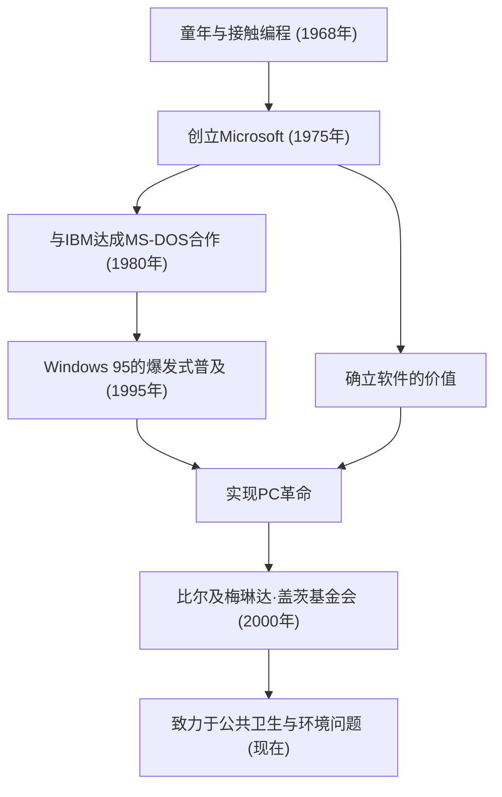

在当今时代，电脑理所当然地存在于我们的办公桌上和口袋里。比尔·盖茨（威廉·亨利·盖茨三世）是将“个人电脑（PC）”这一概念普及到全世界，并创造了软件这一巨大产业的最大功臣。他不仅仅是一名技术人员，更是一位卓越的商人，后来又转变为世界上最大的慈善家。他的一生可以说是现代社会发展历史的缩影。

### 觉醒于软件的价值

盖茨于1955年出生在华盛顿州西雅图，从小就展现出非凡的智慧。他在13岁时就被编程的魅力所吸引。通过他就读的湖滨学校引入的电传打字机终端，他沉浸在计算机的世界中。与保罗·艾伦（后来的微软联合创始人）一起，他们通过寻找系统漏洞来赚取上机时间，最终成长到可以承包当地公司的工资结算系统。

尽管他在1973年进入了哈佛大学，但他的热情并不在学术界。1975年，当世界上第一台商业个人电脑“Altair 8800”发布时，盖茨和艾伦为其开发了BASIC解释器。他们提出了“每张办公桌上、每个家庭里都有一台电脑”的宏大愿景，辍学创立了“Micro-Soft”（后来的Microsoft）。当时，“软件”还只是硬件的附属品，而盖茨最大的远见卓识就在于发现了其作为版权的价值，并将其作为业务的核心。

### 建立帝国与“Windows”的胜利

微软的飞跃决定于1980年与IBM的合同。当被要求为IBM的新型PC提供OS（操作系统）时，盖茨从另一家公司购买了OS，并签订了作为“MS-DOS”提供许可的合同。重要的是，他没有给IBM独占权，而是保留了向其他电脑制造商提供许可的权利。这使得MS-DOS成为PC的事实上的标准。

之后，很早就敏锐地察觉到图形用户界面（GUI）重要性的他，在1985年发布了“Windows”。经过几次版本升级，1995年发布的“Windows 95”成为了世界性的社会现象，大大敞开了通往互联网时代的大门。

### 从冷酷的企业家到拯救世界的慈善家

作为企业家的盖茨，在竞争中非常冷酷，彻底追求胜利。在浏览器大战中与网景公司的激烈争斗，以及围绕违反反垄断法与司法部的诉讼，都是象征其强硬商业手法的事件。另一方面，他有一个被称为“思考周”的习惯，每年几次，他会将自己关在小屋里，阅读大量论文和书籍，不断预测未来技术的趋势。他的成功正是由这种深度思考的时间和将其转化为商业的执行力共同支撑的。

然而，在2000年成立“比尔及梅琳达·盖茨基金会”之后，他的人生阶段发生了重大转变。2008年退居微软管理一线后，他开始将巨额财富投入到解决全球性挑战中。他在发展中国家消除传染病（小儿麻痹症和疟疾）、开发具有划时代意义的下一代厕所，以及近年来应对气候变化（投资清洁能源）等方面的活动多种多样。

这位在商业世界中追求“利润”的男人，如今正寻求“人类生存与福祉”这一最大回报，试图用科学和技术的力量优化世界。

### 科技引领的未来与遗产

比尔·盖茨的一生完美地体现了科技如何从根本上重塑社会。在他建立的软件产业基础之上，才有了现在的智能手机、云计算和人工智能的发展。

他留下的最大教训也许是：“科技本身没有善恶，重要的是如何使用它，如何将其在社会中应用。”那个编写代码、向全世界的PC提供操作系统的青年，现在正站在一个旨在修复地球规模“漏洞”的庞大项目的最前沿。他的足迹将继续作为后代企业家的永恒榜样，展示商业成功之后的“真正社会贡献”应有的样子。
