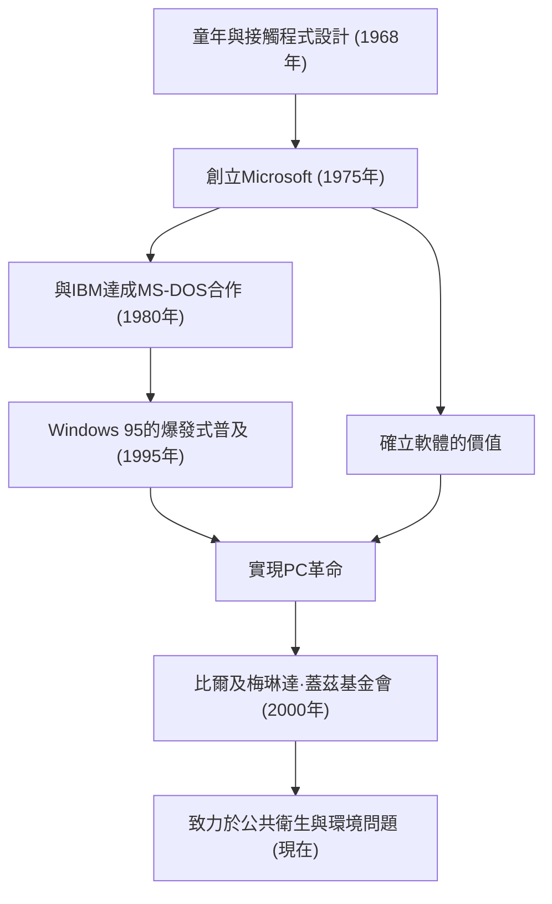

在當今時代，電腦理所當然地存在於我們的辦公桌上和口袋裡。比爾·蓋茲（威廉·亨利·蓋茲三世）是將「個人電腦（PC）」這一概念普及到全世界，並創造了軟體這一巨大產業的最大功臣。他不僅僅是一名技術人員，更是一位卓越的商人，後來又轉變為世界上最大的慈善家。他的一生可以說是現代社會發展歷史的縮影。

### 覺醒於軟體的價值

蓋茲於1955年出生在華盛頓州西雅圖，從小就展現出非凡的智慧。他在13歲時就被程式設計的魅力所吸引。透過他就讀的湖濱學校引入的電傳打字機終端，他沉浸在電腦的世界中。與保羅·艾倫（後來的微軟聯合創始人）一起，他們透過尋找系統漏洞來賺取上機時間，最終成長到可以承包當地公司的薪資結算系統。

儘管他在1973年進入了哈佛大學，但他的熱情並不在學術界。1975年，當世界上第一台商業個人電腦「Altair 8800」發佈時，蓋茲和艾倫為其開發了BASIC直譯器。他們提出了「每張辦公桌上、每個家庭裡都有一台電腦」的宏大願景，輟學創立了「Micro-Soft」（後來的Microsoft）。當時，「軟體」還只是硬體的附屬品，而蓋茲最大的遠見卓識就在於發現了其作為版權的價值，並將其作為業務的核心。

### 建立帝國與「Windows」的勝利

微軟的飛躍決定於1980年與IBM的合約。當被要求為IBM的新型PC提供OS（作業系統）時，蓋茲從另一家公司購買了OS，並簽訂了作為「MS-DOS」提供授權的合約。重要的是，他沒有給IBM獨占權，而是保留了向其他電腦製造商提供授權的權利。這使得MS-DOS成為PC的事實上的標準。

之後，很早就敏銳地察覺到圖形使用者介面（GUI）重要性的他，在1985年發佈了「Windows」。經過幾次版本升級，1995年發佈的「Windows 95」成為了世界性的社會現象，大大敞開了通往網際網路時代的大門。

### 從冷酷的企業家到拯救世界的慈善家

作為企業家的蓋茲，在競爭中非常冷酷，徹底追求勝利。在瀏覽器大戰中與網景公司的激烈爭鬥，以及圍繞違反反壟斷法與司法部的訴訟，都是象徵其強硬商業手法的事件。另一方面，他有一個被稱為「思考週」的習慣，每年幾次，他會將自己關在小屋裡，閱讀大量論文和書籍，不斷預測未來技術的趨勢。他的成功正是由這種深度思考的時間和將其轉化為商業的執行力共同支撐的。

然而，在2000年成立「比爾及梅琳達·蓋茲基金會」之後，他的人生階段發生了重大轉變。2008年退居微軟管理一線後，他開始將巨額財富投入到解決全球性挑戰中。他在開發中國家消除傳染病（小兒麻痺症和瘧疾）、開發具有劃時代意義的下一代廁所，以及近年來應對氣候變遷（投資清潔能源）等方面的活動多種多樣。

這位在商業世界中追求「利潤」的男人，如今正尋求「人類生存與福祉」這一最大回報，試圖用科學和技術的力量優化世界。

### 科技引領的未來與遺產

比爾·蓋茲的一生完美地體現了科技如何從根本上重塑社會。在他建立的軟體產業基礎之上，才有了現在的智慧型手機、雲端運算和人工智慧的發展。

他留下的最大教訓也許是：「科技本身沒有善惡，重要的是如何使用它，如何將其在社會中應用。」那個編寫程式碼、向全世界的PC提供作業系統的青年，現在正站在一個旨在修復地球規模「漏洞」的龐大專案的最前沿。他的足跡將繼續作為後代企業家的永恆榜樣，展示商業成功之後的「真正社會貢獻」應有的樣子。
