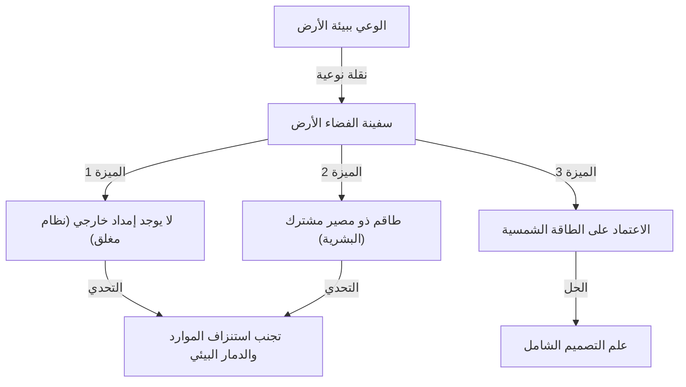
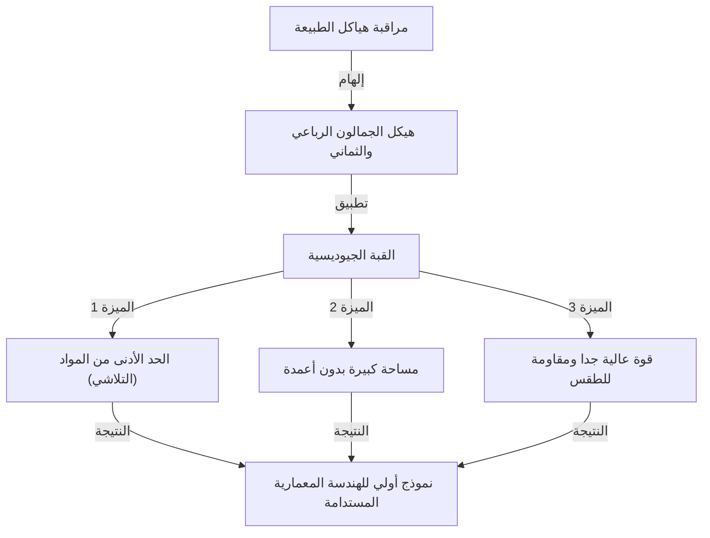

# مقدمة: المدافع عن "علم التصميم الاستباقي الشامل" الذي سبق عصره

ريتشارد بكمنستر فولر (1895 - 1983). ما الذي يتبادر إلى ذهنك عندما تسمع هذا الاسم؟ قد يفكر البعض في "القبة الجيوديسية"، وهو مبنى نصف كروي جميل مصنوع من مثلثات متساوية الأضلاع. وقد يربطها آخرون بالمفهوم الجذاب والعميق لـ "سفينة الفضاء الأرض"، والذي يمكن اعتباره أصل أهداف التنمية المستدامة (SDGs) الحالية والاستدامة.

فولر ليس مجرد مهندس معماري أو مجرد فيلسوف. أطلق على نفسه اسم "مستكشف علم التصميم الاستباقي الشامل"، وهو شخصية عبرت مجالات متعددة مثل الرياضيات والهندسة والهندسة المعمارية والفلسفة والبيئة، في بحث مستمر عن "الحل الأمثل" للبشرية للبقاء على هذا الكوكب.

في هذه المقالة، أثناء تتبعنا للحياة المضطربة لفولر، سنتعمق في اختراعاته العديدة الرائدة وإرثه الفلسفي، والذي تزداد أهميته في المجتمع الحديث.

## 1. الفشل والصحوة: العزيمة على شواطئ بحيرة ميشيغان

لم تكن حياة بكمنستر فولر مليئة بالنجاحات الباهرة فقط. بل إن أصل فلسفته وجد في أعماق الفشل واليأس.

ولد فولر في ميلتون، ماساتشوستس عام 1895، وكان لديه اهتمام قوي بقوانين الطبيعة والهندسة منذ صغره. ومع ذلك، لم يتناسب مع نظام التعليم الاستبدادي وتم طرده من جامعة هارفارد مرتين (المرة الأولى بسبب إهدار المال في ناد اجتماعي، والمرة الثانية بسبب "اللامسؤولية وانعدام الاهتمام").

بعد أن خدم في البحرية خلال الحرب العالمية الأولى، تزوج ودخل عالم الأعمال، لكن شركة مواد البناء التي أسسها أفلست في عام 1927. فقد فولر كل ثروته ومصداقيته الاجتماعية. ومما زاد الطين بلة، أنه عانى من مأساة لا تطاق بفقدان ابنته الكبرى المحبوبة، ألكسندرا، بسبب مضاعفات شلل الأطفال والتهاب السحايا. اعتقد فولر أن بيئة المعيشة السيئة في ذلك الوقت كانت عاملا مساهما في وفاة ابنته، وتعذب بالذنب الشديد.

في شتاء عام 1927، وقف فولر البالغ من العمر 32 عامًا على شواطئ بحيرة ميشيغان، وفكر جديًا في الانتحار غرقًا. "شخص فاشل مثلي لا ينبغي أن يكون عبئًا على عائلته بعد الآن". في اللحظة التي استهلكته فيها هذه الأفكار، يقال إنه مر بتجربة غامضة.

شعر بحدس قوي بأنه لا ينتمي إلى "نفسه" بل إلى "الكون". ثم قرر الشروع في "تجربة" عظيمة تستمر مدى الحياة: "ماذا سيحدث إذا توقفت عن العيش لنفسي وكرست كل قدراتي لرفاهية البشرية جمعاء؟" كانت هذه هي اللحظة التي وُلد فيها المخترع العظيم بكمنستر فولر في السنوات اللاحقة.

## 2. نموذج سفينة الفضاء الأرض (Spaceship Earth)

من بين العديد من مفاهيم فولر، المفهوم الأكثر شهرة والذي لا يزال له تأثير قوي اليوم هو فكرة "سفينة الفضاء الأرض".

أصبح هذا المفهوم معروفا على نطاق واسع من خلال كتابه عام 1968، "دليل تشغيل سفينة الفضاء الأرض". شبه فولر الأرض بـ "سفينة فضاء عملاقة تطير عبر الفضاء بسرعة مذهلة تبلغ حوالي 100,000 كيلومتر في الساعة".

### سفينة فضاء بدون دليل تشغيل

يشير فولر: "هناك شيء واحد غريب فقط في سفينة الفضاء هذه. وهو أنها لم تأت مع دليل تشغيل".
أمضت البشرية وقتًا طويلاً كـ "ركاب" غافلين دون فهم كامل لهيكل سفينة الفضاء هذه، ونظام دعم الحياة فيها (النظام البيئي)، ونظام تدوير الطاقة. ومع ذلك، وبسبب النمو السكاني الانفجاري والاستهلاك الهائل للوقود الأحفوري منذ الثورة الصناعية، فإن الموارد (الاحتياطيات) في سفينة الفضاء تستنفد بسرعة.

جادل فولر بأنه لم يعد مسموحًا للبشرية بأن تكون "ركابًا" غير مسؤولين، بل يجب أن يصبحوا "الطاقم" الذي يحافظ على سفينة الفضاء ويديرها باستخدام معرفتهم وتكنولوجيتهم. تطورت هذه الفلسفة لاحقًا إلى مفاهيم مثل "الاستدامة" و "المجتمع الموجه نحو إعادة التدوير"، وأصبحت الفلسفة الأساسية لأهداف التنمية المستدامة الحالية.

### حدود الوقود الأحفوري والتحول إلى الطاقة المتجددة

أطلق على استهلاك الوقود الأحفوري "فعل استنزاف بطارية سفينة الفضاء (المدخرات)" وحذر منه بشدة. كان يعتقد أن الوقود الأحفوري هو "بطارية الطوارئ لسفينة الفضاء" المتراكمة على الأرض من الطاقة الشمسية على مدى مئات الملايين من السنين، وأن استنفادها كقوة دفع يومية سيؤدي إلى خلل وظيفي مميت لسفينة الفضاء.

وبدلاً من ذلك، دعا إلى الانتقال إلى نظام يعمل فيه المجتمع فقط على "الدخل الحالي من الكون (الطاقة في الوقت الفعلي)"، مثل طاقة الرياح والمد والجزر والطاقة الشمسية. لقد توقع تمامًا أهمية الطاقة المتجددة، التي يتم الدعوة إليها بشدة اليوم، قبل أكثر من نصف قرن.

## 3. التلاشي (Ephemeralization): "إنجاز المزيد بموارد أقل"

كمفهوم أساسي للحفاظ على سفينة الفضاء الأرض، اقترح فولر "Ephemeralization". في سياق فولر، يعني "إنجاز المزيد باستخدام موارد وطاقة ووقت أقل (Doing more with less)".

### العملية الحتمية للتطور التكنولوجي

Ephemeralization هي العملية الأساسية للتطور التكنولوجي. دعونا نفكر في مثال مألوف. في الماضي، كان يتطلب الأمر كمبيوتر صمام مفرغ عملاق بحجم صالة ألعاب رياضية لتخزين وحساب المعلومات من جميع أنحاء العالم. ومع ذلك، نحمل اليوم أجهزة كمبيوتر ذات أداء أعلى بكثير في جيوبنا في شكل "هواتف ذكية".
على الرغم من استخدام مواد أقل، إلا أن الوزن أخف، وانخفض استهلاك الطاقة بشكل كبير، إلا أن الوظائف قد تحسنت بشكل هائل. هذا هو Ephemeralization.

اعتقد فولر أنه من خلال تطبيق هذه العملية على جميع الصناعات والهندسة المعمارية والبنية التحتية، سيكون من الممكن تحسين مستوى معيشة البشرية جمعاء بشكل كبير، حتى مع موارد الأرض المحدودة. كان ادعاءه أن "الفقر واستنزاف الموارد ليسا عيوبًا في سفينة الفضاء، بل هما عيوب في تصميمنا".

## 4. القبة الجيوديسية: معجزة الهندسة والمعمار

المظهر الأكثر روعة لفلسفة Ephemeralization في مجال الهندسة المعمارية هو "القبة الجيوديسية"، وهي مرادف لاسم فولر.

لاحظ فولر بعمق الهياكل في الطبيعة (على سبيل المثال، فقاعات الصابون، وقذائف الكائنات الحية الدقيقة، والترتيبات الذرية، وما إلى ذلك) وأدرك أن الطبيعة تحقق دائمًا "أقصى قوة بأقل طاقة ومواد". لذلك، اخترع طريقة لتقسيم الكرة بشبكة من المثلثات متساوية الأضلاع وتجميع المواد الهيكلية على طول أقصر مسافة على السطح الكروي (الدائرة العظمى = الجيوديسية).

### أقصى درجات القوة والخفة

الميزات المذهلة للقبة الجيوديسية هي كما يلي:

1. **هيكل ذاتي الدعم**: يمكن أن يغطي مساحة شاسعة دون الحاجة إلى أي أعمدة بالداخل.
2. **خفة هائلة**: يمكن بناؤها بمواد بناء أقل بكثير مقارنة بالمباني المستطيلة التقليدية.
3. **متانة قوية**: تتميز بمقاومة عالية جدًا للزلازل والرياح القوية (مثل الأعاصير). نظرا لأن القوة الخارجية تتوزع عبر الهيكل بأكمله، حتى لو تضرر جزء، يتم منع الانهيار المتسلسل.
4. **كفاءة الطاقة**: نظرا لأن نسبة مساحة السطح إلى الحجم يتم تعظيمها، فإن كفاءة الطاقة للتدفئة والتبريد عالية جدًا.

أحدثت هذه القبة ضجة عالمية عندما تم بناء جناح كروي عملاق كجناح الولايات المتحدة لمعرض إكسبو 67 في مونتريال. يقال إنه تم بناء أكثر من 300,000 منها في جميع أنحاء العالم، بدءا من القباب الواقية لقواعد الرادار وقواعد المراقبة في القطب الجنوبي، إلى خيام المهرجانات في الهواء الطلق.

## 5. التآزر (Synergy): الكل أكبر من مجموع أجزائه

مفهوم مهم آخر يكمن وراء فلسفة فولر هو "التآزر". التآزر هو مبدأ لنظرية النظم ينص على أن "سلوك الكل لا يمكن التنبؤ به من سلوك الأجزاء المكونة له الفردية".

اعتقد فولر أن الكون نفسه تآزري. على سبيل المثال، إذا جمعت الهيدروجين (غاز قابل للاشتعال) والأكسجين (غاز يساعد على الاحتراق)، يتم إنشاء مادة بخصائص مختلفة تمامًا (سائل يطفئ النار)، وهي "الماء". بغض النظر عن مدى تفصيل فحصك للهيدروجين والأكسجين بشكل فردي، لا يمكنك التنبؤ بخصائص "الماء". هذا هو التآزر.

### الإمكانات البشرية من خلال التعاون

طبق فولر قانون التآزر هذا على المجتمع البشري أيضًا. وجادل بأنه إذا، بدلاً من سعي الأفراد للحصول على الأرباح بشكل منفصل، تعاونت البشرية جمعاء وتشاركت ودمجت الموارد والمعرفة على نطاق عالمي، فستولد قوة هائلة لحل المشكلات والتي ستكون في بعد مختلف عن الإضافة البسيطة للقوة الفردية.
كان "علم التصميم الاستباقي الشامل" الخاص به إطارًا للبشرية لإثبات التآزر.

## 6. مفهوم دايماكسيون (Dymaxion)

غالبًا ما تحمل اختراعات فولر كلمة "Dymaxion". هذا مصطلح صاغه رجل علاقات عامة أعجب بأفكار فولر، حيث جمع بين الكلمات الثلاث "Dynamic" (ديناميكي) و "Maximum" (أقصى) و "Tension" (توتر).

### منزل دايماكسيون وسيارة دايماكسيون

صمم فولر "منزل دايماكسيون" كمسكن للمستقبل. كان هذا منزلاً سداسيًا من الألومنيوم يمكن إنتاجه بكميات كبيرة في مصنع، ونقله بالطائرة المروحية وتثبيته في أي مكان في العالم، وتنقية مياه الأمطار للدوران، وتزويده بالكهرباء بواسطة طاقة الرياح، مما يجعله رائدًا للمنازل المستقلة تمامًا عن الشبكة.

بالإضافة إلى ذلك، كانت "سيارة دايماكسيون" سيارة ثلاثية العجلات على شكل دمعة تابعت الديناميكا الهوائية إلى أقصى حد. يمكن أن تستوعب 11 شخصًا مع التباهي بكفاءة مذهلة في استهلاك الوقود وقدرة على المناورة (للأسف، بسبب الحوادث خلال مرحلة النموذج الأولي، لم يتم تسويقها أبدًا).

### خريطة دايماكسيون

اختراع أكثر أهمية هو "خريطة دايماكسيون". خرائط العالم التي نراها غالبًا، مثل إسقاط مركاتور، تشوه بشكل كبير الأشكال والمناطق كلما اقتربت من القطبين الشمالي والجنوبي. كما أنها تميل إلى إعطاء وهم بأن العالم "مقسم".

ابتكر فولر طريقة لإسقاط سطح الأرض على مجسم عشريني الوجوه وبسطه على مستوى. من خلال ذلك، قلل من تشويه شكل وحجم القارات، مع إثبات بصري أن جميع القارات متصلة كـ "جزيرة واحدة ضخمة (One World Island)". كانت هذه أداة فلسفية قوية لإزالة الخطوط التعسفية للحدود الوطنية وجعل الناس يدركون أن البشرية مجتمع ذو مصير مشترك.

## 7. إرث فولر: تساؤل للمجتمع الحديث والمستقبل

مرت عقود منذ وفاة بكمنستر فولر في عام 1983. على الرغم من أن أفكاره رُفضت أحيانًا خلال حياته باعتبارها "قصص أحلام" أو "خيالات غريبة الأطوار"، في القرن الحادي والعشرين، اتخذت التحذيرات التي أصدرها واقعية مرعبة.

تغير المناخ، واستنزاف الموارد، والأوبئة، والصراعات المستمرة. نحن نواجه حاليًا أزمة خطيرة لـ "سفينة الفضاء الأرض" المختلة وظيفيًا.

ومع ذلك، لم يكن فولر متشائماً أبداً. طوال حياته، كان يعتقد اعتقادًا راسخًا أن البشرية مجهزة تجهيزًا كاملاً بالذكاء والتكنولوجيا للتغلب على هذه الأزمات. "اليوتوبيا أو النسيان (Utopia or Oblivion)". أيهما سنختار يعتمد على "تصميمنا".

### رسالة فولر إلينا اليوم

ما الذي يجب أن نتعلمه من فولر اليوم؟

1. **امتلاك منظور شامل**: في عصرنا الحديث من التخصص المفرط، نحتاج إلى "تفكير شامل" للنظر إلى الصورة الكبيرة وربط المجالات المختلفة.
2. **حل المشكلات من خلال قوة التصميم**: حل المشكلات المادية ليس من خلال الصراعات الأيديولوجية أو السياسية، ولكن من خلال التصميم والتكنولوجيا العقلانية وقصيرة العمر.
3. **الاعتراف بأن البشرية واحدة**: تجاوز الانقسامات عبر الحدود الوطنية والعرق والدين، والتعاون كطاقم لسفينة الفضاء الأرض.

مسار بكمنستر فولر هو دليل على الأمل الذي يوضح مدى التأثير الذي يمكن أن يحدثه شخص واحد على العالم عندما يمارس فكره بإرادة قوية وحب غير مشروط للبشرية جمعاء. تستمر أفكاره وفلسفاته التي لا تعد ولا تحصى في التألق بقوة اليوم كبوصلة لفتح المستقبل.

---
*Reference: The works and life of R. Buckminster Fuller, Operating Manual for Spaceship Earth.*
