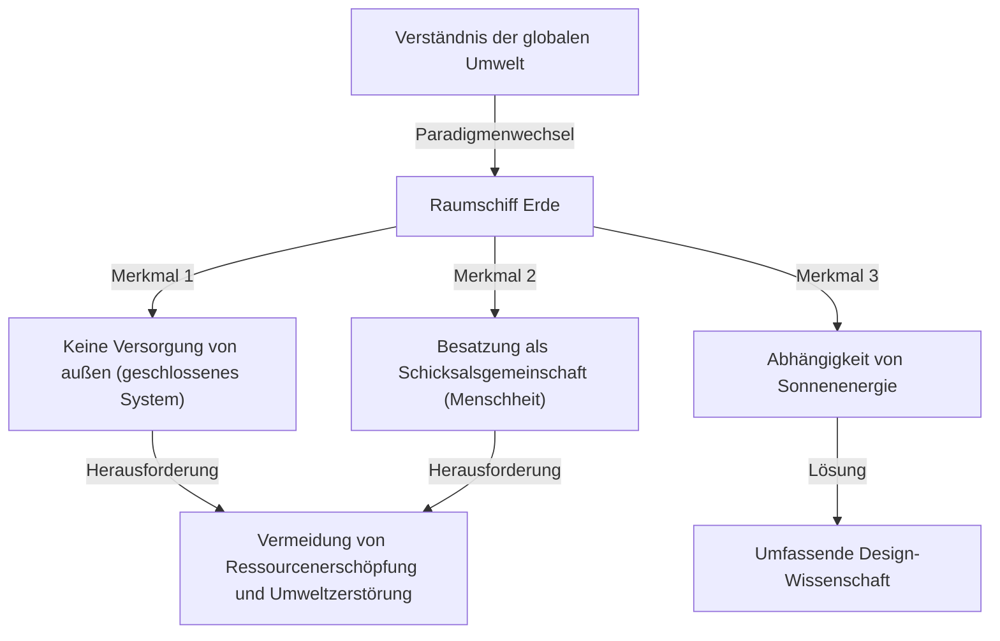
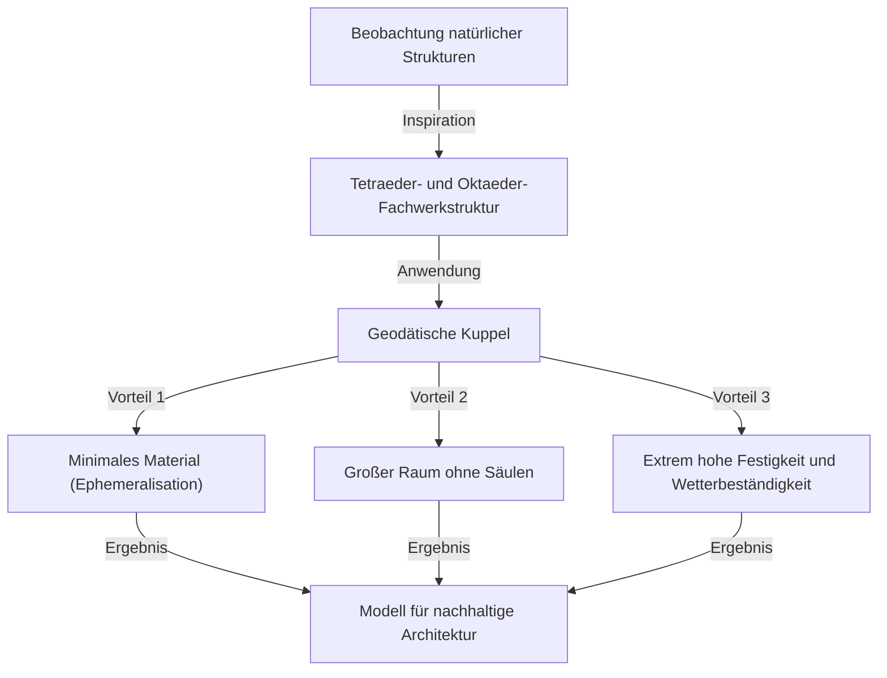

# Einführung: Der Pionier der "umfassenden antizipatorischen Design-Wissenschaft", der seiner Zeit voraus war

Richard Buckminster Fuller (1895 - 1983). Was fällt Ihnen ein, wenn Sie diesen Namen hören? Einige denken vielleicht an die "Geodätische Kuppel", eine wunderschöne, halbkugelförmige architektonische Struktur aus gleichseitigen Dreiecken. Andere wiederum assoziieren ihn vielleicht mit dem einprägsamen und tiefgründigen Konzept des "Raumschiffs Erde (Spaceship Earth)", das als Ursprung der heutigen SDGs und Nachhaltigkeit angesehen werden kann.

Fuller war nicht einfach nur ein Architekt oder ein gewöhnlicher Denker. Er bezeichnete sich selbst als "Erforscher der umfassenden antizipatorischen Design-Wissenschaft" und überquerte verschiedene Bereiche wie Mathematik, Ingenieurwesen, Architektur, Philosophie und Umweltstudien auf der ständigen Suche nach der "optimalen Lösung" für das Überleben der Menschheit auf diesem Planeten.

In diesem Artikel werden wir das turbulente Leben von Buckminster Fuller nachzeichnen und dabei tief in seine vielen revolutionären Erfindungen und sein philosophisches Erbe eintauchen, das in der modernen Gesellschaft immer wichtiger wird.

## 1. Rückschlag und Erwachen: Eine Entscheidung am Ufer des Michigansees

Das Leben von Buckminster Fuller war nicht nur von glänzenden Erfolgen geprägt. Vielmehr lagen die Ursprünge seiner Philosophie in den Tiefen des Scheiterns und der Verzweiflung.

Fuller, geboren 1895 in Milton, Massachusetts, hatte schon in jungen Jahren ein starkes Interesse an Naturgesetzen und Geometrie. Er passte jedoch nicht in das autoritäre Bildungssystem und wurde zweimal von der Harvard University verwiesen (das erste Mal, weil er sein Geld in einem sozialen Club verprasst hatte, und das zweite Mal wegen "Mangel an Verantwortung und Interesse").

Nach seinem Marinedienst während des Ersten Weltkriegs heiratete er und betrat die Geschäftswelt, aber die von ihm gegründete Baustofffirma ging 1927 bankrott. Fuller verlor all sein Vermögen und auch sein gesellschaftliches Ansehen. Zu allem Übel traf ihn die unerträgliche Tragödie, dass er seine geliebte älteste Tochter Alexandra durch Komplikationen von Polio und Meningitis verlor. Fuller machte für den Tod seiner Tochter unter anderem das schlechte Wohnumfeld der damaligen Zeit verantwortlich und wurde von heftigen Schuldgefühlen geplagt.

Im Winter 1927 stand der 32-jährige Fuller am Ufer des Michigansees und dachte ernsthaft darüber nach, sich durch Ertrinken das Leben zu nehmen. "Ein Versager wie ich sollte seiner Familie keine weiteren Umstände bereiten." Genau in dem Moment, als er so verzweifelt war, soll er eine mystische Erfahrung gemacht haben.

Er hatte die starke Intuition, dass er nicht "seinem privaten Selbst" gehöre, sondern "dem Universum". Da beschloss er, ein großes, lebenslanges "Experiment" zu beginnen und sich zu fragen: "Was würde passieren, wenn ich aufhören würde, für mich selbst zu leben, und stattdessen alle meine Fähigkeiten dem Glück der gesamten Menschheit widmen würde?" Dies war der Moment, in dem der spätere große Erfinder Buckminster Fuller geboren wurde.

## 2. Das Paradigma des Raumschiffs Erde (Spaceship Earth)

Unter den vielen Konzepten von Fuller ist die Idee vom "Raumschiff Erde (Spaceship Earth)" das wohl berühmteste und hat bis heute einen starken Einfluss.

Dieses Konzept wurde durch sein 1968 veröffentlichtes Buch "Bedienungsanleitung für das Raumschiff Erde (Operating Manual for Spaceship Earth)" weithin bekannt. Fuller verglich die Erde mit einem "riesigen Raumschiff, das mit einer Geschwindigkeit von etwa 100.000 Kilometern pro Stunde durch den Weltraum rast".

### Ein Raumschiff ohne Bedienungsanleitung

Fuller wies darauf hin: "An diesem Raumschiff ist nur eines seltsam. Nämlich, dass es keine Bedienungsanleitung gibt."
Die Menschheit hat lange Zeit unbewusst als "Passagiere" gelebt, ohne die Struktur dieses Raumschiffs, das Lebenserhaltungssystem (Ökosystem) oder das Energiekreislaufsystem vollständig zu verstehen. Angesichts einer explosionsartig wachsenden Bevölkerung und des massiven Verbrauchs fossiler Brennstoffe seit der industriellen Revolution erschöpfen sich die Ressourcen (Vorräte) des Raumschiffs jedoch rapide.

Fuller lehrte, dass es den Menschen nicht länger gestattet ist, unverantwortliche "Passagiere" zu sein, sondern dass sie zu "Besatzungsmitgliedern (Crew)" werden müssen, die ihr Wissen und ihre Technologie nutzen, um das Raumschiff zu warten und zu verwalten. Diese Philosophie entwickelte sich später zu Konzepten wie "Nachhaltigkeit" und "Kreislaufwirtschaft" und bildet die philosophische Grundlage der heutigen SDGs.

### Die Grenzen fossiler Brennstoffe und der Übergang zu erneuerbaren Energien

Er bezeichnete den Verbrauch fossiler Brennstoffe als "die Batterie (Ersparnisse) des Raumschiffs aufbrauchen" und sprach eine eindringliche Warnung aus. Er war der Ansicht, dass fossile Brennstoffe die "Notstrombatterie des Raumschiffs" seien, in der sich Sonnenenergie über Hunderte von Millionen Jahren auf der Erde angesammelt habe, und dass ihr Aufbrauchen als alltägliche Antriebskraft zu einem fatalen Funktionsausfall des Raumschiffs führen würde.

Stattdessen schlug er den Übergang zu einem System vor, das die Gesellschaft ausschließlich mit "aktuellem Einkommen aus dem Universum (Echtzeit-Energie)" wie Wind-, Gezeiten- und Sonnenenergie betreibt. Er hatte die Bedeutung erneuerbarer Energien, nach denen heute so laut gerufen wird, schon vor über einem halben Jahrhundert vollständig vorausgesehen.

## 3. Ephemeralisation (Ephemeralization): "Mit weniger mehr erreichen"

Als wesentliches Konzept für die Erhaltung des Raumschiffs Erde schlug Fuller die "Ephemeralisation" vor. Dies wird im Japanischen manchmal mit "Verkürzung der Lebensdauer" oder "Verdünnung" übersetzt, aber in Fullers Kontext bedeutet es, "mit weniger Ressourcen, Energie und Zeit mehr Funktionen und Reichtum zu schaffen (Doing more with less)".

### Der unvermeidliche Prozess der technologischen Evolution

Ephemeralisation ist ein grundlegender Prozess der technologischen Evolution. Betrachten wir ein bekanntes Beispiel. Früher wurden zur Speicherung und Berechnung von Informationen in der Welt riesige Vakuumröhrencomputer in der Größe einer Turnhalle benötigt. Heute tragen wir Computer, die weitaus leistungsfähiger sind, als "Smartphones" in unseren Taschen.
Die Materialien wurden reduziert, das Gewicht verringert und der Stromverbrauch ist drastisch gesunken, aber die Funktionalität hat sich exponentiell verbessert. Das ist Ephemeralisation.

Fuller glaubte, dass es durch die Anwendung dieses Prozesses auf alle Branchen, Architekturen und Infrastrukturen möglich sei, den Lebensstandard der gesamten Menschheit dramatisch zu verbessern, selbst mit begrenzten Ressourcen auf der Erde. Seine Behauptung war: "Armut und Ressourcenerschöpfung sind kein Fehler des Raumschiffs, sondern ein Fehler unseres Designs."

## 4. Die geodätische Kuppel: Das Wunderwerk aus Geometrie und Architektur

Die Philosophie der Ephemeralisation wurde im Bereich der Architektur am schönsten durch Fullers Meisterwerk, die "Geodätische Kuppel (Geodesic Dome)", verkörpert.

Fuller beobachtete aufmerksam die Strukturen in der Natur (z. B. Seifenblasen, die Schalen von Mikroorganismen, die Anordnung von Atomen usw.) und stellte fest, dass die Natur stets "maximale Festigkeit mit minimaler Energie und Materie" erreicht. Daher erfand er eine Methode, eine Kugel mit einem Netzwerk aus gleichseitigen Dreiecken zu unterteilen und Baumaterialien entlang der kürzesten Entfernungen auf der Kugeloberfläche (Großkreise = Geodäten) zu montieren.

### Ultimative Festigkeit und Leichtigkeit

Die erstaunlichen Eigenschaften der geodätischen Kuppel sind wie folgt:

1. **Selbsttragende Struktur**: Benötigt im Inneren keinerlei Säulen und kann riesige Räume überspannen.
2. **Überwältigende Leichtigkeit**: Kann im Vergleich zu herkömmlichen quadratischen Gebäuden mit viel weniger Baumaterial errichtet werden.
3. **Robustheit und Haltbarkeit**: Weist eine extrem hohe Widerstandsfähigkeit gegenüber Erdbeben und starken Winden (z. B. Hurrikanen) auf. Da externe Kräfte über die gesamte Struktur verteilt werden, kann eine Teilbeschädigung den totalen Zusammenbruch verhindern.
4. **Energieeffizienz**: Maximiert das Verhältnis von Volumen zu Oberfläche, was zu einer extrem hohen Energieeffizienz beim Heizen und Kühlen führt.

Diese Kuppel sorgte 1967 weltweit für Aufsehen, als sie als gigantischer kugelförmiger Pavillon für den amerikanischen Pavillon auf der Expo in Montreal gebaut wurde. Es heißt, dass weltweit über 300.000 Stück gebaut wurden, von Schutzkuppeln für Radarstationen und antarktische Beobachtungsstationen bis hin zu Zelten für Open-Air-Festivals.

## 5. Synergie (Synergy): Das Ganze ist mehr als die Summe seiner Teile

Ein weiteres wichtiges Konzept, das Fullers Philosophie zugrunde liegt, ist "Synergie (Synergy)". Synergie ist ein Prinzip der Systemtheorie, das besagt, dass "das Verhalten des Ganzen nicht aus dem Verhalten der einzelnen Teile, aus denen es besteht, vorhergesagt werden kann".

Fuller glaubte, dass das Universum selbst synergetisch ist. Wenn man zum Beispiel Wasserstoff (ein brennbares Gas) und Sauerstoff (ein die Verbrennung förderndes Gas) kombiniert, entsteht der Stoff "Wasser" mit völlig anderen Eigenschaften (eine feuerlöschende Flüssigkeit). Egal wie genau man Wasserstoff und Sauerstoff jeweils untersucht, man kann die Eigenschaften von "Wasser" nicht vorhersagen. Das ist Synergie.

### Das Potenzial der Menschheit durch Zusammenarbeit

Fuller wandte dieses Gesetz der Synergie auf die menschliche Gesellschaft an. Anstatt dass Individuen isoliert ihre eigenen Interessen verfolgen, argumentierte er, dass, wenn die gesamte Menschheit kooperieren und Ressourcen und Wissen auf globaler Ebene teilen und integrieren würde, eine explosive Problemlösungskapazität entstünde, die in einer völlig anderen Dimension liegt als die bloße Addition individueller Kräfte.
Die "umfassende antizipatorischen Design-Wissenschaft", die er anstrebte, war genau der Rahmen für die Menschheit, Synergien freizusetzen.

## 6. Das Konzept des Dymaxion

Viele von Fullers Erfindungen wurden oft mit dem Wort "Dymaxion" gekrönt. Dies ist ein Kunstwort, das von einem PR-Mann geprägt wurde, der von seiner Philosophie beeindruckt war, und das drei Wörter kombinierte: "Dynamic (dynamisch)", "Maximum (maximal)" und "Tension (Spannung)".

### Dymaxion House und Dymaxion Car

Fuller entwarf das "Dymaxion House" als Wohnung der Zukunft. Es handelte sich um ein in Massenproduktion herstellbares, sechseckiges Aluminiumhaus, das per Hubschrauber transportiert und überall auf der Welt aufgestellt werden konnte, Regenwasser recycelte und reinigte und Strom durch Windkraft lieferte; es war der Vorläufer des völlig autarken Wohnens.

Das "Dymaxion Car" war ein dreirädriges Fahrzeug in Tropfenform, das Aerodynamik in Perfektion anstrebte. Es konnte 11 Personen befördern und verfügte über eine unglaubliche Kraftstoffeffizienz und Wendigkeit (leider wurde es aufgrund eines Unfalls in der Prototypenphase nie kommerzialisiert).

### Die Dymaxion-Karte

Eine noch wichtigere Erfindung war die "Dymaxion-Karte (Dymaxion Map)". Die Weltkarten, die wir normalerweise sehen, wie etwa die Mercator-Projektion, weisen in der Nähe des Nord- und Südpols erhebliche Verzerrungen in Form und Fläche auf. Sie vermitteln auch oft die Illusion, dass die Welt "geteilt" sei.

Fuller entwickelte eine Methode, um die Erdoberfläche auf ein regelmäßiges Ikosaeder zu projizieren und es dann auf eine flache Ebene zu entfalten. Auf diese Weise minimierte er Verzerrungen der Form und Größe von Kontinenten und bewies visuell, dass alle Kontinente als "eine riesige Insel (One World Island)" miteinander verbunden sind. Dies war ein wirkungsvolles philosophisches Instrument, um willkürliche Grenzen zu beseitigen und den Menschen bewusst zu machen, dass wir eine Schicksalsgemeinschaft sind.

## 7. Fullers Erbe: Fragen an die moderne Gesellschaft und die Zukunft

Jahrzehnte sind vergangen, seit Buckminster Fuller 1983 verstarb. Obwohl seine Ideen zu Lebzeiten manchmal als "Märchen" oder "Fantasien eines Exzentrikers" abgetan wurden, sind seine Warnungen heute im 21. Jahrhundert zu einer erschreckenden Realität geworden.

Klimawandel, Ressourcenerschöpfung, Pandemien und ständige Konflikte. Wir stehen derzeit vor tiefgreifenden Krisen des "Raumschiffs Erde", das zunehmend funktionsunfähig wird.

Fuller war jedoch keineswegs ein Pessimist. Sein ganzes Leben lang glaubte er fest daran, dass die Menschheit mit genügend Intelligenz und Technologie ausgestattet ist, um diese Krisen zu überwinden. "Utopie oder Vergessen (Zerstörung) (Utopia or Oblivion)". Welche Option wir wählen, hängt ganz von unserem "Design" ab.

### Fullers Botschaft an uns heute

Was sollten wir heute von Fuller lernen?

1. **Eine umfassende Perspektive einnehmen**: In der heutigen, übermäßig spezialisierten Zeit brauchen wir "umfassendes Denken", um das große Ganze zu sehen und verschiedene Bereiche miteinander zu verbinden.
2. **Probleme durch die Kraft des Designs lösen**: Nutzen Sie rationale, ephemere Technologie und Design, um physische Probleme zu lösen, anstatt sich auf politische oder ideologische Konflikte einzulassen.
3. **Die Erkenntnis, dass die Menschheit eins ist**: Spaltungen auf der Grundlage von nationalen Grenzen, Rasse oder Religion überwinden und als Besatzung des Raumschiffs Erde zusammenarbeiten.

Der Weg von Buckminster Fuller ist ein Beweis der Hoffnung, der zeigt, welche Wirkung ein Einzelner erzielen kann, wenn er seine Intelligenz mit einem starken Willen und bedingungsloser Liebe zur gesamten Menschheit einsetzt. Die unzähligen Ideen und Philosophien, die er hinterlassen hat, leuchten noch heute hell und dienen als Kompass für den Weg in die Zukunft.

---
*Reference: The works and life of R. Buckminster Fuller, Operating Manual for Spaceship Earth.*
