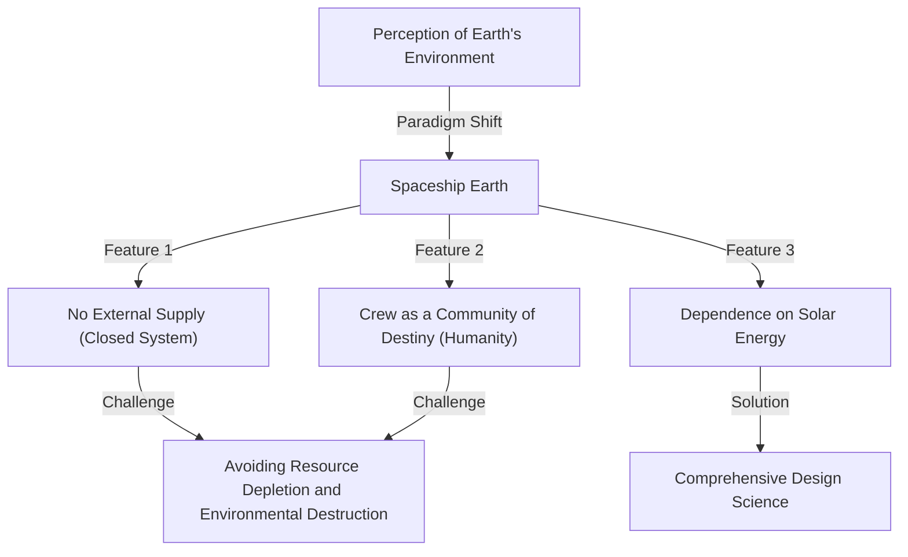
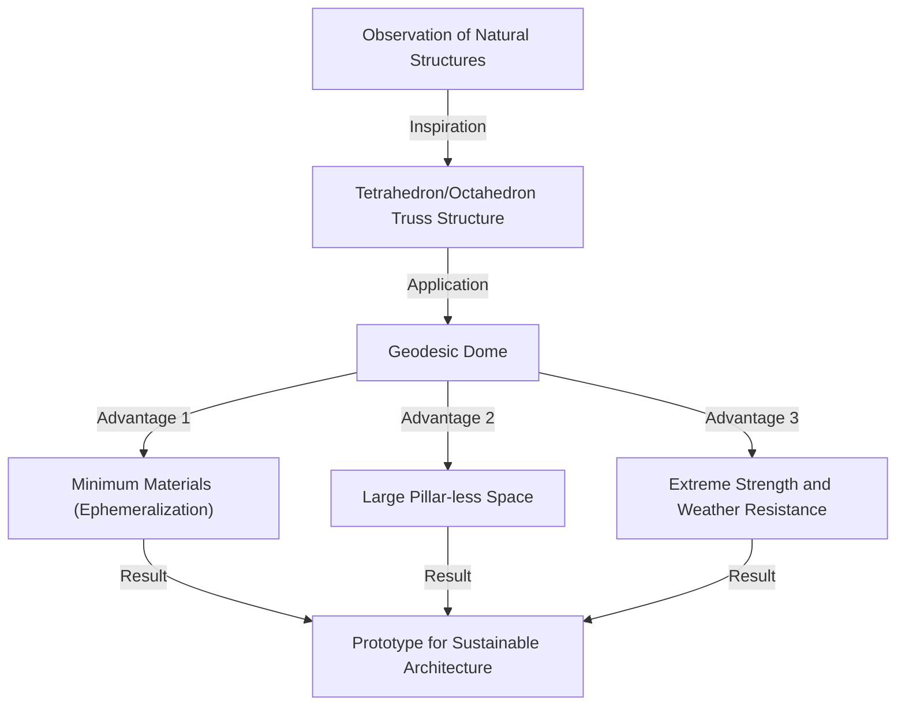

# Introduction: The Proponent of "Comprehensive Anticipatory Design Science" Who Was Ahead of His Time

Richard Buckminster Fuller (1895–1983). What comes to mind when you hear this name? Some might think of the "geodesic dome," a beautiful hemispherical structure composed of equilateral triangles. Others might associate him with the catchy yet profound concept of "Spaceship Earth," which can be considered the origin of current SDGs and sustainability.

Fuller was not just an architect or a mere thinker. Calling himself an "explorer of comprehensive anticipatory design science," he was a person who continued to seek the "optimal solution" for humanity's survival on this Earth by crossing various fields such as mathematics, engineering, architecture, philosophy, and environmental studies.

In this article, while tracing Fuller's turbulent life, we will delve as deeply and in as much detail as possible into the numerous groundbreaking inventions he left behind and his philosophical legacy, which is becoming increasingly important in modern society.

## 1. Setback and Awakening: The Resolution by Lake Michigan

Buckminster Fuller's life was not solely decorated with brilliant successes. Rather, the origin of his philosophy lay in the depths of setback and despair.

Born in Milton, Massachusetts, in 1895, Fuller had a strong interest in the laws of nature and geometry from a young age. However, he could not fit into the authoritarian education system and was expelled from Harvard University twice (the first time for squandering money on social clubs, and the second time for "irresponsibility and lack of interest").

After serving in the Navy during World War I, he got married and stepped into the business world, but the building materials company he founded went bankrupt in 1927. Fuller lost all his assets and his social credibility plummeted. To make matters worse, he was struck by the unbearable tragedy of losing his beloved eldest daughter, Alexandra, to complications from polio and spinal meningitis. Believing that the poor housing environment of the time was partly to blame for her death, Fuller was driven by intense remorse.

In the winter of 1927, at the age of 32, Fuller stood by the shores of Lake Michigan, seriously contemplating suicide by drowning. "A failure like me shouldn't cause any more trouble for my family." Exactly when he was brooding over this, he is said to have had a mystical experience.

He gained a powerful intuition that he did not belong to "himself" but to the "universe." And he decided to embark on a grand, lifelong "experiment": "What would happen if I stopped living for myself and devoted all my abilities to the happiness of all humanity?" This was the moment the great inventor Buckminster Fuller of later years was born.

## 2. The Paradigm of Spaceship Earth

Among Fuller's many concepts, the most famous and the one that continues to have a strong impact today is the idea of "Spaceship Earth."

This concept became widely known through his 1968 book, "Operating Manual for Spaceship Earth." Fuller likened this Earth to a "giant spaceship flying at breakneck speed through outer space at about 100,000 kilometers per hour."

### A Spaceship Without an Operating Manual

Fuller pointed out: "There is only one strange thing about this spaceship. It doesn't come with an operating manual."
Humanity has spent a long time unconsciously acting as "passengers" without fully understanding the structure of this spaceship, its life support systems (ecosystems), or its energy circulation systems. However, with the explosive population growth and mass consumption of fossil fuels since the Industrial Revolution, the spaceship's resources (reserves) are rapidly being depleted.

Fuller argued that humanity is no longer allowed to be irresponsible "passengers" and must become "crew" members who use their knowledge and technology to maintain and manage the spaceship. This philosophy later developed into concepts such as "sustainability" and a "circular economy," and it flows at the root of today's SDGs.

### The Limits of Fossil Fuels and the Shift to Renewable Energy

He called the consumption of fossil fuels "the act of eating up the spaceship's battery (savings)" and issued a strong warning. He believed that fossil fuels were the "spaceship's emergency battery," formed over hundreds of millions of years by solar energy accumulated on Earth, and that exhausting them as an everyday driving force would lead to a fatal malfunction of the spaceship.

Instead, what he advocated was a transition to a system operated solely on "current income from the universe (real-time energy)" such as wind, tidal, and solar power. He completely foresaw the importance of renewable energy, which is being loudly proclaimed today, more than half a century ago.

## 3. Ephemeralization: "Doing More with Less"

As an indispensable concept for maintaining Spaceship Earth, Fuller proposed "Ephemeralization." In Fuller's context, this means "doing more with less" resource, energy, and time.

### The Inevitable Process of Technological Evolution

Ephemeralization is the fundamental process of technological evolution. Let's consider a familiar example. In the past, enormous vacuum tube computers the size of a gymnasium were required to store and compute global information. But today, we carry around far more powerful computers in our pockets as "smartphones."
Even though materials have been reduced, weight has decreased, and power consumption has plummeted, functionality has improved explosively. This is ephemeralization.

Fuller believed that by applying this process to all industries, architecture, and infrastructure, it would be possible to dramatically improve the standard of living for all humanity even with the limited resources on Earth. His argument was that "poverty and resource depletion are not defects of the spaceship, but defects of our design."

## 4. The Geodesic Dome: A Miracle of Geometry and Architecture

The "Geodesic Dome," which could be called synonymous with Fuller, most beautifully embodies the philosophy of ephemeralization in the field of architecture.

Fuller closely observed structures in the natural world (such as soap bubbles, shells of microorganisms, atomic arrangements, etc.) and noticed that nature always achieves "maximum strength with minimum energy and material." Therefore, he invented a method of dividing a sphere into a network of equilateral triangles and assembling structural materials along the shortest distance on a spherical surface (great circle = geodesic).

### Ultimate Strength and Lightness

The marvelous aspects of the geodesic dome are as follows:

1. **Self-supporting structure**: It requires no internal pillars and can cover a vast space.
2. **Overwhelming lightness**: It can be built with far fewer building materials compared to conventional rectangular buildings.
3. **Robust durability**: It is extremely resistant to earthquakes and strong winds (hurricanes, etc.). Because external forces are dispersed throughout the structure, it prevents a chain collapse even if a part is damaged.
4. **Energy efficiency**: Since the ratio of volume to surface area is maximized, heating and cooling energy efficiency is extremely high.

This dome caused a worldwide sensation when a giant spherical pavilion was built as the American Pavilion at the 1967 Montreal Expo. It is also said that over 300,000 have been built around the world, from protective domes for radar bases and Antarctic observation bases to tents for outdoor festivals.

## 5. Synergy: The Whole is Greater Than the Sum of Its Parts

Another important concept that runs through Fuller's philosophy is "Synergy." Synergy is a principle of systems theory which states that "the behavior of the whole is unpredicted by the behavior of its individual parts."

Fuller believed that the universe itself is synergetic. For example, combining hydrogen (a flammable gas) and oxygen (a gas that supports combustion) produces a substance with completely different properties, "water" (a liquid that extinguishes fire). No matter how closely you examine hydrogen and oxygen individually, you cannot predict the properties of "water." This is synergy.

### Human Potential Through Cooperation

Fuller applied this law of synergy to human society as well. He argued that if all humanity cooperates and shares and integrates resources and knowledge on a global scale, rather than individuals pursuing profit separately, an explosive problem-solving ability on a completely different dimension from the simple addition of individual strengths will be born.
His goal of "comprehensive anticipatory design science" was exactly a framework for humanity to exert synergy.

## 6. The Concept of "Dymaxion"

Fuller's inventions are often crowned with the word "Dymaxion." This is a coined word created by a PR man who was impressed by his ideas, combining three words: "Dynamic," "Maximum," and "Tension."

### Dymaxion House and Dymaxion Car

Fuller designed the "Dymaxion House" as a residence of the future. This was an aluminum hexagonal house that could be mass-produced in a factory, airlifted by helicopter, and installed anywhere in the world. It was a pioneer of a completely off-grid house that circulated and purified rainwater and covered electricity with wind power.

Also, the "Dymaxion Car" was a teardrop-shaped three-wheeled vehicle that pursued aerodynamics to the limit. Although it could seat 11 people, it boasted phenomenal fuel efficiency and maneuverability (unfortunately, due to accidents during the prototype stage, it never reached commercialization).

### Dymaxion Map

An even more important invention is the "Dymaxion Map." The world maps we usually see, such as the Mercator projection, significantly distort shapes and areas as they approach the North and South Poles. They also tend to give the illusion that the world is "divided."

Fuller devised a method to project the Earth's surface onto an icosahedron and unfold it onto a flat surface. By doing this, he minimized the distortion of the shapes and sizes of the continents, visually proving that all continents are connected as "one giant island (One World Island)." This was a powerful philosophical tool to remove the arbitrary lines of national borders and make people realize that humanity is a community of destiny.

## 7. Fuller's Legacy: A Question for Modern Society and the Future

Decades have passed since Buckminster Fuller passed away in 1983. Although his ideas were sometimes dismissed as "pipe dreams" or "fantasies of an eccentric" during his lifetime, today in the 21st century, his warnings carry a terrifying reality.

Climate change, resource depletion, pandemics, and constant conflict. We are right now facing a serious crisis of a "Spaceship Earth" that is falling into dysfunction.

However, Fuller was never a pessimist. Throughout his life, he never doubted that humanity was fully equipped with the intelligence and technology to overcome these crises. "Utopia or Oblivion." Which one we choose depends on our "design."

### Fuller's Message to Us Today

What should we learn from Fuller today?

1. **Having a comprehensive perspective**: In a modern era that is too specialized, "comprehensive thinking" that overlooks the big picture and connects different fields is necessary.
2. **Solving problems with the power of design**: Solving physical problems not through political conflict or ideology, but through rational and ephemeral technology and design.
3. **Recognizing that humanity is one**: Transcending divisions by national borders, race, or religion, and cooperating as the crew of Spaceship Earth.

Buckminster Fuller's trajectory is proof of hope, showing how much impact one person can have on the world when they exert their intellect with strong will and unconditional love for all humanity. His countless ideas and philosophies continue to shine powerfully as a compass to carve out the future.

---
*Reference: The works and life of R. Buckminster Fuller, Operating Manual for Spaceship Earth.*
