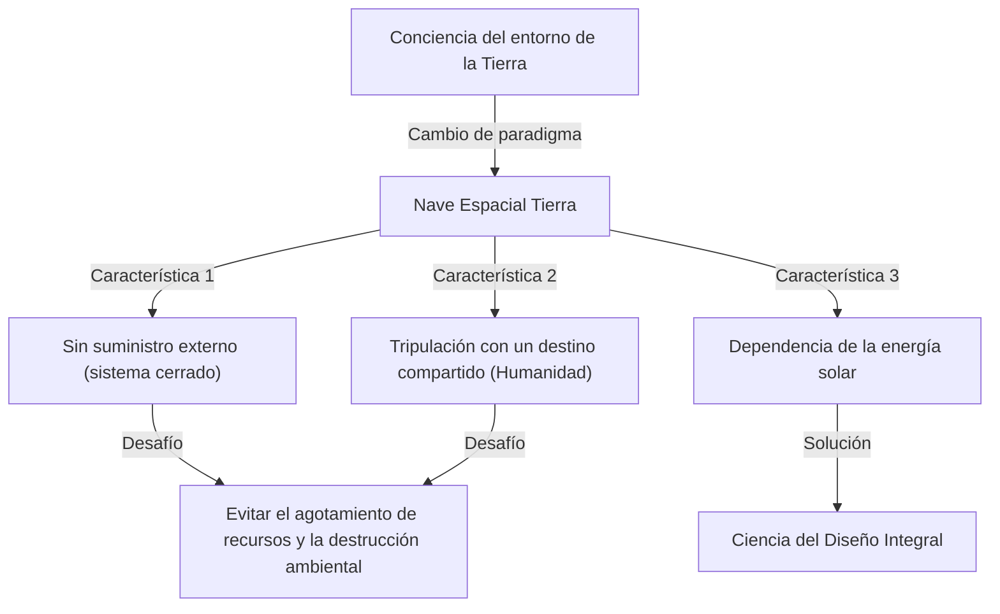
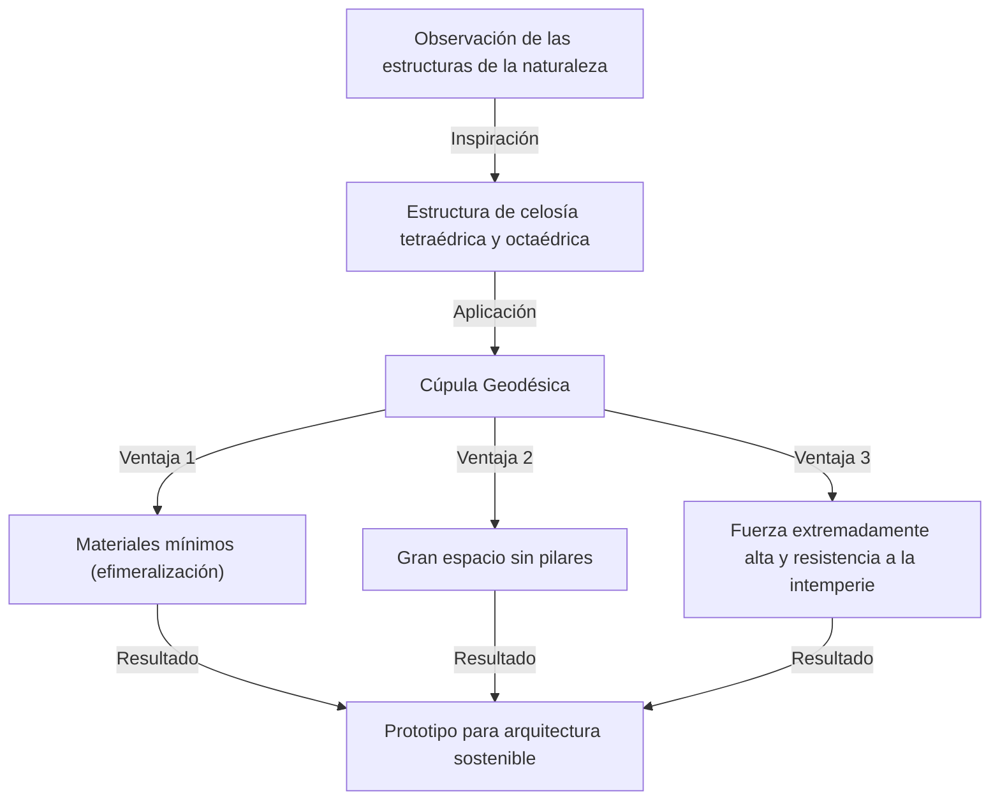

# Introducción: El defensor de la "Ciencia del Diseño Anticipatorio Integral" que se adelantó a su tiempo

Richard Buckminster Fuller (1895 - 1983). ¿Qué te viene a la mente cuando escuchas este nombre? Algunos pueden pensar en la "cúpula geodésica", un hermoso edificio hemisférico hecho de triángulos equiláteros. Otros pueden asociarlo con el concepto pegadizo pero profundo de "Nave Espacial Tierra", que puede considerarse el origen de los actuales ODS y la sostenibilidad.

Fuller no es solo un arquitecto ni solo un filósofo. Llamándose a sí mismo un "explorador de la ciencia del diseño anticipatorio integral", es una figura que cruzó múltiples campos como las matemáticas, la ingeniería, la arquitectura, la filosofía y la ecología, en busca de la "solución óptima" para que la humanidad sobreviva en este planeta.

En este artículo, mientras trazamos la turbulenta vida de Fuller, profundizaremos en sus muchos inventos innovadores y en su legado filosófico, que es cada vez más importante en la sociedad moderna.

## 1. Fracaso y Despertar: Determinación a orillas del Lago Michigan

La vida de Buckminster Fuller no estuvo llena solo de éxitos brillantes. Más bien, el origen de su filosofía se encontró en las profundidades del fracaso y la desesperación.

Nacido en Milton, Massachusetts en 1895, Fuller tuvo un fuerte interés en las leyes de la naturaleza y la geometría desde una edad temprana. Sin embargo, no encajaba en el sistema educativo autoritario y fue expulsado de la Universidad de Harvard dos veces (la primera vez por despilfarrar dinero en un club social, la segunda vez por "irresponsabilidad y falta de interés").

Después de servir en la Marina durante la Primera Guerra Mundial, se casó y entró en el mundo de los negocios, pero la empresa de materiales de construcción que fundó quebró en 1927. Fuller perdió toda su riqueza y su credibilidad social. Para empeorar las cosas, sufrió la insoportable tragedia de perder a su amada hija mayor, Alexandra, por complicaciones de polio y meningitis. Fuller creía que el entorno de vida deficiente en ese momento fue un factor que contribuyó a la muerte de su hija, y se sintió atormentado por una intensa culpa.

En el invierno de 1927, a los 32 años, Fuller se paró a orillas del Lago Michigan, contemplando seriamente el suicidio por ahogamiento. "Un fracasado como yo no debería ser una carga más para mi familia". En el momento exacto en que estaba consumido por estos pensamientos, se dice que tuvo una experiencia mística.

Sintió una fuerte intuición de que no pertenecía a "sí mismo" sino al "universo". Entonces decidió embarcarse en un gran "experimento" de por vida: "¿Qué pasaría si dejara de vivir para mí mismo y dedicara todas mis habilidades al bienestar de toda la humanidad?". Este fue el momento en que nació el gran inventor Buckminster Fuller de los últimos años.

## 2. El paradigma de la Nave Espacial Tierra (Spaceship Earth)

Entre los muchos conceptos de Fuller, el más famoso y el que continúa teniendo una fuerte influencia hoy en día es la idea de la "Nave Espacial Tierra".

Este concepto se hizo ampliamente conocido a través de su libro de 1968, "Manual de Operación para la Nave Espacial Tierra". Fuller comparó la Tierra con una "nave espacial gigante volando a través del espacio a la asombrosa velocidad de unos 100.000 kilómetros por hora".

### Una nave espacial sin un manual de operación

Fuller señala: "Hay solo una cosa extraña acerca de esta nave espacial. Es que no vino con un manual de operación".
La humanidad ha pasado mucho tiempo como "pasajeros" inconscientes sin entender completamente la estructura de esta nave espacial, su sistema de soporte vital (ecosistema) y su sistema de circulación de energía. Sin embargo, debido al crecimiento explosivo de la población y al consumo masivo de combustibles fósiles desde la Revolución Industrial, los recursos (reservas) de la nave espacial se están agotando rápidamente.

Fuller argumentó que a la humanidad ya no se le permite ser "pasajeros" irresponsables, sino que debe convertirse en la "tripulación" que mantiene y gestiona la nave espacial utilizando su conocimiento y tecnología. Esta filosofía más tarde se desarrolló en conceptos como "sostenibilidad" y una "sociedad orientada al reciclaje", convirtiéndose en la filosofía subyacente de los actuales ODS.

### Los límites de los combustibles fósiles y el cambio a las energías renovables

Llamó al consumo de combustibles fósiles "el acto de agotar la batería de la nave espacial (ahorros)" y advirtió encarecidamente en contra de ello. Él creía que los combustibles fósiles eran la "batería de emergencia de la nave espacial" acumulada en la Tierra a partir de la energía solar durante cientos de millones de años, y que agotarla como propulsión diaria llevaría a una disfunción fatal de la nave espacial.

En cambio, abogó por una transición a un sistema en el que la sociedad opere únicamente sobre "ingresos actuales del universo (energía en tiempo real)", como la energía eólica, mareomotriz y solar. Él previó completamente la importancia de la energía renovable, que se defiende con tanta fuerza hoy en día, hace más de medio siglo.

## 3. Efimeralización (Ephemeralization): "Hacer más con menos"

Como concepto esencial para mantener la Nave Espacial Tierra, Fuller propuso la "Efimeralización". Esto puede traducirse como "hacer efímero" o "diluir", pero en el contexto de Fuller, significa "Hacer más con menos recursos, energía y tiempo (Doing more with less)".

### El proceso inevitable de la evolución tecnológica

La efimeralización es el proceso fundamental de la evolución tecnológica. Pensemos en un ejemplo familiar. En el pasado, se requería una computadora gigante de tubos de vacío del tamaño de un gimnasio para almacenar y calcular información de todo el mundo. Sin embargo, hoy en día, llevamos computadoras con un rendimiento mucho mayor en nuestros bolsillos en forma de "teléfonos inteligentes".
Aunque se usan menos materiales, el peso es más ligero y el consumo de energía ha disminuido drásticamente, la funcionalidad ha mejorado explosivamente. Esto es la efimeralización.

Fuller creía que al aplicar este proceso a todas las industrias, arquitectura e infraestructura, sería posible mejorar dramáticamente el nivel de vida de toda la humanidad, incluso con los limitados recursos de la Tierra. Su afirmación era que "la pobreza y el agotamiento de los recursos no son defectos de la nave espacial, sino defectos de nuestro diseño".

## 4. Cúpula Geodésica: El milagro de la geometría y la arquitectura

La manifestación más brillante de la filosofía de la efimeralización en el campo de la arquitectura es la "cúpula geodésica", que es sinónimo del nombre de Fuller.

Fuller observó profundamente las estructuras en la naturaleza (por ejemplo, burbujas de jabón, las conchas de microorganismos, arreglos atómicos, etc.) y se dio cuenta de que la naturaleza siempre logra "máxima resistencia con mínima energía y material". Por lo tanto, inventó un método para dividir una esfera con una red de triángulos equiláteros y ensamblar materiales estructurales a lo largo de la distancia más corta en la superficie esférica (círculo máximo = geodésica).

### Máxima resistencia y ligereza

Las asombrosas características de la cúpula geodésica son las siguientes:

1. **Estructura autoportante**: Puede cubrir un vasto espacio sin necesidad de ningún pilar en el interior.
2. **Ligereza abrumadora**: Puede construirse con muchos menos materiales de construcción en comparación con los edificios rectangulares tradicionales.
3. **Fuerte durabilidad**: Tiene una resistencia extremadamente alta contra terremotos y vientos fuertes (como huracanes). Debido a que la fuerza externa se distribuye a través de toda la estructura, incluso si una parte se daña, se previene un colapso en cadena.
4. **Eficiencia energética**: Debido a que la relación entre el área superficial y el volumen se maximiza, la eficiencia energética para calefacción y refrigeración es extremadamente alta.

Esta cúpula causó sensación en todo el mundo cuando se construyó un pabellón esférico gigante como el Pabellón de los Estados Unidos para la Expo 67 en Montreal. Se dice que se han construido más de 300.000 de ellas en todo el mundo, desde cúpulas protectoras para bases de radar y bases de observación antárticas, hasta tiendas de campaña para festivales al aire libre.

## 5. Sinergia (Synergy): El todo es más que la suma de sus partes

Otro concepto importante que subyace a la filosofía de Fuller es la "Sinergia". La sinergia es el principio de la teoría de sistemas que establece que "el comportamiento del todo es impredecible a partir del comportamiento de sus partes constituyentes individuales".

Fuller creía que el universo mismo es sinérgico. Por ejemplo, si combinas hidrógeno (un gas combustible) y oxígeno (un gas que ayuda a la combustión), se crea una sustancia con propiedades completamente diferentes (un líquido que extingue el fuego), el "agua". No importa cuán detalladamente examines el hidrógeno y el oxígeno individualmente, no puedes predecir las propiedades del "agua". Esto es sinergia.

### El potencial humano a través de la cooperación

Fuller aplicó esta ley de sinergia a la sociedad humana también. Argumentó que si, en lugar de que los individuos persiguieran ganancias por separado, toda la humanidad cooperara y compartiera e integrara recursos y conocimientos a escala global, nacería un poder de resolución de problemas explosivo que estaría en una dimensión diferente a la simple adición del poder individual.
Su "Ciencia del Diseño Anticipatorio Integral" fue exactamente un marco para que la humanidad demostrara sinergia.

## 6. El concepto de Dymaxion (Dymaxion)

Los inventos de Fuller a menudo llevan la palabra "Dymaxion". Este es un término acuñado por un relacionista público que, impresionado por los pensamientos de Fuller, combinó las tres palabras "Dynamic" (Dinámico), "Maximum" (Máximo) y "Tension" (Tensión).

### Casa Dymaxion y Coche Dymaxion

Fuller diseñó la "Casa Dymaxion" como la vivienda del futuro. Se trataba de una casa hexagonal de aluminio que podía ser producida en masa en una fábrica, transportada por helicóptero e instalada en cualquier parte del mundo, purificaba el agua de lluvia para su circulación y se abastecía de electricidad por energía eólica, haciéndola una pionera de las casas completamente independientes de la red (off-grid).

Además, el "Coche Dymaxion" era un automóvil de tres ruedas en forma de lágrima que perseguía la aerodinámica al límite. Podía acomodar a 11 personas mientras presumía de una increíble eficiencia de combustible y maniobrabilidad (desafortunadamente, debido a accidentes durante la etapa de prototipo, nunca llegó a ser comercializado).

### Mapa Dymaxion

Un invento aún más importante es el "Mapa Dymaxion". Los mapas del mundo que vemos a menudo, como la proyección de Mercator, distorsionan significativamente las formas y las áreas a medida que se acercan a los polos Norte y Sur. También tienden a dar la ilusión de que el mundo está "dividido".

Fuller ideó un método de proyectar la superficie de la Tierra en un icosaedro y desplegarlo en un plano. A través de esto, minimizó la distorsión de la forma y el tamaño de los continentes, mientras demostraba visualmente que todos los continentes están conectados como "una sola gran isla (One World Island)". Esta fue una poderosa herramienta filosófica para eliminar las líneas arbitrarias de las fronteras nacionales y hacer que las personas se den cuenta de que la humanidad es una comunidad con un destino compartido.

## 7. El legado de Fuller: Un cuestionamiento de la sociedad moderna y el futuro

Han pasado décadas desde que Buckminster Fuller falleció en 1983. Aunque sus ideas fueron a veces descartadas durante su vida como "historias de ensueño" o "fantasías excéntricas", en el siglo XXI, las advertencias que emitió han adquirido una realidad aterradora.

El cambio climático, el agotamiento de los recursos, las pandemias y los conflictos constantes. Actualmente nos enfrentamos a una grave crisis de la "Nave Espacial Tierra" en disfunción.

Sin embargo, Fuller nunca fue un pesimista. A lo largo de su vida, creyó firmemente que la humanidad estaba plenamente equipada con la inteligencia y la tecnología para superar estas crisis. "Utopía u Olvido (Utopia or Oblivion)". Cuál elegiremos depende de nuestro "diseño".

### El mensaje de Fuller a nosotros hoy

¿Qué debemos aprender de Fuller hoy?

1. **Tener una perspectiva integral**: En nuestra era moderna de hiperespecialización, necesitamos un "pensamiento integral" para observar todo el panorama general y conectar diferentes campos.
2. **Resolver problemas a través del poder del diseño**: Resolver problemas físicos no a través de conflictos ideológicos o políticos, sino a través del diseño y la tecnología racional y efímera.
3. **Reconocer que la humanidad es una**: Trascender las divisiones por fronteras nacionales, raza y religión, y cooperar como la tripulación de la Nave Espacial Tierra.

La trayectoria de Buckminster Fuller es una prueba de esperanza que muestra cuánto impacto puede tener una sola persona en el mundo cuando ejerce su intelecto con una fuerte voluntad y un amor incondicional por toda la humanidad. Sus innumerables ideas y filosofías continúan brillando intensamente hoy como una brújula para abrir el futuro.

---
*Reference: The works and life of R. Buckminster Fuller, Operating Manual for Spaceship Earth.*
