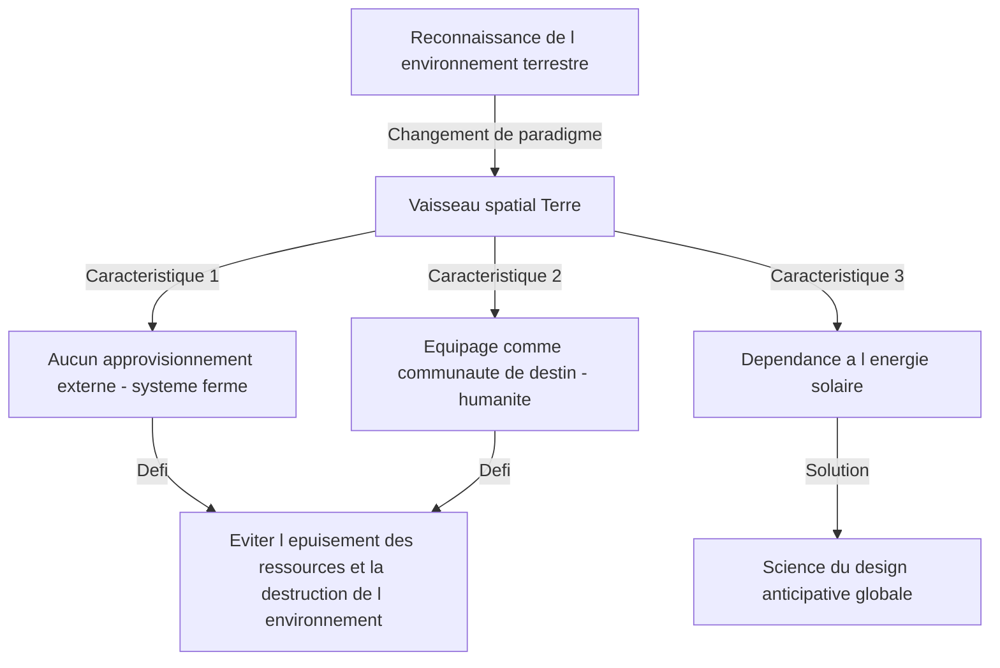
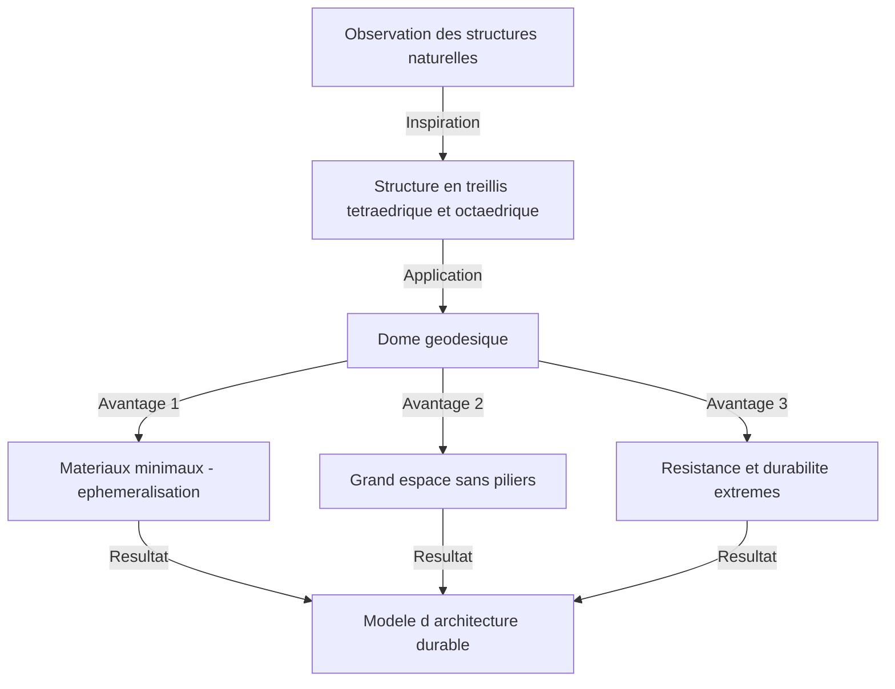

# Introduction : L'initiateur d'une "science du design anticipative globale" bien en avance sur son temps

Richard Buckminster Fuller (1895 - 1983). Que vous vient-il à l'esprit en entendant ce nom ? Certains penseront peut-être au "dôme géodésique", ce magnifique bâtiment hémisphérique combinant des triangles équilatéraux. D'autres se souviendront de l'idée accrocheuse et profonde du "Vaisseau spatial Terre" (Spaceship Earth), qui peut être considérée comme l'origine des ODD et du développement durable actuels.

Fuller n'était pas qu'un simple architecte ou penseur. S'autoproclamant "explorateur d'une science du design anticipative globale", il a traversé divers domaines tels que les mathématiques, l'ingénierie, l'architecture, la philosophie et les sciences de l'environnement, à la recherche de la "solution optimale" pour la survie de l'humanité sur cette Terre.

Dans cet article, en retraçant la vie tumultueuse de Fuller, nous explorerons en profondeur ses nombreuses inventions révolutionnaires et l'héritage idéologique qui prend de plus en plus d'importance dans la société moderne.

## 1. Échec et éveil : La détermination au bord du lac Michigan

La vie de Buckminster Fuller n'a pas été ponctuée que de brillants succès. Au contraire, l'origine de sa pensée réside dans l'abîme de l'échec et du désespoir.

Né à Milton, dans le Massachusetts en 1895, Fuller a montré dès son plus jeune âge un fort intérêt pour les lois de la nature et la géométrie. Cependant, incapable de s'adapter au système éducatif autoritaire, il a été expulsé deux fois de l'Université Harvard (la première fois pour avoir dilapidé de l'argent dans un club social, la seconde pour "irresponsabilité et manque d'intérêt").

Après avoir servi dans la marine pendant la Première Guerre mondiale, il s'est marié et est entré dans le monde des affaires, mais l'entreprise de matériaux de construction qu'il a fondée a fait faillite en 1927. Fuller a perdu toute sa fortune et sa crédibilité sociale. Pire encore, il a subi la tragédie insupportable de perdre sa fille aînée bien-aimée, Alexandra, des suites d'une polio compliquée d'une méningite. Pensant que les mauvaises conditions de logement de l'époque étaient en partie responsables de la mort de sa fille, Fuller a été consumé par de violents remords.

À l'hiver 1927, à l'âge de 32 ans, Fuller se tenait au bord du lac Michigan, envisageant sérieusement de se suicider par noyade. "Un raté comme moi ne devrait plus causer de problèmes à sa famille." C'est au moment même où il était tourmenté par ces pensées qu'il aurait vécu une expérience mystique.

Il a eu la forte intuition qu'il n'appartenait pas "à lui-même", mais "à l'univers". Il a alors décidé d'entamer une "expérience" grandiose, qui allait durer toute sa vie : "Que se passerait-il si j'arrêtais de vivre pour moi-même et que je consacrais toutes mes capacités au bonheur de toute l'humanité ?" C'est à ce moment précis qu'est né le grand inventeur Buckminster Fuller.

## 2. Le paradigme du Vaisseau spatial Terre (Spaceship Earth)

Parmi les nombreux concepts de Fuller, le plus célèbre, et celui qui continue d'avoir une forte influence aujourd'hui, est celui du "Vaisseau spatial Terre".

Ce concept s'est largement fait connaître par son livre de 1968, "Manuel d'instruction pour le vaisseau spatial Terre" (Operating Manual for Spaceship Earth). Fuller y comparait la Terre à un "vaisseau spatial géant volant à une vitesse folle d'environ 100 000 kilomètres par heure dans l'espace".

### Un vaisseau spatial sans manuel d'instruction

Fuller faisait la remarque suivante : "Il y a une chose étrange à propos de ce vaisseau spatial. Il est livré sans manuel d'instruction".
Pendant longtemps, l'humanité a vécu inconsciemment en tant que "passagers", sans comprendre pleinement la structure de ce vaisseau spatial, son système de survie (l'écosystème) et son système de circulation de l'énergie. Cependant, avec l'explosion démographique et la consommation massive de combustibles fossiles depuis la révolution industrielle, les ressources (réserves) du vaisseau spatial s'épuisent rapidement.

Fuller affirmait que l'humanité ne peut plus se permettre d'être de simples "passagers" irresponsables, mais doit utiliser ses connaissances et sa technologie pour devenir un "équipage" qui entretient et gère le vaisseau spatial. Cette pensée a ensuite évolué vers des concepts tels que la "durabilité" (sustainability) et la "société du recyclage", et constitue la philosophie sous-jacente des actuels ODD.

### Les limites des combustibles fossiles et la transition vers les énergies renouvelables

Il a qualifié la consommation de combustibles fossiles d'acte consistant à "dévorer la batterie (les économies) du vaisseau spatial" et a lancé un avertissement sévère. Les combustibles fossiles sont la "batterie de secours du vaisseau spatial", où l'énergie solaire s'est accumulée sur Terre pendant des centaines de millions d'années. Il pensait que l'épuiser comme force motrice quotidienne entraînerait un dysfonctionnement fatal du vaisseau spatial.

Ce qu'il proposait à la place, c'était une transition vers un système où la société fonctionnerait uniquement avec le "revenu actuel de l'univers (énergie en temps réel)", comme l'énergie éolienne, marémotrice et solaire. Il avait parfaitement prévu, il y a plus d'un demi-siècle, l'importance des énergies renouvelables qui est si fortement revendiquée aujourd'hui.

## 3. Éphéméralisation (Ephemeralization) : "Faire plus avec moins"

Pour maintenir le Vaisseau spatial Terre, Fuller a proposé le concept d'"éphéméralisation" (Ephemeralization). Cela se traduit parfois par "raccourcissement" ou "dilution", mais dans le contexte de Fuller, cela signifie "produire plus de fonctions et de richesse avec moins de ressources, d'énergie et de temps" (Doing more with less).

### Un processus inévitable de l'évolution technologique

L'éphéméralisation est le processus fondamental de l'évolution technologique. Prenons un exemple familier. Autrefois, pour stocker et calculer les informations du monde entier, d'immenses ordinateurs à tubes à vide de la taille d'un gymnase étaient nécessaires. Aujourd'hui, cependant, nous transportons des ordinateurs beaucoup plus performants dans nos poches sous forme de "smartphones".
Bien que les matériaux aient diminué, que le poids ait été allégé et que la consommation d'énergie ait considérablement baissé, les fonctionnalités ont augmenté de manière explosive. C'est l'éphéméralisation.

Fuller pensait qu'en appliquant ce processus à toutes les industries, à l'architecture et aux infrastructures, il serait possible d'améliorer de manière drastique le niveau de vie de toute l'humanité, même avec les ressources limitées de la Terre. Son argument était que "la pauvreté et l'épuisement des ressources ne sont pas des défauts du vaisseau spatial, mais des défauts de notre conception (design)".

## 4. Dôme géodésique : Un miracle de la géométrie et de l'architecture

La philosophie de l'éphéméralisation a été le plus brillamment incarnée dans le domaine de l'architecture par ce qui est devenu synonyme de Fuller : le "Dôme géodésique" (Geodesic Dome).

Fuller a observé de près les structures de la nature (par exemple, les bulles de savon, les coquilles de micro-organismes, les arrangements atomiques, etc.) et a réalisé que la nature atteint toujours "une force maximale avec une énergie et une matière minimes". Il a donc inventé une méthode pour diviser une sphère avec un réseau de triangles équilatéraux et assembler des matériaux structurels le long de la distance la plus courte sur la surface sphérique (le grand cercle = géodésique).

### Une résistance et une légèreté ultimes

Les aspects étonnants du dôme géodésique sont les suivants :

1. **Structure autoportante** : Il peut couvrir un vaste espace sans nécessiter de piliers à l'intérieur.
2. **Légèreté écrasante** : Il peut être construit avec beaucoup moins de matériaux de construction qu'un bâtiment carré traditionnel.
3. **Forte durabilité** : Il présente une résistance extrêmement élevée aux tremblements de terre et aux vents violents (tels que les ouragans). Comme l'ensemble de la structure disperse les forces externes, même si une partie est endommagée, un effondrement en chaîne peut être évité.
4. **Efficacité énergétique** : Parce que le rapport de la surface au volume est maximisé, l'efficacité énergétique du chauffage et de la climatisation est extrêmement élevée.

Ce dôme a fait sensation à l'échelle mondiale lorsqu'un pavillon sphérique géant a été construit comme pavillon des États-Unis pour l'Expo de Montréal en 1967. De plus, on dit que plus de 300 000 de ces dômes ont été construits dans le monde, des dômes de protection pour les stations radar aux bases d'observation en Antarctique, en passant par les tentes de festivals en plein air.

## 5. Synergie (Synergy) : Le tout est supérieur à la somme de ses parties

Un autre concept clé qui sous-tend la philosophie de Fuller est la "Synergie" (Synergy). La synergie est un principe de la théorie des systèmes selon lequel "le comportement de l'ensemble ne peut être prédit à partir du comportement des parties individuelles qui le composent".

Fuller pensait que l'univers lui-même était synergique. Par exemple, si vous combinez l'hydrogène (un gaz inflammable) et l'oxygène (un gaz qui favorise la combustion), vous obtenez une substance avec une propriété complètement différente (un liquide qui éteint le feu) appelée "eau". Peu importe le niveau de détail avec lequel vous étudiez l'hydrogène et l'oxygène individuellement, vous ne pouvez pas prédire les propriétés de l'"eau". C'est cela, la synergie.

### Le potentiel de l'humanité grâce à la coopération

Fuller a également appliqué cette loi de la synergie à la société humaine. Il affirmait qu'au lieu que les individus poursuivent des profits isolément, si toute l'humanité coopérait et partageait et intégrait les ressources et les connaissances à l'échelle mondiale, une capacité de résolution de problèmes explosive émergerait, dans une dimension totalement différente d'une simple addition des pouvoirs individuels.
Sa "science du design anticipative globale" était précisément un cadre permettant l'humanité d'exercer cette synergie.

## 6. Le concept de Dymaxion

Les inventions de Fuller portent souvent le nom de "Dymaxion". Il s'agit d'un mot-valise créé par un spécialiste des relations publiques impressionné par ses idées, en combinant les trois mots "Dynamic" (dynamique), "Maximum" (maximum) et "Tension" (tension).

### La Maison Dymaxion et la Voiture Dymaxion

Fuller a conçu la "Maison Dymaxion" comme la maison du futur. Il s'agissait d'une maison hexagonale en aluminium pouvant être produite en masse en usine, transportée par hélicoptère et installée n'importe où dans le monde. Elle purifiait et recyclait l'eau de pluie et était alimentée par l'énergie éolienne, ce qui en faisait la pionnière de la maison totalement autonome.

De plus, la "Voiture Dymaxion" était un véhicule à trois roues en forme de larme qui poussait l'aérodynamisme à ses limites. Bien qu'elle puisse accueillir 11 personnes, elle offrait une efficacité énergétique étonnante et un excellent rayon de braquage (malheureusement, en raison d'accidents au stade du prototype, elle n'a jamais été commercialisée).

### La Carte Dymaxion

Une invention encore plus importante est la "Carte Dymaxion" (Dymaxion Map). Les cartes du monde que nous voyons habituellement, comme la projection de Mercator, déforment considérablement les formes et les zones à mesure qu'elles s'approchent des pôles Nord et Sud. Elles ont également tendance à donner l'illusion que le monde est "divisé".

Fuller a conçu une méthode pour projeter la surface de la Terre sur un icosaèdre régulier, puis la déplier sur un plan. Ainsi, tout en minimisant la distorsion des formes et des tailles des continents, il a visuellement prouvé que tous les continents sont connectés comme "une île géante" (One World Island). C'était un outil idéologique puissant pour supprimer la ligne arbitraire des frontières nationales et faire prendre conscience à l'humanité qu'elle partage une communauté de destin.

## 7. L'héritage de Fuller : Un questionnement pour la société moderne et l'avenir

Des décennies se sont écoulées depuis le décès de Buckminster Fuller en 1983. Ses idées, qui étaient parfois rejetées comme des "rêves" ou des "fantasmes excentriques" de son vivant, portent désormais une réalité terrifiante en ce 21e siècle.

Changement climatique, épuisement des ressources, pandémies et conflits incessants. Nous sommes actuellement confrontés à de graves crises à bord du "Vaisseau spatial Terre", qui commence à mal fonctionner.

Pourtant, Fuller n'était en aucun cas un pessimiste. Tout au long de sa vie, il a fermement cru que l'humanité était suffisamment dotée de l'intelligence et de la technologie pour surmonter ces crises. "Utopie ou Oblivion" (Utopia or Oblivion). Le choix que nous ferons dépend de notre "design".

### Le message de Fuller pour nous aujourd'hui

Que devrions-nous apprendre de Fuller aujourd'hui ?

1. **Avoir une perspective globale** : Dans un monde moderne trop spécialisé, une "pensée globale" qui permet d'avoir une vue d'ensemble et de relier différents domaines est nécessaire.
2. **Résoudre les problèmes par le design** : Il faut résoudre les problèmes physiques non pas par des conflits politiques ou des idéologies, mais par une technologie et un design rationnels et éphémères.
3. **Reconnaître que l'humanité est une** : Dépasser les divisions causées par les frontières nationales, la race et la religion, et coopérer en tant qu'équipage du Vaisseau spatial Terre.

Le parcours de Buckminster Fuller est une preuve d'espoir, montrant quel impact un seul être humain peut avoir sur le monde lorsqu'il mobilise son intelligence avec une forte volonté et un amour inconditionnel pour toute l'humanité. Ses innombrables idées et sa philosophie continuent de briller de mille feux aujourd'hui en tant que boussole pour ouvrir la voie vers l'avenir.

---
*Reference: The works and life of R. Buckminster Fuller, Operating Manual for Spaceship Earth.*
