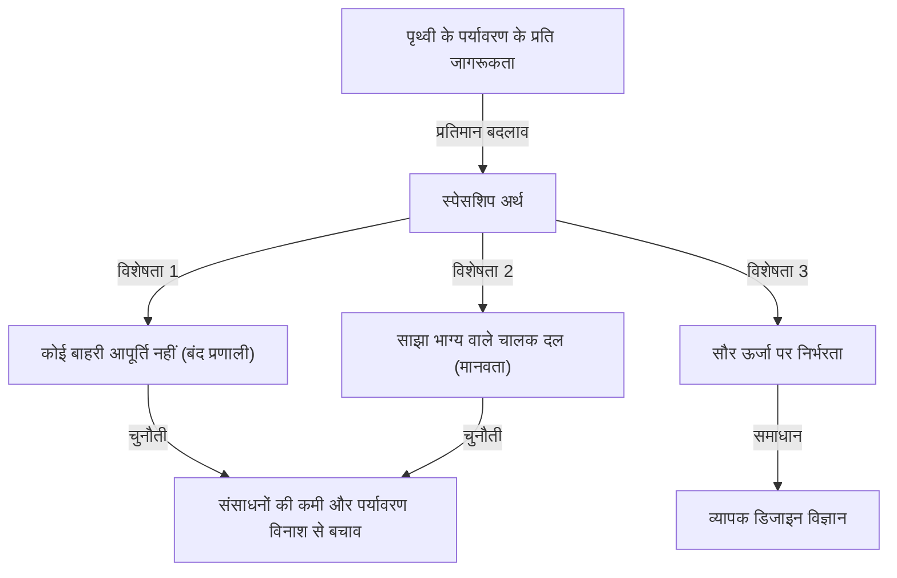
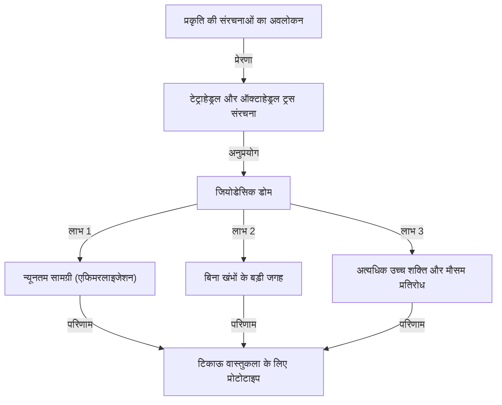

# परिचय: "व्यापक प्रत्याशित डिजाइन विज्ञान" के प्रस्तावक जो अपने समय से बहुत आगे थे

रिचर्ड बकमिंस्टर फुलर (1895 - 1983)। जब आप यह नाम सुनते हैं तो आपके दिमाग में क्या आता है? कुछ लोग समबाहु त्रिभुजों से बनी खूबसूरत अर्धगोलाकार इमारत "जियोडेसिक डोम" के बारे में सोच सकते हैं। अन्य लोग "स्पेसशिप अर्थ" की आकर्षक लेकिन गहरी अवधारणा से जुड़ सकते हैं, जिसे वर्तमान एसडीजी (SDGs) और स्थिरता का मूल माना जा सकता है।

फुलर केवल एक वास्तुकार या एक विचारक नहीं हैं। खुद को "व्यापक प्रत्याशित डिजाइन विज्ञान का अन्वेषक" बताते हुए, वह एक ऐसे व्यक्ति हैं जिन्होंने गणित, इंजीनियरिंग, वास्तुकला, दर्शन और पारिस्थितिकी जैसे कई क्षेत्रों को पार किया, इस ग्रह पर जीवित रहने के लिए मानवता के लिए "इष्टतम समाधान" की निरंतर खोज में।

इस लेख में, फुलर के उथल-पुथल भरे जीवन का पता लगाते हुए, हम उनके कई अभूतपूर्व आविष्कारों और दार्शनिक विरासत में गहराई से जाएंगे, जो आधुनिक समाज में तेजी से महत्वपूर्ण होते जा रहे हैं।

## 1. विफलता और जागरण: मिशिगन झील के किनारे दृढ़ संकल्प

बकमिंस्टर फुलर का जीवन केवल शानदार सफलताओं से नहीं भरा था। इसके बजाय, उनके दर्शन का मूल विफलता और निराशा की गहराई में था।

1895 में मिल्टन, मैसाचुसेट्स में जन्मे फुलर को कम उम्र से ही प्रकृति के नियमों और ज्यामिति में गहरी दिलचस्पी थी। हालाँकि, वह सत्तावादी शिक्षा प्रणाली में फिट नहीं हो सके और हार्वर्ड विश्वविद्यालय से दो बार निष्कासित कर दिए गए (पहली बार एक सामाजिक क्लब में पैसे बर्बाद करने के लिए, दूसरी बार "गैर-जिम्मेदारी और रुचि की कमी" के कारण)।

प्रथम विश्व युद्ध के दौरान नौसेना में सेवा देने के बाद, उन्होंने शादी कर ली और व्यापारिक दुनिया में कदम रखा, लेकिन 1927 में उन्होंने जो निर्माण सामग्री कंपनी स्थापित की थी वह दिवालिया हो गई। फुलर ने अपनी सारी संपत्ति खो दी और अपनी सामाजिक विश्वसनीयता भी खो दी। मामले को बदतर बनाने के लिए, उन्हें पोलियो और मेनिन्जाइटिस की जटिलताओं के कारण अपनी प्यारी सबसे बड़ी बेटी, एलेक्जेंड्रा को खोने की असहनीय त्रासदी का सामना करना पड़ा। फुलर का मानना था कि उस समय रहने का खराब माहौल उनकी बेटी की मृत्यु का एक कारण था, और वे तीव्र अपराधबोध से पीड़ित थे।

1927 की सर्दियों में, 32 वर्षीय फुलर मिशिगन झील के किनारे खड़े थे, और गंभीरता से डूबकर आत्महत्या करने पर विचार कर रहे थे। "मुझ जैसे असफल व्यक्ति को अब अपने परिवार पर बोझ नहीं बनना चाहिए।" ठीक उसी समय जब वे इन विचारों से घिरे हुए थे, कहा जाता है कि उन्हें एक रहस्यमय अनुभव हुआ।

उन्हें एक मजबूत अंतर्ज्ञान हुआ कि वे "स्वयं" के नहीं बल्कि "ब्रह्मांड" के हैं। और उन्होंने जीवन भर के एक भव्य "प्रयोग" को शुरू करने का फैसला किया: "क्या होगा यदि मैं अपने लिए जीना छोड़ दूं और अपनी सभी क्षमताओं को पूरी मानवता की भलाई के लिए समर्पित कर दूं?" यह वह क्षण था जब बाद के वर्षों के महान आविष्कारक बकमिंस्टर फुलर का जन्म हुआ।

## 2. स्पेसशिप अर्थ (Spaceship Earth) का प्रतिमान

फुलर की कई अवधारणाओं में, सबसे प्रसिद्ध और जिसका आज भी गहरा प्रभाव है, वह है "स्पेसशिप अर्थ" का विचार।

यह अवधारणा 1968 की उनकी पुस्तक, "ऑपरेटिंग मैनुअल फॉर स्पेसशिप अर्थ" के माध्यम से व्यापक रूप से जानी जाने लगी। फुलर ने पृथ्वी की तुलना एक "विशाल अंतरिक्ष यान से की जो लगभग 100,000 किलोमीटर प्रति घंटे की आश्चर्यजनक गति से अंतरिक्ष में उड़ रहा है।"

### ऑपरेटिंग मैनुअल के बिना एक अंतरिक्ष यान

फुलर बताते हैं: "इस अंतरिक्ष यान के बारे में केवल एक ही अजीब बात है। वह यह है कि यह एक ऑपरेटिंग मैनुअल के साथ नहीं आया।"
मानवता ने इस अंतरिक्ष यान की संरचना, इसके जीवन रक्षक प्रणाली (पारिस्थितिकी तंत्र) और इसके ऊर्जा परिसंचरण प्रणाली को पूरी तरह से समझे बिना लंबे समय तक अनजाने "यात्रियों" के रूप में समय बिताया है। हालाँकि, जनसंख्या में विस्फोटक वृद्धि और औद्योगिक क्रांति के बाद से जीवाश्म ईंधन की बड़े पैमाने पर खपत के कारण, अंतरिक्ष यान के संसाधन (भंडार) तेजी से कम हो रहे हैं।

फुलर ने तर्क दिया कि मानवता को अब गैर-जिम्मेदार "यात्री" होने की अनुमति नहीं है, बल्कि उन्हें "चालक दल" बनना चाहिए जो अपने ज्ञान और प्रौद्योगिकी का उपयोग करके अंतरिक्ष यान को बनाए रखता है और प्रबंधित करता है। यह दर्शन बाद में "स्थिरता" और "पुनर्चक्रण-उन्मुख समाज" जैसी अवधारणाओं में विकसित हुआ, जो वर्तमान एसडीजी का अंतर्निहित दर्शन बन गया।

### जीवाश्म ईंधन की सीमाएँ और नवीकरणीय ऊर्जा की ओर बदलाव

उन्होंने जीवाश्म ईंधन की खपत को "अंतरिक्ष यान की बैटरी (बचत) को समाप्त करने का कार्य" कहा और इसके खिलाफ कड़ी चेतावनी दी। उनका मानना था कि जीवाश्म ईंधन पृथ्वी पर करोड़ों वर्षों से सौर ऊर्जा से जमा हुई "अंतरिक्ष यान की आपातकालीन बैटरी" थी, और इसे दैनिक प्रणोदन के रूप में समाप्त करने से अंतरिक्ष यान में घातक खराबी आएगी।

इसके बजाय, उन्होंने एक ऐसी प्रणाली में संक्रमण की वकालत की जहाँ समाज पूरी तरह से पवन, ज्वार और सौर ऊर्जा जैसी "ब्रह्मांड से वर्तमान आय (वास्तविक समय की ऊर्जा)" पर संचालित होता है। उन्होंने आधी सदी से भी अधिक समय पहले नवीकरणीय ऊर्जा के महत्व की पूरी तरह से भविष्यवाणी की थी, जिसकी आज इतनी वकालत की जा रही है।

## 3. एफिमरलाइजेशन (Ephemeralization): "कम के साथ अधिक करना"

स्पेसशिप अर्थ को बनाए रखने के लिए एक आवश्यक अवधारणा के रूप में, फुलर ने "एफिमरलाइजेशन" का प्रस्ताव दिया। फुलर के संदर्भ में, इसका अर्थ है "कम संसाधनों, ऊर्जा और समय के साथ अधिक कार्यक्षमता और धन पैदा करना (Doing more with less)"।

### तकनीकी विकास की अपरिहार्य प्रक्रिया

एफिमरलाइजेशन तकनीकी विकास की मौलिक प्रक्रिया है। आइए एक परिचित उदाहरण के बारे में सोचें। अतीत में, दुनिया भर से जानकारी संग्रहीत करने और गणना करने के लिए एक व्यायामशाला के आकार के विशाल वैक्यूम ट्यूब कंप्यूटर की आवश्यकता होती थी। हालाँकि, आज हम अपने फोन के रूप में बहुत अधिक प्रदर्शन करने वाले कंप्यूटर अपनी जेब में रखते हैं।
भले ही कम सामग्री का उपयोग किया जाता है, वजन हल्का होता है, और बिजली की खपत में भारी कमी आई है, फिर भी कार्यक्षमता में विस्फोटक रूप से सुधार हुआ है। यही एफिमरलाइजेशन है।

फुलर का मानना था कि इस प्रक्रिया को सभी उद्योगों, वास्तुकला और बुनियादी ढांचे पर लागू करके, पृथ्वी के सीमित संसाधनों के साथ भी पूरी मानवता के जीवन स्तर में नाटकीय रूप से सुधार करना संभव होगा। उनका दावा था कि "गरीबी और संसाधनों की कमी अंतरिक्ष यान में दोष नहीं हैं, बल्कि हमारे डिजाइन में दोष हैं।"

## 4. जियोडेसिक डोम: ज्यामिति और वास्तुकला का चमत्कार

वास्तुकला के क्षेत्र में एफिमरलाइजेशन दर्शन की सबसे शानदार अभिव्यक्ति "जियोडेसिक डोम" है, जो फुलर के नाम का पर्याय है।

फुलर ने प्रकृति में संरचनाओं (उदाहरण के लिए, साबुन के बुलबुले, सूक्ष्मजीवों के गोले, परमाणु व्यवस्था आदि) का गहराई से अवलोकन किया और महसूस किया कि प्रकृति हमेशा "न्यूनतम ऊर्जा और सामग्री के साथ अधिकतम शक्ति" प्राप्त करती है। इसलिए उन्होंने एक क्षेत्र को समबाहु त्रिभुजों के नेटवर्क से विभाजित करने और गोलाकार सतह (महान वृत्त = जियोडेसिक) पर सबसे छोटी दूरी के साथ संरचनात्मक सामग्री को इकट्ठा करने के एक तरीके का आविष्कार किया।

### परम शक्ति और हल्कापन

जियोडेसिक डोम की आश्चर्यजनक विशेषताएं इस प्रकार हैं:

1. **स्व-सहायक संरचना**: यह अंदर किसी खंभे की आवश्यकता के बिना एक विशाल स्थान को कवर कर सकता है।
2. **अत्यधिक हल्कापन**: पारंपरिक आयताकार इमारतों की तुलना में इसका निर्माण बहुत कम निर्माण सामग्री के साथ किया जा सकता है।
3. **मजबूत स्थायित्व**: यह भूकंप और तेज हवाओं (जैसे तूफान) के खिलाफ अत्यधिक उच्च प्रतिरोध रखता है। क्योंकि बाहरी बल पूरी संरचना में वितरित होता है, यहां तक कि यदि एक हिस्सा क्षतिग्रस्त हो जाता है, तो भी श्रृंखला पतन को रोका जा सकता है।
4. **ऊर्जा दक्षता**: चूंकि सतह क्षेत्र से आयतन का अनुपात अधिकतम होता है, हीटिंग और कूलिंग के लिए ऊर्जा दक्षता बहुत अधिक होती है।

मॉन्ट्रियल में एक्सपो 67 के लिए यूनाइटेड स्टेट्स पवेलियन के रूप में एक विशाल गोलाकार मंडप का निर्माण होने पर इस गुंबद ने दुनिया भर में सनसनी मचा दी। रडार ठिकानों और अंटार्कटिक अवलोकन ठिकानों के लिए सुरक्षात्मक गुंबदों से लेकर बाहरी त्योहारों के तंबू तक, दुनिया भर में 300,000 से अधिक निर्माण किए जाने की बात कही जाती है।

## 5. तालमेल (Synergy): संपूर्ण भागों के योग से अधिक है

फुलर के दर्शन में एक और महत्वपूर्ण अवधारणा "सिनर्जी" है। सिनर्जी एक सिस्टम सिद्धांत का सिद्धांत है जो कहता है कि "संपूर्ण का व्यवहार उसके व्यक्तिगत घटक भागों के व्यवहार से अप्रत्याशित है।"

फुलर का मानना था कि ब्रह्मांड अपने आप में सहक्रियात्मक है। उदाहरण के लिए, यदि आप हाइड्रोजन (एक ज्वलनशील गैस) और ऑक्सीजन (दहन में मदद करने वाली गैस) को मिलाते हैं, तो पूरी तरह से अलग गुणों (आग बुझाने वाला तरल) वाला पदार्थ, "पानी" बनता है। चाहे आप व्यक्तिगत रूप से हाइड्रोजन और ऑक्सीजन की कितनी भी विस्तार से जांच कर लें, आप "पानी" के गुणों की भविष्यवाणी नहीं कर सकते। यही सिनर्जी है।

### सहयोग के माध्यम से मानवीय क्षमता

फुलर ने इस सहक्रिया के नियम को मानव समाज पर भी लागू किया। उन्होंने तर्क दिया कि यदि, व्यक्ति अलग-अलग लाभ प्राप्त करने के बजाय, पूरी मानवता सहयोग करे और वैश्विक स्तर पर संसाधनों और ज्ञान को साझा और एकीकृत करे, तो एक विस्फोटक समस्या-समाधान शक्ति का जन्म होगा जो व्यक्तिगत शक्ति के साधारण जोड़ से अलग आयाम में होगी।
उनका "व्यापक प्रत्याशित डिजाइन विज्ञान" वास्तव में मानवता के लिए तालमेल प्रदर्शित करने का एक ढांचा था।

## 6. डायमैक्सियन (Dymaxion) की अवधारणा

फुलर के आविष्कारों में अक्सर "डायमैक्सियन" शब्द होता है। यह एक जनसंपर्क व्यक्ति द्वारा गढ़ा गया शब्द है, जिसने फुलर के विचारों से प्रभावित होकर तीन शब्दों "डायनेमिक" (गतिशील), "मैक्सिमम" (अधिकतम) और "टेंशन" (तनाव) को मिला दिया।

### डायमैक्सियन हाउस और डायमैक्सियन कार

फुलर ने भविष्य के आवास के रूप में "डायमैक्सियन हाउस" को डिजाइन किया। यह कारखाने में बड़े पैमाने पर उत्पादित होने वाला एल्युमिनियम का हेक्सागोनल घर था जिसे हेलीकॉप्टर द्वारा दुनिया में कहीं भी स्थापित किया जा सकता था, जो वर्षा जल को शुद्ध करके प्रसारित करता था, और पवन ऊर्जा द्वारा संचालित होता था, जिससे यह पूरी तरह से ऑफ-ग्रिड घरों का अग्रणी बन गया।

इसके अलावा, "डायमैक्सियन कार" एक टियरड्रॉप के आकार की तीन-पहिया कार थी जिसने वायुगतिकी को चरम पर पहुंचा दिया। यह 11 लोगों को बैठा सकती थी और आश्चर्यजनक ईंधन दक्षता और गतिशीलता का दावा करती थी (दुर्भाग्य से, प्रोटोटाइप चरण के दौरान दुर्घटनाओं के कारण, इसका कभी व्यवसायीकरण नहीं हुआ)।

### डायमैक्सियन मानचित्र

एक और भी महत्वपूर्ण आविष्कार "डायमैक्सियन मैप" है। दुनिया के नक्शे जो हम अक्सर देखते हैं, जैसे कि मर्केटर प्रक्षेपण, उत्तरी और दक्षिणी ध्रुवों के करीब आने पर आकार और क्षेत्रों को काफी विकृत कर देते हैं। वे यह भ्रम भी देते हैं कि दुनिया "विभाजित" है।

फुलर ने पृथ्वी की सतह को एक इकोसाहेड्रॉन पर प्रक्षेपित और इसे एक समतल पर खोलने की विधि ईजाद की। इसके माध्यम से, उन्होंने महाद्वीपों के आकार और आकार की विकृति को कम किया, जबकि यह दृश्यमान रूप से प्रदर्शित किया कि सभी महाद्वीप "एक विशाल द्वीप (One World Island)" के रूप में जुड़े हुए हैं। राष्ट्रीय सीमाओं की मनमानी रेखाओं को हटाने और लोगों को यह एहसास कराने के लिए कि मानवता एक साझा भाग्य वाला समुदाय है, यह एक शक्तिशाली दार्शनिक उपकरण था।

## 7. फुलर की विरासत: आधुनिक समाज और भविष्य पर सवाल उठाना

बकमिंस्टर फुलर को 1983 में गुजरे हुए कई दशक बीत चुके हैं। हालाँकि उनके जीवनकाल के दौरान उनके विचारों को कभी-कभी "सपनों की कहानियों" या "सनकी कल्पनाओं" के रूप में खारिज कर दिया गया था, 21 वीं सदी में, उनके द्वारा जारी की गई चेतावनियों ने एक भयानक वास्तविकता ले ली है।

जलवायु परिवर्तन, संसाधनों की कमी, महामारियाँ और निरंतर संघर्ष। वर्तमान में हम खराबी वाले "स्पेसशिप अर्थ" के गंभीर संकट का सामना कर रहे हैं।

हालाँकि, फुलर कभी भी निराशावादी नहीं थे। जीवन भर, उनका दृढ़ विश्वास था कि मानवता इन संकटों को दूर करने के लिए बुद्धि और प्रौद्योगिकी से पूरी तरह सुसज्जित थी। "यूटोपिया या विस्मरण (Utopia or Oblivion)"। हम किसे चुनेंगे यह हमारे "डिजाइन" पर निर्भर करता है।

### फुलर से आज हमारे लिए संदेश

आज हमें फुलर से क्या सीखना चाहिए?

1. **व्यापक दृष्टिकोण रखना**: अति-विशेषज्ञता के हमारे आधुनिक युग में, पूरी तस्वीर देखने और विभिन्न क्षेत्रों को जोड़ने के लिए हमें "व्यापक सोच" की आवश्यकता है।
2. **डिजाइन की शक्ति के माध्यम से समस्याओं को हल करना**: राजनीतिक या वैचारिक संघर्षों के माध्यम से नहीं, बल्कि तर्कसंगत और अल्पकालिक प्रौद्योगिकी और डिजाइन के माध्यम से भौतिक समस्याओं को हल करना।
3. **यह पहचानना कि मानवता एक है**: राष्ट्रीय सीमाओं, नस्ल और धर्म द्वारा विभाजन को पार करना, और स्पेसशिप अर्थ के चालक दल के रूप में सहयोग करना।

बकमिंस्टर फुलर का प्रक्षेपवक्र इस बात का प्रमाण है कि जब कोई एक व्यक्ति पूरी मानवता के लिए मजबूत इच्छाशक्ति और बिना शर्त प्यार के साथ अपनी बुद्धि का प्रयोग करता है तो दुनिया पर कितना प्रभाव पड़ सकता है। उनके अनगिनत विचार और दर्शन आज भी भविष्य को खोलने के लिए एक कंपास के रूप में मजबूती से चमकते हैं।

---
*Reference: The works and life of R. Buckminster Fuller, Operating Manual for Spaceship Earth.*
