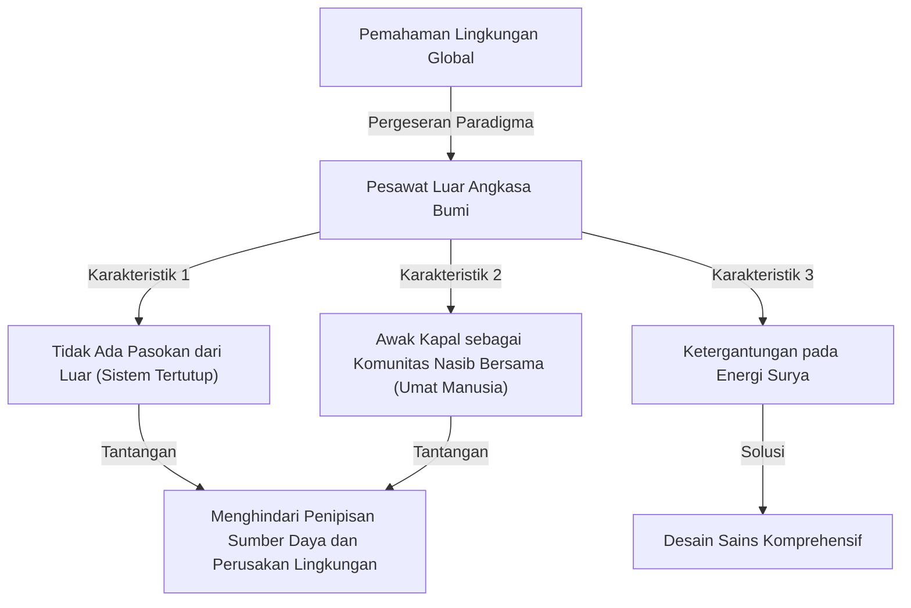
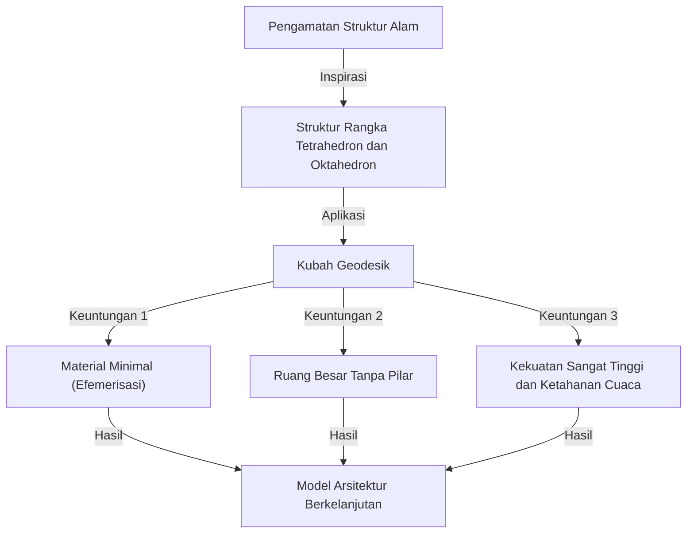

# Pengantar: Promotor "Sains Desain Komprehensif dan Antisipatif" yang Terlalu Maju dari Zamannya

Richard Buckminster Fuller (1895 - 1983). Apa yang terlintas di pikiran Anda saat mendengar nama ini? Beberapa orang mungkin memikirkan "Kubah Geodesik", struktur arsitektur setengah bola yang indah yang terbuat dari segitiga sama sisi. Yang lain mungkin mengaitkannya dengan konsep yang menarik dan mendalam dari "Pesawat Luar Angkasa Bumi (Spaceship Earth)", yang dapat dikatakan sebagai asal usul SDGs dan keberlanjutan saat ini.

Fuller bukan sekadar arsitek biasa, atau sekadar pemikir biasa. Menyebut dirinya sebagai "pencari sains desain komprehensif dan antisipatif", ia adalah sosok yang melintasi berbagai bidang seperti matematika, teknik, arsitektur, filsafat, dan studi lingkungan, terus mencari "solusi optimal" bagi kelangsungan hidup umat manusia di bumi ini.

Dalam artikel ini, kita akan menyusuri kehidupan Buckminster Fuller yang penuh gejolak, sekaligus menggali lebih dalam berbagai penemuan revolusionernya serta warisan filosofisnya yang kini semakin penting di masyarakat modern.

## 1. Kegagalan dan Kebangkitan: Keputusan di Tepi Danau Michigan

Kehidupan Buckminster Fuller tidak hanya diwarnai oleh kesuksesan yang gemilang. Sebaliknya, titik awal filosofinya terletak di dasar kegagalan dan keputusasaan.

Lahir di Milton, Massachusetts, pada tahun 1895, Fuller memiliki minat yang kuat terhadap hukum alam dan geometri sejak usia muda. Namun, ia tidak cocok dengan sistem pendidikan yang otoriter dan dikeluarkan dua kali dari Universitas Harvard (pertama karena menghamburkan uang di klub sosial, dan kedua karena "kurangnya rasa tanggung jawab dan minat").

Setelah bertugas di Angkatan Laut selama Perang Dunia I, ia menikah dan melangkah ke dunia bisnis, tetapi perusahaan bahan bangunan yang didirikannya bangkrut pada tahun 1927. Fuller kehilangan seluruh hartanya dan juga kepercayaan publik. Lebih buruk lagi, ia mengalami tragedi yang tak tertahankan kehilangan putri tertua kesayangannya, Alexandra, akibat komplikasi polio dan meningitis. Fuller merasa bahwa lingkungan perumahan yang buruk saat itu menjadi salah satu penyebab kematian putrinya, dan ia dihantui oleh rasa bersalah yang kuat.

Pada musim dingin 1927, di usia 32 tahun, Fuller berdiri di tepi Danau Michigan, benar-benar mempertimbangkan untuk bunuh diri dengan menenggelamkan dirinya. "Orang yang gagal seperti saya tidak seharusnya menyusahkan keluarga lebih jauh lagi." Tepat saat ia merasa begitu putus asa, ia dikatakan mengalami pengalaman mistis.

Ia mendapat intuisi kuat bahwa dirinya bukan "milik pribadi" melainkan "milik alam semesta". Kemudian, ia memutuskan untuk memulai "eksperimen" besar seumur hidup dengan mempertanyakan, "Apa yang akan terjadi jika saya berhenti hidup untuk diri saya sendiri, dan mendedikasikan seluruh kemampuan saya demi kebahagiaan seluruh umat manusia?" Inilah momen kelahiran penemu hebat Buckminster Fuller di kemudian hari.

## 2. Paradigma Pesawat Luar Angkasa Bumi (Spaceship Earth)

Di antara sekian banyak konsep Fuller, yang paling terkenal dan terus memberikan pengaruh kuat di era modern adalah gagasan "Pesawat Luar Angkasa Bumi (Spaceship Earth)".

Konsep ini dikenal luas melalui bukunya yang terbit pada 1968, "Manual Pengoperasian untuk Pesawat Luar Angkasa Bumi (Operating Manual for Spaceship Earth)". Fuller mengibaratkan bumi ini sebagai "pesawat luar angkasa raksasa yang terbang melesat melalui luar angkasa dengan kecepatan sekitar 100.000 kilometer per jam".

### Pesawat Luar Angkasa Tanpa Manual Pengoperasian

Fuller menunjukkan: "Ada satu hal yang aneh tentang pesawat luar angkasa ini. Yaitu tidak disertakan manual pengoperasiannya."
Umat manusia, tanpa memahami sepenuhnya struktur pesawat luar angkasa ini, sistem pendukung kehidupan (ekosistem), atau sistem siklus energinya, telah lama hidup sebagai "penumpang" yang tidak sadar. Namun, dengan populasi yang meledak dan konsumsi bahan bakar fosil secara besar-besaran sejak Revolusi Industri, sumber daya (cadangan) pesawat luar angkasa ini dengan cepat menipis.

Fuller mengajarkan bahwa umat manusia tidak lagi diizinkan menjadi "penumpang" yang tidak bertanggung jawab, melainkan harus menjadi "awak kapal (kru)" yang menggunakan pengetahuan dan teknologinya untuk memelihara dan mengelola pesawat luar angkasa ini. Filosofi ini kemudian berkembang menjadi konsep seperti "keberlanjutan (sustainability)" dan "masyarakat sirkular", dan menjadi dasar filosofis dari SDGs saat ini.

### Batas Bahan Bakar Fosil dan Transisi ke Energi Terbarukan

Ia menyebut konsumsi bahan bakar fosil sebagai "tindakan menguras baterai (tabungan) pesawat luar angkasa", dan memperingatkan dengan keras. Ia menganggap bahwa bahan bakar fosil adalah "baterai darurat pesawat luar angkasa" tempat energi surya terakumulasi di bumi selama ratusan juta tahun, dan menghabiskannya sebagai tenaga pendorong harian akan menyebabkan disfungsi fatal pada pesawat luar angkasa tersebut.

Sebaliknya, ia mengusulkan transisi ke sistem yang menjalankan masyarakat hanya dengan "pendapatan saat ini dari alam semesta (energi waktu nyata)" seperti angin, pasang surut, dan sinar matahari. Ia benar-benar telah memprediksi pentingnya energi terbarukan yang diserukan dengan lantang di masa kini sejak lebih dari setengah abad yang lalu.

## 3. Efemerisasi (Ephemeralization): "Melakukan Lebih Banyak dengan Lebih Sedikit"

Sebagai konsep yang tak terpisahkan untuk memelihara Pesawat Luar Angkasa Bumi, Fuller mengemukakan "Efemerisasi (Ephemeralization)". Dalam bahasa Jepang ini kadang diterjemahkan sebagai "memperpendek umur" atau "pengenceran", namun dalam konteks Fuller ini berarti "menghasilkan lebih banyak fungsi dan kekayaan dengan sumber daya, energi, dan waktu yang lebih sedikit (Doing more with less)".

### Proses Evolusi Teknologi yang Tak Terhindarkan

Efemerisasi adalah proses fundamental dari evolusi teknologi. Mari kita pertimbangkan contoh yang akrab. Di masa lalu, untuk menyimpan dan menghitung informasi dunia, diperlukan komputer tabung vakum raksasa seukuran gimnasium. Namun saat ini, kita membawa komputer yang jauh lebih kuat di dalam saku sebagai "telepon pintar".
Materialnya menjadi lebih sedikit, bobotnya lebih ringan, dan konsumsi daya turun drastis, tetapi fungsinya meningkat secara eksponensial. Inilah efemerisasi.

Fuller percaya bahwa dengan menerapkan proses ini pada semua industri, arsitektur, dan infrastruktur, adalah mungkin untuk secara dramatis meningkatkan standar hidup semua umat manusia, bahkan dengan sumber daya terbatas di bumi. Klaimnya adalah "kemiskinan dan penipisan sumber daya bukanlah cacat pada pesawat luar angkasa, melainkan cacat pada desain kita."

## 4. Kubah Geodesik: Keajaiban Geometri dan Arsitektur

Filosofi efemerisasi diwujudkan dengan sangat indah di bidang arsitektur melalui mahakarya Fuller, "Kubah Geodesik (Geodesic Dome)".

Fuller mengamati dengan saksama struktur di alam (misalnya, gelembung sabun, cangkang mikroorganisme, susunan atom, dll.) dan menyadari bahwa alam selalu mencapai "kekuatan maksimal dengan energi dan material minimum". Oleh karena itu, ia menciptakan metode pembagian bola dengan jaringan segitiga sama sisi dan merakit material struktural di sepanjang jarak terpendek pada permukaan bola (lingkaran besar = geodesik).

### Kekuatan dan Keringanan Tertinggi

Hal-hal menakjubkan dari Kubah Geodesik adalah sebagai berikut:

1. **Struktur Penyokong Mandiri**: Tidak memerlukan pilar sama sekali di dalamnya, dan dapat menutupi ruang yang luas.
2. **Keringanan Luar Biasa**: Dibandingkan dengan bangunan persegi konvensional, bangunan ini dapat dibangun dengan material konstruksi yang jauh lebih sedikit.
3. **Ketangguhan dan Daya Tahan**: Memiliki ketahanan yang sangat tinggi terhadap gempa bumi dan angin kencang (seperti badai). Karena kekuatan eksternal didistribusikan ke seluruh struktur, kerusakan parsial dapat mencegah keruntuhan berantai.
4. **Efisiensi Energi**: Memaksimalkan rasio volume terhadap luas permukaan, menghasilkan karakteristik efisiensi energi yang sangat tinggi untuk pemanasan dan pendinginan.

Kubah ini memicu sensasi global pada tahun 1967 ketika dibangun sebagai paviliun bola raksasa untuk paviliun Amerika di Expo Montreal. Selain itu, dikatakan bahwa lebih dari 300.000 telah dibangun di seluruh dunia, dari kubah pelindung untuk stasiun radar dan pangkalan observasi Antartika hingga tenda untuk festival luar ruangan.

## 5. Sinergi (Synergy): Keseluruhan Lebih Besar dari Jumlah Bagian-bagiannya

Konsep penting lainnya yang mendasari filosofi Fuller adalah "Sinergi (Synergy)". Sinergi adalah prinsip teori sistem yang menyatakan bahwa "perilaku keseluruhan tidak dapat diprediksi dari perilaku bagian-bagian individu yang menyusunnya".

Fuller percaya bahwa alam semesta itu sendiri bersifat sinergis. Misalnya, jika Anda menggabungkan hidrogen (gas yang mudah terbakar) dan oksigen (gas yang membantu pembakaran), substansi "air" dengan sifat yang sama sekali berbeda (cairan yang memadamkan api) tercipta. Tidak peduli seberapa detail Anda mempelajari hidrogen dan oksigen, Anda tidak dapat memprediksi sifat "air". Inilah sinergi.

### Potensi Manusia Melalui Kerja Sama

Fuller menerapkan hukum sinergi ini pada masyarakat manusia. Alih-alih individu yang mengejar keuntungan sendiri secara terpisah, jika seluruh umat manusia bekerja sama dan berbagi serta mengintegrasikan sumber daya dan pengetahuan pada skala global, kapasitas pemecahan masalah yang eksplosif, yang berada di dimensi yang sama sekali berbeda dari sekadar penjumlahan kekuatan individu, akan lahir.
"Sains desain komprehensif dan antisipatif" yang ia tuju persis merupakan kerangka kerja bagi umat manusia untuk mengerahkan sinergi.

## 6. Konsep Dymaxion

Banyak penemuan Fuller sering dimahkotai dengan kata "Dymaxion". Ini adalah koinase yang diciptakan oleh seorang tenaga humas yang terkesan dengan filosofinya, menggabungkan tiga kata: "Dynamic (Dinamis)", "Maximum (Maksimal)", dan "Tension (Ketegangan)".

### Rumah Dymaxion dan Mobil Dymaxion

Fuller merancang "Rumah Dymaxion" sebagai tempat tinggal masa depan. Ini adalah perumahan heksagonal berbahan aluminium yang dapat diproduksi secara massal di pabrik, dapat diangkut dengan helikopter dan dipasang di mana saja di dunia, mendaur ulang dan memurnikan air hujan, dan menyediakan listrik menggunakan tenaga angin; ini adalah pelopor rumah off-grid lengkap.

"Mobil Dymaxion" adalah kendaraan roda tiga berbentuk tetesan air mata yang sangat mementingkan aerodinamika. Mampu mengangkut 11 orang, membanggakan efisiensi bahan bakar yang luar biasa dan kelincahan (sayangnya, karena kecelakaan selama tahap prototipe, mobil ini tidak pernah dikomersialkan).

### Peta Dymaxion

Penemuan yang lebih penting lagi adalah "Peta Dymaxion (Dymaxion Map)". Peta dunia yang biasa kita lihat, seperti proyeksi Mercator, memiliki distorsi bentuk dan area yang signifikan ketika mendekati Kutub Utara dan Selatan. Ini juga cenderung memberikan ilusi bahwa dunia "terbagi".

Fuller merancang sebuah metode untuk memproyeksikan permukaan bumi ke dalam ikosahedron biasa dan kemudian membentangkannya ke bidang datar. Dengan melakukan ini, ia meminimalkan distorsi bentuk dan ukuran benua sambil secara visual membuktikan bahwa semua benua terhubung sebagai "satu pulau besar (One World Island)". Ini adalah alat filosofis yang kuat untuk menghilangkan garis perbatasan yang sewenang-wenang dan menyadarkan manusia bahwa kita adalah satu komunitas nasib.

## 7. Warisan Fuller: Pertanyaan untuk Masyarakat Modern dan Masa Depan

Puluhan tahun telah berlalu sejak Buckminster Fuller meninggal dunia pada tahun 1983. Meskipun ide-idenya kadang-kadang ditepis sebagai "dongeng" atau "fantasi orang aneh" selama hidupnya, kini di abad ke-21, peringatan yang ia sampaikan telah menjadi kenyataan yang menakutkan.

Perubahan iklim, penipisan sumber daya, pandemi, dan konflik yang terus-menerus. Kita saat ini menghadapi krisis serius pada "Pesawat Luar Angkasa Bumi" yang semakin tidak berfungsi.

Namun, Fuller bukanlah seorang pesimis. Sepanjang hidupnya, ia sangat percaya bahwa manusia diberkahi dengan cukup kecerdasan dan teknologi untuk mengatasi krisis-krisis ini. "Utopia atau Terlupakan (Kehancuran) (Utopia or Oblivion)". Mana yang kita pilih sepenuhnya bergantung pada "desain" kita.

### Pesan dari Fuller untuk Kita Saat Ini

Apa yang seharusnya kita pelajari dari Fuller saat ini?

1. **Memiliki Perspektif Komprehensif**: Di era yang terlalu terspesialisasi saat ini, kita membutuhkan "pemikiran komprehensif" untuk melihat gambaran besar dan menghubungkan berbagai bidang.
2. **Memecahkan Masalah Melalui Kekuatan Desain**: Alih-alih konflik ideologi dan politik, gunakan teknologi dan desain efemeral yang rasional untuk memecahkan masalah fisik.
3. **Kesadaran Bahwa Kemanusiaan Adalah Satu**: Melampaui perpecahan berdasarkan batas negara, ras, atau agama, untuk bekerja sama sebagai kru Pesawat Luar Angkasa Bumi.

Jejak Buckminster Fuller adalah bukti harapan yang menunjukkan seberapa besar dampak yang dapat dihasilkan ketika satu individu mengerahkan kecerdasannya dengan kemauan yang kuat dan cinta tanpa syarat untuk seluruh umat manusia. Banyaknya ide dan filosofi yang ia tinggalkan terus bersinar kuat hingga saat ini, berfungsi sebagai kompas untuk membuka masa depan.

---
*Reference: The works and life of R. Buckminster Fuller, Operating Manual for Spaceship Earth.*
