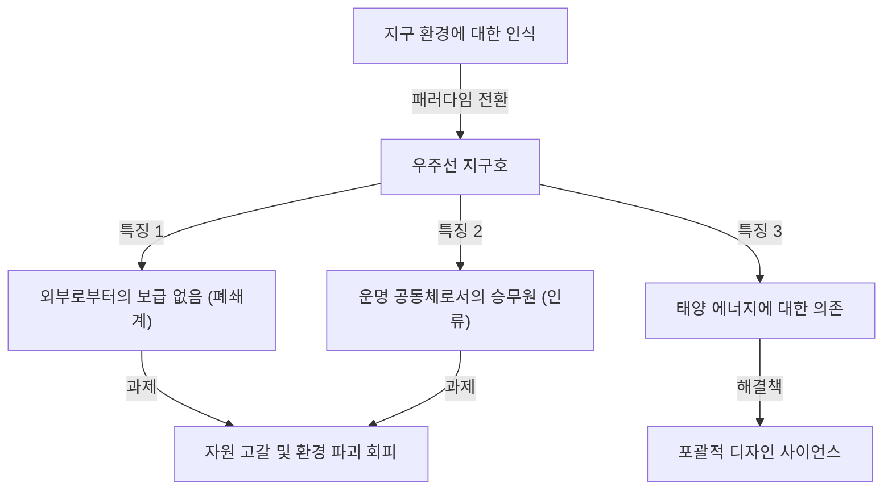
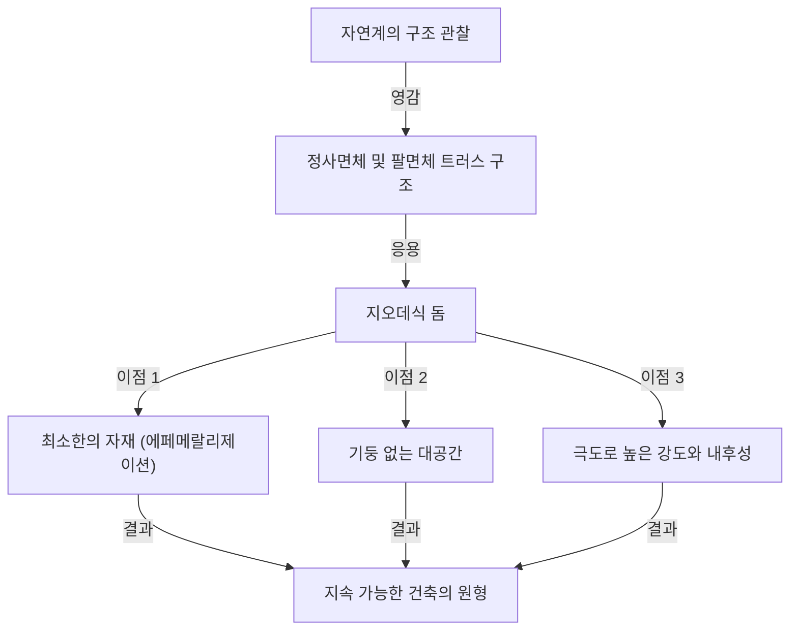

# 서론: 시대를 너무 앞서간 '포괄적 선행 디자인 사이언스'의 주창자

리처드 벅민스터 풀러(Richard Buckminster Fuller, 1895년 - 1983년). 이 이름을 들으면 무엇이 떠오르시나요? 어떤 사람은 정삼각형을 조합한 아름다운 반구형 건축물인 '지오데식 돔'을 떠올릴지도 모릅니다. 또 어떤 사람은 현재의 SDGs나 지속가능성의 기원이라고 할 수 있는 '우주선 지구호(Spaceship Earth)'라는 매력적이고 심오한 개념을 연상할 것입니다.

풀러는 단순한 건축가도, 단순한 사상가도 아닙니다. 스스로를 '포괄적 선행 디자인 사이언스의 탐구자'라고 칭하며 수학, 공학, 건축, 철학, 환경학 등 다방면에 걸친 분야를 넘나들며 인류가 이 지구상에서 살아남기 위한 '최적의 해답'을 끊임없이 탐구한 인물입니다.

본 기사에서는 풀러의 파란만장한 생애를 되짚어 보면서 그가 남긴 수많은 획기적인 발명품과 현대 사회에서 갈수록 그 중요성을 더해가는 사상적 유산에 대해 한없이 깊고 상세하게 파헤쳐 봅니다.

## 1. 좌절과 각성: 미시간 호숫가의 결의

벅민스터 풀러의 인생이 눈부신 성공으로만 장식된 것은 아니었습니다. 오히려 그의 사상의 원점은 밑바닥의 좌절과 절망 속에 있었습니다.

1895년 매사추세츠주 밀턴에서 태어난 풀러는 어렸을 때부터 자연의 법칙과 기하학에 강한 흥미를 가지고 있었습니다. 그러나 권위주의적인 교육 시스템에는 적응하지 못하고 하버드 대학에서 두 번이나 퇴학 처분을 받았습니다(첫 번째는 사교 클럽에서의 낭비, 두 번째는 '무책임과 관심 부족'이 이유였습니다).

제1차 세계대전에서 해군으로 복무한 후 결혼하여 비즈니스 세계에 발을 들여놓았지만, 그가 설립한 건축 자재 회사는 1927년에 파산했습니다. 풀러는 전 재산을 잃고 사회적 신용도 실추되었습니다. 설상가상으로 사랑하는 장녀 알렉산드라를 소아마비와 수막염의 합병증으로 잃는 견디기 힘든 비극을 겪게 됩니다. 장녀의 죽음은 당시의 열악한 주거 환경이 한 원인이라고 생각한 풀러는 극심한 자책감에 시달렸습니다.

1927년 겨울, 32세의 풀러는 미시간 호숫가에 서서 진지하게 투신자살을 고민하고 있었습니다. '나 같은 실패자는 더 이상 가족에게 폐를 끼쳐서는 안 된다.' 그렇게 마음먹고 있던 바로 그 순간, 그는 신비로운 체험을 했다고 전해집니다.

그는 자신이 '개인의 것'이 아니라 '우주의 것'이라는 강렬한 직관을 얻었습니다. 그리고 '만약 내가 나 자신을 위해 사는 것을 그만두고, 전 인류의 행복을 위해 내 모든 능력을 바친다면 어떻게 될까'라는, 평생을 건 장대한 '실험'을 시작하기로 결심한 것입니다. 이것이 훗날의 위대한 발명가 벅민스터 풀러가 탄생한 순간이었습니다.

## 2. 우주선 지구호(Spaceship Earth)의 패러다임

풀러의 수많은 개념 중 가장 유명하고 현대에까지 강한 영향을 미치고 있는 것이 '우주선 지구호(Spaceship Earth)'라는 사고방식입니다.

이 개념은 그가 1968년에 저술한 『우주선 지구호 조종 매뉴얼(Operating Manual for Spaceship Earth)』을 통해 널리 알려졌습니다. 풀러는 이 지구를 '우주 공간을 시속 약 10만 킬로미터의 엄청난 속도로 날아가고 있는 거대한 우주선'에 비유했습니다.

### 조종 매뉴얼이 없는 우주선

풀러는 이렇게 지적합니다. "이 우주선에는 단 하나 이상한 점이 있다. 그것은 조종 매뉴얼이 안 딸려 있다는 것이다."
인류는 이 우주선의 구조나 생명 유지 장치(생태계), 에너지 순환 시스템에 대해 완전히 이해하지 못한 채 오랫동안 무자각하게 '승객'으로 지내왔습니다. 그러나 인구가 폭발적으로 증가하고 산업혁명 이후 화석 연료의 대량 소비로 인해 우주선의 자원(비축물)은 급속히 고갈되고 있습니다.

풀러는 인류가 더 이상 무책임한 '승객'으로 남는 것은 허용되지 않으며, 스스로의 지식과 기술을 이용하여 우주선을 유지하고 관리하는 '승무원(크루)'이 되어야 한다고 설파했습니다. 이 사상은 훗날 '지속가능성(Sustainability)'이나 '순환형 사회'라는 개념으로 발전하였고, 현재 SDGs의 근저에 흐르는 철학이 되었습니다.

### 화석 연료의 한계와 재생 에너지로의 전환

그는 화석 연료의 소비를 '우주선의 배터리(저축)를 갉아먹는 행위'라고 부르며 강력히 경고했습니다. 화석 연료는 수억 년의 시간에 걸쳐 태양 에너지가 지구에 축적된 '우주선의 비상용 배터리'이며, 그것을 일상적인 추진력으로 다 써버리는 것은 우주선의 치명적인 기능 부전을 초래한다고 생각한 것입니다.

대신 그가 제창한 것은 풍력, 조력, 태양광과 같은 '현재 우주로부터의 수입(실시간 에너지)'만으로 사회를 운영하는 시스템으로의 전환이었습니다. 현대에 목소리 높여 외쳐지고 있는 재생 에너지의 중요성을 그는 반세기 이상 전에 완벽하게 예견하고 있었던 것입니다.

## 3. 에페메랄리제이션(Ephemeralization): "더 적은 것으로 더 많은 것을"

우주선 지구호를 유지하기 위해 불가결한 개념으로서 풀러는 '에페메랄리제이션(Ephemeralization)'을 제창했습니다. 이는 '단명화'나 '희박화'로 번역되기도 하지만, 풀러의 문맥에서는 '더 적은 자원과 에너지, 시간으로 더 많은 기능과 부를 창출하는 것(Doing more with less)'을 의미합니다.

### 기술 진화의 필연적 과정

에페메랄리제이션은 기술 진화의 근원적인 과정입니다. 친숙한 예를 들어 생각해 봅시다. 과거에 전 세계의 정보를 저장하고 계산하기 위해서는 체육관만 한 크기의 거대한 진공관 컴퓨터가 필요했습니다. 하지만 현재 우리는 그보다 훨씬 고성능인 컴퓨터를 '스마트폰'이라는 이름으로 주머니에 넣고 다닙니다.
재료는 적어지고 무게는 가벼워졌으며 소비 전력도 격감했음에도 불구하고 기능은 폭발적으로 향상되었습니다. 이것이 에페메랄리제이션입니다.

풀러는 이 과정을 모든 산업이나 건축, 인프라스트럭처에 적용함으로써 지구상의 한정된 자원으로도 전 인류의 생활 수준을 극적으로 향상시키는 것이 가능하다고 믿었습니다. "빈곤이나 자원 고갈은 우주선의 결함이 아니라 우리 디자인의 결함이다"라는 것이 그의 주장이었습니다.

## 4. 지오데식 돔: 기하학과 건축의 기적

에페메랄리제이션의 철학을 건축 분야에서 가장 훌륭하게 체현한 것이 풀러의 대명사라고도 할 수 있는 '지오데식 돔(Geodesic Dome)'입니다.

풀러는 자연계의 구조(예를 들어 비눗방울이나 미생물의 껍질, 원자의 배열 등)를 깊이 관찰하여 자연이 항상 '최소의 에너지와 물질로 최대의 강도'를 실현하고 있다는 사실을 깨달았습니다. 그래서 그는 구체를 정삼각형의 네트워크로 분할하고 구면상의 최단 거리(대원=지오데식)를 따라 구조재를 조립하는 방법을 발명했습니다.

### 궁극의 강도와 가벼움

지오데식 돔의 경이로운 점은 다음과 같습니다.

1. **자가 지지 구조**: 내부에 기둥을 일절 필요로 하지 않고 광활한 공간을 덮을 수 있습니다.
2. **압도적인 가벼움**: 기존의 네모난 건축물에 비해 훨씬 적은 건축 자재로 구축할 수 있습니다.
3. **강인한 내구성**: 지진이나 강풍(허리케인 등)에 대해 극히 높은 내성을 가집니다. 구조 전체로 외력을 분산하기 때문에 일부가 파손되어도 연쇄적인 붕괴를 막을 수 있습니다.
4. **에너지 효율**: 표면적에 대한 체적의 비율이 최대가 되기 때문에 냉난방의 에너지 효율이 극히 높다는 특성이 있습니다.

이 돔은 1967년 몬트리올 엑스포의 미국관으로 거대한 구체 파빌리온이 건설되면서 세계적인 센세이션을 불러일으켰습니다. 또한 레이더 기지의 보호 돔이나 남극 관측 기지, 나아가 야외 페스티벌의 텐트에 이르기까지 전 세계적으로 30만 개 이상이 건설되었다고 합니다.

## 5. 시너지(Synergy): 전체는 부분의 총합 이상의 것

풀러의 철학을 관통하는 또 하나의 중요한 개념이 '시너지(Synergy)'입니다. 시너지란 '전체의 행동은 그것을 구성하는 개별적인 부분의 행동으로부터는 예측할 수 없다'는 시스템 이론의 원리입니다.

풀러는 우주 자체가 시너지적이라고 생각했습니다. 예를 들어 수소(가연성 기체)와 산소(연소를 돕는 기체)를 조합하면 '물'이라는 완전히 다른 성질(불을 끄는 액체)의 물질이 태어납니다. 수소와 산소를 각각 아무리 상세히 조사해도 '물'의 성질을 예측할 수는 없습니다. 이것이 시너지입니다.

### 협력을 통한 인류의 가능성

풀러는 이 시너지의 법칙을 인류 사회에도 적용했습니다. 개인이 뿔뿔이 이익을 추구하는 것이 아니라 전 인류가 협력하고 지구적 규모로 자원과 지혜를 공유·통합한다면, 개별적인 힘의 단순한 덧셈과는 차원이 다른 폭발적인 문제 해결 능력이 생겨난다고 주장한 것입니다.
그가 목표로 한 '포괄적 선행 디자인 사이언스'는 바로 인류가 시너지를 발휘하기 위한 프레임워크였습니다.

## 6. 다이맥시온(Dymaxion)이라는 개념

풀러의 발명품에는 종종 '다이맥시온(Dymaxion)'이라는 단어가 붙어 있습니다. 이는 그의 사상에 감명받은 PR 담당자가 'Dynamic(동적)', 'Maximum(최대)', 'Tension(장력)'이라는 세 단어를 조합하여 만든 조어입니다.

### 다이맥시온 하우스와 다이맥시온 카

풀러는 미래의 주거로서 '다이맥시온 하우스'를 설계했습니다. 이는 공장에서 대량 생산 가능한 알루미늄 재질의 육각형 주택으로, 헬리콥터로 공수하여 전 세계 어디에나 설치할 수 있고, 빗물을 순환 정화하며, 풍력으로 전력을 충당하는 완전한 오프그리드 주택의 선구자였습니다.

또한 '다이맥시온 카'는 공기 역학을 극한까지 추구한 물방울 형태의 삼륜 자동차였습니다. 11명이 승차 가능하면서도 경이로운 연비 성능과 민첩함을 자랑했습니다(안타깝게도 시작 단계에서의 사고 등으로 인해 시판에 이르지는 못했습니다).

### 다이맥시온 맵

더욱 중요한 발명이 '다이맥시온 맵(Dymaxion Map)'입니다. 우리가 평소에 보는 메르카토르 도법 등의 세계지도는 북극이나 남극에 가까워질수록 형태나 면적이 현저하게 왜곡되어 버립니다. 또한 세계가 '분할'되어 있는 듯한 착각을 주기 쉽습니다.

풀러는 지구의 표면을 정이십면체에 투영하고 그것을 평면에 전개하는 기법을 고안했습니다. 이를 통해 대륙의 형태나 크기의 왜곡을 최소화하면서 모든 대륙이 '하나의 거대한 섬(원 월드 아일랜드)'으로서 연결되어 있다는 것을 시각적으로 증명한 것입니다. 이는 국경이라는 자의적인 선을 철폐하고 인류가 운명 공동체임을 인식시키기 위한 강력한 사상적 도구였습니다.

## 7. 풀러의 유산: 현대 사회와 미래에 대한 질문

벅민스터 풀러가 1983년에 세상을 떠난 지 수십 년이 지났습니다. 그가 살아 있을 때에는 '꿈같은 이야기'나 '기인의 공상'으로 치부되기도 했던 그의 사상이었지만, 21세기 현재 그가 발한 경고는 무서울 정도로 현실성을 띠고 있습니다.

기후 변화, 자원 고갈, 팬데믹, 그리고 끊임없는 분쟁. 우리는 지금 바로 기능 부전에 빠져가고 있는 '우주선 지구호'의 심각한 위기에 직면해 있습니다.

그러나 풀러는 결코 비관주의자가 아니었습니다. 그는 평생을 통해 인류에게는 이러한 위기를 극복할 지성과 테크놀로지가 충분히 갖추어져 있다고 믿어 의심치 않았습니다. "유토피아냐, 아니면 망각(파멸)이냐(Utopia or Oblivion)". 우리가 어느 쪽을 선택할지는 우리의 '디자인'에 달려 있습니다.

### 풀러가 현대의 우리에게 보내는 메시지

우리가 지금 풀러에게서 배워야 할 것은 무엇일까요.

1. **포괄적인 시점을 가질 것**: 지나치게 전문화되고 세분화된 현대에 있어 전체상을 조감하고 서로 다른 분야를 연결하는 '포괄적 사고'가 필요합니다.
2. **디자인의 힘으로 문제를 해결할 것**: 정치적인 대립이나 이데올로기가 아니라 합리적이고 에페메랄한 테크놀로지와 디자인에 의해 물리적인 문제를 해결하는 것.
3. **인류는 하나라는 인식**: 국경이나 인종, 종교에 의한 분단을 넘어 우주선 지구호의 승무원으로서 협력하는 것.

벅민스터 풀러의 궤적은 한 인간이 강한 의지와 전 인류에 대한 무상의 사랑을 가지고 지성을 쥐어짜냈을 때 세계에 얼마나 큰 임팩트를 줄 수 있는지를 보여주는 희망의 증명입니다. 그가 남긴 무수한 아이디어와 철학은 미래를 개척하기 위한 나침반으로서 지금도 여전히 힘차게 빛나고 있습니다.

---
*Reference: The works and life of R. Buckminster Fuller, Operating Manual for Spaceship Earth.*
