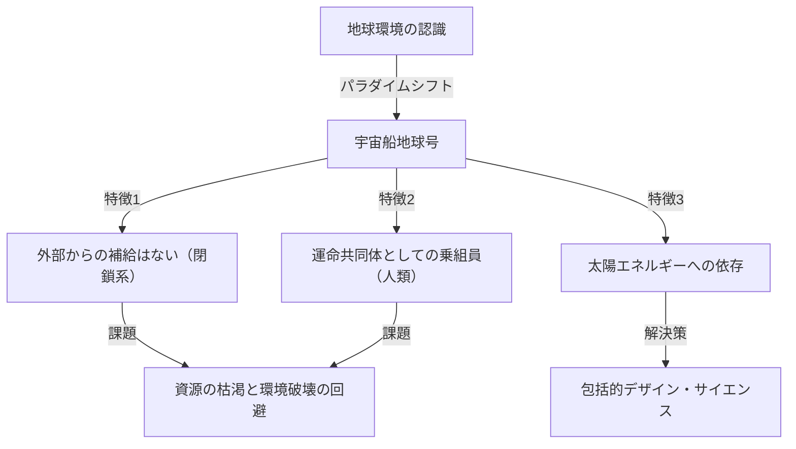
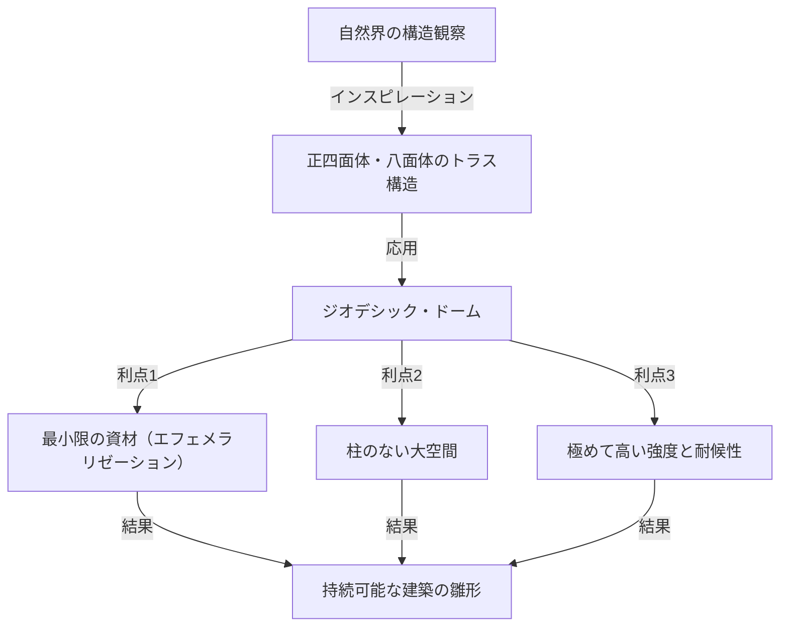

# 序論：時代を先取りしすぎた「包括的先行的デザイン・サイエンス」の提唱者

リチャード・バックミンスター・フラー（Richard Buckminster Fuller, 1895年 - 1983年）。この名前を聞いて、何を思い浮かべるでしょうか。ある人は、正三角形を組み合わせた美しい半球形の建築物「ジオデシック・ドーム」を思い浮かべるかもしれません。またある人は、現在のSDGsやサステナビリティの源流とも言える「宇宙船地球号（Spaceship Earth）」というキャッチーかつ深遠な概念を連想するでしょう。

フラーは単なる建築家でも、単なる思想家でもありません。自らを「包括的・先行的デザイン・サイエンスの探求者」と名乗り、数学、工学、建築、哲学、そして環境学といった多岐にわたる分野を横断し、人類がこの地球上で生き残るための「最適解」を探求し続けた人物です。

本記事では、フラーの波乱万丈な生涯を辿りながら、彼が残した数々の画期的な発明や、現代社会においてますますその重要性を増している思想的遺産について、どこまでも深く、詳細に掘り下げていきます。

## 1. 挫折と覚醒：ミシガン湖畔の決意

バックミンスター・フラーの人生は、輝かしい成功だけで彩られていたわけではありません。むしろ、彼の思想の原点は、どん底の挫折と絶望の中にありました。

1895年、マサチューセッツ州ミルトンに生まれたフラーは、幼い頃から自然の法則や幾何学に対する強い興味を持っていました。しかし、権威主義的な教育システムには馴染めず、ハーバード大学を二度退学処分になっています（一度目は社交クラブでの散財、二度目は「無責任と関心の欠如」が理由でした）。

第一次世界大戦での海軍勤務を経て結婚し、ビジネスの世界に足を踏み入れますが、彼が立ち上げた建築資材会社は1927年に倒産。フラーは全財産を失い、社会的な信用も失墜します。さらに悪いことに、愛する長女アレクサンドラを小児麻痺と髄膜炎の合併症で亡くすという、耐え難い悲劇に見舞われます。長女の死は、当時の劣悪な住環境が一因であるとフラーは考え、激しい自責の念に駆られました。

1927年の冬、32歳のフラーはミシガン湖のほとりに立ち、入水自殺を真剣に考えていました。「自分のような失敗者は、これ以上家族に迷惑をかけるべきではない」。そう思い詰めていたまさにその時、彼は神秘的な体験をしたと言われています。

彼は、自分が「個人のもの」ではなく「宇宙のもの」であるという強烈な直感を得ました。そして、「もし自分が自分自身のために生きることをやめ、全人類の幸福のために自分の能力をすべて捧げたらどうなるか」という、生涯をかけた壮大な「実験」を開始することを決意したのです。これが、後年の偉大な発明家バックミンスター・フラーが誕生した瞬間でした。

## 2. 宇宙船地球号（Spaceship Earth）のパラダイム

フラーの数あるコンセプトの中で、最も有名で、かつ現代に強い影響を与え続けているのが「宇宙船地球号（Spaceship Earth）」という考え方です。

この概念は、彼が1968年に著した『宇宙船地球号操縦マニュアル（Operating Manual for Spaceship Earth）』で広く知られるようになりました。フラーは、この地球を「宇宙空間を時速約10万キロメートルで猛スピードで飛んでいる、巨大な宇宙船」に見立てました。

### 操縦マニュアルのない宇宙船

フラーはこう指摘します。「この宇宙船には、一つだけおかしな点がある。それは、操縦マニュアルが付いていないということだ」。
人類は、この宇宙船の構造や、生命維持装置（生態系）、エネルギーの循環システムについて完全に理解しないまま、長い間、無自覚に「乗客」として過ごしてきました。しかし、人口が爆発的に増加し、産業革命以降の化石燃料の大量消費によって、宇宙船の資源（備蓄）は急速に枯渇しつつあります。

フラーは、人類はもはや無責任な「乗客」であることを許されず、自らの知識と技術を用いて宇宙船を維持・管理する「乗組員（クルー）」にならなければならないと説きました。この思想は、後に「サステナビリティ（持続可能性）」や「循環型社会」といった概念へと発展し、現在のSDGsの根底に流れる哲学となっています。

### 化石燃料の限界と再生可能エネルギーへの転換

彼は化石燃料の消費を「宇宙船のバッテリー（貯金）を食いつぶす行為」と呼び、強く警告しました。化石燃料は、何億年もの時間をかけて太陽エネルギーが地球に蓄積された「宇宙船の非常用バッテリー」であり、それを日常的な推進力として使い果たすことは、宇宙船の致命的な機能不全を招くと考えたのです。

代わりに彼が提唱したのは、風力、潮力、太陽光といった「現在の宇宙からの収入（リアルタイムのエネルギー）」のみで社会を運営するシステムへの移行でした。現代において声高に叫ばれている再生可能エネルギーの重要性を、彼は半世紀以上前に完全に予見していたのです。

## 3. エフェメラリゼーション（Ephemeralization）：「より少なくで、より多くを」

宇宙船地球号を維持するために不可欠な概念として、フラーは「エフェメラリゼーション（Ephemeralization）」を提唱しました。これは日本語で「短命化」や「希薄化」と訳されることもありますが、フラーの文脈においては「より少ない資源・エネルギー・時間で、より多くの機能と富を生み出すこと（Doing more with less）」を意味します。

### 技術進化の必然的プロセス

エフェメラリゼーションは、技術進化の根源的なプロセスです。身近な例で考えてみましょう。かつて、世界中の情報を保存・計算するためには、体育館ほどの大きさがある巨大な真空管コンピューターが必要でした。しかし現在、私たちはそれより遥かに高性能なコンピューターを「スマートフォン」としてポケットに入れて持ち歩いています。
材料は少なくなり、重量は軽くなり、消費電力も激減したにもかかわらず、機能は爆発的に向上しています。これがエフェメラリゼーションです。

フラーは、このプロセスをすべての産業や建築、インフラストラクチャーに適用することで、地球上の限られた資源であっても、全人類の生活水準を劇的に向上させることが可能だと信じていました。「貧困や資源の枯渇は、宇宙船の欠陥ではなく、我々のデザインの欠陥である」というのが彼の主張でした。

## 4. ジオデシック・ドーム：幾何学と建築の奇跡

エフェメラリゼーションの哲学を建築の分野で最も見事に体現したのが、フラーの代名詞とも言える「ジオデシック・ドーム（Geodesic Dome）」です。

フラーは、自然界の構造（例えば、シャボン玉や微生物の殻、原子の配列など）を深く観察し、自然が常に「最小のエネルギーと物質で最大の強度」を実現していることに気づきました。そこで彼は、球体を正三角形のネットワークで分割し、球面上の最短距離（大円＝ジオデシック）に沿って構造材を組み上げる方法を発明しました。

### 究極の強度と軽さ

ジオデシック・ドームの驚異的な点は以下の通りです：

1. **自己支持構造**: 内部に柱を一切必要とせず、広大な空間を覆うことができます。
2. **圧倒的な軽さ**: 従来の四角い建築物と比較して、はるかに少ない建築資材で構築できます。
3. **強靭な耐久性**: 地震や強風（ハリケーンなど）に対して極めて高い耐性を持ちます。構造全体で外力を分散するため、一部が破損しても連鎖的な崩壊を防ぐことができます。
4. **エネルギー効率**: 表面積に対する体積の比率が最大になるため、冷暖房のエネルギー効率が極めて高いという特性があります。

このドームは、1967年のモントリオール万博のアメリカ館として巨大な球体パビリオンが建設されたことで世界的なセンセーションを巻き起こしました。また、レーダー基地の保護ドームや、南極観測基地、さらには野外フェスティバルのテントに至るまで、世界中で30万個以上が建設されたと言われています。

## 5. シナジー（Synergy）：全体は部分の総和以上のもの

フラーの哲学を貫くもう一つの重要な概念が「シナジー（Synergy）」です。シナジーとは、「全体の振る舞いは、それを構成する個々の部分の振る舞いからは予測できない」というシステム理論の原理です。

フラーは、宇宙そのものがシナジー的であると考えました。例えば、水素（可燃性の気体）と酸素（燃焼を助ける気体）を組み合わせると、「水」という全く異なる性質（火を消す液体）の物質が生まれます。水素と酸素をそれぞれいくら詳細に調べても、「水」の性質を予測することはできません。これがシナジーです。

### 協力による人類の可能性

フラーは、このシナジーの法則を人類社会にも適用しました。個人がばらばらに利益を追求するのではなく、全人類が協力し合い、地球規模で資源と知を共有・統合すれば、個々の力の単純な足し算とは次元の違う、爆発的な問題解決能力が生まれると主張したのです。
彼の目指した「包括的先行的デザイン・サイエンス」は、まさに人類がシナジーを発揮するためのフレームワークでした。

## 6. ダイマクション（Dymaxion）という概念

フラーの発明品には、しばしば「ダイマクション（Dymaxion）」という言葉が冠されています。これは、彼の思想に感銘を受けたPRマンが、「Dynamic（動的）」「Maximum（最大）」「Tension（張力）」という3つの言葉を組み合わせて作った造語です。

### ダイマクション・ハウスとダイマクション・カー

フラーは、未来の住居として「ダイマクション・ハウス」を設計しました。これは、工場で大量生産可能なアルミニウム製の六角形の住宅で、ヘリコプターで空輸して世界中どこにでも設置でき、雨水を循環浄化し、風力で電力をまかなうという、完全なオフグリッド住宅の先駆けでした。

また、「ダイマクション・カー」は、空気力学を極限まで追求した涙滴型の三輪自動車でした。11人が乗車可能でありながら、驚異的な燃費性能と小回りの良さを誇りました（残念ながら試作段階での事故などにより、市販化には至りませんでした）。

### ダイマクション・マップ

さらに重要な発明が「ダイマクション・マップ（Dymaxion Map）」です。私たちが普段目にするメルカトル図法などの世界地図は、北極や南極に近づくほど形や面積が著しく歪んでしまいます。また、世界が「分割」されているかのような錯覚を与えがちです。

フラーは、地球の表面を正二十面体に投影し、それを平面に展開する手法を考案しました。これにより、大陸の形や大きさの歪みを最小限に抑えつつ、全ての大陸が「一つの巨大な島（ワン・ワールド・アイランド）」として繋がっていることを視覚的に証明したのです。これは、国境という恣意的な線を取り払い、人類が運命共同体であることを認識させるための、強力な思想的ツールでした。

## 7. フラーの遺産：現代社会と未来への問いかけ

バックミンスター・フラーが1983年にこの世を去ってから、数十年が経過しました。彼の生前には「夢物語」や「奇人の空想」として片付けられることもあった彼の思想ですが、21世紀の現在、彼が発した警告は恐ろしいほどの現実味を帯びています。

気候変動、資源枯渇、パンデミック、そして絶え間ない紛争。私たちは今まさに、機能不全に陥りつつある「宇宙船地球号」の深刻な危機に直面しています。

しかし、フラーは決して悲観主義者ではありませんでした。彼は生涯を通じて、人類にはこれらの危機を克服する知性とテクノロジーが十分に備わっていると信じて疑いませんでした。「ユートピアか、それとも忘却（破滅）か（Utopia or Oblivion）」。私たちがどちらを選ぶかは、私たちの「デザイン」にかかっているのです。

### フラーから現代の私たちへのメッセージ

私たちが今、フラーから学ぶべきことは何でしょうか。

1. **包括的な視点を持つこと**: 専門分化しすぎた現代において、全体像を俯瞰し、異なる分野を繋ぎ合わせる「包括的思考」が必要です。
2. **デザインの力で問題を解決すること**: 政治的な対立やイデオロギーではなく、合理的でエフェメラルなテクノロジーとデザインによって、物理的な問題を解決すること。
3. **人類は一つであるという認識**: 国境や人種、宗教による分断を超え、宇宙船地球号の乗組員として協力すること。

バックミンスター・フラーの軌跡は、一人の人間が、強い意志と全人類への無償の愛をもって知性を振り絞ったとき、世界にどれほどのインパクトを与えられるかを示す、希望の証明です。彼の遺した無数のアイデアと哲学は、未来を切り開くためのコンパスとして、今なお力強く輝き続けています。

---
*Reference: The works and life of R. Buckminster Fuller, Operating Manual for Spaceship Earth.*
