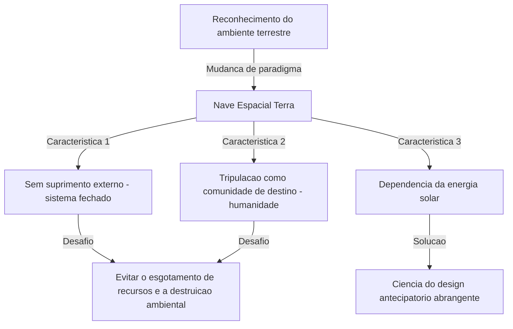
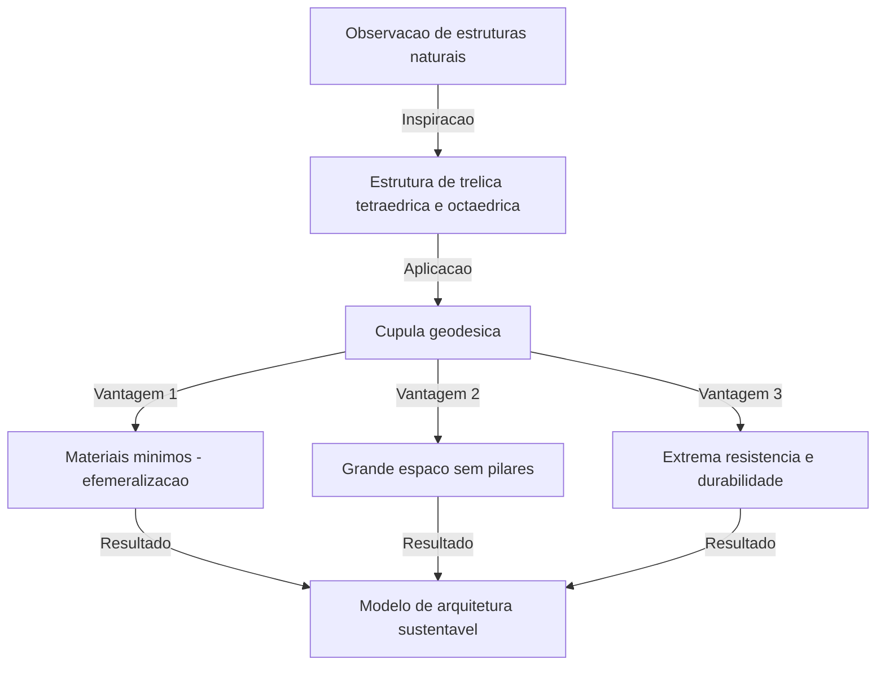

# Introdução: O pioneiro de uma "ciência do design antecipatório abrangente" muito à frente de seu tempo

Richard Buckminster Fuller (1895 - 1983). O que lhe vem à mente ao ouvir este nome? Alguns podem pensar na "cúpula geodésica", um belo edifício hemisférico que combina triângulos equiláteros. Outros podem se lembrar da ideia cativante e profunda da "Nave Espacial Terra" (Spaceship Earth), que pode ser considerada a origem dos atuais ODS e da sustentabilidade.

Fuller não era apenas um arquiteto ou pensador. Autodenominando-se um "explorador de uma ciência do design antecipatório abrangente", ele cruzou vários campos como matemática, engenharia, arquitetura, filosofia e ciência ambiental, buscando continuamente a "solução ideal" para a sobrevivência da humanidade nesta Terra.

Neste artigo, ao traçar a vida turbulenta de Fuller, exploraremos profundamente suas muitas invenções revolucionárias e o legado ideológico que se torna cada vez mais importante na sociedade moderna.

## 1. Fracasso e despertar: A determinação às margens do Lago Michigan

A vida de Buckminster Fuller não foi pontuada apenas por sucessos brilhantes. Em vez disso, a origem de seu pensamento está no abismo do fracasso e do desespero.

Nascido em Milton, Massachusetts, em 1895, Fuller demonstrou desde cedo um forte interesse pelas leis da natureza e pela geometria. No entanto, incapaz de se adaptar ao sistema educacional autoritário, ele foi expulso da Universidade de Harvard duas vezes (a primeira vez por gastar dinheiro em um clube social, a segunda por "irresponsabilidade e falta de interesse").

Depois de servir na Marinha durante a Primeira Guerra Mundial, ele se casou e entrou no mundo dos negócios, mas a empresa de materiais de construção que ele fundou faliu em 1927. Fuller perdeu toda a sua fortuna e credibilidade social. Pior ainda, ele sofreu a insuportável tragédia de perder sua amada filha mais velha, Alexandra, devido a complicações de poliomielite e meningite. Acreditando que as más condições habitacionais da época foram parcialmente responsáveis pela morte de sua filha, Fuller foi consumido por um forte remorso.

No inverno de 1927, aos 32 anos, Fuller estava às margens do Lago Michigan, pensando seriamente em cometer suicídio por afogamento. "Um fracassado como eu não deveria mais causar problemas para sua família." Diz-se que foi exatamente no momento em que era atormentado por esses pensamentos que ele teve uma experiência mística.

Ele teve a forte intuição de que não pertencia "a si mesmo", mas "ao universo". Ele então decidiu iniciar um "experimento" grandioso, que duraria toda a sua vida: "O que aconteceria se eu parasse de viver para mim mesmo e dedicasse todas as minhas habilidades à felicidade de toda a humanidade?" Foi exatamente neste momento que nasceu o grande inventor Buckminster Fuller.

## 2. O paradigma da Nave Espacial Terra (Spaceship Earth)

Entre os muitos conceitos de Fuller, o mais famoso e que continua a ter uma forte influência hoje é o da "Nave Espacial Terra".

Este conceito tornou-se amplamente conhecido por seu livro de 1968, "Manual de Operação para a Nave Espacial Terra" (Operating Manual for Spaceship Earth). Fuller comparou a Terra a uma "nave espacial gigante voando no espaço a uma velocidade louca de cerca de 100.000 quilômetros por hora".

### Uma nave espacial sem manual de instruções

Fuller fez a seguinte observação: "Há uma coisa estranha sobre esta nave espacial. Ela vem sem um manual de instruções."
Por muito tempo, a humanidade viveu inconscientemente como "passageiros", sem compreender totalmente a estrutura desta nave espacial, seu sistema de suporte de vida (o ecossistema) e seu sistema de circulação de energia. No entanto, com a explosão populacional e o consumo massivo de combustíveis fósseis desde a Revolução Industrial, os recursos (reservas) da nave espacial estão se esgotando rapidamente.

Fuller argumentou que a humanidade não pode mais se dar ao luxo de ser "passageiros" irresponsáveis, mas deve usar seu conhecimento e tecnologia para se tornar uma "tripulação" que mantém e gerencia a nave espacial. Este pensamento mais tarde evoluiu para conceitos como "sustentabilidade" e "sociedade da reciclagem", e é a filosofia subjacente aos atuais ODS.

### Os limites dos combustíveis fósseis e a transição para energias renováveis

Ele chamou o consumo de combustíveis fósseis de um ato de "devorar a bateria (poupança) da nave espacial" e emitiu um severo aviso. Os combustíveis fósseis são a "bateria de reserva da nave espacial", onde a energia solar se acumulou na Terra durante centenas de milhões de anos. Ele acreditava que esgotá-la como força motriz diária levaria a um mau funcionamento fatal da nave espacial.

O que ele propôs em vez disso foi uma transição para um sistema em que a sociedade operaria exclusivamente com a "renda atual do universo (energia em tempo real)", como energia eólica, das marés e solar. Ele previu perfeitamente, há mais de meio século, a importância das energias renováveis que é tão fortemente reivindicada hoje.

## 3. Efemeralização (Ephemeralization): "Fazer mais com menos"

Para manter a Nave Espacial Terra, Fuller propôs o conceito de "efemeralização" (Ephemeralization). Isso às vezes se traduz como "encurtamento" ou "diluição", mas no contexto de Fuller, significa "produzir mais funções e riqueza com menos recursos, energia e tempo" (Doing more with less).

### Um processo inevitável da evolução tecnológica

A efemeralização é o processo fundamental da evolução tecnológica. Vamos dar um exemplo familiar. Antigamente, para armazenar e calcular as informações do mundo, eram necessários imensos computadores de tubos de vácuo do tamanho de um ginásio. Hoje, no entanto, carregamos computadores muito mais poderosos em nossos bolsos na forma de "smartphones".
Embora os materiais tenham diminuído, o peso tenha sido reduzido e o consumo de energia tenha caído drasticamente, a funcionalidade aumentou de forma explosiva. Isso é a efemeralização.

Fuller acreditava que, ao aplicar esse processo a todas as indústrias, arquitetura e infraestrutura, seria possível melhorar drasticamente o padrão de vida de toda a humanidade, mesmo com os recursos limitados da Terra. Seu argumento era que "a pobreza e o esgotamento dos recursos não são defeitos da nave espacial, mas defeitos do nosso design".

## 4. Cúpula geodésica: Um milagre da geometria e da arquitetura

A filosofia da efemeralização foi mais brilhantemente incorporada no campo da arquitetura pelo que se tornou sinônimo de Fuller: a "Cúpula geodésica" (Geodesic Dome).

Fuller observou de perto as estruturas da natureza (por exemplo, bolhas de sabão, conchas de microorganismos, arranjos atômicos, etc.) e percebeu que a natureza sempre alcança "a força máxima com energia e matéria mínimas". Então, ele inventou um método para dividir uma esfera com uma rede de triângulos equiláteros e montar materiais estruturais ao longo da distância mais curta na superfície esférica (o grande círculo = geodésica).

### Máxima resistência e leveza

Os aspectos surpreendentes da cúpula geodésica são os seguintes:

1. **Estrutura autoportante**: Pode cobrir um espaço vasto sem a necessidade de pilares internos.
2. **Leveza avassaladora**: Pode ser construída com muito menos materiais de construção em comparação com um edifício quadrado tradicional.
3. **Alta durabilidade**: Possui resistência extremamente alta a terremotos e ventos fortes (como furacões). Como toda a estrutura dispersa as forças externas, mesmo que uma parte seja danificada, um colapso em cadeia pode ser evitado.
4. **Eficiência energética**: Como a relação entre a área da superfície e o volume é maximizada, a eficiência energética de aquecimento e resfriamento é extremamente alta.

Esta cúpula causou sensação mundial quando um gigantesco pavilhão esférico foi construído como pavilhão dos EUA para a Expo 67 em Montreal. Além disso, diz-se que mais de 300.000 dessas cúpulas foram construídas em todo o mundo, de cúpulas de proteção para estações de radar a bases de observação antárticas e tendas para festivais ao ar livre.

## 5. Sinergia (Synergy): O todo é maior que a soma de suas partes

Outro conceito chave que sustenta a filosofia de Fuller é a "Sinergia" (Synergy). A sinergia é um princípio da teoria dos sistemas segundo o qual "o comportamento do todo não pode ser previsto a partir do comportamento de suas partes constituintes individuais".

Fuller acreditava que o próprio universo era sinérgico. Por exemplo, se você combinar hidrogênio (um gás inflamável) e oxigênio (um gás que promove a combustão), obterá uma substância com uma propriedade completamente diferente (um líquido que apaga o fogo) chamada "água". Não importa o quão detalhadamente você estude o hidrogênio e o oxigênio individualmente, você não pode prever as propriedades da "água". Isso é sinergia.

### O potencial da humanidade através da cooperação

Fuller também aplicou esta lei da sinergia à sociedade humana. Ele argumentou que, em vez de indivíduos buscando lucros isoladamente, se toda a humanidade cooperasse, compartilhasse e integrasse recursos e conhecimento em escala global, emergiria uma capacidade explosiva de resolução de problemas, em uma dimensão completamente diferente de uma simples adição de poderes individuais.
Sua "ciência do design antecipatório abrangente" era precisamente uma estrutura para a humanidade exercer essa sinergia.

## 6. O conceito Dymaxion

As invenções de Fuller muitas vezes levam o nome "Dymaxion". É uma palavra-valise criada por um especialista em relações públicas impressionado com suas ideias, combinando as três palavras "Dynamic" (dinâmico), "Maximum" (máximo) e "Tension" (tensão).

### A Casa Dymaxion e o Carro Dymaxion

Fuller projetou a "Casa Dymaxion" como a casa do futuro. Era uma casa hexagonal de alumínio que poderia ser produzida em massa em uma fábrica, transportada por helicóptero e instalada em qualquer lugar do mundo. Ela purificava e reciclava a água da chuva e era movida a energia eólica, tornando-se a pioneira da casa totalmente fora da rede.

Além disso, o "Carro Dymaxion" era um veículo de três rodas em forma de lágrima que levava a aerodinâmica ao seu limite. Embora pudesse acomodar 11 pessoas, oferecia uma incrível eficiência de combustível e excelente raio de giro (infelizmente, devido a acidentes na fase de protótipo, nunca foi comercializado).

### O Mapa Dymaxion

Uma invenção ainda mais importante é o "Mapa Dymaxion" (Dymaxion Map). Os mapas-múndi que costumamos ver, como a projeção de Mercator, distorcem significativamente formas e áreas à medida que se aproximam dos Pólos Norte e Sul. Eles também tendem a criar a ilusão de que o mundo está "dividido".

Fuller desenvolveu um método de projetar a superfície da Terra em um icosaedro regular e, em seguida, desdobrá-lo em um plano. Assim, minimizando a distorção nas formas e tamanhos dos continentes, ele provou visualmente que todos os continentes estão conectados como "uma ilha gigante" (One World Island). Foi uma poderosa ferramenta ideológica para remover a linha arbitrária das fronteiras nacionais e conscientizar a humanidade de que compartilha uma comunidade de destino.

## 7. O legado de Fuller: Um questionamento para a sociedade moderna e o futuro

Décadas se passaram desde que Buckminster Fuller faleceu em 1983. Suas ideias, que às vezes eram descartadas como "sonhos" ou "fantasias excêntricas" durante sua vida, agora carregam uma realidade terrível no século 21.

Mudanças climáticas, esgotamento de recursos, pandemias e conflitos incessantes. Atualmente, enfrentamos graves crises a bordo da "Nave Espacial Terra", que começa a funcionar mal.

No entanto, Fuller não era de forma alguma um pessimista. Ao longo de sua vida, ele acreditou firmemente que a humanidade possuía inteligência e tecnologia suficientes para superar essas crises. "Utopia ou Esquecimento" (Utopia or Oblivion). A escolha que fizermos dependerá do nosso "design".

### A mensagem de Fuller para nós hoje

O que devemos aprender com Fuller hoje?

1. **Ter uma perspectiva global**: Em um mundo moderno superespecializado, é necessário um "pensamento global" que permita ver o quadro geral e conectar diferentes campos.
2. **Resolver problemas através do design**: Devemos resolver os problemas físicos não através de conflitos políticos ou ideologias, mas através de tecnologia e design racionais e efêmeros.
3. **Reconhecer que a humanidade é uma**: Superar as divisões causadas por fronteiras nacionais, raça e religião, e cooperar como a tripulação da Nave Espacial Terra.

A jornada de Buckminster Fuller é uma prova de esperança, mostrando o impacto que um único ser humano pode ter no mundo ao mobilizar sua inteligência com forte vontade e amor incondicional por toda a humanidade. Suas inúmeras ideias e filosofia continuam a brilhar intensamente hoje como uma bússola para abrir o caminho para o futuro.

---
*Reference: The works and life of R. Buckminster Fuller, Operating Manual for Spaceship Earth.*
