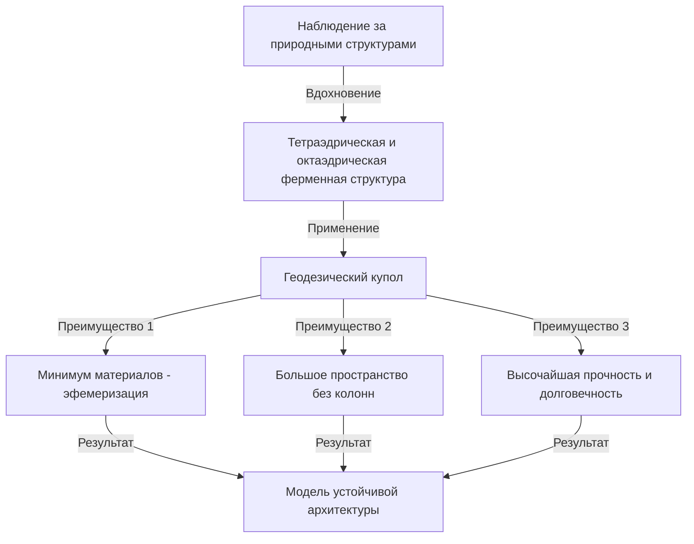

# Введение: Инициатор "комплексной науки о дизайне", опередивший свое время

Ричард Бакминстер Фуллер (1895 - 1983). Что приходит вам на ум, когда вы слышите это имя? Кто-то, возможно, вспомнит "геодезический купол", прекрасное полусферическое здание, состоящее из равносторонних треугольников. Другие могут вспомнить броскую и глубокую идею "Космического корабля Земля" (Spaceship Earth), которую можно считать истоком современных ЦУР и устойчивого развития.

Фуллер не был просто архитектором или мыслителем. Называя себя "исследователем комплексной опережающей науки о дизайне", он пересекал различные области, такие как математика, инженерия, архитектура, философия и экология, продолжая искать "оптимальное решение" для выживания человечества на Земле.

В этой статье, прослеживая бурную жизнь Фуллера, мы глубоко исследуем его многочисленные новаторские изобретения и идеологическое наследие, которое приобретает все большее значение в современном обществе.

## 1. Неудачи и пробуждение: Решимость на берегу озера Мичиган

Жизнь Бакминстера Фуллера не была наполнена только блестящими успехами. Скорее, истоки его мысли лежат в пучине неудач и отчаяния.

Родившийся в Милтоне, штат Массачусетс, в 1895 году, Фуллер с юных лет проявлял сильный интерес к законам природы и геометрии. Однако он не смог приспособиться к авторитарной системе образования и был дважды исключен из Гарвардского университета (первый раз за растрату денег в социальном клубе, второй раз за "безответственность и отсутствие интереса").

Отслужив во флоте во время Первой мировой войны, он женился и занялся бизнесом, но основанная им компания по производству строительных материалов обанкротилась в 1927 году. Фуллер потерял все свое состояние и социальное доверие. Хуже того, он пережил невыносимую трагедию - потерял свою любимую старшую дочь Александру из-за осложнений полиомиелита и менингита. Полагая, что плохие жилищные условия того времени были одной из причин смерти его дочери, Фуллер терзался сильными угрызениями совести.

Зимой 1927 года, в возрасте 32 лет, Фуллер стоял на берегу озера Мичиган, всерьез подумывая о самоубийстве. "Такой неудачник, как я, не должен больше доставлять проблем своей семье". Говорят, именно тогда, когда его терзали эти мысли, он пережил мистический опыт.

Он получил сильное интуитивное озарение, что он принадлежит не "себе", а "вселенной". Затем он решил начать грандиозный "эксперимент", который продлится всю его жизнь: "Что произойдет, если я перестану жить для себя и посвящу все свои способности счастью всего человечества?" Именно в этот момент родился великий изобретатель Бакминстер Фуллер.

## 2. Парадигма Космического корабля Земля (Spaceship Earth)

Среди многочисленных концепций Фуллера самой известной и продолжающей оказывать сильное влияние сегодня является "Космический корабль Земля".

Эта концепция стала широко известна благодаря его книге 1968 года "Руководство по управлению Космическим кораблем Земля" (Operating Manual for Spaceship Earth). Фуллер сравнил Землю с "гигантским космическим кораблем, летящим в космосе с бешеной скоростью около 100 000 километров в час".

### Космический корабль без руководства по эксплуатации

Фуллер отметил: "В этом космическом корабле есть одна странность. К нему не прилагается руководство по эксплуатации".
Долгое время человечество бессознательно жило как "пассажиры", не до конца понимая структуру этого космического корабля, его системы жизнеобеспечения (экосистему) и систему циркуляции энергии. Однако из-за демографического взрыва и массового потребления ископаемого топлива со времен промышленной революции ресурсы космического корабля быстро истощаются.

Фуллер утверждал, что человечество больше не может позволить себе быть безответственными "пассажирами", но должно использовать свои знания и технологии, чтобы стать "экипажем", который поддерживает и управляет космическим кораблем. Эта мысль позже переросла в такие концепции, как "устойчивость" и "общество рециркуляции", и является философией, лежащей в основе современных ЦУР.

### Пределы ископаемого топлива и переход к возобновляемым источникам энергии

Он назвал потребление ископаемого топлива актом "поедания батареи (сбережений) космического корабля" и выступил с суровым предупреждением. Ископаемое топливо — это "резервная батарея космического корабля", в которой солнечная энергия накапливалась на Земле в течение сотен миллионов лет. Он считал, что истощение ее в качестве повседневной движущей силы приведет к фатальной неисправности космического корабля.

Вместо этого он предложил переход к системе, в которой общество будет функционировать исключительно за счет "текущего дохода от вселенной (энергии в реальном времени)", такой как энергия ветра, приливов и солнца. Он прекрасно предвидел более полувека назад важность возобновляемых источников энергии, о которых сегодня говорят так громко.

## 3. Эфемеризация (Ephemeralization): "Делать больше с меньшим"

В качестве концепции, необходимой для поддержания Космического корабля Земля, Фуллер предложил "эфемеризацию" (Ephemeralization). Это означает "создание большего количества функций и богатства с меньшими затратами ресурсов, энергии и времени" (Doing more with less).

### Неизбежный процесс технологической эволюции

Эфемеризация — это фундаментальный процесс технологической эволюции. Возьмем знакомый пример. Раньше для хранения и вычисления мировой информации требовались гигантские ламповые компьютеры размером со спортивный зал. Однако сегодня мы носим в карманах гораздо более мощные компьютеры в виде "смартфонов".
Несмотря на то, что материалов стало меньше, вес снизился, а энергопотребление резко упало, функциональность взрывообразно возросла. Это и есть эфемеризация.

Фуллер верил, что, применив этот процесс ко всем отраслям, архитектуре и инфраструктуре, можно кардинально улучшить уровень жизни всего человечества даже при ограниченных ресурсах Земли. Его аргумент заключался в том, что "бедность и истощение ресурсов — это не дефекты космического корабля, а дефекты нашего дизайна".

## 4. Геодезический купол: Чудо геометрии и архитектуры

Философия эфемеризации была наиболее блестяще воплощена в области архитектуры в том, что стало синонимом Фуллера: "Геодезический купол" (Geodesic Dome).

Фуллер внимательно наблюдал за структурами в природе (например, мыльными пузырями, раковинами микроорганизмов, расположением атомов) и понял, что природа всегда достигает "максимальной прочности при минимальной энергии и материи". Таким образом, он изобрел метод разделения сферы сетью равносторонних треугольников и сборки структурных материалов вдоль кратчайшего расстояния на сферической поверхности (большой круг = геодезическая линия).

### Непревзойденная прочность и легкость

Удивительные особенности геодезического купола заключаются в следующем:

1. **Самонесущая конструкция**: Может перекрывать огромное пространство без необходимости внутренних колонн.
2. **Подавляющая легкость**: Может быть построен с использованием гораздо меньшего количества строительных материалов по сравнению с традиционными прямоугольными зданиями.
3. **Высокая долговечность**: Обладает чрезвычайно высокой устойчивостью к землетрясениям и сильным ветрам (например, ураганам). Поскольку вся структура распределяет внешние силы, даже если часть повреждена, можно предотвратить цепное обрушение.
4. **Энергоэффективность**: Поскольку отношение площади поверхности к объему максимизировано, энергоэффективность отопления и охлаждения чрезвычайно высока.

Этот купол произвел мировую сенсацию, когда гигантский сферический павильон был построен в качестве павильона США для выставки Экспо в Монреале в 1967 году. Кроме того, говорят, что по всему миру было построено более 300 000 таких куполов, от защитных куполов для радиолокационных станций до антарктических наблюдательных баз и палаток для фестивалей на открытом воздухе.

## 5. Синергия (Synergy): Целое больше суммы его частей

Еще одна ключевая концепция, пронизывающая философию Фуллера, — это "Синергия" (Synergy). Синергия — это принцип теории систем, согласно которому "поведение целого не может быть предсказано на основе поведения составляющих его отдельных частей".

Фуллер считал, что сама вселенная синергетична. Например, если объединить водород (горючий газ) и кислород (газ, поддерживающий горение), получится вещество с совершенно другим свойством (жидкость, гасящая огонь) под названием "вода". Независимо от того, насколько подробно вы изучаете водород и кислород по отдельности, вы не сможете предсказать свойства "воды". Это и есть синергия.

### Потенциал человечества благодаря сотрудничеству

Фуллер также применил этот закон синергии к человеческому обществу. Он утверждал, что вместо того, чтобы люди преследовали прибыль по отдельности, если все человечество будет сотрудничать, делиться и интегрировать ресурсы и знания в глобальном масштабе, возникнет взрывная способность решать проблемы, в совершенно ином измерении, чем простое сложение индивидуальных сил.
Его "комплексная наука о дизайне" была именно такой основой, позволяющей человечеству проявлять эту синергию.

## 6. Концепция Dymaxion

Изобретения Фуллера часто носят название "Dymaxion". Это слово, придуманное специалистом по связям с общественностью, который был впечатлен его идеями, путем объединения трех слов: "Dynamic" (динамичный), "Maximum" (максимальный) и "Tension" (напряжение).

### Дом Dymaxion и Автомобиль Dymaxion

Фуллер спроектировал "Дом Dymaxion" как дом будущего. Это был алюминиевый шестиугольный дом, который можно было производить серийно на заводе, доставлять на вертолете и устанавливать в любой точке мира. Он очищал и перерабатывал дождевую воду и питался от энергии ветра, что сделало его пионером полностью автономного дома.

Кроме того, "Автомобиль Dymaxion" был трехколесным транспортным средством в форме капли, которое довело аэродинамику до предела. Хотя он мог вместить 11 человек, он обладал удивительной топливной экономичностью и отличным радиусом поворота (к сожалению, из-за аварий на стадии прототипа он так и не поступил в продажу).

### Карта Dymaxion

Еще более важным изобретением является "Карта Dymaxion" (Dymaxion Map). Карты мира, которые мы обычно видим, такие как проекция Меркатора, значительно искажают формы и площади по мере приближения к Северному и Южному полюсам. Они также склонны создавать иллюзию, что мир "разделен".

Фуллер разработал метод проецирования поверхности Земли на правильный икосаэдр с последующим его развертыванием на плоскость. Таким образом, сведя к минимуму искажение форм и размеров континентов, он визуально доказал, что все континенты соединены как "один гигантский остров" (One World Island). Это был мощный идеологический инструмент для устранения произвольной линии государственных границ и осознания человечеством того, что оно разделяет общую судьбу.

## 7. Наследие Фуллера: Вопрос к современному обществу и будущему

Прошли десятилетия с тех пор, как Бакминстер Фуллер скончался в 1983 году. Его идеи, которые при жизни иногда отвергались как "мечты" или "фантазии чудака", теперь несут в себе пугающую реальность в 21 веке.

Изменение климата, истощение ресурсов, пандемии и непрекращающиеся конфликты. В настоящее время мы сталкиваемся с серьезными кризисами на борту "Космического корабля Земля", который начинает давать сбои.

Однако Фуллер ни в коем случае не был пессимистом. На протяжении всей своей жизни он твердо верил, что человечество обладает достаточным интеллектом и технологиями, чтобы преодолеть эти кризисы. "Утопия или забвение" (Utopia or Oblivion). Выбор, который мы сделаем, зависит от нашего "дизайна".

### Послание Фуллера нам сегодня

Чему мы должны научиться у Фуллера сегодня?

1. **Иметь глобальную перспективу**: В современном, слишком специализированном мире необходимо "глобальное мышление", которое позволяет видеть общую картину и связывать различные области.
2. **Решать проблемы с помощью дизайна**: Мы должны решать физические проблемы не с помощью политических конфликтов или идеологий, а с помощью рациональных и эфемеризованных технологий и дизайна.
3. **Признать, что человечество едино**: Преодолеть разногласия, вызванные национальными границами, расой и религией, и сотрудничать как экипаж Космического корабля Земля.

Путь Бакминстера Фуллера является доказательством надежды, показывающим, какое влияние может оказать на мир один человек, когда он мобилизует свой интеллект с сильной волей и безусловной любовью ко всему человечеству. Его бесчисленные идеи и философия продолжают ярко сиять сегодня как компас, открывающий путь в будущее.

---
*Reference: The works and life of R. Buckminster Fuller, Operating Manual for Spaceship Earth.*
