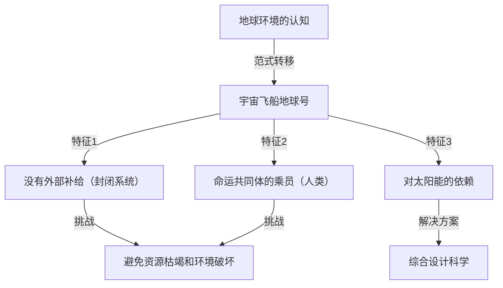
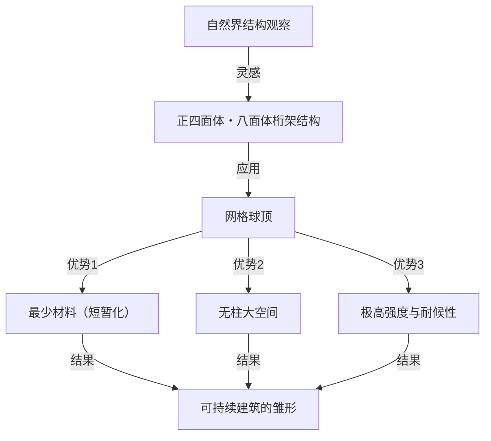

# 引言：过度超前的“综合预期设计科学”倡导者

理查德·巴克敏斯特·富勒（Richard Buckminster Fuller, 1895年 - 1983年）。听到这个名字，你会想到什么？有些人可能会想起由正三角形组成的半球形优美建筑“网格球顶（Geodesic Dome）”。另一些人可能会联想到“宇宙飞船地球号（Spaceship Earth）”这个引人注目而又深奥的概念，它可以说是现代SDGs和可持续发展理念的源头。

富勒不仅是一位建筑师，也不仅是一位思想家。他自称“综合预期设计科学的探索者”，是一位横跨数学、工程、建筑、哲学和环境学等众多领域，不断为人类在地球上生存寻找“最优解”的人物。

在本文中，我们将追寻富勒波澜壮阔的一生，尽可能深入、详细地探讨他留下的众多划时代的发明，以及在现代社会中日益重要的思想遗产。

## 1. 挫折与觉醒：密歇根湖畔的决心

巴克敏斯特·富勒的人生并非只被辉煌的成功所点缀。相反，他思想的起点在于跌入谷底的挫折与绝望之中。

1895年，富勒出生于马萨诸塞州米尔顿，从小就对自然法则和几何学表现出浓厚的兴趣。然而，他无法适应权威主义的教育体系，曾两次被哈佛大学开除（第一次是因为在社交俱乐部挥霍无度，第二次是因为“不负责任和缺乏兴趣”）。

在第一次世界大战期间服役于海军后，他结了婚并踏入商界，但他创立的建筑材料公司在1927年破产了。富勒失去了所有财产，社会信誉也一落千丈。更糟糕的是，他心爱的长女亚历山德拉因小儿麻痹症和脑膜炎并发症不幸夭折，让他遭受了难以承受的悲痛。富勒认为当时的恶劣居住环境是导致女儿死亡的原因之一，陷入了深深的自责之中。

1927年的冬天，32岁的富勒站在密歇根湖畔，认真考虑过投水自杀。“像我这样的失败者，不应该再给家人添麻烦了。”就在他万念俱灰的时刻，据说他经历了一次神秘的体验。

他获得了一种强烈的直觉，即自己并不属于“个人”，而是属于“宇宙”。于是，他决定开启一场耗尽一生的宏大“实验”：“如果我不再为自己而活，而是把我所有的能力奉献给全人类的幸福，那会发生什么？”这就是后来的伟大发明家巴克敏斯特·富勒诞生的瞬间。

## 2. 宇宙飞船地球号（Spaceship Earth）的范式

在富勒的众多概念中，最著名的、也是对现代产生持续而深远影响的，就是“宇宙飞船地球号（Spaceship Earth）”的理念。

这个概念通过他在1968年撰写的《宇宙飞船地球号操作手册（Operating Manual for Spaceship Earth）》而被广泛认知。富勒将地球比作一艘“以每小时约10万公里的极快速度在太空中飞行的巨大宇宙飞船”。

### 一艘没有操作手册的宇宙飞船

富勒这样指出：“这艘宇宙飞船只有一个奇怪的地方。那就是它没有附带操作手册。”
长久以来，人类在完全不了解这艘飞船的结构、生命维持系统（生态系统）和能量循环系统的情况下，不知不觉地扮演着“乘客”的角色。然而，随着人口的爆炸性增长以及工业革命以来化石燃料的大量消耗，宇宙飞船的资源（储备）正在迅速枯竭。

富勒认为，人类再也不被允许做不负责任的“乘客”，必须成为运用自身知识和技术来维护与管理飞船的“乘员（Crew）”。这一思想后来发展成了“可持续性（Sustainability）”和“循环型社会”等概念，并成为当今SDGs底层的哲学根基。

### 化石燃料的极限与向可再生能源的转变

他将消耗化石燃料的行为称为“吃掉宇宙飞船的电池（存款）”，并发出强烈警告。他认为化石燃料是历经数亿年时间将太阳能储存在地球上的“宇宙飞船应急电池”，如果将其作为日常动力消耗殆尽，将导致宇宙飞船出现致命的功能障碍。

取而代之的是，他提倡过渡到一个仅依靠风能、潮汐能、太阳能等“当前来自宇宙的收入（实时能源）”来运作社会的系统。在今天被大声疾呼的可再生能源的重要性，他在半个多世纪前就已完全预见了。

## 3. 短暂化（Ephemeralization）：“少费多用”

作为维持宇宙飞船地球号不可或缺的概念，富勒提出了“短暂化（Ephemeralization）”。这在日语中有时被译为“短命化”或“稀薄化”，但在富勒的语境中，它的意思是“用更少的资源、能量和时间，创造更多的功能和财富（Doing more with less）”。

### 技术进化的必然过程

短暂化是技术进化的根本过程。让我们用一个身边的例子来思考。过去，为了保存和计算全球的信息，需要一个有体育馆那么大的巨型真空管计算机。但现在，我们把性能远超于它的计算机作为“智能手机”装在口袋里随身携带。
尽管材料减少了，重量变轻了，耗电量也大幅下降，但功能却出现了爆炸式的提升。这就是短暂化。

富勒相信，通过将这一过程应用于所有产业、建筑和基础设施，即使地球上的资源有限，也有可能大幅提高全人类的生活水平。“贫困和资源枯竭不是宇宙飞船的缺陷，而是我们设计的缺陷”，这就是他的主张。

## 4. 网格球顶：几何学与建筑的奇迹

在建筑领域最完美地体现了短暂化哲学的，就是可以说是富勒代名词的“网格球顶（Geodesic Dome）”。

富勒深入观察了自然界的结构（例如肥皂泡、微生物的外壳、原子的排列等），并意识到自然界总是以“最小的能量和物质实现最大的强度”。因此，他发明了一种用正三角形网络分割球体，并沿着球面上的最短距离（大圆＝测地线）组装结构材料的方法。

### 极致的强度与轻盈

网格球顶的惊人之处如下：

1. **自支撑结构**: 内部完全不需要柱子，就可以覆盖广阔的空间。
2. **压倒性的轻盈**: 与传统的方形建筑相比，可以用极少的建筑材料建造。
3. **强韧的耐久性**: 对地震和强风（如飓风）具有极高的抵抗力。由于整个结构能分散外力，因此即使一部分损坏也能防止连锁坍塌。
4. **能源效率**: 因为表面积与体积的比例达到最大，所以冷暖气的能源效率极高。

1967年，作为蒙特利尔世博会的美国馆，一座巨大的球形展馆拔地而起，在全世界引起了轰动。此外，从雷达基地的保护罩、南极观测站，到户外音乐节的帐篷，据说全世界已经建造了超过30万个这种穹顶。

## 5. 协同效应（Synergy）：整体大于部分之和

贯穿富勒哲学的另一个重要概念是“协同效应（Synergy）”。协同效应是系统理论中的一个原理，指的是“整体的行为无法从构成它的各个部分的行为中预测出来”。

富勒认为，宇宙本身就具有协同效应。例如，将氢气（可燃气体）和氧气（助燃气体）结合，就会产生一种性质完全不同（灭火的液体）的物质“水”。无论你多么详细地分别研究氢气和氧气，都无法预测“水”的性质。这就是协同效应。

### 合作带来的人类潜能

富勒也将这一协同法则应用于人类社会。他主张，如果全人类能够在全球范围内合作并共享、整合资源与知识，而不是个人各自追求利益，就会产生一种与个人力量简单相加不在同一维度的、爆炸性的问题解决能力。
他所追求的“综合预期设计科学”，正是人类发挥协同效应的框架。

## 6. 戴马克松（Dymaxion）的概念

富勒的发明通常被冠以“戴马克松（Dymaxion）”一词。这是由一位对他思想印象深刻的公关人员将“Dynamic（动态）”、“Maximum（最大）”和“Tension（张力）”这三个词组合而成的造词。

### 戴马克松房屋与戴马克松汽车

富勒设计了“戴马克松房屋”作为未来的住宅。这是一种可以在工厂量产的铝制六角形住宅，可以通过直升机空运安装在世界任何地方，它能循环净化雨水，用风力发电，是完全脱离电网住宅的先驱。

此外，“戴马克松汽车”是一种将空气动力学追求到极致的水滴形三轮汽车。它虽然可以乘坐11人，但却拥有惊人的燃油经济性和灵活性（遗憾的是，由于试作阶段的事故等原因，未能实现商业化）。

### 戴马克松地图

更重要的发明是“戴马克松地图（Dymaxion Map）”。我们平时看到的墨卡托投影法等世界地图，越靠近南北极，形状和面积的扭曲就越严重。此外，它往往给人一种世界被“分割”的错觉。

富勒发明了一种将地球表面投影到正二十面体上，然后将其展开成平面的方法。通过这种方法，在将大陆形状和大小的扭曲降至最低的同时，在视觉上证明了所有大陆都是作为一个“巨大的岛屿（同一个世界的岛屿）”连接在一起的。这是一个消除国界这一武断界线、让人类认识到自己是一个命运共同体的强大思想工具。

## 7. 富勒的遗产：对现代社会与未来的追问

巴克敏斯特·富勒在1983年离开人世后，已经过去了几十年。他生前的一些思想有时被视为“白日梦”或“怪人的幻想”，但在21世纪的今天，他所发出的警告却带上了可怕的现实意义。

气候变化、资源枯竭、流行病以及不断的冲突。我们目前正面临着濒临功能失调的“宇宙飞船地球号”的严重危机。

然而，富勒绝不是一个悲观主义者。他一生都坚信，人类完全具备克服这些危机的智慧和技术。“是乌托邦，还是遗忘（毁灭）？（Utopia or Oblivion）”我们选择哪一个，取决于我们的“设计”。

### 富勒给现代我们的启示

我们今天应该从富勒那里学到什么？

1. **拥有综合的视角**: 在过度专业分工的现代，需要能够俯瞰全局并连接不同领域的“综合思维”。
2. **用设计的力量解决问题**: 不是通过政治对立或意识形态，而是通过合理且“短暂化”的技术与设计来解决物理问题。
3. **认识到人类是一体的**: 超越国界、种族、宗教的隔阂，作为宇宙飞船地球号的乘员开展合作。

巴克敏斯特·富勒的轨迹证明了希望：当一个人凭着坚强的意志和对全人类无私的爱而绞尽脑汁时，能给世界带来多大的冲击。他留下的无数想法和哲学，作为开创未来的指南针，至今依然闪耀着强大的光芒。

---
*Reference: The works and life of R. Buckminster Fuller, Operating Manual for Spaceship Earth.*
