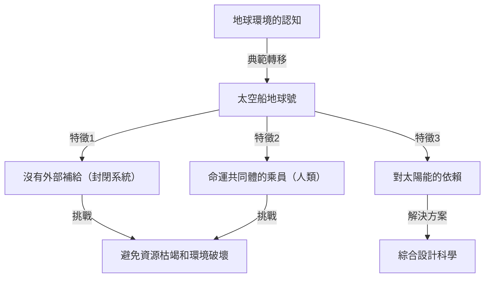
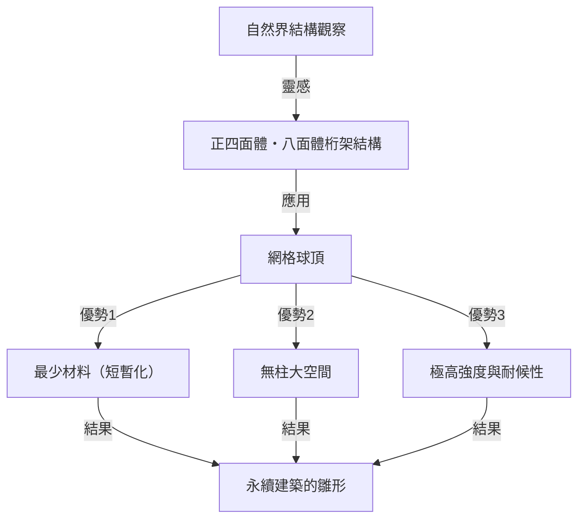

# 引言：過度超前的「綜合預期設計科學」倡導者

理查·巴克敏斯特·富勒（Richard Buckminster Fuller, 1895年 - 1983年）。聽到這個名字，你會想到什麼？有些人可能會想起由正三角形組成的半球形優美建築「網格球頂（Geodesic Dome）」。另一些人可能會聯想到「太空船地球號（Spaceship Earth）」這個引人注目而又深奧的概念，它可以說是現代SDGs和永續發展理念的源頭。

富勒不僅是一位建築師，也不僅是一位思想家。他自稱「綜合預期設計科學的探索者」，是一位橫跨數學、工程、建築、哲學和環境學等眾多領域，不斷為人類在地球上生存尋找「最佳解」的人物。

在本文中，我們將追尋富勒波瀾壯闊的一生，盡可能深入、詳細地探討他留下的眾多劃時代的發明，以及在現代社會中日益重要的思想遺產。

## 1. 挫折與覺醒：密西根湖畔的決心

巴克敏斯特·富勒的人生並非只被輝煌的成功所點綴。相反地，他思想的起點在於跌入谷底的挫折與絕望之中。

1895年，富勒出生於麻薩諸塞州米爾頓，從小就對自然法則和幾何學表現出濃厚的興趣。然而，他無法適應權威主義的教育體系，曾兩次被哈佛大學開除（第一次是因為在社交俱樂部揮霍無度，第二次是因為「不負責任和缺乏興趣」）。

在第一次世界大戰期間服役於海軍後，他結了婚並踏入商界，但他創立的建築材料公司在1927年破產了。富勒失去了所有財產，社會信譽也一落千丈。更糟糕的是，他心愛的長女亞歷山德拉因小兒麻痺症和腦膜炎併發症不幸夭折，讓他遭受了難以承受的悲痛。富勒認為當時的惡劣居住環境是導致女兒死亡的原因之一，陷入了深深的自責之中。

1927年的冬天，32歲的富勒站在密西根湖畔，認真考慮過投水自殺。「像我這樣的失敗者，不應該再給家人添麻煩了。」就在他萬念俱灰的時刻，據說他經歷了一次神祕的體驗。

他獲得了一種強烈的直覺，即自己並不屬於「個人」，而是屬於「宇宙」。於是，他決定開啟一場耗盡一生的宏大「實驗」：「如果我不再為自己而活，而是把我所有的能力奉獻給全人類的幸福，那會發生什麼？」這就是後來的偉大發明家巴克敏斯特·富勒誕生的瞬間。

## 2. 太空船地球號（Spaceship Earth）的典範

在富勒的眾多概念中，最著名的、也是對現代產生持續而深遠影響的，就是「太空船地球號（Spaceship Earth）」的理念。

這個概念透過他在1968年撰寫的《太空船地球號操作手冊（Operating Manual for Spaceship Earth）》而被廣泛認知。富勒將地球比作一艘「以每小時約10萬公里的極快速度在太空中飛行的巨大太空船」。

### 一艘沒有操作手冊的太空船

富勒這樣指出：「這艘太空船只有一個奇怪的地方。那就是它沒有附帶操作手冊。」
長久以來，人類在完全不了解這艘飛船的結構、生命維持系統（生態系統）和能量循環系統的情況下，不知不覺地扮演著「乘客」的角色。然而，隨著人口的爆炸性成長以及工業革命以來化石燃料的大量消耗，太空船的資源（儲備）正在迅速枯竭。

富勒認為，人類再也不被允許做不負責任的「乘客」，必須成為運用自身知識和技術來維護與管理飛船的「乘員（Crew）」。這一思想後來發展成了「永續性（Sustainability）」和「循環型社會」等概念，並成為當今SDGs底層的哲學根基。

### 化石燃料的極限與向再生能源的轉變

他將消耗化石燃料的行為稱為「吃掉太空船的電池（存款）」，並發出強烈警告。他認為化石燃料是歷經數億年時間將太陽能儲存在地球上的「太空船應急電池」，如果將其作為日常動力消耗殆盡，將導致太空船出現致命的功能障礙。

取而代之的是，他提倡過渡到一個僅依靠風能、潮汐能、太陽能等「當前來自宇宙的收入（即時能源）」來運作社會的系統。在今天被大聲疾呼的再生能源的重要性，他在半個多世紀前就已完全預見了。

## 3. 短暫化（Ephemeralization）：「少費多用」

作為維持太空船地球號不可或缺的概念，富勒提出了「短暫化（Ephemeralization）」。這在日語中有時被譯為「短命化」或「稀薄化」，但在富勒的語境中，它的意思是「用更少的資源、能量和時間，創造更多的功能和財富（Doing more with less）」。

### 技術進化的必然過程

短暫化是技術進化的根本過程。讓我們用一個身邊的例子來思考。過去，為了保存和計算全球的資訊，需要一個有體育館那麼大的巨型真空管電腦。但現在，我們把性能遠超於它的電腦作為「智慧型手機」裝在口袋裡隨身攜帶。
儘管材料減少了，重量變輕了，耗電量也大幅下降，但功能卻出現了爆炸性的提升。這就是短暫化。

富勒相信，透過將這一過程應用於所有產業、建築和基礎設施，即使地球上的資源有限，也有可能大幅提高全人類的生活水準。「貧困和資源枯竭不是太空船的缺陷，而是我們設計的缺陷」，這就是他的主張。

## 4. 網格球頂：幾何學與建築的奇蹟

在建築領域最完美地體現了短暫化哲學的，就是可以說是富勒代名詞的「網格球頂（Geodesic Dome）」。

富勒深入觀察了自然界的結構（例如肥皂泡、微生物的外殼、原子的排列等），並意識到自然界總是以「最小的能量和物質實現最大的強度」。因此，他發明了一種用正三角形網絡分割球體，並沿著球面上的最短距離（大圓＝測地線）組裝結構材料的方法。

### 極致的強度與輕盈

網格球頂的驚人之處如下：

1. **自支撐結構**: 內部完全不需要柱子，就可以覆蓋廣闊的空間。
2. **壓倒性的輕盈**: 與傳統的方形建築相比，可以用極少的建築材料建造。
3. **強韌的耐久性**: 對地震和強風（如颶風）具有極高的抵抗力。由於整個結構能分散外力，因此即使一部分損壞也能防止連鎖坍塌。
4. **能源效率**: 因為表面積與體積的比例達到最大，所以冷暖氣的能源效率極高。

1967年，作為蒙特婁世博會的美國館，一座巨大的球形展館拔地而起，在全世界引起了轟動。此外，從雷達基地的保護罩、南極觀測站，到戶外音樂節的帳篷，據說全世界已經建造了超過30萬個這種穹頂。

## 5. 綜效（Synergy）：整體大於部分之和

貫穿富勒哲學的另一個重要概念是「綜效（Synergy）」。綜效是系統理論中的一個原理，指的是「整體的行為無法從構成它的各個部分的行為中預測出來」。

富勒認為，宇宙本身就具有綜效。例如，將氫氣（可燃氣體）和氧氣（助燃氣體）結合，就會產生一種性質完全不同（滅火的液體）的物質「水」。無論你多麼詳細地分別研究氫氣和氧氣，都無法預測「水」的性質。這就是綜效。

### 合作帶來的人類潛能

富勒也將這一綜效法則應用於人類社會。他主張，如果全人類能夠在全球範圍內合作並共享、整合資源與知識，而不是個人各自追求利益，就會產生一種與個人力量簡單相加不在同一維度的、爆炸性的問題解決能力。
他所追求的「綜合預期設計科學」，正是人類發揮綜效的框架。

## 6. 戴馬克松（Dymaxion）的概念

富勒的發明通常被冠以「戴馬克松（Dymaxion）」一詞。這是由一位對他思想印象深刻的公關人員將「Dynamic（動態）」、「Maximum（最大）」和「Tension（張力）」這三個詞組合而成的造詞。

### 戴馬克松房屋與戴馬克松汽車

富勒設計了「戴馬克松房屋」作為未來的住宅。這是一種可以在工廠量產的鋁製六角形住宅，可以透過直升機空運安裝在世界任何地方，它能循環淨化雨水，用風力發電，是完全脫離電網住宅的先驅。

此外，「戴馬克松汽車」是一種將空氣動力學追求到極致的水滴形三輪汽車。它雖然可以乘坐11人，但卻擁有驚人的燃油經濟性和靈活性（遺憾的是，由於試作階段的事故等原因，未能實現商業化）。

### 戴馬克松地圖

更重要的發明是「戴馬克松地圖（Dymaxion Map）」。我們平時看到的麥卡托投影法等世界地圖，越靠近南北極，形狀和面積的扭曲就越嚴重。此外，它往往給人一種世界被「分割」的錯覺。

富勒發明了一種將地球表面投影到正二十面體上，然後將其展開成平面的方法。透過這種方法，在將大陸形狀和大小的扭曲降至最低的同時，在視覺上證明了所有大陸都是作為一個「巨大的島嶼（同一個世界的島嶼）」連接在一起的。這是一個消除國界這一武斷界線、讓人類認識到自己是一個命運共同體的強大思想工具。

## 7. 富勒的遺產：對現代社會與未來的追問

巴克敏斯特·富勒在1983年離開人世後，已經過去了幾十年。他生前的一些思想有時被視為「白日夢」或「怪人的幻想」，但在21世紀的今天，他所發出的警告卻帶上了可怕的現實意義。

氣候變遷、資源枯竭、流行病以及不斷的衝突。我們目前正面臨著瀕臨功能失調的「太空船地球號」的嚴重危機。

然而，富勒絕不是一個悲觀主義者。他一生都堅信，人類完全具備克服這些危機的智慧和技術。「是烏托邦，還是遺忘（毀滅）？（Utopia or Oblivion）」我們選擇哪一個，取決於我們的「設計」。

### 富勒給現代我們的啟示

我們今天應該從富勒那裡學到什麼？

1. **擁有綜合的視角**: 在過度專業分工的現代，需要能夠俯瞰全局並連接不同領域的「綜合思維」。
2. **用設計的力量解決問題**: 不是透過政治對立或意識形態，而是透過合理且「短暫化」的技術與設計來解決物理問題。
3. **認識到人類是一體的**: 超越國界、種族、宗教的隔閡，作為太空船地球號的乘員開展合作。

巴克敏斯特·富勒的軌跡證明了希望：當一個人憑著堅強的意志和對全人類無私的愛而絞盡腦汁時，能給世界帶來多大的衝擊。他留下的無數想法和哲學，作為開創未來的指南針，至今依然閃耀著強大的光芒。

---
*Reference: The works and life of R. Buckminster Fuller, Operating Manual for Spaceship Earth.*
