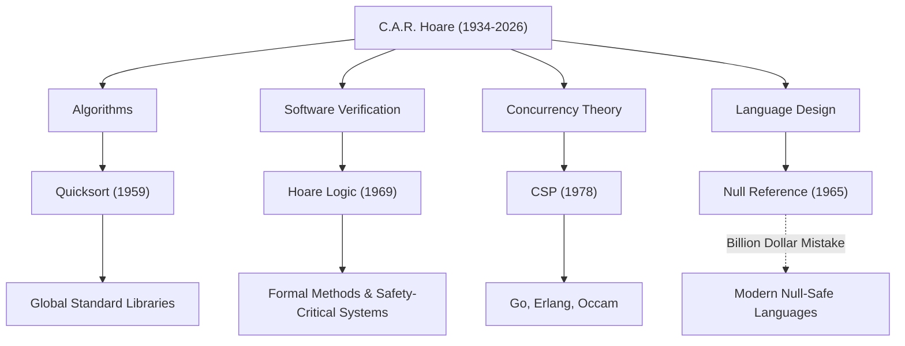

السير تشارلز أنتوني ريتشارد هور (المعروف باسم توني هور، 1934-2026) كان عالم حاسوب عظيم أرسى أسس هندسة البرمجيات الحديثة ولغات البرمجة. إنجازاته، التي تركها وراءه بعد وفاته في مارس 2026 عن عمر يناهز 92 عامًا، تبث الحياة في كل نظام نستخدمه بشكل يومي. في هذا المقال، نتعمق في حياته، وفلسفته الفريدة، والتأثير الذي لا يُقاس الذي أحدثه على الأجيال القادمة.

## من العلوم الإنسانية إلى المنطق الرياضي: خلفية فريدة

وُلد هور عام 1934 في كولومبو، سيلان البريطانية (سريلانكا الحالية)، وتخصص في الكلاسيكيات والفلسفة (Literae Humaniores) في كلية ميرتون، جامعة أكسفورد. هذه الخلفية الموجهة نحو العلوم الإنسانية، والتي تبدو للوهلة الأولى غير مرتبطة بعلوم الحاسوب، أصبحت مصدر فلسفته التي أكدت على "الدقة المنطقية" و"الجمال اللغوي" في أبحاثه اللاحقة.

مفتونًا بالمنطق الرياضي خلال سنوات دراسته الجامعية، درس الإحصاء لاحقًا وتعلم اللغة الروسية خلال خدمته العسكرية في البحرية الملكية. قادته هذه المعرفة باللغة الروسية إلى الدراسة في جامعة موسكو الحكومية والمشاركة في مشروع الترجمة الآلية، والذي كان بمثابة حافز لإنشاء واحدة من أشهر الخوارزميات في العالم.

## أربعة إنجازات عظيمة شكلت علوم الحاسوب

امتدت أبحاث هور إلى مجموعة واسعة جدًا من المجالات، من الخوارزميات إلى نظرية التزامن. فيما يلي مساهماته التمثيلية:

1. **الترتيب السريع (Quicksort, 1959)**
   خلال دراسته في جامعة موسكو الحكومية، تطلب مشروع الترجمة الآلية من الروسية إلى الإنجليزية ترتيب الكلمات أبجديًا للبحث في القاموس بسرعة. تم ابتكار "الترتيب السريع" في هذه العملية. هذه الخوارزمية العودية التي تستخدم طريقة فرق تسد تفتخر بعمر افتراضي مذهل وعملية، وتستمر في الاعتماد عليها في المكتبات القياسية في جميع أنحاء العالم حتى اليوم، بعد أكثر من نصف قرن من نشرها.

2. **منطق هور (Hoare Logic, 1969)**
   ردًا على السؤال، "هل يمكننا أن نثبت رياضيًا أن البرنامج يعمل بشكل صحيح؟"، اقترح هور الدلالات البديهية. "منطق هور"، الذي يثبت صحة البرنامج باستخدام الشروط المسبقة والشروط اللاحقة، فتح الطريق للقضاء على أخطاء البرامج من خلال الدقة الرياضية بدلاً من القواعد التجريبية. هذا هو السلف المباشر للطرق الرسمية (Formal Methods) اليوم والتقنيات التي تضمن سلامة الأنظمة الحيوية للمهام مثل الفضاء الجوي والمعدات الطبية.

3. **CSP (العمليات المتسلسلة المتواصلة، 1978)**
   كيف ينبغي صياغة الاتصالات المتشابكة المعقدة في نظام المعالجة المتزامنة حيث تعمل برامج متعددة في وقت واحد؟ "CSP"، الذي نشره هور، هو نظرية رياضية تصف بشكل موجز وصارم التفاعلات من خلال تمرير الرسائل بين العمليات. كان لهذا المفهوم لاحقًا تأثير عميق للغاية على تصميم لغات البرمجة المتزامنة مثل goroutines والقنوات في لغة Go، و Erlang، و Occam.

4. **خطأ المليار دولار (The Billion Dollar Mistake, 1965)**
   أثناء تصميم لغة ALGOL W، أدخل هور "المرجع الفارغ" (Null Reference)، والذي يشير إلى كائن غير موجود، ببساطة لأنه كان "سهل التنفيذ". في السنوات اللاحقة، اعترف علنًا واعتذر بشدة عن هذا باعتباره "خطأه الذي كلف مليار دولار". الأخطاء التي لا حصر لها، وأعطال النظام، ونقاط الضعف الأمنية التي تسبب فيها هذا Null لا يمكن قياسها. ومع ذلك، فإن تفكيره الصريح دعم بقوة السعي وراء أمان Null (Null Safety) في اللغات الآمنة الحديثة مثل Rust و Swift.

## رسم بياني لارتباط الإنجازات والتأثيرات

يوضح الرسم البياني أدناه كيف أتت مجالات بحث هور الرئيسية ثمارها في التكنولوجيا الحديثة.

## الفلسفة التي ارتقت بالبرمجة إلى "الرياضيات"

تكمن فلسفة هور الثابتة في الاعتقاد بأن "البرمجة يجب أن تستند إلى الانضباط الرياضي". في فجر البرمجة، كانت "حرفة" تعتمد على الحدس والخبرة أو التجربة والخطأ للمهندسين. ومع ذلك، جادل هور باستمرار بأن سلوك البرنامج يجب استنتاجه وإثباته بدقة تمامًا مثل الصيغة الرياضية.

لقد وضع "البساطة" و"الأناقة" كأعلى القيم في تصميم البرمجيات. من أقواله الشهيرة:

> "هناك طريقتان لبناء تصميم برمجي: إحداهما هي جعله بسيطًا جدًا بحيث لا توجد فيه أي عيوب واضحة، والأخرى هي جعله معقدًا جدًا بحيث لا توجد عيوب واضحة. الطريقة الأولى أكثر صعوبة بكثير."

تتنبأ هذه الكلمات بشكل ملحوظ بالوضع الحالي حيث تبحث هندسة الخدمات المصغرة والبرمجة الوظيفية مرة أخرى عن "البساطة" في تطوير البرمجيات الحديث المعقد بشكل متزايد.

## جسر من الأوساط الأكاديمية إلى الصناعة

بعد مسيرة أكاديمية طويلة في جامعة أكسفورد، انضم هور إلى Microsoft Research في كامبريدج كباحث رئيسي أول بعد تقاعده في عام 1999. حتى بعد وصوله إلى قمة العالم الأكاديمي، واصل بحثه لمواجهة تعقيدات تطوير البرمجيات في العالم الحقيقي في الصناعة ولدمج الأساليب الرسمية في الأدوات الصناعية الفعلية.

فاز بـ "جائزة تورنغ"، والتي يشار إليها غالبًا باسم جائزة نوبل في علوم الحاسوب، في عام 1980، ومنحته الملكة إليزابيث لقب فارس في عام 2000، وحصل على عدد لا يحصى من الأوسمة طوال حياته. ومع ذلك، فقد ظل هو نفسه متواضعًا باستمرار، ولم يعتذر عن نقل إخفاقاته (مثل المرجع الفارغ) كدروس للأجيال الشابة.

## إرث للأجيال القادمة

قد تشير وفاة توني هور إلى نهاية حقبة عظيمة في علوم الحاسوب. ومع ذلك، فإن البذور التي زرعها قد نمت بالفعل بشكل كبير.

وراء حقيقة أنه يمكننا تشغيل التطبيقات على هواتفنا الذكية بشكل مريح تكمن المعالجة عالية السرعة للبيانات بواسطة Quicksort. وراء حقيقة أن البنية التحتية السحابية يمكنها التعامل مع عشرات الآلاف من الطلبات في وقت واحد تكمن بنية المعالجة المتزامنة التي ورثت مفهوم CSP. ووراء حقيقة أن الطائرات والسيارات ذاتية القيادة التي نركبها تعمل بأمان تكمن تقنية إثبات صحة البرنامج المطورة من منطق هور.

لم يترك لنا السير توني هور تقنية كتابة التعليمات البرمجية فحسب، بل ترك لنا إجابة على السؤال الأساسي حول "ما يجب أن تكون عليه البرامج". سيستمر إرثه الفكري بلا شك في دعم أساس مجتمعنا الرقمي كدليل للمهندسين في جميع أنحاء العالم.
