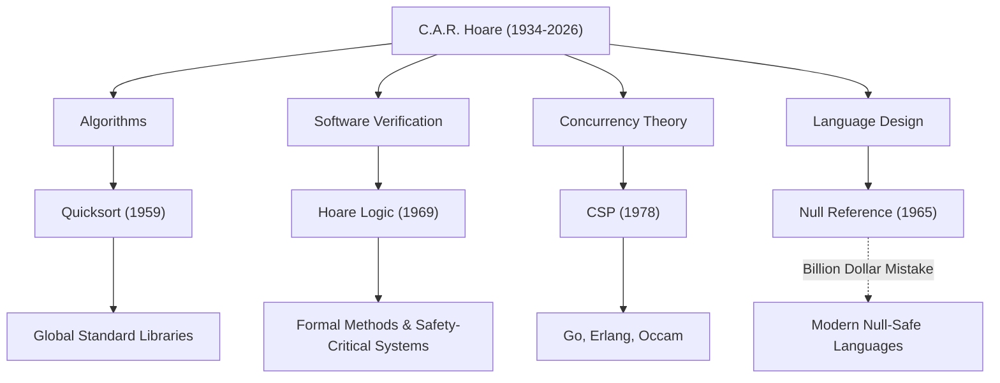

Sir Charles Antony Richard Hoare (allgemein bekannt als Tony Hoare, 1934–2026) war ein großer Informatiker, der die Grundlagen des modernen Software-Engineerings und der Programmiersprachen legte. Seine Errungenschaften, die er nach seinem Tod im März 2026 im Alter von 92 Jahren hinterließ, hauchen jedem System, das wir täglich nutzen, Leben ein. In diesem Artikel befassen wir uns eingehend mit seinem Leben, seiner einzigartigen Philosophie und dem unermesslichen Einfluss, den er auf zukünftige Generationen hatte.

## Von den Geisteswissenschaften zur mathematischen Logik: Ein einzigartiger Hintergrund

Hoare wurde 1934 in Colombo in Britisch-Ceylon (heute Sri Lanka) geboren und studierte Klassische Altertumswissenschaft und Philosophie (Literae Humaniores) am Merton College der Universität Oxford. Dieser geisteswissenschaftlich geprägte Hintergrund, der auf den ersten Blick nichts mit Informatik zu tun zu haben scheint, wurde zur Quelle seiner Philosophie, die in seinen späteren Forschungen „logische Strenge“ und „sprachliche Schönheit“ betonte.

Während seines Studiums faszinierte ihn die mathematische Logik, später studierte er Statistik und lernte während seines Militärdienstes bei der Royal Navy Russisch. Diese Russischkenntnisse führten ihn zu einem Studium an der Staatlichen Universität Moskau und zu seiner Teilnahme an einem maschinellen Übersetzungsprojekt, was als Katalysator für die Schaffung eines der berühmtesten Algorithmen der Welt diente.

## Vier große Errungenschaften, die die Informatik prägten

Hoares Forschungen erstreckten sich über ein sehr breites Spektrum, von Algorithmen bis zur Theorie der Nebenläufigkeit. Die folgenden sind seine repräsentativsten Beiträge:

1. **Quicksort (1959)**
   Während seines Auslandsstudiums an der Staatlichen Universität Moskau erforderte ein maschinelles Übersetzungsprojekt vom Russischen ins Englische, dass Wörter alphabetisch sortiert wurden, um ein Wörterbuch schnell durchsuchen zu können. Dabei entstand „Quicksort“. Dieser rekursive Algorithmus, der die Teile-und-herrsche-Methode verwendet, zeichnet sich durch eine erstaunliche Lebensdauer und Praktikabilität aus und wird auch heute noch, mehr als ein halbes Jahrhundert nach seiner Veröffentlichung, in Standardbibliotheken weltweit verwendet.

2. **Hoare-Kalkül (Hoare Logic, 1969)**
   Als Antwort auf die Frage „Können wir mathematisch beweisen, dass ein Programm korrekt funktioniert?“, schlug Hoare die axiomatische Semantik vor. Der „Hoare-Kalkül“, der die Korrektheit eines Programms anhand von Vorbedingungen und Nachbedingungen beweist, ebnete den Weg, Softwarefehler nicht durch Faustregeln, sondern durch mathematische Strenge zu beseitigen. Dies ist der direkte Vorfahre der heutigen Formalen Methoden (Formal Methods) und der Technologien, die die Sicherheit von unternehmenskritischen Systemen wie Luft- und Raumfahrt- und medizinischen Geräten gewährleisten.

3. **CSP (Communicating Sequential Processes, 1978)**
   Wie sollten die komplex verwobenen Kommunikationen in einem nebenläufigen Verarbeitungssystem modelliert werden, in dem mehrere Programme gleichzeitig laufen? „CSP“, das von Hoare veröffentlicht wurde, ist eine mathematische Theorie, die die Interaktionen durch Nachrichtenübermittlung zwischen Prozessen präzise und streng beschreibt. Dieses Konzept hatte später einen extrem tiefgreifenden Einfluss auf den Entwurf nebenläufiger Programmiersprachen wie Gos Goroutinen und Channels, Erlang und Occam.

4. **Der Milliarden-Dollar-Fehler (The Billion Dollar Mistake, 1965)**
   Während des Entwurfs der Sprache ALGOL W führte Hoare die „Nullreferenz“ (Null Reference) ein, die auf ein nicht existierendes Objekt verweist, einfach weil sie „einfach zu implementieren“ war. In späteren Jahren gestand er dies öffentlich als seinen eigenen „Milliarden-Dollar-Fehler“ ein und entschuldigte sich zutiefst dafür. Die unzähligen Fehler, Systemabstürze und Sicherheitslücken, die durch dieses Null verursacht wurden, sind unermesslich. Seine offene Reflexion unterstützte jedoch stark das Streben nach Null-Sicherheit (Null Safety) in modernen sicheren Sprachen wie Rust und Swift.

## Korrelationsdiagramm von Errungenschaften und Auswirkungen

Das folgende Diagramm zeigt, wie Hoares wichtigste Forschungsbereiche in der modernen Technologie Früchte getragen haben.

## Die Philosophie, die das Programmieren zur „Mathematik“ erhob

Hoares konsequente Philosophie beruht auf der Überzeugung, dass „Programmieren auf mathematischer Disziplin basieren sollte“. In den Anfängen des Programmierens war es ein „Handwerk“, das sich auf Intuition, Erfahrung oder Versuch und Irrtum von Ingenieuren verließ. Hoare argumentierte jedoch beharrlich, dass das Verhalten eines Programms genau wie eine mathematische Formel streng deduziert und bewiesen werden sollte.

Er stellte „Einfachheit“ und „Eleganz“ als die höchsten Werte im Softwaredesign auf. Er sagte bekanntlich:

> „Es gibt zwei Methoden beim Entwurf von Software: Die eine besteht darin, ihn so einfach zu machen, dass es offensichtlich keine Mängel gibt, und die andere besteht darin, ihn so kompliziert zu machen, dass es keine offensichtlichen Mängel gibt. Die erste Methode ist weitaus schwieriger.“

Diese Worte sehen bemerkenswert genau die aktuelle Situation voraus, in der Microservice-Architekturen und funktionale Programmierung bei der modernen, zunehmend komplexen Softwareentwicklung wieder nach „Einfachheit“ suchen.

## Eine Brücke von der Wissenschaft zur Industrie

Nach einer langen akademischen Laufbahn an der Universität Oxford wechselte Hoare nach seiner Pensionierung 1999 als Senior Principal Researcher zu Microsoft Research in Cambridge. Selbst nachdem er den Höhepunkt der akademischen Welt erreicht hatte, setzte er seine Forschungen fort, um sich den Komplexitäten der realen Softwareentwicklung in der Industrie zu stellen und formale Methoden in tatsächliche industrielle Werkzeuge zu integrieren.

Er gewann 1980 den „Turing Award“, der oft als Nobelpreis der Informatik bezeichnet wird, und wurde im Jahr 2000 von Königin Elizabeth zum Ritter geschlagen (Sir). Im Laufe seines Lebens erhielt er unzählige Ehrungen. Er selbst blieb jedoch stets bescheiden und gab seine eigenen Fehler (wie die Null-Referenz) unumwunden als Lehre an jüngere Generationen weiter.

## Vermächtnis für zukünftige Generationen

Der Tod von Tony Hoare mag das Ende einer großen Ära der Informatik markieren. Die von ihm gepflanzten Samen sind jedoch bereits groß gewachsen.

Hinter der Tatsache, dass wir Apps auf unseren Smartphones bequem bedienen können, verbirgt sich die Hochgeschwindigkeits-Datenverarbeitung durch Quicksort. Hinter der Tatsache, dass Cloud-Infrastrukturen Zehntausende von Anfragen gleichzeitig bearbeiten können, verbirgt sich die nebenläufige Verarbeitungsarchitektur, die das Konzept von CSP geerbt hat. Und hinter der Tatsache, dass die Flugzeuge und selbstfahrenden Autos, mit denen wir fahren, sicher funktionieren, verbirgt sich die Technologie zum Beweis der Programmkorrektheit, die aus dem Hoare-Kalkül entwickelt wurde.

Sir Tony Hoare hat uns nicht nur die Technik des Codeschreibens hinterlassen, sondern auch eine Antwort auf die grundlegende Frage, „wie Software sein sollte“. Sein intellektuelles Vermächtnis wird zweifellos weiterhin das Fundament unserer digitalen Gesellschaft als Wegweiser für Ingenieure auf der ganzen Welt stützen.
