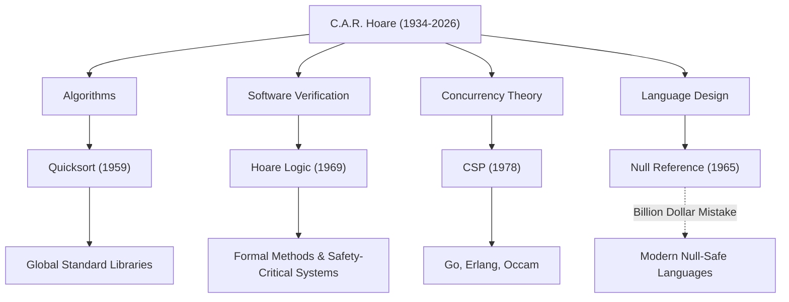

Sir Charles Antony Richard Hoare (commonly known as Tony Hoare, 1934–2026) was a great computer scientist who laid the foundations of modern software engineering and programming languages. His achievements, left behind after he passed away in March 2026 at the age of 92, breathe life into every system we use on a daily basis. In this article, we delve deeply into his life, his unique philosophy, and the immeasurable impact he had on future generations.

## From Humanities to Mathematical Logic: A Unique Background

Born in 1934 in Colombo, British Ceylon (now Sri Lanka), Hoare majored in Classics and Philosophy (Literae Humaniores) at Merton College, Oxford University. This humanities-oriented background, which at first glance seems unrelated to computer science, became the source of his philosophy that emphasized "logical rigor" and "linguistic beauty" in his later research.

Fascinated by mathematical logic during his undergraduate years, he later studied statistics and learned Russian during his military service in the Royal Navy. This knowledge of Russian led to his study at Moscow State University and his participation in a machine translation project, which served as the catalyst for the creation of one of the world's most famous algorithms.

## Four Great Achievements That Shaped Computer Science

Hoare's research spanned a very wide range of areas, from algorithms to the theory of concurrency. The following are his representative contributions:

1. **Quicksort (1959)**
   During his study abroad at Moscow State University, a machine translation project from Russian to English required sorting words alphabetically to search a dictionary quickly. "Quicksort" was devised in this process. This recursive algorithm using the divide-and-conquer method boasts an astonishing lifespan and practicality, continuing to be adopted in standard libraries worldwide even today, more than half a century after its publication.

2. **Hoare Logic (1969)**
   In response to the question, "Can we mathematically prove that a program works correctly?", Hoare proposed Axiomatic Semantics. "Hoare Logic," which proves the correctness of a program using preconditions and postconditions, opened the way to eliminating software bugs through mathematical rigor rather than rules of thumb. This is the direct ancestor of today's Formal Methods and the technologies that ensure the safety of mission-critical systems such as aerospace and medical equipment.

3. **CSP (Communicating Sequential Processes, 1978)**
   How should the complexly intertwined communications be modeled in a concurrent processing system where multiple programs run simultaneously? "CSP," published by Hoare, is a mathematical theory that concisely and rigorously describes the interactions through message passing between processes. This concept later had an extremely profound impact on the design of concurrent programming languages such as Go's goroutines and channels, Erlang, and Occam.

4. **The Billion Dollar Mistake (1965)**
   During the design of the ALGOL W language, Hoare introduced the "Null Reference," which points to a non-existent object, simply because it was "easy to implement." In later years, he publicly acknowledged and deeply apologized for this as his own "billion-dollar mistake." The countless bugs, system crashes, and security vulnerabilities caused by this Null are immeasurable. However, his candid reflection strongly backed the pursuit of Null Safety in modern safe languages like Rust and Swift.

## Correlation Diagram of Achievements and Impacts

The diagram below shows how Hoare's main research areas have come to fruition in modern technology.

## The Philosophy That Elevated Programming to "Mathematics"

Hoare's consistent philosophy lies in the belief that "programming should be based on mathematical discipline." In the dawn of programming, it was a "craft" that relied on the intuition, experience, or trial and error of engineers. However, Hoare persistently argued that a program's behavior should be rigorously deduced and proven just like a mathematical formula.

He placed "simplicity" and "elegance" as the highest values in software design. He famously said:

> "There are two ways of constructing a software design: One way is to make it so simple that there are obviously no deficiencies, and the other way is to make it so complicated that there are no obvious deficiencies. The first method is far more difficult."

These words remarkably foresee the current situation where microservice architectures and functional programming are once again seeking "simplicity" in modern, increasingly complex software development.

## A Bridge from Academia to Industry

After a long academic career at Oxford University, Hoare joined Microsoft Research in Cambridge as a Senior Principal Researcher upon his retirement in 1999. Even after reaching the pinnacle of the academic world, he continued his research to face the complexities of real-world software development in the industry and to integrate formal methods into actual industrial tools.

He won the "Turing Award," often referred to as the Nobel Prize of computer science, in 1980, and was knighted by Queen Elizabeth in 2000, receiving countless honors throughout his life. However, he himself remained constantly humble, unapologetically passing on his own failures (such as the Null reference) as lessons for younger generations.

## Legacy for Future Generations

The death of Tony Hoare may mark the end of a great era in computer science. However, the seeds he planted have already grown large.

Behind the fact that we can comfortably operate apps on our smartphones is the high-speed data processing by Quicksort. Behind the fact that cloud infrastructure can handle tens of thousands of requests simultaneously is the concurrent processing architecture that inherited the concept of CSP. And behind the fact that the airplanes and self-driving cars we ride operate safely is the program correctness proving technology developed from Hoare Logic.

Sir Tony Hoare left us not just the technique of writing code, but an answer to the fundamental question of "what software should be." His intellectual legacy will undoubtedly continue to support the foundation of our digital society as a guidepost for engineers around the world.
