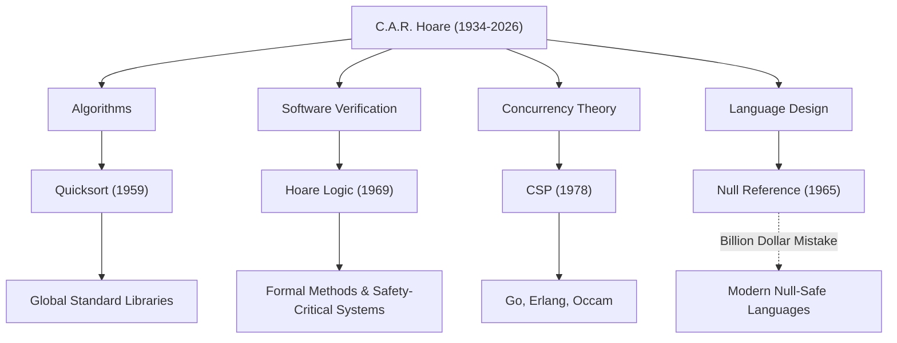

Sir Charles Antony Richard Hoare (comúnmente conocido como Tony Hoare, 1934–2026) fue un gran científico de la computación que sentó las bases de la ingeniería de software moderna y los lenguajes de programación. Sus logros, dejados tras su fallecimiento en marzo de 2026 a la edad de 92 años, dan vida a cada sistema que usamos a diario. En este artículo, profundizamos en su vida, su filosofía única y el impacto inconmensurable que tuvo en las generaciones futuras.

## De las Humanidades a la Lógica Matemática: Una Trayectoria Única

Nacido en 1934 en Colombo, Ceilán Británico (hoy Sri Lanka), Hoare se especializó en Estudios Clásicos y Filosofía (Literae Humaniores) en el Merton College de la Universidad de Oxford. Esta base humanística, que a primera vista parece ajena a la informática, se convirtió en la fuente de su filosofía que enfatizaba el "rigor lógico" y la "belleza lingüística" en sus investigaciones posteriores.

Fascinado por la lógica matemática durante sus años de pregrado, luego estudió estadística y aprendió ruso durante su servicio militar en la Marina Real Británica. Este conocimiento del ruso lo llevó a estudiar en la Universidad Estatal de Moscú y a participar en un proyecto de traducción automática, lo que sirvió como catalizador para la creación de uno de los algoritmos más famosos del mundo.

## Cuatro Grandes Logros que Dieron Forma a la Informática

La investigación de Hoare abarcó una amplia gama de áreas, desde algoritmos hasta la teoría de la concurrencia. A continuación se presentan sus contribuciones más representativas:

1. **Quicksort (1959)**
   Durante sus estudios en la Universidad Estatal de Moscú, un proyecto de traducción automática del ruso al inglés requería ordenar palabras alfabéticamente para buscar en un diccionario rápidamente. "Quicksort" fue ideado en este proceso. Este algoritmo recursivo que utiliza el método de divide y vencerás cuenta con una vida útil y una practicidad asombrosas, y se sigue adoptando en bibliotecas estándar de todo el mundo incluso hoy en día, más de medio siglo después de su publicación.

2. **Lógica de Hoare (1969)**
   En respuesta a la pregunta "¿Podemos probar matemáticamente que un programa funciona correctamente?", Hoare propuso la Semántica Axiomática. La "Lógica de Hoare", que prueba la corrección de un programa utilizando precondiciones y postcondiciones, abrió el camino para eliminar errores de software a través del rigor matemático en lugar de reglas empíricas. Este es el antepasado directo de los Métodos Formales actuales y de las tecnologías que garantizan la seguridad de los sistemas de misión crítica, como la tecnología aeroespacial y los equipos médicos.

3. **CSP (Communicating Sequential Processes, 1978)**
   ¿Cómo deberían modelarse las comunicaciones intrincadas en un sistema de procesamiento concurrente donde se ejecutan múltiples programas simultáneamente? "CSP", publicado por Hoare, es una teoría matemática que describe de manera concisa y rigurosa las interacciones a través del paso de mensajes entre procesos. Este concepto tuvo más tarde un impacto extremadamente profundo en el diseño de lenguajes de programación concurrente, como las goroutines y canales de Go, Erlang y Occam.

4. **El Error de los Mil Millones de Dólares (1965)**
   Durante el diseño del lenguaje ALGOL W, Hoare introdujo la "Referencia Nula" (Null Reference), que apunta a un objeto inexistente, simplemente porque era "fácil de implementar". En años posteriores, reconoció públicamente y se disculpó profundamente por esto como su "error de mil millones de dólares". Los innumerables errores, fallas del sistema y vulnerabilidades de seguridad causados por este Null son incalculables. Sin embargo, su sincera reflexión respaldó firmemente la búsqueda de la Seguridad Nula (Null Safety) en los lenguajes seguros modernos como Rust y Swift.

## Diagrama de Correlación de Logros e Impactos

El siguiente diagrama muestra cómo las principales áreas de investigación de Hoare han dado sus frutos en la tecnología moderna.

## La Filosofía que Elevó la Programación a "Matemáticas"

La filosofía constante de Hoare radica en la creencia de que "la programación debe basarse en la disciplina matemática". En los albores de la programación, era un "oficio" que dependía de la intuición, la experiencia o el ensayo y error de los ingenieros. Sin embargo, Hoare argumentó persistentemente que el comportamiento de un programa debe ser deducido y probado rigurosamente, al igual que una fórmula matemática.

Situó la "simplicidad" y la "elegancia" como los valores más altos en el diseño de software. Se le conoce por su famosa cita:

> "Hay dos maneras de construir el diseño de un software: Una es hacerlo tan simple que obviamente no haya deficiencias, y la otra es hacerlo tan complicado que no haya deficiencias obvias. El primer método es mucho más difícil".

Estas palabras prevén notablemente la situación actual donde las arquitecturas de microservicios y la programación funcional buscan nuevamente la "simplicidad" en el desarrollo de software moderno y cada vez más complejo.

## Un Puente de la Academia a la Industria

Después de una larga carrera académica en la Universidad de Oxford, Hoare se unió a Microsoft Research en Cambridge como Investigador Principal Senior tras su jubilación en 1999. Incluso después de alcanzar la cima del mundo académico, continuó su investigación para enfrentar las complejidades del desarrollo de software del mundo real en la industria y para integrar los métodos formales en las herramientas industriales reales.

Ganó el "Premio Turing", a menudo conocido como el Premio Nobel de la informática, en 1980, y fue nombrado Caballero por la Reina Isabel en 2000, recibiendo innumerables honores a lo largo de su vida. Sin embargo, él mismo siempre se mantuvo humilde, transmitiendo sin disculpas sus propios fracasos (como la referencia Nula) como lecciones para las generaciones más jóvenes.

## Legado para las Generaciones Futuras

La muerte de Tony Hoare puede marcar el fin de una gran era en la informática. Sin embargo, las semillas que plantó ya han crecido mucho.

Detrás del hecho de que podemos operar aplicaciones cómodamente en nuestros teléfonos inteligentes está el procesamiento de datos de alta velocidad por Quicksort. Detrás del hecho de que la infraestructura en la nube puede manejar decenas de miles de solicitudes simultáneamente está la arquitectura de procesamiento concurrente que heredó el concepto de CSP. Y detrás del hecho de que los aviones y los automóviles autónomos en los que viajamos operan de manera segura está la tecnología de prueba de corrección de programas desarrollada a partir de la Lógica de Hoare.

Sir Tony Hoare nos dejó no solo la técnica de escribir código, sino una respuesta a la pregunta fundamental de "qué debería ser el software". Su legado intelectual sin duda continuará apoyando los cimientos de nuestra sociedad digital como un hito para los ingenieros de todo el mundo.
