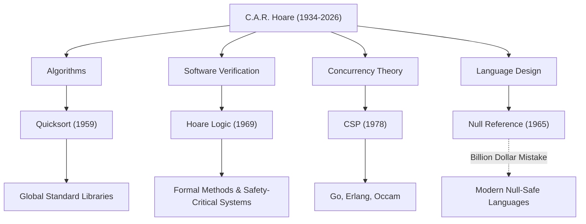

Sir Charles Antony Richard Hoare (communément appelé Tony Hoare, 1934–2026) était un grand informaticien qui a jeté les bases du génie logiciel moderne et des langages de programmation. Ses réalisations, laissées derrière lui après son décès en mars 2026 à l'âge de 92 ans, insufflent la vie à chaque système que nous utilisons au quotidien. Dans cet article, nous plongeons profondément dans sa vie, sa philosophie unique et l'impact incommensurable qu'il a eu sur les générations futures.

## Des Sciences Humaines à la Logique Mathématique : Un Parcours Atypique

Né en 1934 à Colombo, au Ceylan britannique (aujourd'hui Sri Lanka), Hoare s'est spécialisé en Lettres Classiques et Philosophie (Literae Humaniores) au Merton College de l'Université d'Oxford. Cette formation axée sur les sciences humaines, qui semble à première vue sans rapport avec l'informatique, est devenue la source de sa philosophie qui mettait l'accent sur la "rigueur logique" et la "beauté linguistique" dans ses recherches ultérieures.

Fasciné par la logique mathématique pendant ses années de licence, il a ensuite étudié les statistiques et appris le russe pendant son service militaire dans la Royal Navy. Cette connaissance du russe l'a conduit à étudier à l'Université d'État de Moscou et à participer à un projet de traduction automatique, ce qui a servi de catalyseur à la création de l'un des algorithmes les plus célèbres au monde.

## Quatre Grandes Réalisations qui ont Façonné l'Informatique

Les recherches de Hoare ont couvert un très large éventail de domaines, des algorithmes à la théorie de la concurrence. Voici ses contributions représentatives :

1. **Quicksort (Tri Rapide, 1959)**
   Pendant ses études à l'Université d'État de Moscou, un projet de traduction automatique du russe vers l'anglais nécessitait de trier les mots par ordre alphabétique pour rechercher rapidement dans un dictionnaire. "Quicksort" a été conçu au cours de ce processus. Cet algorithme récursif utilisant la méthode "diviser pour régner" bénéficie d'une durée de vie et d'une praticité étonnantes, continuant à être adopté dans les bibliothèques standard du monde entier même aujourd'hui, plus d'un demi-siècle après sa publication.

2. **Logique de Hoare (1969)**
   En réponse à la question "Pouvons-nous prouver mathématiquement qu'un programme fonctionne correctement ?", Hoare a proposé la Sémantique Axiomatique. La "Logique de Hoare", qui prouve l'exactitude d'un programme en utilisant des préconditions et des postconditions, a ouvert la voie à l'élimination des bugs logiciels grâce à la rigueur mathématique plutôt qu'à des règles empiriques. C'est l'ancêtre direct des Méthodes Formelles (Formal Methods) actuelles et des technologies qui assurent la sécurité des systèmes critiques tels que l'aérospatiale et l'équipement médical.

3. **CSP (Communicating Sequential Processes, 1978)**
   Comment modéliser les communications complexes et entremêlées dans un système de traitement simultané où plusieurs programmes s'exécutent en même temps ? "CSP", publié par Hoare, est une théorie mathématique qui décrit de manière concise et rigoureuse les interactions par passage de messages entre les processus. Ce concept a par la suite eu un impact extrêmement profond sur la conception des langages de programmation concurrente tels que les goroutines et les canaux de Go, Erlang et Occam.

4. **L'Erreur à un Milliard de Dollars (The Billion Dollar Mistake, 1965)**
   Lors de la conception du langage ALGOL W, Hoare a introduit la "Référence Nulle" (Null Reference), qui pointe vers un objet inexistant, simplement parce que c'était "facile à implémenter". Dans les années qui ont suivi, il a publiquement reconnu et s'est profondément excusé pour cela comme étant sa propre "erreur à un milliard de dollars". Les innombrables bugs, pannes de système et vulnérabilités de sécurité causés par ce Null sont incalculables. Cependant, sa réflexion candide a fortement soutenu la quête de la Sécurité Nulle (Null Safety) dans les langages sûrs modernes comme Rust et Swift.

## Diagramme de Corrélation des Réalisations et Impacts

Le diagramme ci-dessous montre comment les principaux domaines de recherche de Hoare ont porté leurs fruits dans la technologie moderne.

## La Philosophie qui a Élevé la Programmation aux "Mathématiques"

La philosophie constante de Hoare repose sur la conviction que "la programmation doit être basée sur une discipline mathématique". À l'aube de la programmation, c'était un "artisanat" qui reposait sur l'intuition, l'expérience ou les essais et erreurs des ingénieurs. Cependant, Hoare a soutenu avec persistance que le comportement d'un programme devait être rigoureusement déduit et prouvé tout comme une formule mathématique.

Il a placé la "simplicité" et l'"élégance" comme les valeurs les plus élevées de la conception logicielle. Il a d'ailleurs prononcé cette phrase célèbre :

> "Il y a deux façons de concevoir un logiciel : la première est de le rendre si simple qu'il n'y a manifestement aucune lacune, et la seconde est de le rendre si compliqué qu'il n'y a pas de lacunes évidentes. La première méthode est beaucoup plus difficile."

Ces mots anticipent remarquablement la situation actuelle où les architectures de microservices et la programmation fonctionnelle recherchent à nouveau la "simplicité" dans le développement de logiciels modernes et de plus en plus complexes.

## Un Pont entre le Milieu Académique et l'Industrie

Après une longue carrière universitaire à l'Université d'Oxford, Hoare a rejoint Microsoft Research à Cambridge en tant que Chercheur Principal Senior lors de sa retraite en 1999. Même après avoir atteint le sommet du monde académique, il a continué ses recherches pour faire face aux complexités du développement de logiciels du monde réel dans l'industrie et pour intégrer les méthodes formelles dans les outils industriels réels.

Il a remporté le "Prix Turing", souvent qualifié de Prix Nobel de l'informatique, en 1980, et a été fait Chevalier par la Reine Elizabeth en 2000, recevant d'innombrables honneurs tout au long de sa vie. Cependant, il est toujours resté humble, transmettant sans excuse ses propres échecs (comme la référence Nulle) comme leçons pour les jeunes générations.

## Héritage pour les Générations Futures

La mort de Tony Hoare pourrait marquer la fin d'une grande époque de l'informatique. Cependant, les graines qu'il a semées ont déjà beaucoup grandi.

Derrière le fait que nous puissions utiliser confortablement des applications sur nos smartphones se cache le traitement de données à grande vitesse par Quicksort. Derrière le fait que l'infrastructure cloud puisse gérer des dizaines de milliers de requêtes simultanément se cache l'architecture de traitement simultané qui a hérité du concept de CSP. Et derrière le fait que les avions et les voitures autonomes dans lesquels nous circulons fonctionnent de manière sûre se cache la technologie de preuve de correction de programme développée à partir de la Logique de Hoare.

Sir Tony Hoare ne nous a pas seulement laissé la technique d'écriture de code, mais une réponse à la question fondamentale de "ce que devrait être le logiciel". Son héritage intellectuel continuera sans aucun doute à soutenir les fondements de notre société numérique en tant que guide pour les ingénieurs du monde entier.
