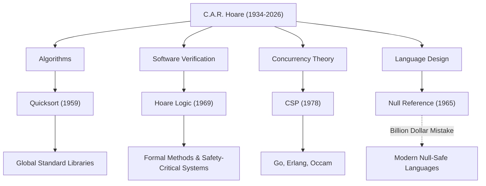

सर चार्ल्स एंटनी रिचर्ड होरे (आमतौर पर टोनी होरे, 1934-2026 के रूप में जाने जाते हैं) एक महान कंप्यूटर वैज्ञानिक थे जिन्होंने आधुनिक सॉफ्टवेयर इंजीनियरिंग और प्रोग्रामिंग भाषाओं की नींव रखी। मार्च 2026 में 92 वर्ष की आयु में निधन के बाद उनके पीछे छोड़ी गई उपलब्धियां, हमारे द्वारा दैनिक आधार पर उपयोग किए जाने वाले प्रत्येक सिस्टम में जान फूंकती हैं। इस लेख में, हम उनके जीवन, उनके अनूठे दर्शन और भावी पीढ़ियों पर उनके द्वारा छोड़े गए अथाह प्रभाव में गहराई से उतरते हैं।

## मानविकी से गणितीय तर्कशास्त्र तक: एक अनूठी पृष्ठभूमि

1934 में कोलंबो, ब्रिटिश सीलोन (अब श्रीलंका) में जन्मे, होरे ने ऑक्सफोर्ड विश्वविद्यालय के मर्टन कॉलेज में क्लासिक्स और दर्शन (लिटेरा ह्यूमनिओरेस) में अपनी पढ़ाई पूरी की। यह मानविकी-उन्मुख पृष्ठभूमि, जो पहली नज़र में कंप्यूटर विज्ञान से असंबंधित लगती है, उनके दर्शन का स्रोत बन गई जिसने उनके बाद के शोध में "तार्किक कठोरता" और "भाषाई सुंदरता" पर जोर दिया।

अपने स्नातक वर्षों के दौरान गणितीय तर्कशास्त्र से प्रभावित होकर, उन्होंने बाद में सांख्यिकी का अध्ययन किया और रॉयल नेवी में अपनी सैन्य सेवा के दौरान रूसी भाषा सीखी। रूसी के इस ज्ञान ने उन्हें मॉस्को स्टेट यूनिवर्सिटी में अध्ययन करने और एक मशीन अनुवाद परियोजना में भाग लेने के लिए प्रेरित किया, जिसने दुनिया के सबसे प्रसिद्ध एल्गोरिदम में से एक के निर्माण के लिए उत्प्रेरक के रूप में कार्य किया।

## चार महान उपलब्धियां जिन्होंने कंप्यूटर विज्ञान को आकार दिया

होरे का शोध एल्गोरिदम से लेकर समवर्ती (concurrency) के सिद्धांत तक बहुत व्यापक क्षेत्रों में फैला हुआ है। निम्नलिखित उनके प्रतिनिधि योगदान हैं:

1. **क्विकसॉर्ट (Quicksort, 1959)**
   मॉस्को स्टेट यूनिवर्सिटी में अपने विदेश अध्ययन के दौरान, रूसी से अंग्रेजी में एक मशीन अनुवाद परियोजना के लिए शब्दकोश को जल्दी से खोजने के लिए शब्दों को वर्णानुक्रम में छांटने की आवश्यकता थी। इस प्रक्रिया में "क्विकसॉर्ट" तैयार किया गया था। डिवाइड-एंड-कॉन्कर (divide-and-conquer) विधि का उपयोग करने वाला यह पुनरावर्ती एल्गोरिथ्म एक आश्चर्यजनक जीवनकाल और व्यावहारिकता का दावा करता है, जो आज भी, इसके प्रकाशन के आधी सदी से अधिक समय बाद भी, दुनिया भर में मानक पुस्तकालयों में अपनाया जा रहा है।

2. **होरे लॉजिक (Hoare Logic, 1969)**
   इस प्रश्न के उत्तर में, "क्या हम गणितीय रूप से साबित कर सकते हैं कि कोई प्रोग्राम सही ढंग से काम करता है?", होरे ने स्वयंसिद्ध शब्दार्थ (Axiomatic Semantics) का प्रस्ताव रखा। "होरे लॉजिक," जो पूर्व शर्त और पश्च शर्त का उपयोग करके एक प्रोग्राम की शुद्धता साबित करता है, ने अंगूठे के नियमों के बजाय गणितीय कठोरता के माध्यम से सॉफ्टवेयर बग को खत्म करने का मार्ग प्रशस्त किया। यह आज की औपचारिक विधियों (Formal Methods) और उन प्रौद्योगिकियों का प्रत्यक्ष पूर्वज है जो एयरोस्पेस और चिकित्सा उपकरण जैसे मिशन-महत्वपूर्ण प्रणालियों की सुरक्षा सुनिश्चित करते हैं।

3. **CSP (कम्युनिकेटिंग सीक्वेंशियल प्रोसेस, 1978)**
   एक समवर्ती प्रसंस्करण प्रणाली में जटिल रूप से जुड़ी हुई संचार प्रणालियों को कैसे मॉडल किया जाना चाहिए जहां एक साथ कई प्रोग्राम चलते हैं? होरे द्वारा प्रकाशित "CSP", एक गणितीय सिद्धांत है जो प्रक्रियाओं के बीच संदेश पारित करने के माध्यम से बातचीत का संक्षेप और कठोरता से वर्णन करता है। इस अवधारणा का बाद में समवर्ती प्रोग्रामिंग भाषाओं जैसे गो (Go) के गोरूटीन और चैनल, एरलैंग (Erlang) और ओकाम (Occam) के डिजाइन पर बेहद गहरा प्रभाव पड़ा।

4. **बिलियन डॉलर की गलती (The Billion Dollar Mistake, 1965)**
   एल्गोल डब्लू (ALGOL W) भाषा के डिजाइन के दौरान, होरे ने "शून्य संदर्भ" (Null Reference) पेश किया, जो एक गैर-मौजूद ऑब्जेक्ट को इंगित करता है, सिर्फ इसलिए क्योंकि इसे "लागू करना आसान था।" बाद के वर्षों में, उन्होंने सार्वजनिक रूप से इसे अपनी "बिलियन-डॉलर की गलती" के रूप में स्वीकार किया और गहराई से माफी मांगी। इस नल (Null) के कारण अनगिनत बग, सिस्टम क्रैश और सुरक्षा कमजोरियां अथाह हैं। हालांकि, उनके स्पष्ट चिंतन ने जंग (Rust) और स्विफ्ट (Swift) जैसी आधुनिक सुरक्षित भाषाओं में शून्य सुरक्षा (Null Safety) की खोज का दृढ़ता से समर्थन किया।

## उपलब्धियों और प्रभावों का सहसंबंध आरेख

नीचे दिया गया आरेख दर्शाता है कि कैसे होरे के मुख्य शोध क्षेत्रों ने आधुनिक तकनीक में फल-फूल लिया है।

## दर्शन जिसने प्रोग्रामिंग को "गणित" के रूप में उन्नत किया

होरे का सुसंगत दर्शन इस विश्वास में निहित है कि "प्रोग्रामिंग गणितीय अनुशासन पर आधारित होनी चाहिए।" प्रोग्रामिंग की शुरुआत में, यह एक "शिल्प" था जो इंजीनियरों के अंतर्ज्ञान, अनुभव या परीक्षण और त्रुटि पर निर्भर था। हालांकि, होरे ने लगातार तर्क दिया कि एक प्रोग्राम के व्यवहार को गणितीय सूत्र की तरह कड़ाई से घटाया और सिद्ध किया जाना चाहिए।

उन्होंने सॉफ्टवेयर डिजाइन में "सरलता" और "लालित्य" को सर्वोच्च मूल्यों के रूप में रखा। उनका प्रसिद्ध कथन है:

> "सॉफ्टवेयर डिजाइन बनाने के दो तरीके हैं: एक तरीका इसे इतना सरल बनाना है कि इसमें स्पष्ट रूप से कोई कमियां न हों, और दूसरा तरीका इसे इतना जटिल बनाना है कि कोई स्पष्ट कमियां न हों। पहला तरीका बहुत अधिक कठिन है।"

ये शब्द उल्लेखनीय रूप से वर्तमान स्थिति की भविष्यवाणी करते हैं जहां माइक्रोसर्विस आर्किटेक्चर और कार्यात्मक प्रोग्रामिंग एक बार फिर आधुनिक, तेजी से जटिल सॉफ्टवेयर विकास में "सरलता" की तलाश कर रहे हैं।

## शिक्षा जगत से उद्योग तक एक पुल

ऑक्सफोर्ड विश्वविद्यालय में लंबे शैक्षणिक करियर के बाद, होरे 1999 में अपनी सेवानिवृत्ति के बाद कैम्ब्रिज में माइक्रोसॉफ्ट रिसर्च में सीनियर प्रिंसिपल रिसर्चर के रूप में शामिल हुए। अकादमिक दुनिया के शिखर तक पहुंचने के बाद भी, उन्होंने उद्योग में वास्तविक दुनिया के सॉफ्टवेयर विकास की जटिलताओं का सामना करने और वास्तविक औद्योगिक उपकरणों में औपचारिक तरीकों को एकीकृत करने के लिए अपना शोध जारी रखा।

उन्होंने 1980 में "ट्यूरिंग अवार्ड" जीता, जिसे अक्सर कंप्यूटर विज्ञान का नोबेल पुरस्कार कहा जाता है, और 2000 में महारानी एलिजाबेथ द्वारा नाइट की उपाधि दी गई, अपने पूरे जीवन में अनगिनत सम्मान प्राप्त किए। हालांकि, वह हमेशा विनम्र रहे, बिना किसी हिचकिचाहट के अपनी विफलताओं (जैसे शून्य संदर्भ) को युवा पीढ़ियों के लिए सबक के रूप में पारित करते रहे।

## भावी पीढ़ियों के लिए विरासत

टोनी होरे की मृत्यु कंप्यूटर विज्ञान में एक महान युग के अंत का प्रतीक हो सकती है। हालाँकि, उनके द्वारा बोए गए बीज पहले ही बड़े हो चुके हैं।

इस तथ्य के पीछे कि हम अपने स्मार्टफोन पर आराम से ऐप संचालित कर सकते हैं, क्विकसॉर्ट द्वारा उच्च गति वाला डेटा प्रसंस्करण है। इस तथ्य के पीछे कि क्लाउड इंफ्रास्ट्रक्चर एक साथ हजारों अनुरोधों को संभाल सकता है, समवर्ती प्रसंस्करण वास्तुकला है जिसने CSP की अवधारणा को विरासत में मिला है। और इस तथ्य के पीछे कि हम जिन हवाई जहाजों और स्व-ड्राइविंग कारों की सवारी करते हैं वे सुरक्षित रूप से काम करते हैं, होरे लॉजिक से विकसित प्रोग्राम की सत्यता साबित करने वाली तकनीक है।

सर टोनी होरे ने हमें केवल कोड लिखने की तकनीक ही नहीं छोड़ी, बल्कि इस मौलिक प्रश्न का उत्तर दिया कि "सॉफ्टवेयर क्या होना चाहिए।" उनकी बौद्धिक विरासत निस्संदेह दुनिया भर के इंजीनियरों के लिए एक मार्गदर्शक के रूप में हमारे डिजिटल समाज की नींव का समर्थन करना जारी रखेगी।
