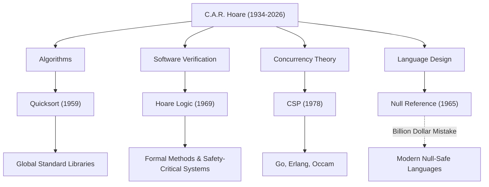

Sir Charles Antony Richard Hoare (biasa dikenal sebagai Tony Hoare, 1934–2026) adalah seorang ilmuwan komputer hebat yang meletakkan dasar bagi rekayasa perangkat lunak modern dan bahasa pemrograman. Pencapaiannya, yang ditinggalkan setelah ia meninggal pada bulan Maret 2026 pada usia 92 tahun, menghidupkan setiap sistem yang kita gunakan sehari-hari. Dalam artikel ini, kita mendalami kehidupannya, filosofi uniknya, dan dampaknya yang tak terukur pada generasi mendatang.

## Dari Humaniora ke Logika Matematika: Latar Belakang yang Unik

Lahir pada tahun 1934 di Kolombo, Ceylon Britania (sekarang Sri Lanka), Hoare mengambil jurusan Studi Klasik dan Filsafat (Literae Humaniores) di Merton College, Universitas Oxford. Latar belakang yang berorientasi pada humaniora ini, yang pada pandangan pertama tampaknya tidak terkait dengan ilmu komputer, menjadi sumber filosofinya yang menekankan "ketelitian logis" dan "keindahan linguistik" dalam penelitian-penelitian berikutnya.

Terpesona oleh logika matematika selama tahun-tahun sarjananya, ia kemudian mempelajari statistik dan belajar bahasa Rusia selama dinas militernya di Angkatan Laut Kerajaan. Pengetahuan tentang bahasa Rusia ini membawanya untuk belajar di Universitas Negeri Moskow dan partisipasinya dalam proyek terjemahan mesin, yang berfungsi sebagai katalis untuk penciptaan salah satu algoritma paling terkenal di dunia.

## Empat Pencapaian Besar yang Membentuk Ilmu Komputer

Penelitian Hoare membentang ke rentang bidang yang sangat luas, dari algoritma hingga teori konkurensi. Berikut ini adalah kontribusi perwakilannya:

1. **Quicksort (1959)**
   Selama studinya di Universitas Negeri Moskow, sebuah proyek terjemahan mesin dari bahasa Rusia ke bahasa Inggris membutuhkan pengurutan kata menurut abjad untuk mencari di kamus dengan cepat. "Quicksort" dirancang dalam proses ini. Algoritma rekursif ini, yang menggunakan metode bagi-dan-taklukkan, membanggakan rentang hidup dan kepraktisan yang menakjubkan, dan terus diadopsi di perpustakaan standar di seluruh dunia bahkan sampai sekarang, lebih dari setengah abad setelah diterbitkan.

2. **Logika Hoare (1969)**
   Menanggapi pertanyaan, "Bisakah kita membuktikan secara matematis bahwa suatu program bekerja dengan benar?", Hoare mengusulkan Semantik Aksiomatik. "Logika Hoare," yang membuktikan kebenaran sebuah program menggunakan prasyarat dan pascasyarat, membuka jalan untuk menghilangkan bug perangkat lunak melalui keketatan matematis alih-alih aturan praktis. Ini adalah leluhur langsung dari Metode Formal (Formal Methods) saat ini dan teknologi yang menjamin keamanan sistem yang kritis bagi misi seperti ruang angkasa dan peralatan medis.

3. **CSP (Communicating Sequential Processes, 1978)**
   Bagaimana komunikasi yang saling terkait secara rumit harus dimodelkan dalam sistem pemrosesan bersamaan di mana banyak program berjalan secara bersamaan? "CSP," yang diterbitkan oleh Hoare, adalah teori matematika yang secara ringkas dan ketat menggambarkan interaksi melalui penyampaian pesan antar proses. Konsep ini kemudian berdampak sangat besar pada desain bahasa pemrograman konkuren seperti goroutine dan channel di Go, Erlang, dan Occam.

4. **Kesalahan Satu Miliar Dolar (The Billion Dollar Mistake, 1965)**
   Selama desain bahasa ALGOL W, Hoare memperkenalkan "Referensi Null" (Null Reference), yang menunjuk ke objek yang tidak ada, hanya karena "mudah diimplementasikan". Pada tahun-tahun berikutnya, ia secara terbuka mengakui dan meminta maaf yang sebesar-besarnya atas hal ini sebagai "kesalahan bernilai satu miliar dolar". Bug yang tak terhitung jumlahnya, kerusakan sistem, dan kerentanan keamanan yang disebabkan oleh Null ini tidak terukur. Namun, refleksinya yang jujur sangat mendukung pencarian Keamanan Null (Null Safety) dalam bahasa-bahasa aman modern seperti Rust dan Swift.

## Diagram Korelasi Prestasi dan Dampak

Diagram di bawah ini menunjukkan bagaimana bidang penelitian utama Hoare telah membuahkan hasil dalam teknologi modern.

## Filosofi yang Mengangkat Pemrograman Menjadi "Matematika"

Filosofi Hoare yang konsisten terletak pada keyakinan bahwa "pemrograman harus didasarkan pada disiplin matematika". Pada awal pemrograman, itu adalah "kerajinan" yang bergantung pada intuisi, pengalaman, atau coba-coba dari para insinyur. Namun, Hoare gigih berpendapat bahwa perilaku program harus disimpulkan dan dibuktikan secara ketat sama seperti rumus matematika.

Dia menempatkan "kesederhanaan" dan "keanggunan" sebagai nilai tertinggi dalam desain perangkat lunak. Dia terkenal mengatakan:

> "Ada dua cara membangun desain perangkat lunak: Salah satunya adalah membuatnya sangat sederhana sehingga jelas tidak ada kekurangan, dan cara lain adalah membuatnya sangat rumit sehingga tidak ada kekurangan yang jelas. Metode pertama jauh lebih sulit."

Kata-kata ini dengan luar biasa meramalkan situasi saat ini di mana arsitektur layanan mikro dan pemrograman fungsional sekali lagi mencari "kesederhanaan" dalam pengembangan perangkat lunak modern yang semakin kompleks.

## Jembatan dari Akademisi ke Industri

Setelah karir akademis yang panjang di Universitas Oxford, Hoare bergabung dengan Microsoft Research di Cambridge sebagai Peneliti Utama Senior setelah pensiun pada tahun 1999. Bahkan setelah mencapai puncak dunia akademis, ia melanjutkan penelitiannya untuk menghadapi kerumitan pengembangan perangkat lunak dunia nyata di industri dan untuk mengintegrasikan metode formal ke dalam alat industri yang sebenarnya.

Dia memenangkan "Penghargaan Turing", yang sering disebut sebagai Hadiah Nobel dalam ilmu komputer, pada tahun 1980, dan dianugerahi gelar kebangsawanan oleh Ratu Elizabeth pada tahun 2000, menerima penghargaan yang tak terhitung jumlahnya sepanjang hidupnya. Namun, ia sendiri selalu tetap rendah hati, tanpa ragu meneruskan kegagalannya (seperti referensi Null) sebagai pelajaran bagi generasi muda.

## Warisan untuk Generasi Mendatang

Kematian Tony Hoare mungkin menandai akhir dari era kebesaran dalam ilmu komputer. Namun, benih yang ditanamnya telah tumbuh besar.

Di balik fakta bahwa kita dapat mengoperasikan aplikasi di ponsel cerdas kita dengan nyaman adalah pemrosesan data berkecepatan tinggi oleh Quicksort. Di balik fakta bahwa infrastruktur cloud dapat menangani puluhan ribu permintaan secara bersamaan adalah arsitektur pemrosesan konkuren yang mewarisi konsep CSP. Dan di balik fakta bahwa pesawat terbang dan mobil tanpa pengemudi yang kita naiki beroperasi dengan aman adalah teknologi pembuktian kebenaran program yang dikembangkan dari Logika Hoare.

Sir Tony Hoare meninggalkan kita tidak hanya teknik menulis kode, tetapi jawaban atas pertanyaan mendasar tentang "harus seperti apa perangkat lunak". Warisan intelektualnya niscaya akan terus mendukung fondasi masyarakat digital kita sebagai pedoman bagi para insinyur di seluruh dunia.
