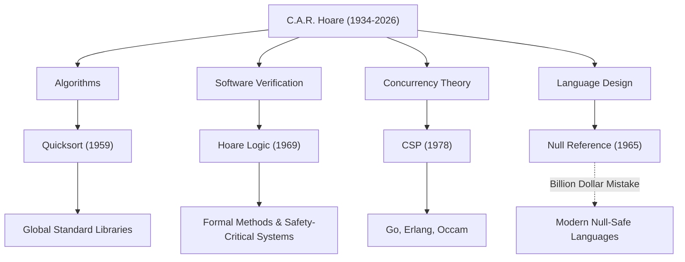

현대 소프트웨어 공학과 프로그래밍 언어의 기반을 다진 위대한 컴퓨터 과학자, 찰스 안토니 리처드 호어 경(통칭 토니 호어, 1934–2026). 2026년 3월, 92세의 나이로 세상을 떠난 그가 남긴 업적은 우리가 일상적으로 이용하는 모든 시스템에 숨 쉬고 있습니다. 본 기사에서는 그의 생애, 독자적인 철학, 그리고 후세에 미친 헤아릴 수 없는 영향에 대해 깊이 파헤쳐 봅니다.

## 인문학에서 수리논리학으로: 이색적인 경력

1934년, 당시 영국령 실론(현재의 스리랑카)의 콜롬보에서 태어난 호어는 옥스퍼드 대학교 머튼 칼리지에서 고전학과 철학(Literae Humaniores)을 전공했습니다. 언뜻 보면 컴퓨터 과학과 무관해 보이는 이러한 문과적인 소양이, 이후 그의 연구에서 '논리의 엄밀함'과 '언어의 아름다움'을 중시하는 철학의 원천이 됩니다.

학부 시절 수리논리학에 매료된 그는, 이후 통계학을 배우고 영국 해군에서 군 복무를 하던 중 러시아어를 습득했습니다. 이 러시아어 지식이 훗날 모스크바 대학교 유학과 기계 번역 프로젝트 참여로 이어졌고, 세계에서 가장 유명한 알고리즘 중 하나를 탄생시키는 계기가 되었습니다.

## 컴퓨터 과학을 형성한 4대 업적

호어의 연구는 알고리즘부터 병행 처리 이론까지 매우 폭넓은 영역에 걸쳐 있습니다. 다음은 그의 대표적인 공헌입니다.

1. **퀵 정렬 (Quicksort, 1959년)**
   모스크바 대학교 유학 시절, 러시아어를 영어로 번역하는 기계 번역 프로젝트에서 사전을 빠르게 검색하기 위해 단어를 알파벳 순서로 정렬해야 했습니다. 그 과정에서 고안된 것이 '퀵 정렬'입니다. 분할 정복법을 이용한 이 재귀적 알고리즘은 발표 후 반세기가 지난 현재까지도 전 세계의 표준 라이브러리에서 채택되며 놀라운 수명과 실용성을 자랑합니다.

2. **호어 논리 (Hoare Logic, 1969년)**
   "프로그램이 올바르게 작동하는 것을 수학적으로 증명할 수 있을까?"라는 질문에 대해, 호어는 공리적 의미론(Axiomatic Semantics)을 제창했습니다. 사전 조건과 사후 조건을 이용하여 프로그램의 정당성을 증명하는 '호어 논리'는 소프트웨어의 버그를 경험 법칙이 아닌 수학적 엄밀함을 통해 배제하는 길을 열었습니다. 이는 오늘날의 정형 기법(Formal Methods)이나 항공우주 및 의료 기기와 같은 미션 크리티컬한 시스템의 안전성을 담보하는 기술의 직접적인 조상입니다.

3. **CSP (순차 프로세스 통신, 1978년)**
   여러 프로그램이 동시에 실행되는 병행 처리 시스템에서, 복잡하게 얽힌 통신을 어떻게 모델링해야 할까요? 호어가 발표한 'CSP'는 프로세스 간의 메시지 패싱을 통한 상호작용을 간결하고 엄밀하게 기술하는 수학적 이론입니다. 이 개념은 훗날 Go 언어의 고루틴과 채널, Erlang, Occam 등 병행 프로그래밍 언어의 설계에 극히 큰 영향을 미쳤습니다.

4. **10억 달러의 실수 (The Billion Dollar Mistake, 1965년)**
   ALGOL W 언어를 설계하던 중, 호어는 "단순히 구현하기 쉽다"는 이유로 존재하지 않는 객체를 가리키는 'Null 참조(Null Reference)'를 도입했습니다. 훗날 그는 이를 "나의 10억 달러짜리 실수"라고 공개적으로 인정하며 깊이 사과했습니다. 이 Null로 인해 발생한 수많은 버그와 시스템 크래시, 보안 취약성은 헤아릴 수 없습니다. 그러나 그의 이러한 솔직한 반성 덕분에 Rust나 Swift와 같은 현대의 안전한 언어에서 Null 안전(Null Safety)을 추구하는 움직임이 강력한 탄력을 받게 되었습니다.

## 업적과 영향의 상관도

아래 그림은 호어의 주요 연구 분야가 현대 기술에서 어떻게 결실을 맺었는지 보여줍니다.

## 프로그래밍을 '수학'으로 승화시킨 철학

호어의 일관된 철학은 "프로그래밍은 수학적 규율에 기반해야 한다"는 신념에 있습니다. 초창기의 프로그래밍은 엔지니어의 직감이나 경험, 혹은 시행착오에 의존하는 '장인 정신'이었습니다. 그러나 호어는 프로그램의 동작을 수학 공식처럼 엄밀하게 추론하고 증명할 수 있어야 한다고 끊임없이 주장했습니다.

그는 '단순함'과 '우아함'을 소프트웨어 설계의 최고 가치로 두었습니다. 그의 유명한 명언은 다음과 같습니다.

> "소프트웨어 설계에는 두 가지 방법이 있다. 하나는 결함이 없다는 것이 명백할 정도로 단순하게 만드는 것이다. 다른 하나는 명백한 결함이 존재하지 않을 정도로 복잡하게 만드는 것이다. 전자가 훨씬 더 어렵다."

이 말은 현대의 복잡해지는 소프트웨어 개발에서 마이크로서비스 아키텍처나 함수형 프로그래밍이 다시 '단순함'을 추구하고 있는 현상을 멋지게 예견하고 있습니다.

## 학계에서 산업계로의 가교 역할

옥스퍼드 대학교에서의 긴 학술적 커리어를 거쳐, 호어는 1999년 정년퇴임 후 캠브리지의 Microsoft Research에 수석 연구원(Senior Principal Researcher)으로 합류했습니다. 학계의 최고봉에 오른 후에도 그는 산업계의 실제 소프트웨어 개발에서의 복잡성과 마주하며, 정형 기법을 실제 산업 도구에 통합하기 위한 연구를 계속했습니다.

그는 1980년에 컴퓨터 과학계의 노벨상이라 불리는 '튜링상'을 수상했고, 2000년에는 엘리자베스 여왕으로부터 기사 작위(Sir)를 수여받는 등 일생 동안 셀 수 없이 많은 영예를 안았습니다. 그러나 그 자신은 항상 겸손했으며, 자신의 실패(Null 참조 등)를 후학들을 위한 교훈으로 숨김없이 전했습니다.

## 후세에 남긴 유산

토니 호어의 죽음은 컴퓨터 과학에 있어 하나의 위대한 시대의 종언을 의미할지도 모릅니다. 그러나 그가 뿌린 씨앗은 이미 크게 자라났습니다.

우리가 스마트폰에서 앱을 편안하게 조작할 수 있는 배경에는 퀵 정렬을 통한 고속 데이터 처리가 있습니다. 클라우드 인프라가 수만 건의 요청을 동시에 처리할 수 있는 배경에는 CSP의 개념을 이어받은 병행 처리 아키텍처가 있습니다. 그리고 우리가 타는 비행기나 자율주행 자동차가 안전하게 작동하는 배경에는 호어 논리에서 발전한 프로그램 정당성 증명 기술이 있습니다.

토니 호어 경은 단순히 코드를 작성하는 기술이 아니라 "소프트웨어는 어떠해야 하는가"라는 근본적인 질문에 대한 해답을 우리에게 남겨주었습니다. 그의 지적 유산은 앞으로도 전 세계 엔지니어들의 이정표로서 디지털 사회의 근간을 계속 지탱할 것입니다.
