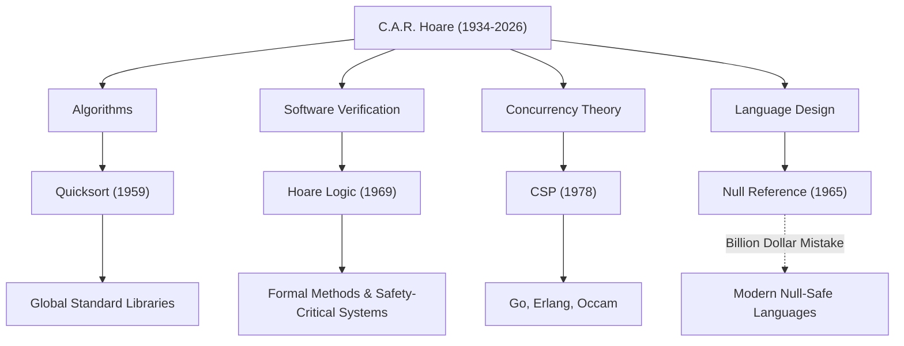

現代のソフトウェア工学やプログラミング言語の基盤を築いた偉大な計算機科学者、サー・チャールズ・アントニー・リチャード・ホーア（通称トニー・ホーア、1934–2026）。2026年3月に92歳でこの世を去った彼の残した功績は、私たちが日常的に利用するあらゆるシステムに息づいています。本記事では、彼の生涯、独自の哲学、そして後世に与えた計り知れない影響について深く掘り下げます。

## 人文学から数理論理学へ：異色の経歴

1934年、当時のイギリス領セイロン（現在のスリランカ）のコロンボで生まれたホーアは、オックスフォード大学マートン・カレッジで古典学と哲学（Literae Humaniores）を専攻しました。一見するとコンピュータ科学とは無縁に思えるこの文系的な素地こそが、後の彼の研究において「論理の厳密さ」や「言語の美しさ」を重視する哲学の源泉となります。

学部時代に数理論理学に魅了された彼は、その後統計学を学び、イギリス海軍での兵役中にはロシア語を習得しました。このロシア語の知識が、後にモスクワ大学への留学と機械翻訳プロジェクトへの参加に繋がり、世界で最も有名なアルゴリズムの一つを生み出す契機となったのです。

## 計算機科学を形作った4つの大功績

ホーアの研究は、アルゴリズムから並行処理の理論まで、非常に幅広い領域に及びます。以下は彼の代表的な貢献です。

1. **クイックソート（Quicksort, 1959年）**
   モスクワ大学での留学時代、ロシア語から英語への機械翻訳プロジェクトにおいて、辞書を高速に検索するために単語をアルファベット順に並べ替える必要がありました。その過程で考案されたのが「クイックソート」です。分割統治法を用いたこの再帰的アルゴリズムは、発表から半世紀以上が経過した現在でも、世界中の標準ライブラリで採用され続ける驚異的な寿命と実用性を誇ります。

2. **ホーア論理（Hoare Logic, 1969年）**
   「プログラムが正しく動くことを、数学的に証明できるか？」という問いに対し、ホーアは公理的意味論（Axiomatic Semantics）を提唱しました。事前条件と事後条件を用いてプログラムの正当性を証明する「ホーア論理」は、ソフトウェアのバグを経験則ではなく数学的厳密さによって排除する道を開きました。これは今日の形式手法（Formal Methods）や、航空宇宙・医療機器などのミッションクリティカルなシステムの安全性を担保する技術の直接的な祖先です。

3. **CSP（Communicating Sequential Processes, 1978年）**
   複数のプログラムが同時に動く並行処理システムにおいて、複雑に絡み合う通信をどのようにモデル化すべきか。ホーアが発表した「CSP」は、プロセス間のメッセージパッシングによる相互作用を簡潔かつ厳密に記述する数学的理論です。この概念は、後にGo言語のゴルーチンとチャネル、Erlang、Occamなどの並行プログラミング言語の設計に極めて大きな影響を与えました。

4. **10億ドルの過ち（The Billion Dollar Mistake, 1965年）**
   ALGOL W言語の設計中、ホーアは「単に実装が容易だから」という理由で、存在しないオブジェクトを指し示す「Null参照（Null Reference）」を導入しました。後年、彼はこれを「自身の10億ドルの過ち」と公に認め、深く謝罪しています。この Null によって引き起こされた無数のバグやシステムクラッシュ、セキュリティ上の脆弱性は計り知れません。しかし、彼のこの率直な反省こそが、Rust や Swift といった現代の安全な言語における Null 安全（Null Safety）の追求を強力に後押しすることになりました。

## 功績と影響の相関図

以下の図は、ホーアの主要な研究分野がどのように現代の技術へと結実していったかを示しています。

## プログラミングを「数学」へと昇華させた哲学

ホーアの一貫した哲学は、「プログラミングは数学的規律に基づくべきである」という信念にあります。黎明期のプログラミングは、エンジニアの勘や経験、あるいは試行錯誤に依存する「職人技」でした。しかしホーアは、プログラムの振る舞いを数式のように厳密に推論・証明できるべきだと主張し続けました。

彼は「シンプルさ」と「エレガンス」をソフトウェア設計の最高価値に置いていました。彼の有名な言葉に次のようなものがあります。

> 「ソフトウェア設計には2つの方法がある。1つは、欠陥がないことが明らかになるほどシンプルにすること。もう1つは、明らかな欠陥が存在しないほど複雑にすることである。前者のほうがはるかに難しい」

この言葉は、現代の複雑化するソフトウェア開発において、マイクロサービスアーキテクチャや関数型プログラミングが再び「シンプルさ」を求めている現状を見事に予見しています。

## 学界から産業界への架け橋

オックスフォード大学での長年の学術的キャリアを経て、ホーアは1999年に定年退職を迎えた後、ケンブリッジのMicrosoft Researchにシニア・プリンシパル・リサーチャーとして加わりました。学界の最高峰に上り詰めた後も、彼は産業界の現実のソフトウェア開発における複雑さと向き合い、形式手法を実際の産業ツールに統合するための研究を続けました。

1980年にはコンピュータ科学界のノーベル賞と称される「チューリング賞」を受賞し、2000年にはエリザベス女王からナイトの称号（Sir）を授与されるなど、その生涯で数え切れないほどの栄誉に輝きました。しかし、彼自身は常に謙虚であり、自らの失敗（Null参照など）を後進への教訓として隠すことなく語り継ぎました。

## 後世への遺産

トニー・ホーアの死は、計算機科学における一つの偉大な時代の終焉を意味するかもしれません。しかし、彼が蒔いた種はすでに大きく育っています。

私たちがスマートフォンで快適にアプリを操作できる背景には、クイックソートによる高速なデータ処理があります。クラウドインフラが何万ものリクエストを同時に捌ける背景には、CSPの概念を受け継いだ並行処理アーキテクチャがあります。そして、私たちが乗る飛行機や自動運転車が安全に動作する背景には、ホーア論理から発展したプログラムの正当性証明技術があります。

サー・トニー・ホーアは、単にコードを書く技術ではなく、「ソフトウェアとはどうあるべきか」という根本的な問いに対する解答を私たちに残してくれました。彼の知的遺産は、これからも世界中のエンジニアの道標として、デジタル社会の根底を支え続けることでしょう。
