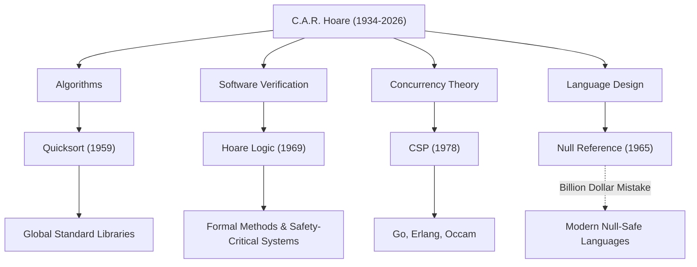

Sir Charles Antony Richard Hoare (comumente conhecido como Tony Hoare, 1934–2026) foi um grande cientista da computação que lançou as bases da engenharia de software moderna e das linguagens de programação. Suas conquistas, deixadas para trás após seu falecimento em março de 2026 aos 92 anos, dão vida a cada sistema que usamos diariamente. Neste artigo, nos aprofundamos em sua vida, sua filosofia única e o impacto imensurável que ele teve nas gerações futuras.

## Das Humanidades à Lógica Matemática: Uma Trajetória Única

Nascido em 1934 em Colombo, Ceilão Britânico (atual Sri Lanka), Hoare formou-se em Letras Clássicas e Filosofia (Literae Humaniores) no Merton College, Universidade de Oxford. Essa formação voltada para as ciências humanas, que à primeira vista parece não ter relação com a ciência da computação, tornou-se a fonte de sua filosofia que enfatizou o "rigor lógico" e a "beleza linguística" em suas pesquisas posteriores.

Fascinado pela lógica matemática durante seus anos de graduação, mais tarde ele estudou estatística e aprendeu russo durante o serviço militar na Marinha Real. Esse conhecimento do russo o levou a estudar na Universidade Estadual de Moscou e a participar de um projeto de tradução automática, que serviu como catalisador para a criação de um dos algoritmos mais famosos do mundo.

## Quatro Grandes Conquistas Que Moldaram a Ciência da Computação

A pesquisa de Hoare abrangeu uma gama muito ampla de áreas, de algoritmos à teoria da simultaneidade. A seguir estão suas contribuições representativas:

1. **Quicksort (1959)**
   Durante seus estudos na Universidade Estadual de Moscou, um projeto de tradução automática do russo para o inglês exigiu a classificação de palavras em ordem alfabética para pesquisar rapidamente em um dicionário. O "Quicksort" foi concebido neste processo. Esse algoritmo recursivo usando o método dividir para conquistar possui uma vida útil e praticidade surpreendentes, continuando a ser adotado em bibliotecas padrão em todo o mundo, mesmo hoje, mais de meio século após sua publicação.

2. **Lógica de Hoare (1969)**
   Em resposta à pergunta: "Podemos provar matematicamente que um programa funciona corretamente?", Hoare propôs a Semântica Axiomática. A "Lógica de Hoare", que prova a correção de um programa usando pré-condições e pós-condições, abriu caminho para eliminar bugs de software por meio de rigor matemático em vez de regras práticas. Este é o ancestral direto dos Métodos Formais (Formal Methods) de hoje e das tecnologias que garantem a segurança de sistemas de missão crítica, como os setores aeroespacial e de equipamentos médicos.

3. **CSP (Processos Sequenciais Comunicantes, 1978)**
   Como as comunicações intrincadas devem ser modeladas em um sistema de processamento simultâneo em que vários programas são executados ao mesmo tempo? O "CSP", publicado por Hoare, é uma teoria matemática que descreve concisa e rigorosamente as interações por meio da passagem de mensagens entre processos. Mais tarde, esse conceito teve um impacto extremamente profundo no design de linguagens de programação concorrentes, como goroutines e canais de Go, Erlang e Occam.

4. **O Erro de Um Bilhão de Dólares (1965)**
   Durante o design da linguagem ALGOL W, Hoare introduziu a "Referência Nula" (Null Reference), que aponta para um objeto inexistente, simplesmente porque era "fácil de implementar". Em anos posteriores, ele reconheceu publicamente e pediu desculpas por isso como o seu "erro de um bilhão de dólares". Os inúmeros bugs, falhas no sistema e vulnerabilidades de segurança causados ​​por esse Null são imensuráveis. No entanto, sua reflexão sincera apoiou fortemente a busca pela Segurança Nula (Null Safety) em linguagens seguras modernas, como Rust e Swift.

## Diagrama de Correlação de Conquistas e Impactos

O diagrama abaixo mostra como as principais áreas de pesquisa de Hoare se concretizaram na tecnologia moderna.

## A Filosofia que Elevou a Programação à "Matemática"

A filosofia consistente de Hoare baseia-se na crença de que "a programação deve ser baseada na disciplina matemática". Nos primórdios da programação, era um "ofício" que contava com a intuição, experiência ou tentativa e erro dos engenheiros. No entanto, Hoare argumentou persistentemente que o comportamento de um programa deve ser rigorosamente deduzido e provado exatamente como uma fórmula matemática.

Ele colocou a "simplicidade" e a "elegância" como os valores mais elevados no design de software. Ele disse de forma famosa:

> "Existem duas maneiras de construir o design de um software: uma maneira é torná-lo tão simples que, obviamente, não haja deficiências, e a outra é torná-lo tão complicado que não haja deficiências óbvias. O primeiro método é muito mais difícil."

Essas palavras preveem notavelmente a situação atual em que arquiteturas de microsserviços e programação funcional buscam mais uma vez a "simplicidade" no desenvolvimento de software moderno e cada vez mais complexo.

## Uma Ponte da Academia para a Indústria

Após uma longa carreira acadêmica na Universidade de Oxford, Hoare ingressou na Microsoft Research em Cambridge como Pesquisador Principal Sênior após sua aposentadoria em 1999. Mesmo após atingir o auge do mundo acadêmico, ele continuou suas pesquisas para enfrentar as complexidades do desenvolvimento de software no mundo real da indústria e integrar os métodos formais nas ferramentas industriais reais.

Ele ganhou o "Prêmio Turing", muitas vezes chamado de Prêmio Nobel da ciência da computação, em 1980, e foi nomeado cavaleiro pela Rainha Elizabeth em 2000, recebendo inúmeras homenagens ao longo de sua vida. No entanto, ele sempre permaneceu humilde, repassando seus próprios fracassos (como a referência nula) como lições para as gerações mais jovens.

## Legado para as Gerações Futuras

A morte de Tony Hoare pode marcar o fim de uma grande era na ciência da computação. No entanto, as sementes que ele plantou já cresceram bastante.

Por trás do fato de que podemos operar confortavelmente aplicativos em nossos smartphones, está o processamento de dados em alta velocidade do Quicksort. Por trás do fato de que a infraestrutura em nuvem pode lidar com dezenas de milhares de solicitações simultaneamente, está a arquitetura de processamento simultâneo que herdou o conceito CSP. E por trás do fato de que os aviões e os carros autônomos que usamos operam com segurança, está a tecnologia de prova de correção de programas desenvolvida a partir da Lógica de Hoare.

Sir Tony Hoare nos deixou não apenas a técnica de escrever códigos, mas uma resposta à pergunta fundamental de "o que o software deve ser". Seu legado intelectual continuará, sem dúvida, a apoiar a base de nossa sociedade digital como um guia para engenheiros em todo o mundo.
