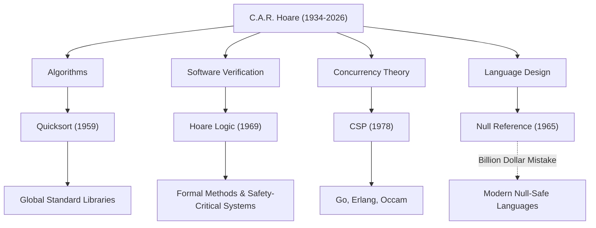

Сэр Чарльз Энтони Ричард Хоар (обычно известный как Тони Хоар, 1934–2026) был великим ученым в области информатики, заложившим основы современной программной инженерии и языков программирования. Его достижения, оставленные им после его смерти в марте 2026 года в возрасте 92 лет, вдыхают жизнь в каждую систему, которую мы используем повседневно. В этой статье мы глубоко погружаемся в его жизнь, его уникальную философию и то неизмеримое влияние, которое он оказал на будущие поколения.

## От гуманитарных наук к математической логике: Уникальный опыт

Родившийся в 1934 году в Коломбо, Британский Цейлон (ныне Шри-Ланка), Хоар специализировался на классической литературе и философии (Literae Humaniores) в Мертон-колледже Оксфордского университета. Это гуманитарное образование, на первый взгляд не связанное с компьютерными науками, стало источником его философии, подчеркивающей «логическую строгость» и «лингвистическую красоту» в его более поздних исследованиях.

Увлекшись математической логикой в годы учебы в бакалавриате, он позже изучал статистику и выучил русский язык во время военной службы в Королевском флоте. Знание русского языка привело его к учебе в Московском государственном университете и участию в проекте машинного перевода, что послужило катализатором для создания одного из самых известных в мире алгоритмов.

## Четыре великих достижения, сформировавших информатику

Исследования Хоара охватывали очень широкий спектр областей, от алгоритмов до теории параллелизма. Ниже представлены его основные достижения:

1. **Быстрая сортировка (Quicksort, 1959)**
   Во время его учебы по обмену в Московском государственном университете, проект машинного перевода с русского на английский требовал сортировки слов в алфавитном порядке для быстрого поиска в словаре. В этом процессе был придуман "Quicksort". Этот рекурсивный алгоритм, использующий метод «разделяй и властвуй», может похвастаться поразительной долговечностью и практичностью, продолжая применяться в стандартных библиотеках по всему миру даже сегодня, спустя более полувека после его публикации.

2. **Логика Хоара (Hoare Logic, 1969)**
   В ответ на вопрос «Можем ли мы математически доказать, что программа работает правильно?», Хоар предложил Аксиоматическую семантику. «Логика Хоара», которая доказывает правильность программы с использованием предусловий и постусловий, открыла путь к устранению программных ошибок с помощью математической строгости, а не эмпирических правил. Это прямой предшественник современных Формальных методов (Formal Methods) и технологий, обеспечивающих безопасность критически важных систем, таких как аэрокосмическое и медицинское оборудование.

3. **CSP (Взаимодействующие последовательные процессы, 1978)**
   Как следует моделировать сложно переплетенные коммуникации в системе параллельной обработки, где несколько программ выполняются одновременно? «CSP», опубликованная Хоаром, — это математическая теория, которая кратко и строго описывает взаимодействия посредством передачи сообщений между процессами. Эта концепция позже оказала чрезвычайно глубокое влияние на дизайн языков параллельного программирования, таких как горутины и каналы Go, Erlang и Occam.

4. **Ошибка на миллиард долларов (The Billion Dollar Mistake, 1965)**
   Во время разработки языка ALGOL W Хоар ввел «Нулевую ссылку» (Null Reference), указывающую на несуществующий объект, просто потому, что это было «легко реализовать». В последующие годы он публично признал это своей собственной «ошибкой на миллиард долларов» и принес глубокие извинения. Бесчисленные ошибки, сбои системы и уязвимости безопасности, вызванные этим Null, неизмеримы. Однако его искреннее размышление решительно поддержало стремление к Null Safety (Безопасности от Null) в современных безопасных языках, таких как Rust и Swift.

## Корреляционная диаграмма достижений и влияний

Приведенная ниже диаграмма показывает, как основные области исследований Хоара принесли плоды в современных технологиях.

## Философия, возвысившая программирование до «Математики»

Последовательная философия Хоара заключается в убеждении, что «программирование должно основываться на математической дисциплине». На заре программирования оно было «ремеслом», опиравшимся на интуицию, опыт или метод проб и ошибок инженеров. Однако Хоар настойчиво утверждал, что поведение программы должно строго выводиться и доказываться так же, как математическая формула.

Он ставил «простоту» и «элегантность» как высшие ценности в проектировании программного обеспечения. Его знаменитая цитата гласит:

> «Есть два способа построения дизайна программного обеспечения: один путь — сделать его настолько простым, что в нем очевидно нет недостатков, а другой путь — сделать его настолько сложным, что в нем нет очевидных недостатков. Первый метод намного сложнее».

Эти слова удивительно предвосхищают нынешнюю ситуацию, когда микросервисные архитектуры и функциональное программирование вновь ищут «простоту» в современной, все более сложной разработке программного обеспечения.

## Мост от науки к промышленности

После долгой академической карьеры в Оксфордском университете Хоар присоединился к Microsoft Research в Кембридже в качестве старшего главного исследователя после своего выхода на пенсию в 1999 году. Даже достигнув вершины академического мира, он продолжал свои исследования, чтобы противостоять сложностям разработки реального программного обеспечения в отрасли и интегрировать формальные методы в реальные промышленные инструменты.

Он получил «Премию Тьюринга», которую часто называют Нобелевской премией в области компьютерных наук, в 1980 году и был посвящен в рыцари королевой Елизаветой в 2000 году, получив бесчисленные почести на протяжении всей своей жизни. Однако сам он всегда оставался скромным, без извинений передавая свои собственные неудачи (такие как нулевая ссылка) в качестве уроков для молодых поколений.

## Наследие для будущих поколений

Смерть Тони Хоара может означать конец великой эпохи в области компьютерных наук. Однако посаженные им семена уже дали большие всходы.

За тем фактом, что мы можем комфортно управлять приложениями на наших смартфонах, стоит высокоскоростная обработка данных с помощью Quicksort. За тем фактом, что облачная инфраструктура может одновременно обрабатывать десятки тысяч запросов, стоит архитектура параллельной обработки, унаследовавшая концепцию CSP. И за тем фактом, что самолеты и беспилотные автомобили, на которых мы ездим, работают безопасно, стоит технология доказательства правильности программ, разработанная на основе логики Хоара.

Сэр Тони Хоар оставил нам не просто технику написания кода, но и ответ на фундаментальный вопрос о том, «каким должно быть программное обеспечение». Его интеллектуальное наследие, несомненно, будет продолжать поддерживать фундамент нашего цифрового общества в качестве ориентира [для инженеров](/ru/p/prompt-engineering-for-engineers/) по всему миру.
