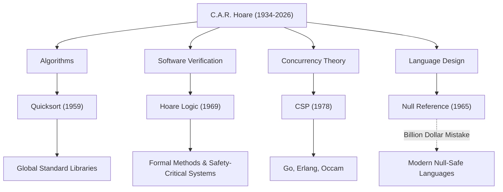

现代软件工程和编程语言基础的奠基人、伟大的计算机科学家查尔斯·安东尼·理查德·霍尔爵士（通称托尼·霍尔，1934–2026）。他于2026年3月以92岁高龄与世长辞，但他留下的功绩至今仍活跃在我们日常使用的每一个系统中。本文将深入探讨他的生平、独特的哲学，以及对后世产生的不可估量的影响。

## 从人文学科到数理逻辑：非凡的经历

1934年，霍尔出生于当时的英属锡兰（现斯里兰卡）科伦坡。他在牛津大学墨顿学院主修古典学与哲学（Literae Humaniores）。这种乍看之下与计算机科学毫无关联的文科背景，正是他后来在研究中重视“逻辑的严谨性”和“语言之美”的哲学源泉。

在本科阶段被数理逻辑深深吸引的他，随后学习了统计学，并在英国海军服役期间掌握了俄语。正是这份俄语知识，促成了他后来前往莫斯科大学留学并参与机器翻译项目，这也成为了他创造出世界上最著名的算法之一的契机。

## 塑造计算机科学的四大伟业

霍尔的研究领域极为广泛，从算法到并发处理理论无所不包。以下是他最具代表性的贡献：

1. **快速排序（Quicksort, 1959年）**
   在莫斯科大学留学期间，为了在俄译英机器翻译项目中快速查阅字典，需要将单词按字母顺序重新排列。在这个过程中，“快速排序”应运而生。这种采用分治法的递归算法，在发表半个多世纪后的今天，依然被全球的标准库广泛采用，展现出惊人的生命力和实用性。

2. **霍尔逻辑（Hoare Logic, 1969年）**
   面对“能否用数学方法证明程序运行正确？”这一问题，霍尔提出了公理语义学（Axiomatic Semantics）。利用前置条件和后置条件来证明程序正确性的“霍尔逻辑”，开辟了一条通过数学严密性而非经验法则来排除软件漏洞的道路。这也是当今形式化方法（Formal Methods）以及保障航空航天、医疗设备等关键任务系统安全技术的直接鼻祖。

3. **CSP（通信顺序进程, 1978年）**
   在多个程序同时运行的并发处理系统中，该如何对错综复杂的通信进行建模？霍尔发表的“CSP”是一种数学理论，通过进程间的消息传递，简洁而严谨地描述了它们之间的交互。这一概念后来对Go语言的goroutine和channel、Erlang、Occam等并发编程语言的设计产生了极其深远的影响。

4. **十亿美元的错误（The Billion Dollar Mistake, 1965年）**
   在设计ALGOL W语言时，霍尔仅仅因为“容易实现”，便引入了指向不存在对象的“空引用（Null Reference）”。晚年时，他公开承认这是自己“十亿美元的错误”并深表歉意。这个Null引发的无数漏洞、系统崩溃和安全脆弱性难以估量。然而，正是他这种坦诚的反思，强烈推动了Rust、Swift等现代安全语言对空安全（Null Safety）的极致追求。

## 功绩与影响的相关图

下图展示了霍尔的主要研究领域是如何在现代技术中结出硕果的。

## 将编程升华为“数学”的哲学

霍尔一贯的哲学理念在于，他坚信“编程应建立在数学规律之上”。在编程的黎明期，它还是一门依赖工程师直觉、经验或反复试错的“手艺”。但霍尔始终主张，程序的行为应该能像数学公式一样被严密地推导和证明。

他将“简洁”与“优雅”视为软件设计的最高价值。他有一句著名的格言：

> “软件设计有两种方式：一种是设计得极其简单，以至于明显没有缺陷；另一种是设计得极其复杂，以至于没有明显的缺陷。前者要困难得多。”

这番话精准地预言了在当今日益复杂的软件开发中，[微服务架构](/zh-cn/p/microservices-architecture-bff-api-gateway/)和[函数式编程](/zh-cn/p/lambda-calculus-functional-programming/)重新追求“简洁性”的现状。

## 跨越学术界与工业界的桥梁

在牛津大学度过了漫长的学术生涯后，霍尔于1999年退休，随后作为高级首席研究员加入了剑桥的微软研究院。即便在登上了学术界的最高峰后，他依然直面工业界现实软件开发中的复杂性，持续致力于将形式化方法整合到实际的工业工具中。

他于1980年荣获被誉为计算机科学界诺贝尔奖的“图灵奖”，并在2000年被伊丽莎白女王授予骑士头衔（Sir），一生中获得了数不胜数的荣誉。然而，他本人始终保持谦逊，毫不掩饰地将自己的失败（如空引用）作为教训传授给后人。

## 留给后世的遗产

托尼·霍尔的逝世，或许意味着计算机科学领域一个伟大时代的终结。但是，他播下的种子早已长成参天大树。

我们之所以能在智能手机上流畅地操作应用，其背后离不开快速排序带来的高速数据处理；云基础设施之所以能同时处理数以万计的请求，其背后是继承了CSP概念的并发处理架构；而我们乘坐的飞机和自动驾驶汽车能够安全运行，其背后则是源自霍尔逻辑的程序正确性证明技术。

托尼·霍尔爵士留给我们的，不仅仅是编写代码的技术，更是对“软件究竟该是什么样”这一根本问题的解答。他的知识遗产，在未来也将继续作为全球工程师的指路明灯，支撑着数字社会的根基。
