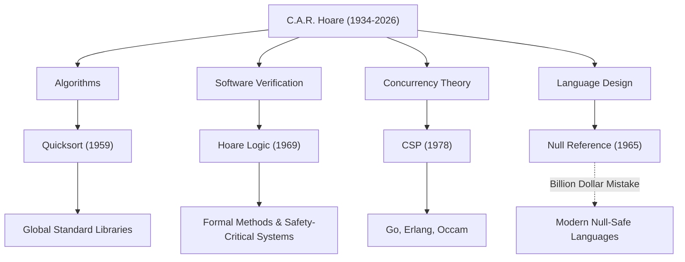

現代軟體工程和程式語言基礎的奠基人、偉大的計算機科學家查爾斯·安東尼·理查德·霍爾爵士（通稱東尼·霍爾，1934–2026）。他於2026年3月以92歲高齡辭世，但他留下的貢獻至今仍活躍在我們日常使用的每一個系統中。本文將深入探討他的生平、獨特的哲學，以及對後世產生的無可估量的影響。

## 從人文學科到數理邏輯：非凡的經歷

1934年，霍爾出生於當時的英屬錫蘭（現斯里蘭卡）可倫坡。他在牛津大學墨頓學院主修古典學與哲學（Literae Humaniores）。這種乍看之下與計算機科學毫無關聯的文科背景，正是他後來在研究中重視「邏輯的嚴謹性」和「語言之美」的哲學源泉。

在大學時期被數理邏輯深深吸引的他，隨後學習了統計學，並在英國海軍服役期間掌握了俄語。正是這份俄語知識，促成了他後來前往莫斯科大學留學並參與機器翻譯專案，這也成為了他創造出世界上最著名的演算法之一的契機。

## 塑造計算機科學的四大偉業

霍爾的研究領域極為廣泛，從演算法到並行處理理論無所不包。以下是他最具代表性的貢獻：

1. **快速排序（Quicksort, 1959年）**
   在莫斯科大學留學期間，為了在俄譯英機器翻譯專案中快速查閱字典，需要將單字按字母順序重新排列。在這個過程中，「快速排序」應運而生。這種採用分治法的遞迴演算法，在發表半個多世紀後的今天，依然被全球的標準函式庫廣泛採用，展現出驚人的生命力與實用性。

2. **霍爾邏輯（Hoare Logic, 1969年）**
   面對「能否用數學方法證明程式運行正確？」這一問題，霍爾提出了公理語意學（Axiomatic Semantics）。利用前置條件和後置條件來證明程式正確性的「霍爾邏輯」，開闢了一條透過數學嚴密性而非經驗法則來排除軟體錯誤的道路。這也是當今形式化方法（Formal Methods）以及保障航太、醫療設備等任務關鍵型系統安全技術的直接鼻祖。

3. **CSP（通訊循序程式, 1978年）**
   在多個程式同時運行的並行處理系統中，該如何對錯綜複雜的通訊進行建模？霍爾發表的「CSP」是一種數學理論，透過行程間的訊息傳遞，簡潔而嚴謹地描述了它們之間的互動。這一概念後來對Go語言的goroutine和channel、Erlang、Occam等並行程式語言的設計產生了極其深遠的影響。

4. **十億美元的錯誤（The Billion Dollar Mistake, 1965年）**
   在設計ALGOL W語言時，霍爾僅僅因為「容易實作」，便引入了指向不存在物件的「空值參考（Null Reference）」。晚年時，他公開承認這是自己「十億美元的錯誤」並深表歉意。這個Null引發的無數錯誤、系統崩潰和安全脆弱性難以估量。然而，正是他這種坦誠的反思，強烈推動了Rust、Swift等現代安全語言對空值安全（Null Safety）的極致追求。

## 貢獻與影響的相關圖

下圖展示了霍爾的主要研究領域是如何在現代技術中結出碩果的。

## 將程式設計昇華為「數學」的哲學

霍爾一貫的哲學理念在於，他堅信「程式設計應建立在數學規律之上」。在程式設計的黎明期，它還是一門依賴工程師直覺、經驗或反覆試錯的「手藝」。但霍爾始終主張，程式的行為應該能像數學公式一樣被嚴密地推導和證明。

他將「簡潔」與「優雅」視為軟體設計的最高價值。他有一句著名的格言：

> 「軟體設計有兩種方式：一種是設計得極其簡單，以至於明顯沒有缺陷；另一種是設計得極其複雜，以至於沒有明顯的缺陷。前者要困難得多。」

這番話精準地預言了在當今日益複雜的軟體開發中，微服務架構和函數式程式設計重新追求「簡潔性」的現狀。

## 跨越學術界與工業界的橋樑

在牛津大學度過了漫長的學術生涯後，霍爾於1999年退休，隨後作為高級首席研究員加入了劍橋的微軟研究院。即便在登上了學術界的最高峰後，他依然直面工業界現實軟體開發中的複雜性，持續致力於將形式化方法整合到實際的工業工具中。

他於1980年榮獲被譽為計算機科學界諾貝爾獎的「圖靈獎」，並在2000年被伊麗莎白女王授予騎士頭銜（Sir），一生中獲得了數不勝數的榮譽。然而，他本人始終保持謙遜，毫不掩飾地將自己的失敗（如空值參考）作為教訓傳授給後人。

## 留給後世的遺產

東尼·霍爾的逝世，或許意味著計算機科學領域一個偉大時代的終結。但是，他播下的種子早已長成參天大樹。

我們之所以能在智慧型手機上流暢地操作應用程式，其背後離不開快速排序帶來的高速資料處理；雲端基礎設施之所以能同時處理數以萬計的請求，其背後是繼承了CSP概念的並行處理架構；而我們乘坐的飛機和自動駕駛汽車能夠安全運行，其背後則是源自霍爾邏輯的程式正確性證明技術。

東尼·霍爾爵士留給我們的，不僅僅是編寫程式碼的技術，更是對「軟體究竟該是什麼樣」這一根本問題的解答。他的知識遺產，在未來也將繼續作為全球工程師的指路明燈，支撐著數位社會的根基。
