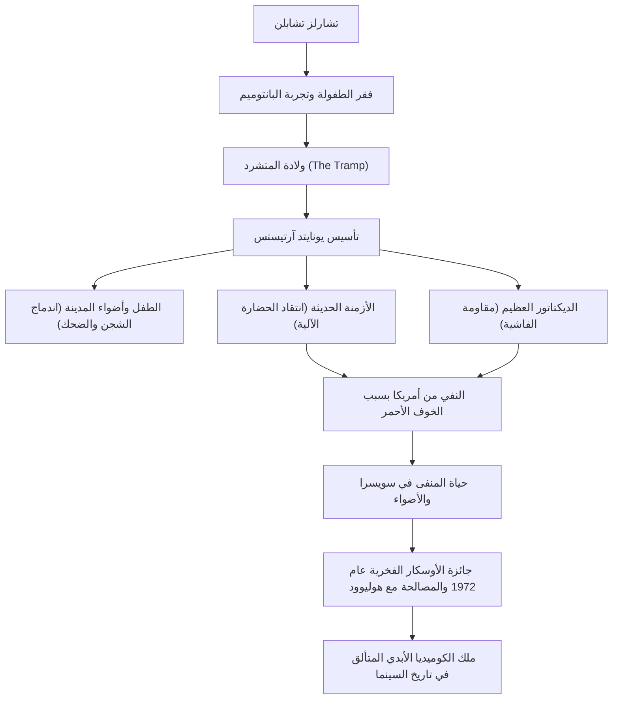

تشارلز سبنسر تشابلن (Charles Spencer Chaplin، 16 أبريل 1889 - 25 ديسمبر 1977) هو ممثل سينمائي، مخرج، ممثل كوميدي، كاتب سيناريو، وملحن من أصل بريطاني. يُعرف باسم "ملك الكوميديا"، وهو معترف به على نطاق واسع كواحد من أهم الشخصيات وأكثرها تأثيراً في تاريخ السينما. شخصيته التي ابتكرها "المتشرد (The Tramp)"، بمظهرها الأيقوني المتمثل في القبعة المستديرة، والشارب الصغير، والسراويل الفضفاضة، وعصا الخيزران، لا تزال محبوبة من قبل الناس في جميع أنحاء العالم. في هذا المقال، سنستكشف حياة تشابلن المضطربة، والفلسفة العميقة المضمنة في أعماله، وتأثيره على الأجيال القادمة.

## أصول الكوميديا المولودة من الفقر والوحدة

وُلد تشارلز تشابلن في عائلة فقيرة في لندن عام 1889. كان والداه من فناني قاعات الموسيقى، لكنهما تطلقا عندما كان صغيراً. عاش طفولة قاسية؛ توفي والده مبكراً بسبب إدمان الكحول، وعانت والدته من مرض عقلي وتم إيداعها في مؤسسة. وسط فقر مدقع تنقل خلاله بين دور الأيتام وملاجئ الفقراء، كان تشابلن يرقص ويؤدي العروض الصامتة (البانتوميم) في الشوارع لكسب المال من أجل البقاء.

هذه التجربة المبكرة القاسية كان لها تأثير حاسم على تكوين شخصية "المتشرد" لاحقاً. حزن أولئك الذين يكافحون من أجل البقاء في قاع المجتمع، ومع ذلك الكرامة الإنسانية والأمل الذي لا يضيع. في أساس كوميديا تشابلن يتدفق دائماً نظرة دافئة تجاه الضعفاء وروح متمردة حادة ضد لامعقولية المجتمع.

## إلى قمة هوليوود: ولادة "المتشرد" والنجاح

في عام 1910، سافر تشابلن إلى الولايات المتحدة في جولة مسرحية، واكتشفه ماك سينيت، رائد صناعة السينما، وانضم إلى استوديوهات كيستون. مع ظهوره السينمائي لأول مرة في عام 1914، سرعان ما أسس شخصية "المتشرد" واكتسب شعبية هائلة.

بعد ذلك، مع كل انتقال إلى شركات إيساني، وميوتشوال، وفيرست ناشيونال، حصل على أجور غير مسبوقة وحرية إنتاجية ساحقة. في عام 1919، أسس شركة الأفلام "يونايتد آرتيستس" مع أصدقائه دوغلاس فيربانكس، ماري بيكفورد، وديفيد وارك غريفيث. لقد استقل عن سيطرة نظام استوديوهات هوليوود وخلق بيئة حيث يمكنه التحكم بالكامل في أعماله الخاصة.

## الكمال والفلسفة البصرية: اندماج "الضحك والدموع"

الجاذبية الكبرى لأعمال تشابلن هي الطريقة التي يمتزج بها الشجن العميق والإنسانية بشكل رائع داخل ضحكات الكوميديا الجسدية (سلابستيك). لقد ترك المقولة الشهيرة، "الحياة مأساة عندما تراها عن قرب، لكنها كوميديا عندما تنظر إليها من بعيد"، وتتبلور هذه الفلسفة ببراعة في روائع مثل "الطفل" (1921) و"أضواء المدينة" (1931).

كان تشابلن أيضاً باحثاً لا هوادة فيه عن الكمال. عُرف بعدم السماح بالتنازلات وإعادة المشاهد مئات المرات حتى يرضى عنها، ولم يقتصر عمله على الكتابة والإخراج والتمثيل فحسب، بل تولى كل شيء بنفسه بما في ذلك الموسيقى والتحرير. حتى مع قدوم عصر الأفلام الناطقة، تمسك بالتعبيرية الخاصة بالسينما الصامتة لفترة من الوقت. في فيلم "الأزمنة الحديثة" (1936)، قدم ذروة البانتوميم بينما سخر بشدة من الحضارة الآلية ولاإنسانية الرأسمالية.

## القمع السياسي وحياة المنفى: الصراع مع العصر

النظرة الثاقبة لتشابلن تجاه المجتمع أخذت تدريجياً طابعاً سياسياً. في فيلم "الديكتاتور العظيم" عام 1940، انتقد أدولف هتلر والفاشية بشكل مباشر، وألقى خطاباً عظيماً تاريخياً سيبقى في تاريخ السينما.

ومع ذلك، وسط عاصفة "الخوف الأحمر (المكارثية)" التي غطت الولايات المتحدة بعد الحرب العالمية الثانية، جذبت تصريحات تشابلن ذات الميول اليسارية ومواقفه السلمية انتقادات شرسة من المحافظين. في عام 1952، بينما كان متوجهاً إلى لندن لحضور العرض الأول لفيلم "الأضواء"، قامت الحكومة الأمريكية بنفيه فعلياً من البلاد. بعد ذلك، استقر مع عائلته في كورسيه-سور-فوفي، سويسرا، حيث أمضى بقية حياته بهدوء.

## إرث أبدي: التأثير على الأجيال القادمة

عاد تشابلن مرة أخرى إلى الأراضي الأمريكية في عام 1972 لحضور حفل جوائز الأوسكار الفخرية. غُمرت القاعة بتصفيق حار وقوفاً استمر لمدة 12 دقيقة، محققاً مصالحة تاريخية مع هوليوود.

تستمر الأعمال والرسائل التي تركها تشابلن في التأثير بشكل كبير على المبدعين والجمهور المعاصر عبر الزمن. موقفه المتمثل في فضح لامعقولية المجتمع من خلال الضحك، وفي الوقت نفسه الإيمان حتى النهاية بالحب والأمل الذي يمتلكه البشر، أثبت الإمكانات القصوى التي يمتلكها وسيط السينما.

### تدفق حياة تشابلن وإنجازاته

كانت حياة تشابلن حقاً مثل فيلم ملحمي. في كل مرة نشاهد فيها أعماله، نضحك ونبكي مراراً وتكراراً، بينما نؤكد من جديد على كرامة العيش كبشر.
