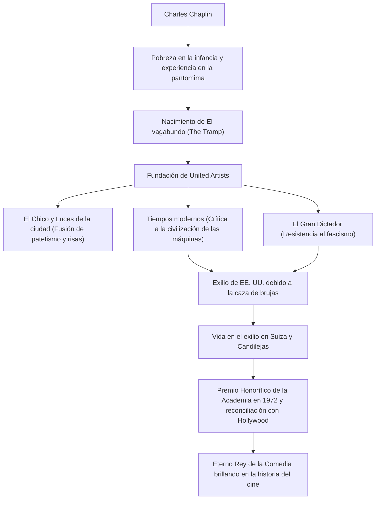

Charles Spencer Chaplin (16 de abril de 1889 - 25 de diciembre de 1977) fue un actor de cine, director, comediante, guionista y compositor de origen británico. Conocido como el "Rey de la Comedia", es ampliamente reconocido como una de las figuras más importantes e influyentes en la historia del cine. Su personaje de "El vagabundo (The Tramp)", con su icónica imagen de sombrero bombín, pequeño bigote, pantalones holgados y un bastón de bambú, sigue siendo amado por personas de todo el mundo. En este artículo, exploraremos la turbulenta vida de Chaplin, la profunda filosofía de sus obras y el impacto que dejó para la posteridad.

## Los orígenes de la comedia nacida de la pobreza y la soledad

Charles Chaplin nació en el seno de una familia pobre de Londres en 1889. Sus padres eran artistas de music hall, pero se divorciaron cuando él era pequeño. Chaplin tuvo una infancia dura: su padre murió prematuramente de alcoholismo y su madre sufrió problemas mentales y fue internada en una institución. Viviendo en la pobreza extrema, pasando por orfanatos y asilos, Chaplin bailaba y hacía pantomimas en las calles para ganar dinero y sobrevivir.

Esta dura experiencia temprana tuvo una influencia decisiva en la formación del personaje de "El vagabundo". El dolor de quienes luchan por sobrevivir en la base de la sociedad y, sin embargo, la dignidad humana y la esperanza que no se pierden. En la base del humor de Chaplin siempre fluye una mirada cálida hacia los más débiles y un agudo espíritu rebelde contra la irracionalidad de la sociedad.

## A la cima de Hollywood: El nacimiento y éxito de "El vagabundo"

En 1910, Chaplin viajó a los Estados Unidos durante una gira teatral. Fue descubierto por Mack Sennett, un pionero de la industria cinematográfica, y se unió a los estudios Keystone. Al debutar en el cine en 1914, estableció rápidamente el personaje de "El vagabundo" y alcanzó una popularidad explosiva.

Posteriormente, con cada cambio a Essanay, Mutual y First National, obtuvo salarios sin precedentes y una libertad creativa abrumadora. En 1919, junto con sus amigos Douglas Fairbanks, Mary Pickford y D.W. Griffith, fundó la compañía cinematográfica "United Artists". Se independizó del control del sistema de estudios de Hollywood y creó un entorno en el que podía controlar completamente sus propias obras.

## Perfeccionismo y filosofía visual: La fusión de "risas y lágrimas"

El mayor atractivo de las obras de Chaplin es la manera en que el profundo patetismo (melancolía) y el humanismo se mezclan exquisitamente dentro de las carcajadas del slapstick (comedia física). Dejó la famosa frase: "La vida es una tragedia vista en primer plano, pero una comedia en plano general", y esa filosofía cristaliza de manera brillante en obras maestras como *El Chico* (1921) y *Luces de la ciudad* (1931).

Chaplin también fue un perfeccionista implacable. Conocido por no permitir compromisos y repetir tomas cientos de veces hasta estar satisfecho, no solo escribió, dirigió y protagonizó sus películas, sino que también se encargó de todo, incluyendo la música y el montaje. Incluso con la llegada de la era del cine sonoro, se aferró a la expresividad del cine mudo por un tiempo. En *Tiempos modernos* (1936), satirizó mordazmente la civilización de las máquinas y la inhumanidad del capitalismo, al tiempo que presentaba la cumbre de la pantomima.

## Opresión política y vida en el exilio: La lucha contra su tiempo

La aguda mirada de Chaplin sobre la sociedad fue adquiriendo gradualmente un mensaje político. En *El Gran Dictador* de 1940, criticó frontalmente a Adolf Hitler y al fascismo, y pronunció un gran discurso histórico que perduraría en la historia del cine.

Sin embargo, en medio de la tormenta de la "Caza de brujas" (macartismo) que cubrió a los Estados Unidos después de la Segunda Guerra Mundial, las declaraciones de tendencia izquierdista y la actitud pacifista de Chaplin atrajeron feroces críticas de los conservadores. En 1952, mientras viajaba a Londres para el estreno de *Candilejas*, el gobierno estadounidense lo exilió de facto. Después de eso, se instaló con su familia en Corsier-sur-Vevey, Suiza, donde pasaría el resto de sus días tranquilamente.

## Un legado eterno: Impacto en las generaciones futuras

Chaplin volvió a pisar suelo estadounidense en 1972 para la ceremonia de los Premios Óscar, donde recibió un premio honorífico. El auditorio se deshizo en una ovación de pie que duró 12 minutos, logrando una histórica reconciliación con Hollywood.

Las obras y mensajes que dejó Chaplin siguen teniendo una inmensa influencia en los creadores y audiencias contemporáneas a lo largo del tiempo. Su actitud de denunciar la irracionalidad de la sociedad a través de la risa y, al mismo tiempo, creer hasta el final en el amor y la esperanza que posee el ser humano, demostró el máximo potencial que tiene el cine como medio.

### Flujo de la vida y logros de Chaplin

La vida de Chaplin fue, sin duda, como una película épica. Cada vez que vemos sus obras, reímos y lloramos una y otra vez, reafirmando la dignidad de vivir como seres humanos.
