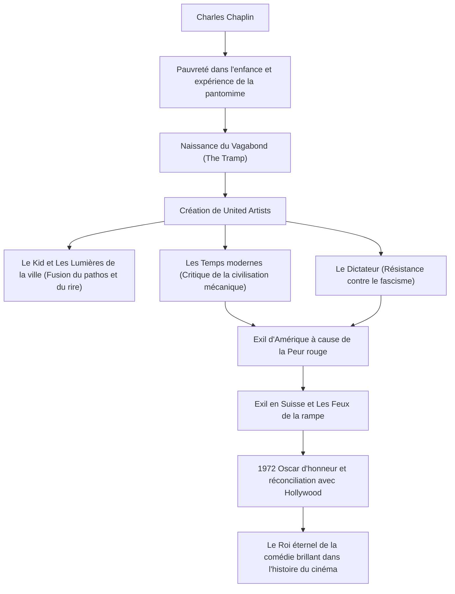

Charles Spencer Chaplin (16 avril 1889 - 25 décembre 1977) est un acteur, réalisateur, humoriste, scénariste et compositeur britannique. Surnommé le « Roi de la comédie », il est largement reconnu comme l'une des figures les plus importantes et influentes de l'histoire du cinéma. Son personnage de « Charlot » (The Tramp), avec sa silhouette emblématique - chapeau melon, petite moustache, pantalon baggy et canne en bambou - continue d'être aimé par les gens du monde entier. Cet article explore la vie tumultueuse de Chaplin, la profonde philosophie ancrée dans ses œuvres et l'impact qu'il a laissé sur les générations futures.

## L'origine de la comédie née de la pauvreté et de la solitude

Charles Chaplin est né en 1889 dans une famille pauvre de Londres. Ses deux parents étaient des artistes de music-hall, mais ils ont divorcé lorsqu'il était jeune. Il a vécu une enfance cruelle : son père, alcoolique, est mort prématurément, et sa mère, souffrant de troubles mentaux, a été placée en institution. Passant d'orphelinats en asiles dans une pauvreté extrême, Chaplin gagnait sa vie en dansant et en faisant des pantomimes dans la rue pour survivre.

C'est cette expérience originelle brutale qui a eu une influence décisive sur la formation ultérieure de son personnage du « Vagabond ». Le chagrin de ceux qui luttent pour survivre au bas de l'échelle sociale, et la dignité et l'espoir humains qui, malgré tout, ne se perdent jamais. Au fond de l'humour de Chaplin coule toujours un regard chaleureux pour les faibles et un esprit rebelle aiguisé contre l'absurdité de la société.

## Au sommet d'Hollywood : Naissance et succès du « Vagabond »

En 1910, lors d'une tournée théâtrale aux États-Unis, Chaplin est découvert par Mack Sennett, pionnier de l'industrie cinématographique, et rejoint la Keystone Company. Faisant ses débuts au cinéma en 1914, il impose rapidement son personnage du « Vagabond » et acquiert une popularité explosive.

Par la suite, à chaque changement de studio (Essanay, Mutual, First National), il obtient des cachets sans précédent et une liberté de création écrasante. En 1919, avec ses amis proches Douglas Fairbanks, Mary Pickford et D.W. Griffith, il fonde la société de production « United Artists ». S'affranchissant de la domination du système des studios hollywoodiens, il met en place un environnement où il peut contrôler entièrement ses propres œuvres.

## Perfectionnisme et philosophie visuelle : La fusion du « rire et des larmes »

Le plus grand charme des œuvres de Chaplin réside dans le mélange parfait entre un profond pathos (mélancolie) et de l'humanisme, au milieu des éclats de rire du slapstick (comédie burlesque). Il a laissé cette célèbre citation : « La vie est une tragédie quand on la regarde de près, mais une comédie quand on la regarde de loin ». Cette philosophie s'illustre brillamment dans des chefs-d'œuvre tels que *Le Kid* (1921) et *Les Lumières de la ville* (1931).

De plus, Chaplin était un perfectionniste absolu. Connu pour ne faire aucun compromis, il pouvait refaire des centaines de prises jusqu'à ce qu'il soit satisfait, et s'occupait non seulement du scénario, de la réalisation et du rôle principal, mais aussi de la musique et du montage. Même à l'avènement du cinéma parlant, il est resté fidèle un temps à la force d'expression du cinéma muet. Dans *Les Temps modernes* (1936), il a offert l'apogée de la pantomime tout en fustigeant la déshumanisation de la civilisation mécanique et du capitalisme.

## Répression politique et exil : Un combat contre son époque

Le regard acéré de Chaplin sur la société prend progressivement une dimension politique. Dans *Le Dictateur* (1940), il critique frontalement Adolf Hitler et le fascisme, livrant un discours historique qui restera dans les annales du cinéma.

Cependant, dans la tempête de la « Peur rouge » (maccarthysme) qui s'abat sur l'Amérique après la Seconde Guerre mondiale, les déclarations à tendance gauchiste et l'attitude pacifiste de Chaplin s'attirent les foudres des conservateurs. En 1952, alors qu'il se rend à Londres pour la première du film *Les Feux de la rampe*, le gouvernement américain lui interdit de facto le retour sur le territoire. Il s'installe ensuite avec sa famille à Corsier-sur-Vevey, en Suisse, où il passera le reste de sa vie dans la tranquillité.

## Un héritage éternel : L'impact sur les générations futures

Chaplin ne foule à nouveau le sol américain qu'en 1972, à l'occasion de la cérémonie des Oscars où il reçoit un prix honorifique. La salle lui réserve une ovation debout de 12 minutes, marquant une réconciliation historique avec Hollywood.

Les œuvres et les messages laissés par Chaplin continuent d'exercer une profonde influence sur les créateurs et le public contemporains, par-delà les époques. Son attitude consistant à dénoncer l'absurdité sociale par le rire, tout en croyant fermement en l'amour et l'espoir inhérents à l'être humain, a prouvé les possibilités ultimes du média qu'est le cinéma.

### Le parcours de la vie et des accomplissements de Chaplin

La vie de Chaplin ressemblait à s'y méprendre à un film grandiose. À chaque fois que nous regardons ses œuvres, nous rions et pleurons encore et encore, tout en redécouvrant la dignité de vivre en tant qu'être humain.
