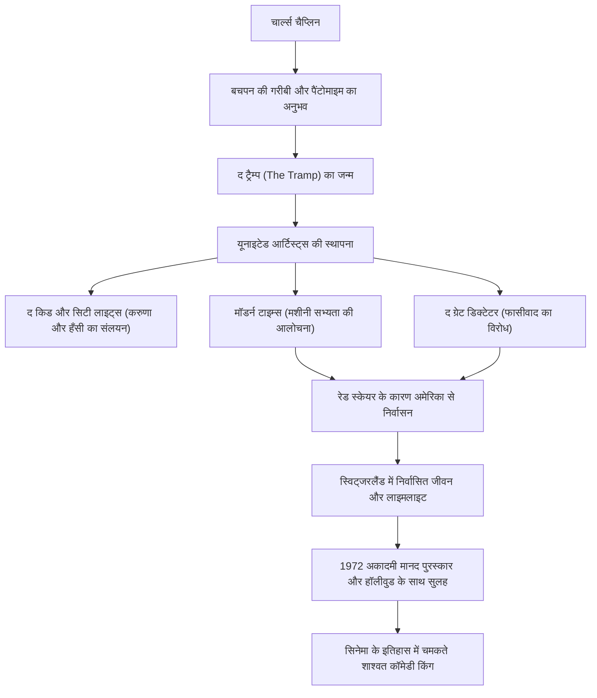

चार्ल्स स्पेंसर चैप्लिन (Charles Spencer Chaplin, 16 अप्रैल 1889 - 25 दिसंबर 1977) एक ब्रिटिश मूल के फिल्म अभिनेता, निर्देशक, हास्य अभिनेता, पटकथा लेखक और संगीतकार थे। 'कॉमेडी किंग' के रूप में जाने जाने वाले, उन्हें सिनेमा के इतिहास में सबसे महत्वपूर्ण और प्रभावशाली हस्तियों में से एक के रूप में व्यापक रूप से पहचाना जाता है। उनके द्वारा बनाया गया "द ट्रैम्प (The Tramp)" का किरदार - एक बॉलर टोपी, छोटी मूंछें, ढीली पैंट और बांस की छड़ी वाला एक प्रतिष्ठित रूप - दुनिया भर के लोगों द्वारा आज भी प्यार किया जाता है। इस लेख में, हम चैप्लिन के उथल-पुथल भरे जीवन, उनकी कृतियों में छिपे गहरे दर्शन और आने वाली पीढ़ियों पर उनके प्रभाव के बारे में जानेंगे।

## गरीबी और अकेलेपन से जन्मी कॉमेडी की उत्पत्ति

चार्ल्स चैप्लिन का जन्म 1889 में लंदन के एक गरीब परिवार में हुआ था। उनके माता-पिता दोनों संगीत हॉल के कलाकार थे, लेकिन जब वह छोटे थे तब उनका तलाक हो गया। उनके पिता की कम उम्र में शराब की लत से मृत्यु हो गई, और उनकी माँ मानसिक रूप से बीमार हो गईं और उन्हें एक संस्था में भर्ती कराया गया। अनाथालयों और वर्कहाउस में अत्यधिक गरीबी में जीते हुए, चैप्लिन ने पैसे कमाने और जीवित रहने के लिए सड़कों पर नृत्य और मूक अभिनय (pantomime) किया।

इस कठोर प्रारंभिक अनुभव ने बाद में "द ट्रैम्प" चरित्र के निर्माण पर निर्णायक प्रभाव डाला। समाज के निचले तबके में जीवित रहने के लिए संघर्ष कर रहे लोगों का दुख, और फिर भी न खोने वाली मानवीय गरिमा और उम्मीद। चैप्लिन के हास्य के मूल में हमेशा कमजोरों के प्रति एक गर्मजोशी भरा नजरिया और समाज के अन्याय के खिलाफ एक तेज विद्रोही भावना बहती है।

## हॉलीवुड के शिखर तक: "द ट्रैम्प" का जन्म और सफलता

1910 में, एक थियेटर कंपनी के दौरे पर अमेरिका की यात्रा करने वाले चैप्लिन को फिल्म उद्योग के अग्रणी मैक सेनेट द्वारा खोजा गया, और वह कीस्टोन स्टूडियो में शामिल हो गए। 1914 में अपने फिल्म डेब्यू के साथ, उन्होंने जल्दी ही "द ट्रैम्प" के चरित्र को स्थापित किया और विस्फोटक लोकप्रियता हासिल की।

इसके बाद, एस्साने, म्यूचुअल और फर्स्ट नेशनल के साथ हर बार आगे बढ़ते हुए, उन्हें अभूतपूर्व वेतन और उत्पादन की असीम स्वतंत्रता मिली। 1919 में, उन्होंने अपने दोस्तों डगलस फेयरबैंक्स, मैरी पिकफोर्ड और डी. डब्ल्यू. ग्रिफिथ के साथ फिल्म कंपनी "यूनाइटेड आर्टिस्ट्स" की स्थापना की। उन्होंने हॉलीवुड स्टूडियो सिस्टम के नियंत्रण से खुद को स्वतंत्र कर लिया और एक ऐसा माहौल तैयार किया जहां वे अपने काम को पूरी तरह से नियंत्रित कर सकते थे।

## पूर्णतावाद और दृश्य दर्शन: "हँसी और आँसू" का संलयन

चैप्लिन के काम का सबसे बड़ा आकर्षण यह है कि स्लैपस्टिक (शारीरिक कॉमेडी) की हँसी के भीतर गहरे पैथोस (करुणा) और मानवतावाद को उत्कृष्ट रूप से मिलाया गया है। उन्होंने मशहूर बात कही थी, "जिंदगी करीब से देखने पर एक त्रासदी है, लेकिन दूर से देखने पर एक कॉमेडी।" यह दर्शन 'द किड' (1921) और 'सिटी लाइट्स' (1931) जैसी उत्कृष्ट कृतियों में शानदार ढंग से फलीभूत हुआ है।

चैप्लिन एक पूर्णतावादी भी थे। बिना किसी समझौते के, वे संतुष्ट होने तक सैकड़ों बार टेक लेने के लिए जाने जाते थे। उन्होंने न केवल लेखन, निर्देशन और अभिनय किया, बल्कि संगीत और संपादन सहित सब कुछ खुद संभाला। बोलती फिल्मों (टॉकीज़) के युग के आगमन के बावजूद, वे कुछ समय के लिए मूक (साइलेंट) फिल्म की अभिव्यंजना से जुड़े रहे। 'मॉडर्न टाइम्स' (1936) में, उन्होंने मशीनी सभ्यता और पूंजीवाद की अमानवीयता पर तीखा व्यंग्य करते हुए पैंटोमाइम का शिखर प्रस्तुत किया।

## राजनीतिक उत्पीड़न और निर्वासन में जीवन: समय के साथ संघर्ष

समाज पर चैप्लिन की पैनी नजर धीरे-धीरे राजनीतिक संदेश देने लगी। 1940 की 'द ग्रेट डिक्टेटर' में, उन्होंने अडोल्फ हिटलर और फासीवाद की सीधी आलोचना की, और सिनेमा के इतिहास में एक ऐतिहासिक और महान भाषण दिया।

हालांकि, द्वितीय विश्व युद्ध के बाद अमेरिका में "रेड स्केयर (मैकार्थीवाद)" के तूफान के बीच, चैप्लिन की वामपंथी झुकाव वाली टिप्पणियों और शांतिवादी रवैये ने रूढ़िवादियों से भयंकर आलोचना को आकर्षित किया। 1952 में, जब वह 'लाइमलाइट' के प्रीमियर के लिए लंदन जा रहे थे, तो अमेरिकी सरकार ने उन्हें प्रभावी रूप से देश से निर्वासित कर दिया। उसके बाद, वह अपने परिवार के साथ कोर्सियर-सुर-वेवे, स्विट्जरलैंड में बस गए, जहाँ उन्होंने अपना शेष जीवन शांति से बिताया।

## अनन्त विरासत: भावी पीढ़ियों पर प्रभाव

चैप्लिन ने 1972 में अकादमी मानद पुरस्कार समारोह के लिए फिर से अमेरिकी धरती पर कदम रखा। हॉल में 12 मिनट तक खड़े होकर तालियां (स्टैंडिंग ओवेशन) बजीं, और हॉलीवुड के साथ एक ऐतिहासिक सुलह हुई।

चैप्लिन की कृतियां और संदेश समय से परे आधुनिक रचनाकारों और दर्शकों को गहराई से प्रभावित करते आ रहे हैं। हंसी के माध्यम से समाज के अन्यायों को उजागर करने और साथ ही मनुष्यों के प्यार और आशा पर अंत तक विश्वास करने के उनके रवैये ने फिल्म मीडिया की अंतिम क्षमता को साबित कर दिया।

### चैप्लिन का जीवन और उपलब्धियों का प्रवाह

चैप्लिन का जीवन वास्तव में एक महाकाव्य फिल्म की तरह था। हर बार जब हम उनकी रचनाओं को देखते हैं, तो हम बार-बार हंसते और रोते हैं, और एक इंसान के रूप में जीने की गरिमा की फिर से पुष्टि करते हैं।
