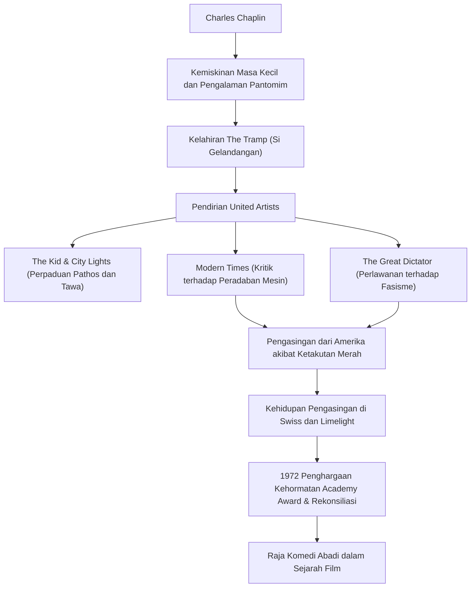

Charles Spencer Chaplin (16 April 1889 - 25 Desember 1977) adalah seorang aktor film, sutradara, komedian, penulis skenario, dan komposer asal Inggris. Dikenal dengan julukan "Raja Komedi", ia secara luas diakui sebagai salah satu tokoh paling penting dan berpengaruh dalam sejarah perfilman. Karakter "The Tramp" (Si Gelandangan Kecil) yang diciptakannya, dengan penampilan ikoniknya berupa topi bowler, kumis sikat gigi, celana baggy, dan tongkat bambu, terus dicintai oleh orang-orang di seluruh dunia. Artikel ini akan mengupas kehidupan Chaplin yang penuh gejolak, filosofi mendalam yang terkandung dalam karya-karyanya, serta pengaruhnya bagi generasi mendatang.

## Titik Awal Komedi yang Lahir dari Kemiskinan dan Kesepian

Charles Chaplin lahir pada tahun 1889 dari keluarga miskin di London. Kedua orang tuanya adalah penghibur gedung pertunjukan musik, tetapi mereka bercerai saat ia masih kecil. Ia menghabiskan masa kecil yang keras karena ayahnya meninggal muda akibat alkoholisme dan ibunya dirawat di rumah sakit jiwa karena gangguan mental. Di tengah kemiskinan ekstrem saat berpindah-pindah dari panti asuhan dan rumah kerja (workhouse), Chaplin menari di jalanan dan menampilkan pantomim untuk mendapatkan uang demi bertahan hidup.

Pengalaman awal yang keras inilah yang memberikan pengaruh krusial dalam pembentukan karakter "The Tramp" di kemudian hari. Kesedihan orang-orang yang berjuang untuk hidup di dasar masyarakat, namun tetap tidak kehilangan martabat dan harapan kemanusiaannya. Di dasar komedi Chaplin, selalu mengalir pandangan hangat terhadap kaum lemah dan semangat pemberontakan yang tajam terhadap absurditas sosial.

## Menuju Puncak Hollywood: Kelahiran dan Kesuksesan "The Tramp"

Pada tahun 1910, saat bepergian ke Amerika dalam tur kelompok teater, Chaplin ditemukan oleh pelopor industri film Mack Sennett dan bergabung dengan Keystone Studios. Setelah debut filmnya pada tahun 1914, ia dengan cepat memantapkan karakter "The Tramp" dan mendapatkan popularitas yang luar biasa.

Setelah itu, setiap kali berpindah ke Essanay, Mutual, dan First National, ia memperoleh bayaran yang luar biasa dan kebebasan produksi yang sangat besar. Pada tahun 1919, ia mendirikan perusahaan film "United Artists" bersama sahabat-sahabatnya Douglas Fairbanks, Mary Pickford, dan D.W. Griffith. Ia berhasil membebaskan diri dari kendali sistem studio Hollywood dan menciptakan lingkungan di mana ia bisa sepenuhnya mengendalikan karya-karyanya sendiri.

## Kesempurnaan dan Filosofi Visual: Perpaduan "Tawa dan Air Mata"

Daya tarik terbesar dari karya Chaplin adalah bahwa dalam tawa terbahak-bahak dari komedi slapstick, terdapat perpaduan sempurna antara pathos (kesedihan mendalam) dan humanisme. Ia meninggalkan kutipan terkenal, "Hidup adalah sebuah tragedi jika dilihat dari dekat, namun menjadi sebuah komedi jika dilihat dari jauh", dan filosofi ini terwujud dengan indah dalam mahakarya seperti "The Kid" (1921) dan "City Lights" (1931).

Selain itu, Chaplin juga merupakan seorang perfeksionis sejati. Dikenal karena tidak pernah berkompromi dan mengulang ratusan pengambilan gambar hingga ia puas, ia tidak hanya menulis skenario, menyutradarai, dan membintangi film, tetapi juga menangani semuanya sendiri, termasuk musik dan pengeditan. Bahkan ketika era film bersuara (talkies) tiba, ia tetap bersikeras pada kekuatan ekspresi film bisu (silent) untuk sementara waktu. Dalam "Modern Times" (1936), ia mengkritik keras peradaban mesin dan ketidakmanusiawian kapitalisme sekaligus menampilkan puncak dari pantomim.

## Penindasan Politik dan Pengasingan: Perjuangan Melawan Zaman

Pandangan tajam Chaplin terhadap masyarakat perlahan-lahan mulai mengandung pesan politik. Dalam "The Great Dictator" pada tahun 1940, ia secara terang-terangan mengkritik Adolf Hitler dan fasisme, serta menyampaikan pidato bersejarah yang dikenang dalam sejarah film.

Namun, di tengah badai "Ketakutan Merah" (McCarthyism) yang menyelimuti Amerika pasca-Perang Dunia II, pernyataan-pernyataan Chaplin yang dianggap condong ke kiri dan sikap pasifisnya mendapat kecaman keras dari kaum konservatif. Pada tahun 1952, saat dalam perjalanan ke London untuk pemutaran perdana film "Limelight", ia menerima larangan masuk ke Amerika dari pemerintah AS secara de facto. Setelah itu, ia menetap di Corsier-sur-Vevey, Swiss, bersama keluarganya dan menjalani sisa hidup yang tenang.

## Warisan Abadi: Pengaruh bagi Generasi Mendatang

Chaplin baru kembali menginjakkan kaki di tanah Amerika pada tahun 1972 dalam upacara penerimaan Penghargaan Kehormatan Academy Award (Oscar). Acara tersebut diselimuti standing ovation yang berlangsung selama 12 menit, menandai rekonsiliasi bersejarah dengan Hollywood.

Karya dan pesan yang ditinggalkan Chaplin terus memberikan pengaruh besar bagi para kreator dan penonton masa kini, melintasi batas waktu. Sikapnya yang mengutuk absurditas sosial melalui tawa, sekaligus meyakini sepenuhnya cinta dan harapan yang dimiliki manusia, membuktikan potensi tertinggi yang dimiliki oleh media film.

### Alur Kehidupan dan Prestasi Chaplin

Kehidupan Chaplin benar-benar layaknya sebuah film epik. Setiap kali kita menonton karya-karyanya, kita tertawa dan menangis berulang kali, sambil menegaskan kembali betapa berharganya hidup sebagai manusia.
