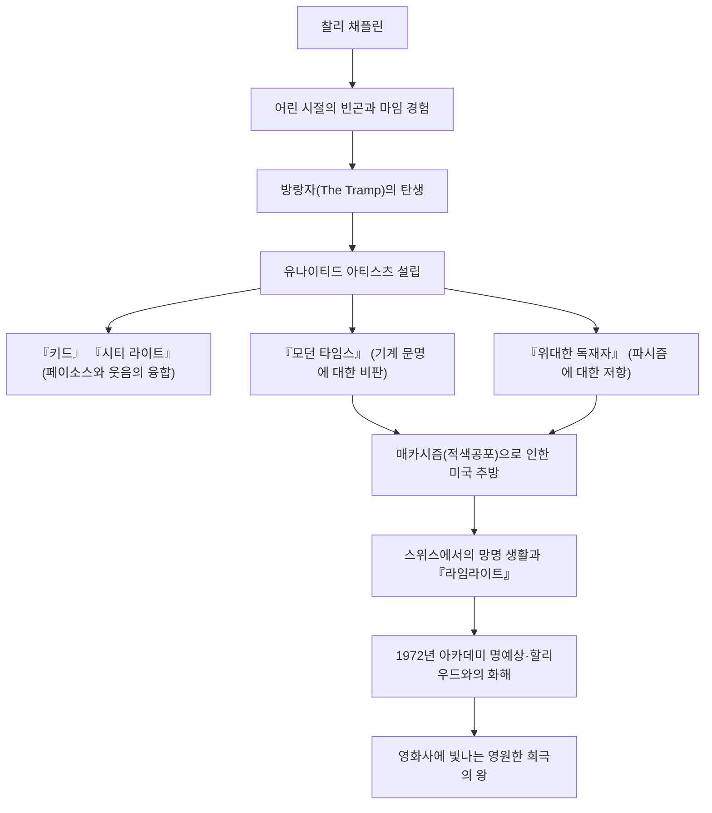

찰스 스펜서 채플린(Charles Spencer Chaplin, 1889년 4월 16일 - 1977년 12월 25일)은 영국 출신의 영화 배우, 감독, 코미디언, 각본가이자 작곡가입니다. '희극의 왕'이라는 별명을 가진 그는 영화사에서 가장 중요하고 영향력 있는 인물 중 한 명으로 널리 인정받고 있습니다. 그가 창조한 '작은 방랑자(The Tramp)' 캐릭터는 중절모와 콧수염, 헐렁한 바지와 대나무 지팡이라는 상징적인 모습으로 전 세계 사람들에게 계속해서 사랑받고 있습니다. 본 기사에서는 채플린의 파란만장한 생애, 작품에 담긴 깊은 철학, 그리고 후세에 미친 영향에 대해 살펴봅니다.

## 빈곤과 고독에서 태어난 희극의 원점

찰리 채플린은 1889년 런던의 가난한 가정에서 태어났습니다. 부모님은 모두 뮤직홀의 예인이었지만 그가 어릴 적 이혼했고, 아버지는 알코올 중독으로 일찍 세상을 떠났으며, 어머니는 정신 질환으로 시설에 수용되는 가혹한 어린 시절을 보냈습니다. 고아원과 구빈원을 전전하는 극심한 빈곤 속에서 채플린은 살아남기 위해 거리에서 춤을 추고 마임을 선보이며 푼돈을 벌었습니다.

이러한 가혹한 원체험이야말로 훗날 '방랑자' 캐릭터 형성에 결정적인 영향을 미쳤습니다. 사회 밑바닥에서 열심히 살아가는 사람들의 비애와 그럼에도 잃지 않는 인간의 존엄과 희망. 채플린의 웃음 기저에는 항상 약자에 대한 따뜻한 시선과 사회의 부조리에 대한 날카로운 반항 정신이 흐르고 있습니다.

## 할리우드의 정점으로: '작은 방랑자'의 탄생과 성공

1910년, 극단의 순회공연으로 미국에 건너간 채플린은 영화계의 선구자인 맥 세넷에게 발탁되어 키스톤 사에 입사합니다. 1914년 영화에 데뷔하자마자 순식간에 '방랑자' 캐릭터를 확립하고 폭발적인 인기를 얻었습니다.

이후 에사네이 사, 뮤추얼 사, 퍼스트 내셔널 사로 이적을 거듭할 때마다 파격적인 출연료와 압도적인 제작의 자유를 얻게 됩니다. 1919년에는 절친한 친구인 더글러스 페어뱅크스, 메리 픽포드, D.W. 그리피스와 함께 영화사 '유나이티드 아티스츠'를 설립했습니다. 할리우드 스튜디오 시스템의 지배에서 독립하여 자신의 작품을 완전히 통제할 수 있는 환경을 갖추게 되었습니다.

## 완벽주의와 영상 철학: '웃음과 눈물'의 융합

채플린 작품의 가장 큰 매력은 슬랩스틱(우당탕탕 코미디)의 폭소 속에 깊은 페이소스(애수)와 휴머니즘이 절묘하게 혼합되어 있다는 점입니다. 그는 "인생은 가까이서 보면 비극이지만 멀리서 보면 희극이다"라는 유명한 말을 남겼는데, 그 철학은 『키드』(1921년)나 『시티 라이트』(1931년)와 같은 걸작에서 훌륭하게 결실을 맺고 있습니다.

또한 채플린은 철저한 완벽주의자이기도 했습니다. 타협을 허용하지 않고 납득할 때까지 수백 번이라도 테이크를 거듭하는 것으로 알려져 있으며, 각본, 감독, 주연뿐만 아니라 음악과 편집까지 모두 스스로 처리했습니다. 발성 영화(토키)의 시대가 도래했음에도 그는 한동안 무성 영화의 표현력에 고집했고, 『모던 타임스』(1936년)에서는 기계 문명과 자본주의의 비인간성을 통렬하게 풍자하면서 마임의 극치를 제시했습니다.

## 정치적 탄압과 망명 생활: 시대와의 투쟁

채플린의 사회를 향한 날카로운 시선은 점차 정치적인 메시지를 띠게 됩니다. 1940년의 『위대한 독재자』에서는 아돌프 히틀러와 파시즘을 정면으로 비판하고, 영화사에 남을 역사적인 대연설을 펼쳤습니다.

그러나 제2차 세계대전 후 미국을 덮친 '매카시즘(적색공포)'의 폭풍 속에서 채플린의 좌파적인 발언이나 평화주의적인 태도는 보수파로부터 거센 비난을 받게 됩니다. 1952년, 영화 『라임라이트』의 프리미어 상영을 위해 런던으로 향하던 그는 미국 정부로부터 사실상의 국외 추방 처분을 받았습니다. 이후 그는 가족과 함께 스위스의 코르시에쉬르베베에 정착하여 조용한 여생을 보내게 됩니다.

## 영원한 유산: 후세에 미친 영향

채플린이 미국의 땅을 다시 밟은 것은 1972년 아카데미 명예상 시상식 때였습니다. 식장에는 12분 동안이나 기립 박수가 이어졌고, 할리우드와의 역사적인 화해가 이루어졌습니다.

채플린이 남긴 작품과 메시지는 시대를 초월하여 현대의 크리에이터와 관객들에게 지대한 영향을 계속 미치고 있습니다. 웃음을 통해 사회의 부조리를 고발하고 동시에 인간이 가진 사랑과 희망을 끝까지 믿은 그의 자세는 영화라는 매체가 가진 궁극의 가능성을 증명했습니다.

### 채플린의 생애와 업적 흐름

채플린의 생애는 그야말로 한 편의 장대한 영화 같았습니다. 그의 작품을 볼 때마다 우리는 몇 번이고 웃고, 또 눈물을 흘리면서 인간으로서 살아가는 존엄성을 재확인하게 됩니다.
