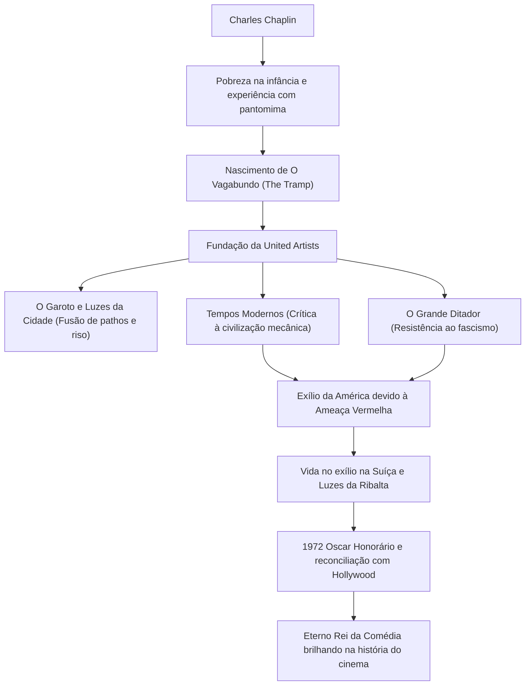

Charles Spencer Chaplin (16 de abril de 1889 - 25 de dezembro de 1977) foi um ator, diretor, comediante, roteirista e compositor britânico. Conhecido como o "Rei da Comédia", ele é amplamente reconhecido como uma das figuras mais importantes e influentes da história do cinema. Seu personagem "O Vagabundo" (The Tramp), com sua aparência icônica de chapéu-coco, bigodinho, calças largas e bengala de bambu, continua sendo amado por pessoas em todo o mundo. Neste artigo, exploraremos a vida turbulenta de Chaplin, a profunda filosofia embutida em suas obras e o impacto que ele deixou para as gerações futuras.

## A origem da comédia nascida da pobreza e da solidão

Charles Chaplin nasceu em 1889, em uma família pobre de Londres. Seus pais eram ambos artistas de music hall, mas se divorciaram quando ele era jovem. Ele viveu uma infância cruel: seu pai morreu prematuramente de alcoolismo, e sua mãe sofreu de doença mental e foi internada em uma instituição. Passando de orfanatos a asilos em extrema pobreza, Chaplin ganhava a vida dançando e fazendo pantomima nas ruas para sobreviver.

Foi essa dura experiência inicial que teve uma influência decisiva na formação posterior de seu personagem "O Vagabundo". A tristeza das pessoas que lutam desesperadamente para sobreviver na base da sociedade, e a dignidade e esperança humanas que, apesar de tudo, não se perdem. Na raiz do humor de Chaplin, sempre flui um olhar caloroso para os fracos e um espírito rebelde aguçado contra a absurdidade da sociedade.

## Ao topo de Hollywood: O nascimento e o sucesso de "O Vagabundo"

Em 1910, durante uma turnê teatral nos Estados Unidos, Chaplin foi descoberto por Mack Sennett, um pioneiro da indústria cinematográfica, e juntou-se à Keystone Company. Ao fazer sua estreia no cinema em 1914, ele rapidamente estabeleceu o personagem de "O Vagabundo" e ganhou popularidade explosiva.

Posteriormente, cada vez que mudava de estúdio (Essanay, Mutual, First National), ele obtinha cachês sem precedentes e uma liberdade criativa esmagadora. Em 1919, junto com seus amigos íntimos Douglas Fairbanks, Mary Pickford e D.W. Griffith, ele fundou a produtora de cinema "United Artists". Libertando-se do domínio do sistema de estúdios de Hollywood, ele criou um ambiente onde podia controlar completamente seus próprios trabalhos.

## Perfeccionismo e filosofia visual: A fusão de "risos e lágrimas"

O maior encanto das obras de Chaplin é como o profundo pathos (melancolia) e o humanismo se misturam perfeitamente às gargalhadas da comédia pastelão (slapstick). Ele deixou a famosa frase: "A vida é uma tragédia quando vista de perto, mas uma comédia quando vista de longe", e essa filosofia foi brilhantemente concretizada em obras-primas como *O Garoto* (1921) e *Luzes da Cidade* (1931).

Além disso, Chaplin era um perfeccionista absoluto. Conhecido por não fazer concessões, ele podia refazer centenas de tomadas até ficar satisfeito, e não apenas cuidava do roteiro, direção e atuação principal, mas também da música e da edição. Mesmo com a chegada da era do cinema falado, ele se apegou por um tempo ao poder expressivo do cinema mudo. Em *Tempos Modernos* (1936), ele apresentou o ápice da pantomima ao mesmo tempo que satirizou severamente a desumanização da civilização mecânica e do capitalismo.

## Repressão política e vida no exílio: Uma luta contra a sua época

O olhar aguçado de Chaplin sobre a sociedade gradualmente assumiu um tom mais político. Em *O Grande Ditador* (1940), ele criticou frontalmente Adolf Hitler e o fascismo, proferindo um discurso histórico que ficou marcado na história do cinema.

No entanto, em meio à tempestade da "Ameaça Vermelha" (Macarthismo) que cobriu a América após a Segunda Guerra Mundial, as declarações de inclinação esquerdista e a postura pacifista de Chaplin atraíram fortes críticas dos conservadores. Em 1952, enquanto estava a caminho de Londres para a estreia do filme *Luzes da Ribalta*, o governo dos Estados Unidos praticamente o baniu do país. Posteriormente, ele se estabeleceu com sua família em Corsier-sur-Vevey, na Suíça, onde passou o resto de sua vida em paz.

## Um legado eterno: O impacto nas gerações futuras

Chaplin só pisou em solo americano novamente em 1972, para a cerimônia de entrega do Oscar Honorário. O local foi tomado por uma ovação de pé de 12 minutos, marcando uma reconciliação histórica com Hollywood.

As obras e as mensagens deixadas por Chaplin continuam a influenciar profundamente criadores e públicos contemporâneos, através do tempo. Sua atitude de denunciar a absurdidade da sociedade por meio do riso, enquanto acreditava firmemente no amor e na esperança inerentes aos seres humanos, provou as possibilidades máximas da mídia cinematográfica.

### Fluxo da vida e conquistas de Chaplin

A vida de Chaplin foi como um filme épico. Toda vez que assistimos às suas obras, rimos e choramos repetidamente, redescobrindo a dignidade de viver como um ser humano.
