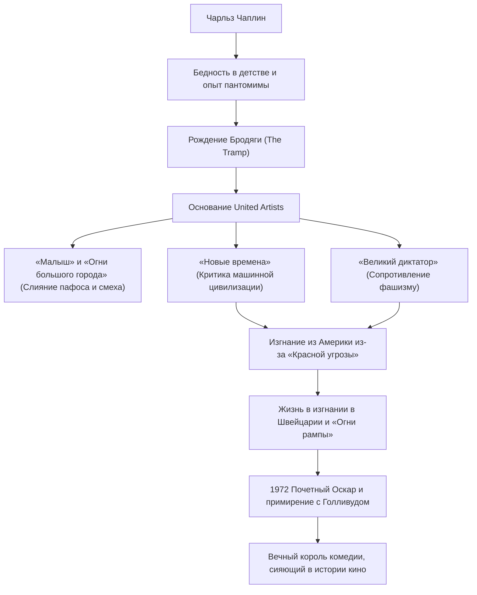

Чарльз Спенсер Чаплин (16 апреля 1889 г. - 25 декабря 1977 г.) — британский киноактер, режиссер, комик, сценарист и композитор. Известный как «Король комедии», он широко признан одной из самых важных и влиятельных фигур в истории кино. Созданный им образ «Бродяги» (The Tramp) — с его культовым котелком, маленькими усиками, мешковатыми штанами и бамбуковой тростью — продолжает пользоваться любовью людей во всем мире. В этой статье мы рассмотрим бурную жизнь Чаплина, глубокую философию, заложенную в его произведениях, и влияние, которое он оказал на будущие поколения.

## Истоки комедии, рожденные из бедности и одиночества

Чарльз Чаплин родился в 1889 году в бедной лондонской семье. Его родители были артистами мюзик-холла, но развелись, когда он был еще маленьким. Он пережил суровое детство: отец рано умер от алкоголизма, а мать страдала психическим заболеванием и была помещена в лечебницу. Скитаясь по приютам и работным домам в крайней нищете, Чаплин зарабатывал на хлеб, танцуя и показывая пантомиму на улицах, чтобы выжить.

Именно этот жестокий ранний опыт оказал решающее влияние на формирование образа «Бродяги» в будущем. Печаль людей, отчаянно пытающихся выжить на социальном дне, и человеческое достоинство и надежда, которые, несмотря ни на что, не теряются. В основе юмора Чаплина всегда лежит теплое отношение к слабым и острый дух бунтарства против абсурдности общества.

## На вершине Голливуда: Рождение и успех «Бродяги»

В 1910 году, во время гастролей театральной труппы в США, Чаплина заметил пионер киноиндустрии Мак Сеннет, и он присоединился к компании Keystone. Дебютировав в кино в 1914 году, он быстро утвердил образ «Бродяги» и приобрел взрывную популярность.

Впоследствии, переходя из одной студии в другую (Essanay, Mutual, First National), он добивался беспрецедентных гонораров и подавляющей творческой свободы. В 1919 году вместе со своими близкими друзьями Дугласом Фэрбенксом, Мэри Пикфорд и Дэвидом Уорком Гриффитом он основал кинокомпанию United Artists. Освободившись от господства голливудской студийной системы, он создал среду, в которой мог полностью контролировать свои собственные произведения.

## Перфекционизм и визуальная философия: Слияние «смеха и слез»

Главное очарование произведений Чаплина заключается в том, что в них сквозь взрывной смех фарса (слэпстика) идеально вплетены глубокий пафос (печаль) и гуманизм. Он оставил знаменитые слова: «Жизнь — это трагедия, если смотреть на нее крупным планом, но комедия, если смотреть издали», и эта философия блестяще воплотилась в таких шедеврах, как *«Малыш»* (1921) и *«Огни большого города»* (1931).

Кроме того, Чаплин был абсолютным перфекционистом. Известно, что он не терпел компромиссов и мог делать сотни дублей, пока не был удовлетворен, и не только писал сценарии, режиссировал и играл главные роли, но и сам занимался музыкой и монтажом. Даже с наступлением эры звукового кино он еще некоторое время был привержен выразительной силе немого кино, а в фильме *«Новые времена»* (1936) он представил вершину пантомимы, одновременно подвергнув резкой сатире дегуманизацию машинной цивилизации и капитализма.

## Политические репрессии и жизнь в изгнании: Борьба с эпохой

Острый взгляд Чаплина на общество постепенно приобретал все большую политическую окраску. В фильме *«Великий диктатор»* (1940) он подверг прямой критике Адольфа Гитлера и фашизм, произнеся историческую речь, которая осталась в истории кино.

Однако в буре «Красной угрозы» (маккартизма), охватившей Америку после Второй мировой войны, левые высказывания и пацифистская позиция Чаплина подверглись резкой критике со стороны консерваторов. В 1952 году, когда он направлялся в Лондон на премьеру фильма *«Огни рампы»*, правительство США фактически запретило ему въезд в страну. Впоследствии он вместе с семьей поселился в Корсье-сюр-Веве, в Швейцарии, где и провел остаток своей жизни в спокойствии.

## Вечное наследие: Влияние на будущие поколения

Чаплин снова ступил на американскую землю лишь в 1972 году, на церемонии вручения почетной премии Оскар. Зал устроил ему 12-минутную овацию стоя, ознаменовав историческое примирение с Голливудом.

Произведения и послания, оставленные Чаплином, продолжают оказывать огромное влияние на современных творцов и зрителей сквозь время. Его позиция — обличать абсурдность общества через смех, но при этом твердо верить в любовь и надежду, присущие человеку, — доказала высшие возможности кинематографа как медиа.

### Жизненный путь и достижения Чаплина

Жизнь Чаплина была подобна одному грандиозному фильму. Каждый раз, когда мы смотрим его произведения, мы снова и снова смеемся и плачем, заново открывая для себя ценность человеческой жизни.
