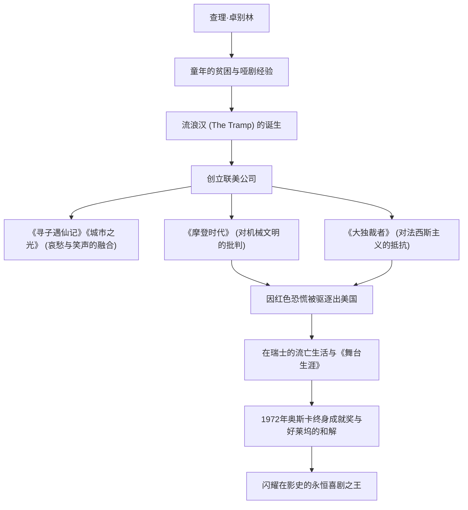

查尔斯·斯宾塞·卓别林（Charles Spencer Chaplin，1889年4月16日 - 1977年12月25日）是一位出生于英国的电影演员、导演、喜剧演员、编剧和作曲家。享有“喜剧之王”美誉的他，被广泛认为是电影史上最重要且最具影响力的人物之一。他所创造的“流浪汉（The Tramp）”形象——头戴圆顶硬礼帽、留着小胡子、穿着宽松的裤子、手持竹拐杖的标志性装扮——至今仍被世界各地的人们所喜爱。本文将带您了解卓别林波澜壮阔的一生、作品中蕴含的深刻哲学，以及对后世产生的影响。

## 诞生于贫困与孤独的喜剧原点

查理·卓别林于1889年出生在伦敦的一个贫苦家庭。他的父母都是音乐厅的艺人，但在他幼年时便离异，父亲因酗酒早逝，母亲则因精神疾病被送入收容所，这使他度过了一个残酷的童年。在辗转于孤儿院和济贫院的赤贫生活中，卓别林为了生存，在街头跳舞、表演哑剧以赚取微薄的日薪。

这种残酷的早期经历，对后来“流浪汉”形象的塑造产生了决定性的影响。在社会底层拼命生存的人们的悲哀，以及尽管如此仍未丧失的人性尊严与希望。卓别林的喜剧根底里，始终流淌着对弱者的温暖目光，以及对社会荒谬的强烈反叛精神。

## 走向好莱坞巅峰：“小流浪汉”的诞生与成功

1910年，卓别林随剧团巡演来到美国，被电影界先驱麦克·塞内特发掘，加入了启斯东（Keystone）电影公司。1914年，他迎来了电影处女作，并在转瞬之间确立了“流浪汉”形象，获得了爆发性的人气。

此后，他经历了埃森奈（Essanay）、互助（Mutual）和第一国家（First National）等公司的多次跳槽，每次都获得了破天荒的片酬和压倒性的创作自由。1919年，他与好友道格拉斯·范朋克、玛丽·毕克馥以及D·W·格里菲斯共同创立了“联美（United Artists）”电影公司。他摆脱了好莱坞制片厂体制的控制，建立了一个能够完全掌控自己作品的环境。

## 完美主义与影像哲学：“笑与泪”的融合

卓别林作品最大的魅力，在于在闹剧（Slapstick）的爆笑中，巧妙地融入了深沉的哀愁（Pathos）与人道主义。他留下了一句名言：“人生近看是悲剧，远看是喜剧”，这种哲学在《寻子遇仙记》（1921年）和《城市之光》（1931年）等杰作中得到了完美的结晶。

此外，卓别林也是一位彻头彻尾的完美主义者。他以绝不妥协、重拍几百次直到满意为止而闻名。他不仅担任编剧、导演和主演，甚至连音乐和剪辑都亲自操刀。即使有声电影时代到来，他也在一段时间内坚持无声电影的表现力，在《摩登时代》（1936年）中，他在强烈讽刺机械文明和资本主义非人性的同时，展示了哑剧的极致。

## 政治打压与流亡生活：与时代的抗争

卓别林对社会的敏锐目光，逐渐带有政治信息色彩。在1940年的《大独裁者》中，他正面批判了阿道夫·希特勒和法西斯主义，发表了名留影史的历史性伟大演讲。

然而，在第二次世界大战后笼罩美国的“麦卡锡主义（红色恐慌）”风暴中，卓别林看似左翼的言论和和平主义态度遭到了保守派的猛烈抨击。1952年，在前往伦敦参加电影《舞台生涯》首映式的途中，他遭到了美国政府实质上的驱逐出境。此后，他与家人定居在瑞士的科尔西耶-苏-沃韦，度过了平静的余生。

## 永恒的遗产：对后世的影响

卓别林再次踏上美国的土地，是在1972年的奥斯卡终身成就奖颁奖典礼上。全场起立鼓掌长达12分钟，标志着他与好莱坞历史性的和解。

卓别林留下的作品与信息，跨越时代，持续对现代创作者和观众产生着巨大的影响。他通过笑声控诉社会的荒谬，同时坚信人类拥有的爱与希望的态度，证明了电影这一媒介所具有的终极可能性。

### 卓别林的一生与成就流程

卓别林的一生，宛如一部宏大的电影。每当观看他的作品时，我们在无数次欢笑与流泪中，重新确认了作为人而活着的尊严。
