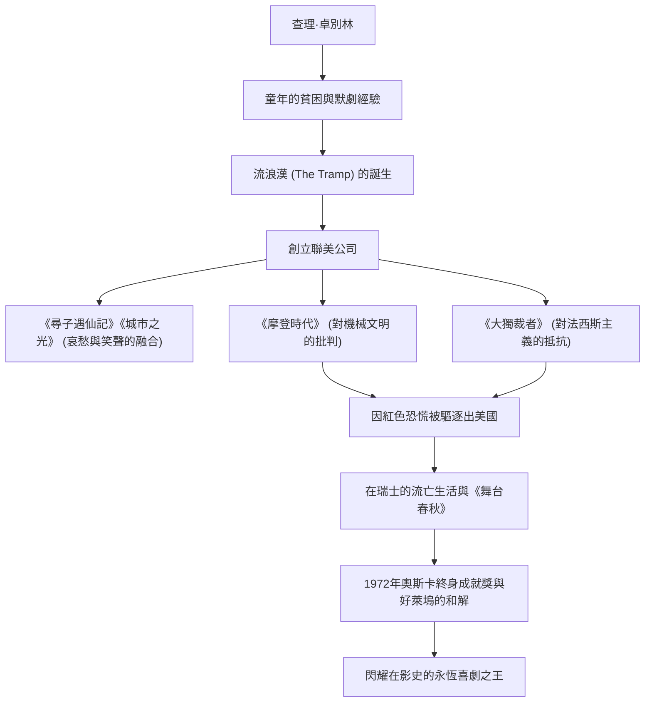

查爾斯·史賓賽·卓別林（Charles Spencer Chaplin，1889年4月16日 - 1977年12月25日）是一位出生於英國的電影演員、導演、喜劇演員、編劇和作曲家。享有「喜劇之王」美譽的他，被廣泛認為是電影史上最重要且最具影響力的人物之一。他所創造的「流浪漢（The Tramp）」形象——頭戴圓頂硬禮帽、留著小鬍子、穿著寬鬆的褲子、手持竹拐杖的標誌性裝扮——至今仍被世界各地的人們所喜愛。本文將帶您了解卓別林波瀾壯闊的一生、作品中蘊含的深刻哲學，以及對後世產生的影響。

## 誕生於貧困與孤獨的喜劇原點

查理·卓別林於1889年出生在倫敦的一個貧苦家庭。他的父母都是音樂廳的藝人，但在他幼年時便離異，父親因酗酒早逝，母親則因精神疾病被送入收容所，這使他度過了一個殘酷的童年。在輾轉於孤兒院和濟貧院的赤貧生活中，卓別林為了生存，在街頭跳舞、表演默劇以賺取微薄的日薪。

這種殘酷的早期經歷，對後來「流浪漢」形象的塑造產生了決定性的影響。在社會底層拼命生存的人們的悲哀，以及儘管如此仍未喪失的人性尊嚴與希望。卓別林的喜劇根底裡，始終流淌著對弱者的溫暖目光，以及對社會荒謬的強烈反叛精神。

## 走向好萊塢巔峰：「小流浪漢」的誕生與成功

1910年，卓別林隨劇團巡演來到美國，被電影界先驅麥克·塞內特發掘，加入了啟斯東（Keystone）電影公司。1914年，他迎來了電影處女作，並在轉瞬之間確立了「流浪漢」形象，獲得了爆發性的人氣。

此後，他經歷了埃森奈（Essanay）、互助（Mutual）和第一國家（First National）等公司的多次跳槽，每次都獲得了破天荒的片酬和壓倒性的創作自由。1919年，他與好友道格拉斯·范朋克、瑪麗·畢克馥以及D·W·格里菲斯共同創立了「聯美（United Artists）」電影公司。他擺脫了好萊塢製片廠體制的控制，建立了一個能夠完全掌控自己作品的環境。

## 完美主義與影像哲學：「笑與淚」的融合

卓別林作品最大的魅力，在於在鬧劇（Slapstick）的爆笑中，巧妙地融入了深沉的哀愁（Pathos）與人道主義。他留下了一句名言：「人生近看是悲劇，遠看是喜劇」，這種哲學在《尋子遇仙記》（1921年）和《城市之光》（1931年）等傑作中得到了完美的結晶。

此外，卓別林也是一位徹頭徹尾的完美主義者。他以絕不妥協、重拍幾百次直到滿意為止而聞名。他不僅擔任編劇、導演和主演，甚至連音樂和剪輯都親自操刀。即使有聲電影時代到來，他也在一段時間內堅持無聲電影的表現力，在《摩登時代》（1936年）中，他在強烈諷刺機械文明和資本主義非人性的同時，展示了默劇的極致。

## 政治打壓與流亡生活：與時代的抗爭

卓別林對社會的敏銳目光，逐漸帶有政治訊息色彩。在1940年的《大獨裁者》中，他正面批判了阿道夫·希特勒和法西斯主義，發表了名留影史的歷史性偉大演講。

然而，在第二次世界大戰後籠罩美國的「麥卡錫主義（紅色恐慌）」風暴中，卓別林看似左翼的言論和和平主義態度遭到了保守派的猛烈抨擊。1952年，在前往倫敦參加電影《舞台春秋》首映式的途中，他遭到了美國政府實質上的驅逐出境。此後，他與家人定居在瑞士的科爾西耶-蘇-沃韋，度過了平靜的餘生。

## 永恆的遺產：對後世的影響

卓別林再次踏上美國的土地，是在1972年的奧斯卡終身成就獎頒獎典禮上。全場起立鼓掌長達12分鐘，標誌著他與好萊塢歷史性的和解。

卓別林留下的作品與訊息，跨越時代，持續對現代創作者和觀眾產生著巨大的影響。他透過笑聲控訴社會的荒謬，同時堅信人類擁有的愛與希望的態度，證明了電影這一媒介所具有的終極可能性。

### 卓別林的一生與成就流程

卓別林的一生，宛如一部宏大的電影。每當觀看他的作品時，我們在無數次歡笑與流淚中，重新確認了作為人而活著的尊嚴。
