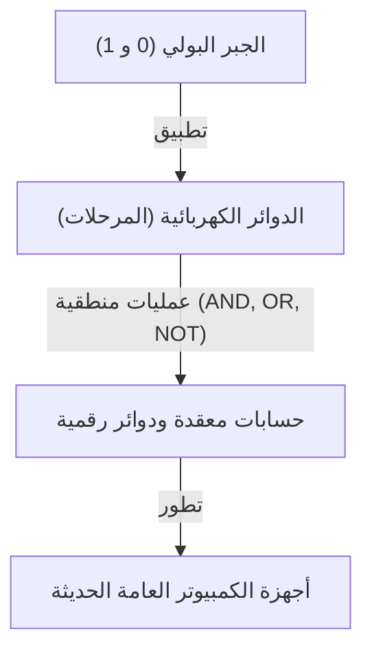
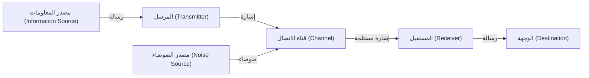

# كلود شانون: العبقري الذي صنع العصر الرقمي

الهواتف الذكية، الإنترنت، أجهزة الكمبيوتر، والذكاء الاصطناعي التي نستخدمها يومياً. كل هذه تعتمد على مفاهيم "الاتصالات الرقمية" و "المعلومات" التي ولدت من عقل عبقري واحد. اسمه كلود إلوود شانون (Claude Elwood Shannon, 1916–2001). سجل اسمه في التاريخ كـ "أبي نظرية المعلومات" ويُعد أحد أعظم العلماء وأكثرهم تأثيراً في القرن العشرين.

في هذه المقالة، سنتعمق في تفاصيل نشأة شانون، وأبحاثه الرائدة التي أرست أسس المجتمع الرقمي الحديث، وصولاً إلى شخصيته الإنسانية المليئة بـ "روح المرح".

## 1. الطفولة والشغف بالاختراع

ولد كلود شانون في 30 أبريل 1916 في بلدة بيتوسكي الصغيرة بولاية ميشيغان الأمريكية، ونشأ في جايلورد. كان والده رجل أعمال، وكانت والدته معلمة لغات ومديرة مدرسة ثانوية. أظهر شانون منذ صغره اهتماماً غير عادي بالآلات والأجهزة الإلكترونية، وكان يجمع الخردة من حول منزله لبناء شبكة تلغراف سرية مع أصدقائه باستخدام الأسلاك الشائكة، وأنظمة اتصالات تستخدم أسوار المزرعة.

من الحقائق المثيرة للاهتمام أيضاً أن جده كان مخترعاً وقريباً بعيداً لتوماس إديسون. حلم شانون الصغير بأن يصبح مخترعاً عظيماً مثل إديسون، وانغمس في صنع نماذج الطائرات والقوارب التي يتم التحكم فيها عن بعد. منذ ذلك الحين، بدأت موهبته كمهندس تنمو داخله، حيث كان يمتلك الرغبة في "فهم الآلية الأساسية للأشياء وإعادة بنائها".

## 2. من جامعة ميشيغان إلى معهد ماساتشوستس للتكنولوجيا: لقاء الجبر البولي ودوائر الترحيل

في عام 1932، التحق شانون بجامعة ميشيغان وحصل على درجتي بكالوريوس في الرياضيات والهندسة الكهربائية. كان لتعرضه لكل من الجمال المنطقي للرياضيات والجوانب العملية للهندسة الكهربائية أثر حاسم على أبحاثه اللاحقة.

في عام 1936، انتقل إلى معهد ماساتشوستس للتكنولوجيا (MIT) لمواصلة دراساته العليا، حيث بدأ بحثه تحت إشراف فانيفار بوش. كان بوش في ذلك الوقت يطور آلة حاسبة تناظرية ضخمة تسمى المحلل التفاضلي. تم تكليف شانون بصيانة دوائر الترحيل المعقدة لهذه الآلة.

هنا لاحظ شانون أن "الجبر البولي (الجبر المنطقي)"، الذي ابتكره عالم الرياضيات في القرن التاسع عشر جورج بول، يتطابق رياضياً تماماً مع مفاتيح الدوائر الكهربائية (تشغيل وإيقاف). لقد أثبت أن العمليات المنطقية ("صواب" (1) و "خطأ" (0) مثل AND و OR و NOT) يمكن تمثيلها فيزيائياً بواسطة التوصيلات المتوالية والمتوازية في الدوائر الكهربائية.

في عام 1937، وفي سن الحادية والعشرين، نشر شانون رسالة الماجستير الخاصة به بعنوان "التحليل الرمزي لدوائر الترحيل والتبديل" (A Symbolic Analysis of Relay and Switching Circuits). تمت الإشادة بهذه الرسالة كـ "أهم وأكثر رسالة ماجستير تأثيراً في القرن العشرين"، وأصبحت الأساس لتصميم الدوائر الرقمية الحديثة. أظهر هذا الاكتشاف أن "أي عملية حسابية منطقية مهما كانت معقدة، يمكن إجراؤها ببساطة عن طريق مزيج من تشغيل وإيقاف المفاتيح (0 و 1)"، مما أرسى المبدأ الأساسي الذي تقوم عليه أجهزة الكمبيوتر اليوم.

## 3. الحرب العالمية الثانية وأبحاث نظرية التشفير

خلال الحرب العالمية الثانية، انضم شانون إلى مختبرات بيل، حيث عمل في أنظمة التحكم في النيران وأبحاث نظرية التشفير. هناك التقى أيضاً بعالم الرياضيات البريطاني العبقري آلان تورينج، وتبادلا نقاشات عميقة حول الآلات والذكاء البشري.

واصل شانون أبحاثه في نظرية التشفير، وفي عام 1945 أعد تقريراً سرياً بعنوان "النظرية الرياضية للتشفير" (A Mathematical Theory of Cryptography) (نُشر لاحقاً في عام 1949 كـ "نظرية الاتصال للأنظمة السرية"). في هذا التقرير، قدم إثباتاً رياضياً لـ "الشفرة غير القابلة للكسر تماماً" (لوحة المرة الواحدة). كما عرّف بوضوح ولأول مرة مفهومي "المعلومات" (Information) و "التكرار" (Redundancy) في سياق التشفير، مما شكل نقطة انطلاق مهمة لنظرية المعلومات اللاحقة.

## 4. 1948: ولادة نظرية المعلومات

في عام 1948، نشر شانون بحثاً تاريخياً في المجلة الفنية لنظام بيل (Bell System Technical Journal) بعنوان "النظرية الرياضية للاتصالات" (A Mathematical Theory of Communication). كانت هذه الورقة بمثابة اللحظة التي تم فيها تأسيس مجال أكاديمي جديد بالكامل وهو "نظرية المعلومات".

في عالم ما قبل شانون، كانت "المعلومات" مفهوماً غامضاً وذاتياً، ويُعتقد أنها تعتمد على المعنى والمحتوى. لكن شانون جرد المعلومات عن قصد من "المعنى"، وعرّفها رياضياً كمسألة احتمالات وإحصاء بحتة. وقد اعتمد لأول مرة رسمياً "البت" (bit: اختصار للرقم الثنائي binary digit) كوحدة لقياس المعلومات، وأظهر أن جميع أشكال المعلومات (نصوص، صوت، صور، إلخ) يمكن التعبير عنها كسلسلة من البتات من 0 و 1.

### نمذجة أنظمة الاتصالات

وصف شانون أي نظام اتصالات بالنموذج البسيط التالي:

كان هذا النموذج عالمياً وقابلاً للتطبيق على جميع أشكال نقل المعلومات، بدءاً من الهواتف والبث التلفزيوني والإنترنت، وصولاً إلى المحادثات بين البشر ونسخ الحمض النووي.

### مبرهنة شانون وكمية المعلومات (الإنتروبيا)

كما أدخل مفهوم "إنتروبيا المعلومات" لتمثيل حالة عدم اليقين في المعلومات. لقد قام بصياغة المفهوم البديهي الذي يقول إنه كلما قل احتمال وقوع حدث ما، زادت كمية المعلومات المكتسبة عند معرفته.

علاوة على ذلك، أثبت شانون رياضياً أنه بغض النظر عن مقدار الضوضاء (Noise) الموجودة في قناة الاتصال، فإذا كانت السرعة أقل من "سعة القناة (حد شانون)" الخاصة بتلك القناة، فمن الممكن نظرياً نقل المعلومات دون أخطاء (باحتمال يقترب من الصفر) من خلال تطبيق تشفير تصحيح الأخطاء المناسب. يُعرف هذا بـ "مبرهنة شانون لتشفير القناة"، وكان اكتشافاً مذهلاً قلب المفاهيم السائدة لمهندسي الاتصالات في ذلك الوقت. ففي ذلك الحين، كان يُعتقد أن الطريقة الوحيدة لمواجهة الضوضاء هي زيادة قوة الإشارة. إن قدرتنا اليوم على استقبال صور واضحة من مسابير فضائية بعيدة، أو تشغيل الموسيقى من قرص مضغوط مخدوش، تعود بفضل تقنيات تصحيح الأخطاء القائمة على هذه المبرهنة.

## 5. الوجه الحقيقي للعبقري: الرجل الذي أحب ألعاب الخفة والدراجة الأحادية

لم تكمن عظمة شانون في ذكائه المنقطع النظير فحسب، بل أيضاً في "روح المرح" (Playfulness) الإنسانية العميقة التي تمتع بها. لم يكن يهتم على الإطلاق بالمكانة أو الشهرة أو الثروة، وكان يقوم بأبحاثه واختراعاته فقط لإرضاء فضوله.

أصبح مشهد شانون وهو يتجول في ممرات مختبرات بيل راكباً دراجة أحادية ويقوم بألعاب الخفة أسطورة بين زملائه. لم يقتصر الأمر على بناء نظرية رياضية لألعاب الخفة واستنتاج "مبرهنة ألعاب الخفة"، بل وصل به الأمر إلى اختراع آلة تقوم بألعاب الخفة بنفسها.

كما أنه كان أحد الرواد الذين وضعوا أسس برامج الكمبيوتر التي تلعب الشطرنج. كان للبحث الذي نشره عام 1950 تأثير عميق على التطور اللاحق لشطرنج الكمبيوتر. بالإضافة إلى ذلك، اخترع فأراً ميكانيكياً يسمى "ثيسيوس" يستطيع استكشاف متاهة بنفسه وتذكرها، والذي كان محاولة رائدة لإثبات مفهوم الذكاء الاصطناعي المبكر (التعلم الآلي).

كان منزل شانون مليئاً بالاختراعات الغريبة والممتعة. من "الآلة المطلقة" (Ultimate Machine) التي بمجرد تشغيلها تخرج يد من الصندوق لتقوم بإيقاف تشغيلها مرة أخرى، إلى بوق ينفث النار، وطبق طائر (فريزبي) مخصص؛ لم يكن لفضوله حدود.

## 6. سنواته الأخيرة وإرثه

في عام 1956، أصبح شانون أستاذاً في معهد ماساتشوستس للتكنولوجيا، وواصل أبحاثه أثناء التدريس. ومع ذلك، كان يكره ضجيج وشهرة العالم الأكاديمي، واختفى تدريجياً من الحياة العامة لينغمس في هواياته واختراعاته في المنزل. في سنواته الأخيرة، عانى من مرض الزهايمر، ويُقال إنه لم يكن قادراً على إدراك مدى ازدهار إنجازاته العظيمة كإنترنت ومجتمع رقمي حديث بالكامل. في 24 فبراير 2001، توفي شانون عن عمر يناهز 84 عاماً.

## الخلاصة

نمت البذور التي زرعها كلود شانون لتصبح الغابة الضخمة التي نطلق عليها اليوم مجتمع المعلومات الرقمي. لولاه، لما كان الإنترنت اليوم، ولا الهواتف الذكية، ولا الموسيقى الرقمية، ولا الذكاء الاصطناعي موجوداً، أو لكانت أخذت شكلاً مختلفاً تماماً.

لقد قام شانون بتبسيط المعلومات إلى 0 و 1، وأثبت رياضياً كيفية نقل المعلومات بدقة في بحر من الضوضاء. تُظهر حياته بشكل رائع كيف يمكن للفضول الخالص وروح المرح أن تؤدي إلى اكتشافات عظيمة تغير العالم من جذوره. عندما نمسك بأجهزتنا الرقمية، لم لا نتوقف لحظة لنتذكر ذلك العبقري وهو يستمتع بألعاب الخفة على دراجته الأحادية.
