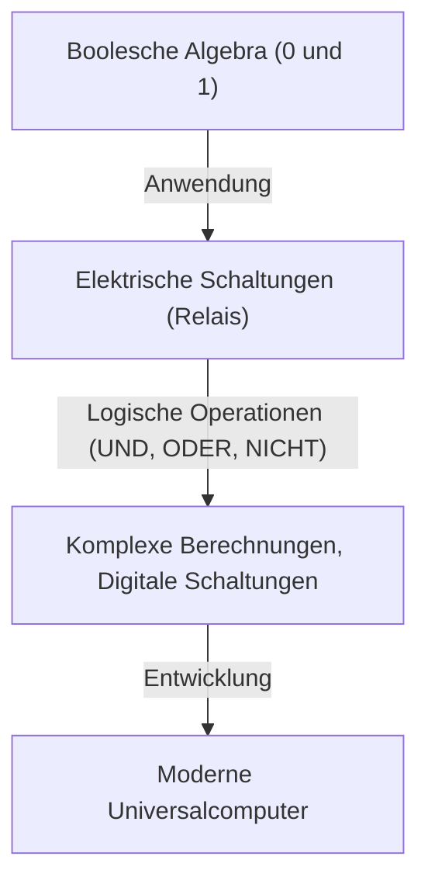
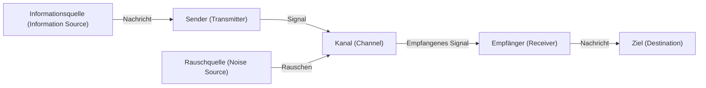

# Claude Shannon: Das Genie, das das digitale Zeitalter erschuf

Smartphones, das Internet, Computer und künstliche Intelligenz, die wir täglich nutzen. Die Konzepte der "digitalen Kommunikation" und "Information", auf denen all dies basiert, entsprangen dem Kopf eines einzigen Genies. Sein Name war Claude Elwood Shannon (1916–2001). Er ging als "Vater der Informationstheorie" in die Geschichte ein und zählt zu den größten und einflussreichsten Wissenschaftlern des 20. Jahrhunderts.

In diesem Artikel werden wir tief eintauchen und Shannons Leben detailliert beleuchten: von seiner Kindheit über die bahnbrechenden Arbeiten, die den Grundstein für unsere moderne digitale Gesellschaft legten, bis hin zu seinem überaus menschlichen und von "Spieltrieb" geprägten wahren Gesicht.

## 1. Kindheit und Leidenschaft für Erfindungen

Claude Shannon wurde am 30. April 1916 in Petoskey, einer kleinen Stadt in Michigan, USA, geboren und wuchs in Gaylord auf. Sein Vater war Geschäftsmann, seine Mutter Sprachlehrerin und Schulleiterin. Schon in jungen Jahren zeigte Shannon ein ungewöhnliches Interesse an Mechanik und Elektronik. Er sammelte Schrott rund um sein Haus und baute ein geheimes Telegrafennetz mit Stacheldraht zu einem Freund sowie Kommunikationssysteme, die die Zäune der Farm nutzten.

Interessanterweise war sein Großvater ebenfalls Erfinder und ein entfernter Verwandter von Thomas Edison. Der junge Shannon träumte davon, ein großer Erfinder wie Edison zu werden, und widmete sich dem Bau von Modellflugzeugen und ferngesteuerten Booten. Bereits zu dieser Zeit keimte in ihm das Talent eines Ingenieurs auf, der "die grundlegende Funktionsweise der Dinge versteht und sie neu zusammensetzt".

## 2. Von der University of Michigan zum MIT: Die Begegnung mit Boolescher Algebra und Relaisschaltungen

1932 trat Shannon in die University of Michigan ein und erwarb zwei Bachelor-Abschlüsse in Mathematik und Elektrotechnik. Dass er sowohl die logische Schönheit der Mathematik als auch die praktischen Aspekte der Elektrotechnik kennenlernte, sollte für seine spätere Forschung von entscheidender Bedeutung sein.

1936 wechselte er für ein Aufbaustudium an das Massachusetts Institute of Technology (MIT) und begann unter der Leitung von Vannevar Bush zu forschen. Bush entwickelte zu dieser Zeit einen riesigen analogen Computer, den sogenannten Differentialanalysator. Shannon wurde mit der Wartung der komplexen Relaisschaltungen dieses Computers betraut.

Hier erkannte Shannon, dass die "Boolesche Algebra (logische Algebra)", die im 19. Jahrhundert vom Mathematiker George Boole erfunden wurde, und die Schalter (Ein und Aus) elektrischer Schaltungen mathematisch völlig übereinstimmten. Er bewies, dass die logischen Operationen von "Wahr (1)" und "Falsch (0)" (UND, ODER, NICHT) physikalisch durch Reihen- oder Parallelschaltungen elektrischer Schaltungen dargestellt werden können.

1937 veröffentlichte Shannon im Alter von 21 Jahren seine Masterarbeit *A Symbolic Analysis of Relay and Switching Circuits* (Eine symbolische Analyse von Relais- und Schaltkreisen). Diese Arbeit wurde als "die wichtigste und einflussreichste Masterarbeit des 20. Jahrhunderts" gepriesen und bildete die Grundlage für das moderne digitale Schaltungsdesign. Diese Entdeckung zeigte, dass "jede noch so komplexe logische Berechnung allein durch die Kombination von Schaltern (Ein und Aus bzw. 0 und 1) ausgeführt werden kann", und etablierte das Prinzip, das den Kern heutiger Computer bildet.

## 3. Der Zweite Weltkrieg und die Erforschung der Kryptographie

Während des Zweiten Weltkriegs trat Shannon in die Bell Laboratories ein und arbeitete an Feuerleitsystemen und Kryptographie. Hier lernte er auch den brillanten britischen Mathematiker Alan Turing kennen, mit dem er tiefe Diskussionen über Maschinen und menschliche Intelligenz führte.

Shannon trieb die Forschung zur Kryptographie voran und verfasste 1945 einen als geheim eingestuften Bericht mit dem Titel *A Mathematical Theory of Cryptography* (1949 nach dem Krieg als *Communication Theory of Secrecy Systems* veröffentlicht). Darin lieferte er den mathematischen Beweis für eine "vollkommen unknackbare Verschlüsselung (One-Time-Pad)". Er definierte zudem erstmals die Konzepte "Information" und "Redundanz (Redundancy)" im Kontext der Kryptographie, was ein wichtiges Sprungbrett für die spätere Informationstheorie war.

## 4. 1948: Die Geburtsstunde der Informationstheorie

1948 veröffentlichte Shannon im *Bell System Technical Journal* seine historische Abhandlung *A Mathematical Theory of Communication* (Eine mathematische Theorie der Kommunikation). Diese Arbeit war der Moment, in dem er im Alleingang das neue akademische Feld der "Informationstheorie" begründete.

In der Welt vor Shannon war "Information" ein vages, subjektives Konzept, das von Bedeutung und Inhalt abhing. Shannon verwarf jedoch bewusst die "Bedeutung" der Information und definierte Information rein mathematisch als ein Problem von Wahrscheinlichkeit und Statistik. Er führte das "Bit" (Abkürzung für binary digit) als Einheit zur Messung von Informationen ein und zeigte, dass alle Informationen (Text, Audio, Bilder usw.) als Bitfolgen von 0 und 1 ausgedrückt werden können.

### Modellierung von Kommunikationssystemen

Shannon beschrieb jedes Kommunikationssystem mit dem folgenden einfachen Modell:

Dieses Modell war universell und auf jede Art der Informationsübertragung anwendbar, sei es Telefon, Fernsehübertragungen, das Internet, ja sogar menschliche Gespräche oder die Transkription von DNA.

### Shannons Theorem und Informationsgehalt (Entropie)

Er führte auch die "Informationsentropie" als Konzept ein, um die Unsicherheit von Informationen auszudrücken. Er formalisierte das intuitive Konzept, dass die Information, die man erhält, umso größer ist, je geringer die Wahrscheinlichkeit eines Ereignisses ist.

Darüber hinaus bewies Shannon mathematisch, dass selbst bei noch so viel Rauschen in einem Kanal Informationen theoretisch fehlerfrei (mit einer Wahrscheinlichkeit nahe Null) übertragen werden können, solange die Übertragungsrate unter der "Kanalkapazität (Shannon-Grenze)" des Kanals liegt, vorausgesetzt, es wird eine geeignete fehlerkorrigierende Codierung angewendet. Dies wurde "Shannons Kanalcodierungstheorem" genannt und war für die damaligen Nachrichtentechniker eine atemberaubende Entdeckung, die mit bisherigen Vorstellungen brach. Damals glaubte man nämlich, die einzige Möglichkeit, Rauschen entgegenzuwirken, sei die Erhöhung der Signalleistung. Dass wir heute klare Bilder von Raumsonden in den Tiefen des Universums empfangen oder Musik von einer zerkratzten CD abspielen können, verdanken wir der auf diesem Theorem basierenden Fehlerkorrekturtechnologie.

## 5. Das wahre Gesicht des Genies: Der Mann, der Jonglieren und Einräder liebte

Shannons Größe lag neben seinem unvergleichlichen Intellekt in seinem äußerst menschlichen "Spieltrieb (Playfulness)". Er war völlig gleichgültig gegenüber Status, Ruhm oder Reichtum und forschte und erfand nur, um seine eigene Neugier zu befriedigen.

Der Anblick Shannons, der auf einem Einrad die Flure der Bell Labs entlangfuhr und dabei jonglierte, ist unter seinen Kollegen legendär. Er entwickelte nicht nur eine mathematische Theorie des Jonglierens und leitete das "Jonglier-Theorem" ab, sondern erfand sogar eine Jongliermaschine.

Er war auch einer der Pioniere, die den Grundstein für Computerprogramme zum Schachspielen legten. Seine 1950 veröffentlichte Arbeit hatte großen Einfluss auf die spätere Entwicklung von Computerschach. Ferner erfand er "Theseus", eine mechanische Maus, die selbstständig durch ein Labyrinth navigieren und sich dieses merken konnte, was ein wegweisender Versuch war, die Konzepte der frühen künstlichen Intelligenz (maschinelles Lernen) zu demonstrieren.

Shannons Haus war voller seltsamer und lustiger Erfindungen. Sein Erfindergeist kannte keine Grenzen – ob es nun die "Ultimative Maschine (Ultimate Machine)" war, bei der eine Hand aus einer Kiste kam und den Schalter, den man gerade umgelegt hatte, wieder ausschaltete, eine feuerspeiende Trompete oder eine maßgeschneiderte Frisbee.

## 6. Späte Jahre und Vermächtnis

1956 wurde Shannon Professor am MIT und lehrte und forschte dort. Er mochte jedoch den Trubel und Ruhm der akademischen Welt nicht und zog sich allmählich aus der Öffentlichkeit zurück, um sich seinen Hobbys und Erfindungen zu Hause zu widmen. In seinen späten Jahren litt er an der Alzheimer-Krankheit, und es wird gesagt, dass er nicht mehr vollständig erfassen konnte, dass seine großartige Arbeit als Grundlage für das heutige Internet und die digitale Gesellschaft erblühte. Shannon starb am 24. Februar 2001 im Alter von 84 Jahren.

## Fazit

Die Samen, die Claude Shannon gesät hat, sind zu einem riesigen Wald der heutigen digitalen Informationsgesellschaft herangewachsen. Ohne ihn würden das Internet von heute, Smartphones, digitale Musik und künstliche Intelligenz vielleicht gar nicht existieren oder völlig anders aussehen.

Shannon reduzierte Informationen auf 0 und 1 und bewies mathematisch, wie man sie inmitten eines Meeres von Rauschen genau übertragen kann. Sein Leben ist ein wunderbares Beispiel dafür, wie pure Neugier und Spieltrieb zu großen Entdeckungen führen können, die die Welt von Grund auf verändern. Wenn wir ein digitales Gerät in die Hand nehmen, sollten wir vielleicht für einen Moment an das Genie denken, das es genoss, auf einem Einrad zu fahren und dabei zu jonglieren.
