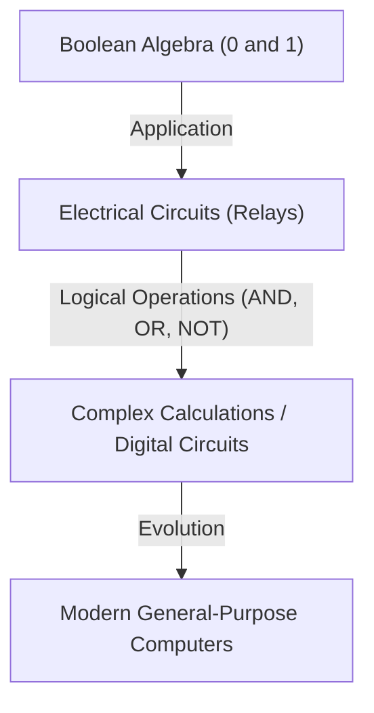
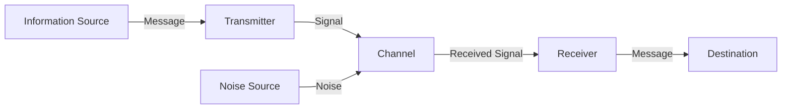

# Claude Shannon: The Genius Who Created the Digital Age

The smartphones, the Internet, computers, and artificial intelligence that we use on a daily basis. The concepts of "digital communication" and "information" that form the foundation of all of these were born from the mind of one single genius. His name is Claude Elwood Shannon (1916–2001). Carving his name in history as the "father of information theory," he is counted among the most phenomenal and influential scientists of the 20th century.

In this article, we will take a very detailed and deep dive into Shannon's upbringing, the groundbreaking papers that laid the cornerstone for today's digital society, and his deeply human, "playful" true nature.

## 1. Early Life and Passion for Invention

Claude Shannon was born on April 30, 1916, in the small town of Petoskey, Michigan, USA, and grew up in Gaylord. His father was a businessman, and his mother was a language teacher who also served as a high school principal. From a young age, Shannon showed an extraordinary interest in mechanical and electronic devices. He would gather junk from around his house to construct a secret telegraph network with his friends using barbed wire, and build communication systems utilizing farm fences.

Interestingly, his grandfather was an inventor and a distant relative of Thomas Edison. As a child, Shannon dreamed of becoming a great inventor like Edison, immersing himself in building model airplanes and radio-controlled boats. Even from this time, his talent as an engineer—"to understand the fundamental mechanisms of things and reconstruct them"—had already begun to sprout within him.

## 2. From the University of Michigan to MIT: Encountering Boolean Algebra and Relay Circuits

In 1932, Shannon entered the University of Michigan, earning two bachelor's degrees in mathematics and electrical engineering. Experiencing both the logical beauty of mathematics and the practical aspects of electrical engineering would have a decisive meaning for his later research.

In 1936, he went on to graduate school at the Massachusetts Institute of Technology (MIT) and began researching under the guidance of Vannevar Bush. At the time, Bush was developing a massive analog computer called a Differential Analyzer. Shannon was placed in charge of maintaining the complex relay circuits of this computer.

Here, Shannon realized that "Boolean algebra" (logical algebra), devised by 19th-century mathematician George Boole, perfectly matched the switches (on and off) of electrical circuits mathematically. He proved that the logical operations (AND, OR, NOT) of "true (1)" and "false (0)" could be physically represented by series and parallel connections of electrical circuits.

In 1937, at the age of 21, Shannon published his master's thesis, "A Symbolic Analysis of Relay and Switching Circuits." This paper was praised as "the most important and influential master's thesis of the 20th century" and became the foundation of modern digital circuit design. This discovery showed that "no matter how complex the logical calculation, it can be executed solely by combinations of on and off switches (0 and 1)," thereby establishing the principle that forms the core of today's computers.

## 3. World War II and Cryptography Research

During World War II, Shannon joined Bell Labs, engaging in research on fire-control systems and cryptography. Here, he met the genius British mathematician Alan Turing, and they exchanged deep discussions about machine and human intelligence.

Shannon advanced his research in cryptography and in 1945 compiled a classified report titled "A Mathematical Theory of Cryptography" (later declassified and published in 1949 as "Communication Theory of Secrecy Systems"). In this work, he provided the mathematical proof for a "completely unbreakable cipher (one-time pad)." Furthermore, he explicitly defined the concepts of "Information" and "Redundancy" within the context of cryptography for the first time, which became an important stepping stone to his subsequent information theory.

## 4. 1948: The Birth of Information Theory

In 1948, Shannon published a historic paper titled "A Mathematical Theory of Communication" in the Bell System Technical Journal. This paper was the exact moment when the new academic field of "Information Theory" was single-handedly founded.

In the pre-Shannon world, "information" was an ambiguous and subjective concept, thought to be dependent on meaning or content. However, Shannon intentionally stripped away the "meaning" from information, and mathematically defined information purely as a problem of probability and statistics. He publicly adopted the "bit" (short for binary digit) for the first time as a unit to measure information, showing that all information (text, audio, images, etc.) could be represented as sequences of 0s and 1s.

### Modeling Communication Systems

Shannon described all communication systems using the following simple model.

This model was universal, applicable to all forms of information transmission, from telephones, television broadcasting, and the Internet, all the way to human conversation and DNA transcription.

### Shannon's Theorem and Information Content (Entropy)

He also introduced "information entropy" as a concept to represent the uncertainty of information. He mathematically formulated the intuitive concept that the lower the probability of an event occurring, the greater the amount of information gained when one learns of it.

Furthermore, Shannon mathematically proved that no matter how much noise exists in a communication channel, as long as the speed is below the "channel capacity (Shannon limit)" of that channel, it is theoretically possible to transmit information without errors (with a probability approaching zero) by applying appropriate error-correcting coding. This is called "Shannon's channel coding theorem," and it was a staggering discovery that overturned the common sense of communication engineers at the time. This was because, back then, it was thought that the only way to combat noise was to increase the signal output. The reason we can receive clear images from space probes far out in the universe or play music from scratched CDs today is thanks to error-correcting technology based on this theorem.

## 5. The True Face of a Genius: The Man Who Loved Juggling and Unicycles

Shannon's greatness lay not only in his unparalleled intellect, but also in his extremely human "Playfulness." He was completely indifferent to status, fame, and wealth, conducting research and inventing things simply to satisfy his own curiosity.

The sight of Shannon juggling while riding a unicycle down the halls of Bell Labs has become legendary among his colleagues. He didn't just build a mathematical theory of juggling and derive the "juggling theorem"; he even invented a machine to juggle.

He was also one of the pioneers who laid the foundation for computer programs that play chess. His paper published in 1950 had a profound influence on the later development of computer chess. Furthermore, he invented a mechanical mouse named "Theseus" that could autonomously navigate and memorize a maze, which became a pioneering attempt to demonstrate the concept of early artificial intelligence (machine learning).

Shannon's home was overflowing with strange and fascinating inventions. The "Ultimate Machine," a box that, when switched on, simply produces a hand that turns itself off, a flame-throwing trumpet, customized frisbees—his curiosity was inexhaustible.

## 6. Later Years and Legacy

In 1956, Shannon became a professor at MIT, continuing his research while teaching. However, he disliked the hustle and bustle and fame of the academic world, gradually disappearing from the public eye to immerse himself in hobbies and inventions at home. In his later years, he suffered from Alzheimer's disease, and it is said that he could not fully recognize that his great achievements had blossomed into the modern internet and digital society. On February 24, 2001, Shannon passed away at the age of 84.

## Conclusion

The seeds planted by Claude Shannon have grown into the massive forest of today's digital information society. Without him, the Internet, smartphones, digital music, and artificial intelligence of today might not exist, or they would have taken a completely different form.

Shannon reduced information to 0s and 1s and mathematically proved how to transmit information accurately within a sea of noise. His life beautifully demonstrates how pure curiosity and playfulness can lead to monumental discoveries that fundamentally change the world. The next time we pick up a digital device, how about spending a brief moment thinking of the genius who enjoyed juggling on a unicycle.
